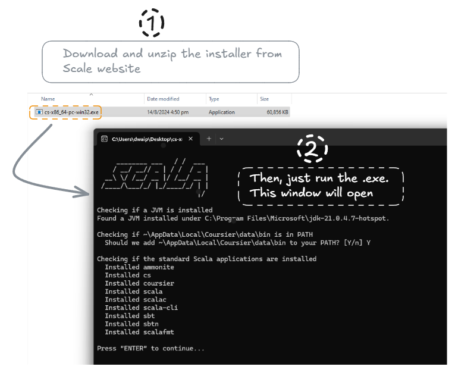
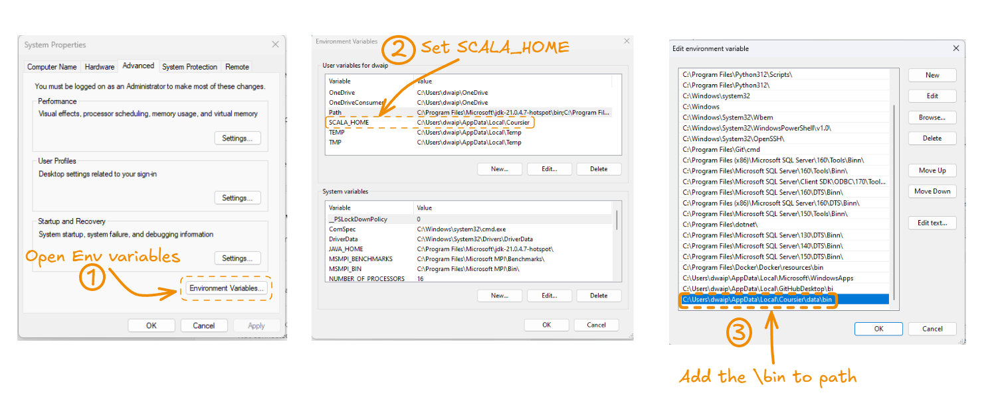
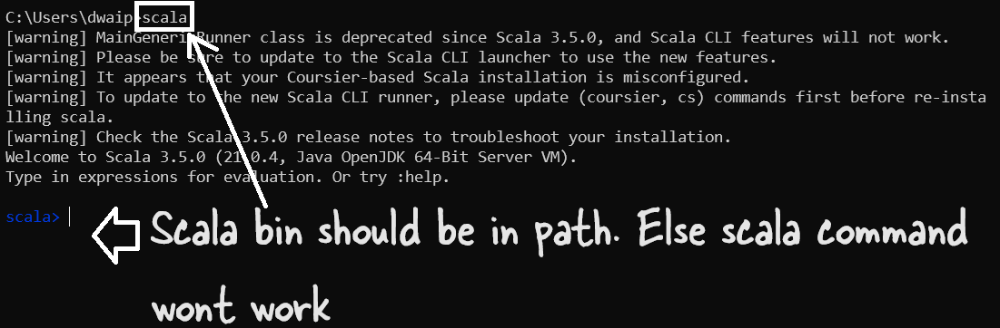

# Installing Scala on Windows

Scala can be installed on Windows using Coursier tool. It's basically a command line tool which opens up when you click on the scala installer exe. Follow these steps to install scala on Windows. 

### Download and Install Scala

- [Download the .zip file and open it](https://github.com/coursier/coursier/releases/latest/download/cs-x86_64-pc-win32.zip).
- Run the `cs-x86_64-pc-win32.exe` file.
- A Command Prompt window will open. When prompted, press `Y` to proceed.

### Set Up Environment Variables

The installation might not automatically set `SCALA_HOME` and add the `\bin` folder to your PATH. This setup is necessary for Scala to work properly.

After the installation, you need to manually add `SCALA_HOME` and `SCALA_HOME\data\bin` to your system's PATH.

> Note: Scala's bin should be in the path. Else, you won't be able to run it from command prompt.

