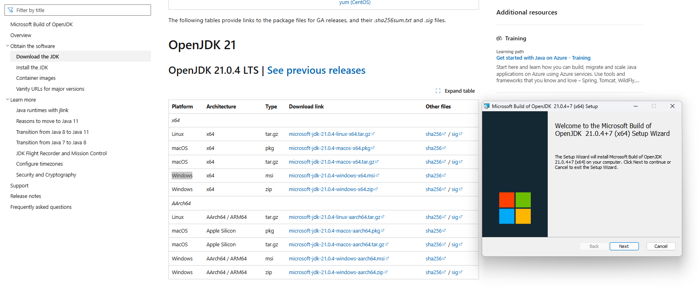
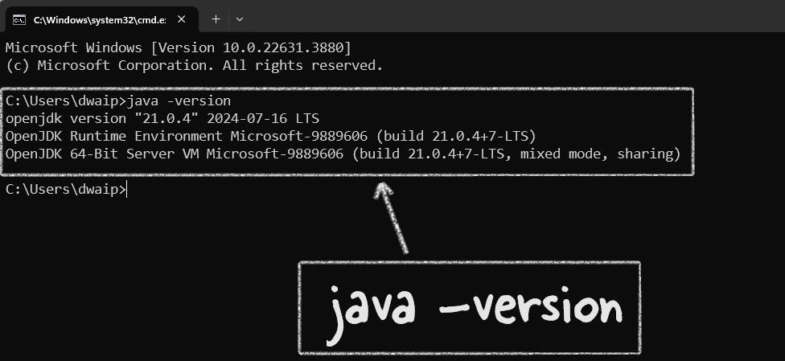
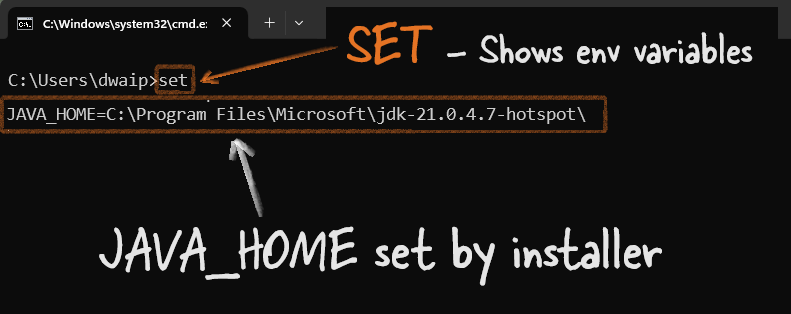

# <span style="color: #7A3DAA; font-family: Segoe UI, sans-serif;">Installing Microsoft OpenJDK</span>

There are many versions of JDK. Refer to the table at the end to see them. Here we will focus on OpenJDK. Many popular applications and platforms use OpenJDK as their Java runtime. For example, **Minecraft (Java Edition)**, **Apache Cassandra**, **Apache Kafka**, **Jenkins**, and **ElasticSearch** all rely on OpenJDK. Development tools like **IntelliJ IDEA** and **Eclipse** also run well on it. **Spring Boot applications**, **Atlassian** products like **Jira** and **Confluence**, big data tools like **Apache Hadoop** and **Apache Spark**, as well as **Docker images** and web servers like **Apache Tomcat** and **Jetty**, commonly use OpenJDK. Even **Android Studio** can run with OpenJDK. So, OpenJDK is used a lot in  real-world applications.

In this article I will give you a brief intro to Microsoft OpenJDK and how to install it.

## <span style="color: #7A3DAA; font-family: Segoe UI, sans-serif;">When to Use Microsoft OpenJDK?</span>

If you're using JDK in the Microsoft ecosystem, it's best to go with Microsoft's JDK. If any issues come up, you can easily get support from Microsoft. But if you're in a general setup or prefer tools not tied to one company, OpenJDK might be a better choice.

Microsoft also says their OpenJDK can replace any OpenJDK, even in non-Microsoft environments like AWS + Linux. Plus, their version has extra fixes and enhancements, making it work better in the Microsoft ecosystem.

## <span style="color: #7A3DAA; font-family: Segoe UI, sans-serif;">Installation Steps</span>

### <span style="color: #653090; font-family: Segoe UI, sans-serif;">For Windows:</span>

1. **Download and Run the installer:**
   - Go to [Microsoft Build of OpenJDK website](https://learn.microsoft.com/en-us/java/openjdk/download).
   - Choose the Windows `.msi` installer and download and run it.
   - During installation, choose the option to set `JAVA_HOME` and update the `Path`.
    

2. **Verify Installation and check JAVA_HOME variable**
   - Open Command Prompt and type `java -version`. You should see the installed version of Microsoft OpenJDK
    
    - Enter `set` in command prompt. It will show you all the environment variable. Look for JAVA_HOME to see if it is set properly.
    

### <span style="color: #653090; font-family: Segoe UI, sans-serif;">For macOS:</span>

1. **Download Archive:**
   - Visit the [Microsoft Build of OpenJDK website](https://learn.microsoft.com/en-us/java/openjdk/download).
   - Download the `.tar.gz` archive for macOS.

2. **Extract and Install:**
   - Open Terminal and navigate to the downloaded archive.
   - Extract it using:
     ```bash
     sudo tar zxvf microsoft-jdk-17-macos-x64.tar.gz -C /Library/Java/JavaVirtualMachines/
     ```

3. **Set JAVA_HOME:**
   - Add the following to your `.bash_profile`, `.zshrc`, or `.bashrc`:
     ```bash
     export JAVA_HOME=/Library/Java/JavaVirtualMachines/microsoft-17.jdk/Contents/Home
     export PATH=$JAVA_HOME/bin:$PATH
     ```
   - Apply changes with:
     ```bash
     source ~/.bash_profile
     ```

4. **Verify Installation:**
   - Run `java -version`
   - You should see the Microsoft OpenJDK version installed.

### <span style="color: #653090; font-family: Segoe UI, sans-serif;">For Linux (Ubuntu/Debian):</span>

1. **Download Archive:**
   - Head to the [Microsoft Build of OpenJDK website](https://learn.microsoft.com/en-us/java/openjdk/download) and download the `.tar.gz` for Linux.

2. **Extract and Install:**
   - Open Terminal and navigate to the download location.
   - Extract using:
     ```bash
     sudo tar zxvf microsoft-jdk-17-linux-x64.tar.gz -C /usr/lib/jvm
     ```

3. **Set JAVA_HOME and Update Alternatives:**
   - Add to your `.bashrc` or equivalent:
     ```bash
     export JAVA_HOME=/usr/lib/jvm/microsoft-17
     export PATH=$JAVA_HOME/bin:$PATH
     ```
   - Set as default:
     ```bash
     sudo update-alternatives --install /usr/bin/java java /usr/lib/jvm/microsoft-17/bin/java 1
     sudo update-alternatives --config java
     ```

4. **Verify Installation:**
   - Run `java -version`
   - You should see the installed Microsoft OpenJDK version.

## <span style="color: #7A3DAA; font-family: Segoe UI, sans-serif;">Conclusion</span>

Microsoft Build of OpenJDK is just like the regular OpenJDK when it comes to working with apps. The main difference is that it's made by Microsoft, so it might work better with Microsoft products. Plus, if you're using it on Azure and something goes wrong with Java, you can get help from Microsoft support. In short, it's basically OpenJDK with Microsoft's name on it.

## <span style="color: #7A3DAA; font-family: Segoe UI, sans-serif;">JDK Brands</span>

| **JDK Version**                  | **Free to Download** | **Advantages**                                                                 |
|----------------------------------|----------------------|--------------------------------------------------------------------------------|
| **Oracle JDK**                   | Yes (for personal use, development, and testing)** | Official JDK from Oracle, commercial support, and long-term updates available. |
| **OpenJDK**                      | Yes                  | Open-source, reference implementation of Java SE, widely supported.            |
| **Amazon Corretto**              | Yes                  | Production-ready, free support, optimized for AWS, multiplatform.              |
| **Eclipse Temurin (AdoptOpenJDK)** | Yes                 | Free, well-supported, and widely used in various environments.                 |
| **Microsoft Build of OpenJDK**   | Yes                  | Free, optimized for Azure and Microsoft products, integrated with MS ecosystem.|
| **GraalVM**                      | Yes (Community Edition) | High-performance, supports multiple languages, ahead-of-time compilation.      |
| **Azul Zulu**                    | Yes                  | Certified OpenJDK build, various support options, optimized for enterprise use. |
