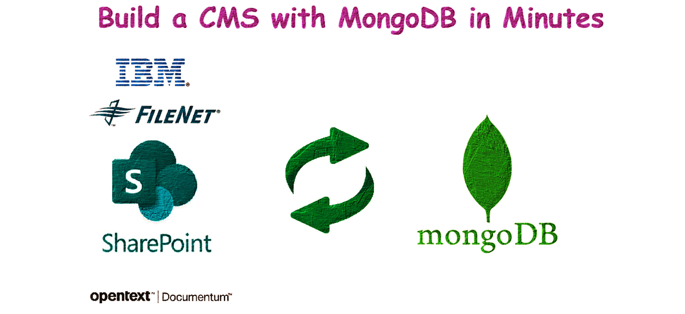
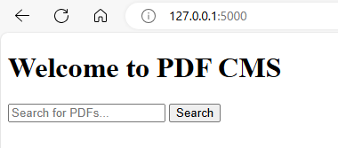
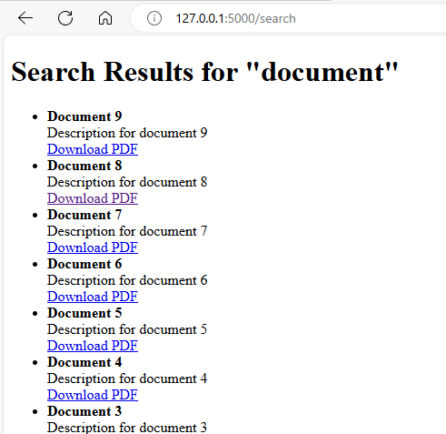
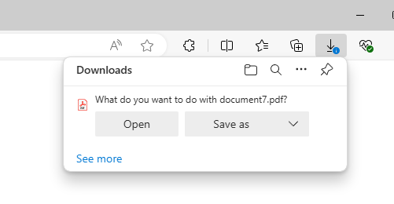

# Building a Simple CMS with MongoDB, Python, and Flask

Usually, we use Content Management Software like IBM Filenet or OpenText Documentum to create content warehouses. These applications store content (PDFs, JPEGs) as objects and save the associated metadata in databases like MSSQL or Oracle. They offer front-end applications like Webtop and Documentum Administrator to access the files.

With MongoDB, you can create a similar application almost in no time. This article will show you how easy it is to build such an app.

We will use MongoDB as a container running in Docker. Our application for generating PDFs and metadata, as well as the uploading part, will run on a local Windows machine. We'll use Python 3.11 to develop the application.

The front end will be created using Flask.

## Project Background

The project can be divided into the following parts:

1. **Creating the MongoDB container**
2. **Creating a script to generate PDFs and associated metadata in JSON**
3. **Uploading the PDFs to MongoDB**
4. **Creating a front-end UI using Flask to search the content in MongoDB**

## Create a MongoDB Container

First, create a Docker network and volume:

```sh
docker network create spark-network
docker volume create mongo_data
```

Execute the following command to run the MongoDB container:

```sh
docker run -d --name mongoDB --network spark-network -p 27017:27017 -v mongo-data:/data/db mongo
```

Explanation of the command options:
- `-d`: Run the container in detached mode.
- `--name mongoDB`: Assign the name "mongoDB" to the container.
- `--network spark-network`: Connect the container to the network "spark-network".
- `-p 27017:27017`: Map port 27017 on the host to port 27017 in the container.
- `-v mongo-data:/data/db`: Use a Docker volume named "mongo-data" to persist MongoDB data.

You can connect to MongoDB using a MongoDB client or management tool like MongoDB Compass, Robo 3T, or Studio 3T. The connection string is:

```
mongodb://localhost:27017
```

## Creating Sample PDFs and Metadata Files

Create the folder structure `mongoDB_CMS\content_and_metadata` and place the script files inside it. 

<p style="color: #003366; font-family: 'Trebuchet MS', Helvetica, sans-serif; background-color: #f0f8ff; padding: 15px; border-left: 5px solid #6699cc; border-radius: 10px; box-shadow: 2px 2px 10px #6699cc;">
<strong>Note:</strong> Before running the scripts, install the required Python packages using command prompt/terminal: **pip install fpdf pymongo**
</p>


### Script to Create Metadata and PDF Files

Save the following script as `1_create_files.py`:

```python
from fpdf import FPDF
import json
import os

# Base directory to save content and metadata files inside content_and_metadata folder
#base_dir = os.path.join(os.getcwd(), 'content_and_metadata')
#os.makedirs(base_dir, exist_ok=True)
# Base directory to save content and metadata files inside a particular folder
# base_dir = r'C:\Users\dwaip\Desktop\mongoDB_CMS'

# Base directory, to save the content and metadata in the current folder
base_dir = os.getcwd()  # Get the current working directory


# Generate 10 PDF files and corresponding metadata files
metadata_list = [
    {"title": f"Document {i}", "description": f"Description for document {i}", "file_name": f"document{i}.pdf"}
    for i in range(1, 11)
]

for i, metadata in enumerate(metadata_list, 1):
    # Create PDF file
    pdf = FPDF()
    pdf.add_page()
    pdf.set_font("Arial", size=12)
    pdf.cell(200, 10, txt=f"Document {i}", ln=True, align='C')
    pdf.cell(200, 10, txt="This is a sample PDF file.", ln=True, align='C')
    
    pdf_file_path = os.path.join(base_dir, f"document{i}.pdf")
    pdf.output(pdf_file_path)
    
    # Create metadata file
    metadata_file_path = os.path.join(base_dir, f'metadata{i}.json')
    with open(metadata_file_path, 'w') as f:
        json.dump(metadata, f, indent=4)

print(f"PDF and metadata files created successfully inside: {base_dir}")
```

Navigate to the folder and run the script:

```sh
python 1_create_files.py
```

## Upload the Content and Metadata to MongoDB

Save the following script as `2_upload_to_mongodb.py`:

```python
from pymongo import MongoClient
import json
import gridfs
import os

# Connect to MongoDB
client = MongoClient('mongodb://localhost:27017/')
db = client['cms_db']
fs = gridfs.GridFS(db)

# Directory path
base_dir = os.getcwd()  # Get the current working directory
# base_dir = r'C:\Users\dwaip\Desktop\mongoDB_CMS' #For any custom directory

# Read and upload metadata and content files
for file in os.listdir(base_dir):
    if file.endswith('.json'):
        # Read metadata file
        metadata_path = os.path.join(base_dir, file)
        with open(metadata_path, 'r') as f:
            metadata = json.load(f)
            file_name = metadata['file_name']
            file_path = os.path.join(base_dir, file_name)

            # Check if the content file exists
            if os.path.exists(file_path):
                # Upload file to GridFS
                with open(file_path, 'rb') as content_file:
                    file_id = fs.put(content_file, filename=file_name)

                # Add file_id to metadata
                metadata['file_id'] = str(file_id)  # Convert ObjectId to string

                # Insert metadata into MongoDB
                db.metadata.insert_one(metadata)
            else:
                print(f"Content file {file_name} not found. Skipping...")

print(f"Files and metadata uploaded successfully in: {base_dir}")
```

Using cmd, go to the folder and run the script:

```sh
python 2_upload_to_mongodb.py
```

## Create and Run the Flask Application to Search CMS

Create the folder structure `mongoDB_CMS\FlaskApp\templates` and create two HTML files inside the `templates` folder.

#### `index.html`

```html
<!DOCTYPE html>
<html lang="en">
<head>
    <meta charset="UTF-8">
    <title>PDF CMS</title>
</head>
<body>
    <h1>Welcome to PDF CMS</h1>
    <form action="/search" method="post">
        <input type="text" name="query" placeholder="Search for PDFs...">
        <button type="submit">Search</button>
    </form>
</body>
</html>
```

#### `search.html`

```html
<!DOCTYPE html>
<html lang="en">
<head>
    <meta charset="UTF-8">
    <title>Search Results</title>
</head>
<body>
    <h1>Search Results for "{{ query }}"</h1>
    <ul>
        
            <li>
                <strong>{{ result['title'] }}</strong><br>
                {{ result['description'] }}<br>
                <a href="/download/{{ result['file_id'] }}">Download PDF</a>
            </li>
        
            <li>No results found.</li>
        
    </ul>
    <a href="/">Go back</a>
</body>
</html>
```

#### `app.py`

Save the following script as `app.py` inside `mongoDB_CMS\FlaskApp\`:

```python
from flask import Flask, render_template, request, send_file, jsonify
from pymongo import MongoClient
from gridfs import GridFS
from bson.objectid import ObjectId
import io

app = Flask(__name__)

# Connect to MongoDB
client = MongoClient('mongodb://localhost:27017/')
db = client['cms_db']
fs = GridFS(db)

# Create text index for searching
db.metadata.create_index([("$**", "text")])

@app.route('/')
def index():
    return render_template('index.html')

@app.route('/search', methods=['GET', 'POST'])
def search():
    query = request.form.get('query', '')
    print(f"Search query: {query}")
    
    if query:
        results = db.metadata.find({"$text": {"$search": query}})
        results_list = list(results)
        print(f"Search results: {results_list}")
    else:
        results_list = []
    
    return render_template('search.html', results=results_list, query=query)

@app.route('/download/<file_id>')
def download(file_id):
    file_id = ObjectId(file_id)
    file_data = fs.get(file_id)
    return send_file(io.BytesIO(file_data.read()), download_name=file_data.filename, as_attachment=True)

@app.route('/api/search', methods=['POST'])
def api_search():
    query = request.json.get('query', '')
    results = db.metadata.find({"$text": {"$search": query}})
    return jsonify([result for result in results])

if __name__ == '__main__':
    app.run(debug=True)
```

Using CMD go the to the `mongoDB_CMS\FlaskApp\` folder and run the Flask application:

```sh
python app.py
```

### Use the search application

Navigate to `http://127.0.0.1:5000/` to access the application. 



You will see a search interface where you can search for PDF documents. 


The search results will display the documents with a link to download the PDFs.



## Appendix

### How the pdf is uploaded and linked with the metadata

- The script iterates over `.json` files in the directory, reading each metadata file.

    ```python
    for file in os.listdir(base_dir):
        if file.endswith('.json'):
            with open(os.path.join(base_dir, file), 'r') as f:
                metadata = json.load(f)
    ```
- It extracts the `file_name` from the metadata to locate the PDF file.

    ```python
    file_name = metadata['file_name']
    file_path = os.path.join(base_dir, file_name)
    ```
- If the PDF file exists, it is uploaded to GridFS, generating a unique `file_id`.

    ```python
    if os.path.exists(file_path):
        with open(file_path, 'rb') as content_file:
            file_id = fs.put(content_file, filename=file_name)
    ```
- The `file_id` is added to the metadata and stored in the `metadata` collection in MongoDB.

    ```python
    metadata['file_id'] = str(file_id)
    db.metadata.insert_one(metadata)
    ```
### How MongoDB Stores Files and Metadata

**Files**:

Files are stored in MongoDB using GridFS, which breaks each file into 255 KB chunks. These chunks are stored as separate documents in the `fs.chunks` collection. The `fs.files` collection stores information about each file, like the filename, upload date, file length, and references to the chunks that make up the file.

**Metadata**:

Metadata for each PDF is stored in a separate collection called `cms_db.metadata`. This includes details like the title, description, and filename of the PDF. Each metadata document has a `file_id` field, which stores the ObjectId of the corresponding file in GridFS. This `file_id` links the metadata to the actual file, allowing the application to find and serve the file based on user requests.

#### Default Metadata (GridFS Metadata)

GridFS automatically handles the basic information about each file. It stores files in chunks of 255 KB in the `fs.chunks` collection. The `fs.files` collection holds metadata like the filename, upload date, file length, chunk size, MD5 hash for checking file integrity, and references to the file chunks. This ensures that files are stored and retrieved correctly.

#### Custom Metadata

Apart from the default metadata, custom metadata is stored in a separate collection (e.g., `cms_db.metadata`). This includes details specific to the application, such as the PDF title, description, and the user-friendly filename. Each custom metadata document also has a `file_id` field that links to the corresponding file in GridFS. This makes it easy for the application to find and serve the file when needed.


## COnclusion:

Using MongoDB for Enterprise Content Management can be a good choice if you have specific needs, but traditional ECM systems are often better for several reasons. Traditional ECM systems like SharePoint, Alfresco, and Documentum come with built-in features such as document libraries, version control, metadata management, workflow automation, compliance tools, and user access controls. MongoDB, on the other hand, does not offer these features out-of-the-box. Additionally, ECM systems have user-friendly interfaces designed for document management, requiring less customization compared to MongoDB.

ECM systems also help meet regulatory requirements for document retention, data privacy, and security by providing built-in tools for audit trails, access controls, and document lifecycle management. They offer strong governance features to manage documents according to company policies. Moreover, ECM solutions integrate smoothly with other enterprise applications like Microsoft 365 and ERP systems, whereas MongoDB requires more development effort for similar integration. ECM systems come with ready-to-use APIs and connectors, reducing the need for custom development.

Another advantage of ECM systems is their quick deployment with minimal setup effort. Using MongoDB would require significant custom development to achieve the same functionalities. Finally, ECM solutions come with support and maintenance services to keep the system up-to-date and secure.
