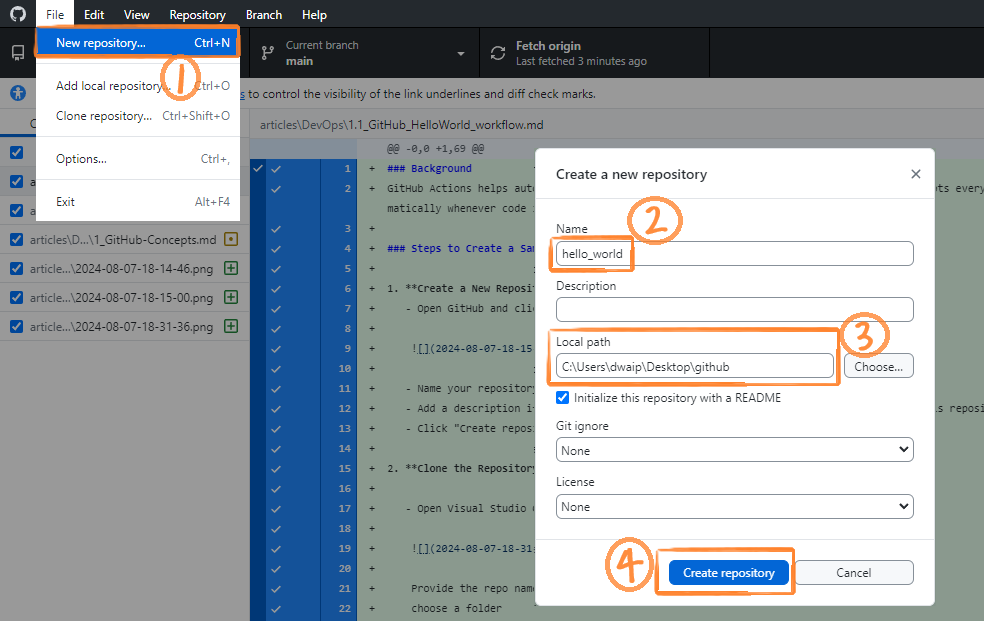
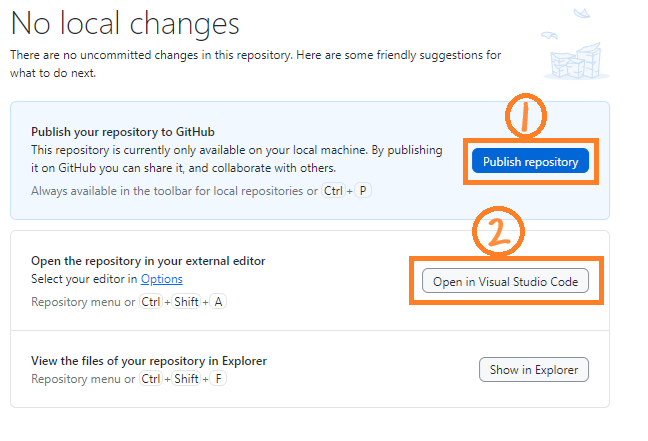
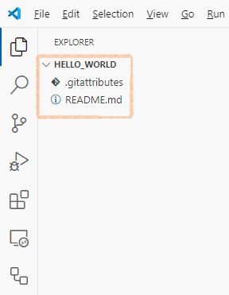
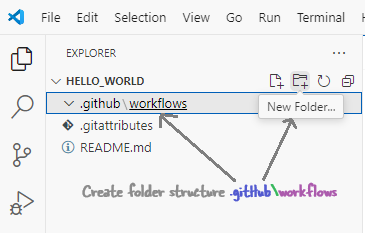
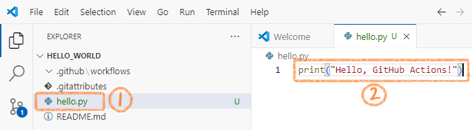
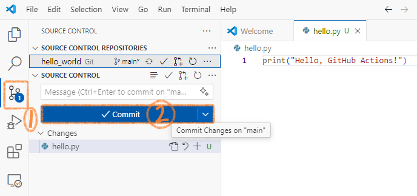
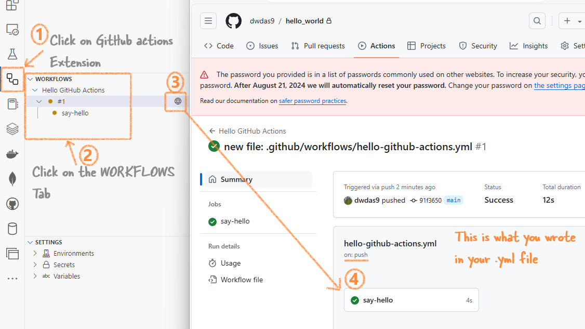

<details open markdown="block">
  <summary>
    Table of contents
  </summary>
  {: .text-delta }
1. TOC
{:toc}
</details>

# <span style="color: blueviolet;Font-family: Segoe UI, sans-serif;">Background</span>

<p style="color: #006600; font-family: 'Trebuchet MS', Helvetica, sans-serif; background-color: #e6ffe6; padding: 15px; border-left: 5px solid #00cc66;">
GitHub Actions Workflows are the core of GitHub CI/CD. You can set them up easily. VS Code has many extensions for GitHub. In this article, I will show how to create a simple GitHub Actions Workflow. It will help you understand the flow. Later using similar steps you can create complex Action Workflows. Let's get started.
</p>

## <span style="color: MediumOrchid;Font-family: Segoe UI, sans-serif;">Create an End-to-End GitHub Actions Workflow Using VS Code</span>

### <span style="color: PaleVioletRed;Font-family: Segoe UI, sans-serif;">Create a New Repository Using GitHub Desktop</span>

  - **Open GitHub Desktop**. Click on **New repository**. Provide a name for your repository, check the local path, and click on **Create repository**.




  - Click on **Publish repository**. Then Click on **Open in Visual Studio Code**.



  - In the VS Code you will be able to see your folder **.gitattributes** file




### <span style="color: PaleVioletRed;Font-family: Segoe UI, sans-serif;">Set Up the GitHub Actions Workflow in VS Code</span>

- **Create Folder Structure**:
  - In VS Code, click on the create folder icon and create a `.github` folder.
  - Inside the `.github` folder, create another folder named `workflows`.




- **Create Workflow File**:
  - Inside the `workflows` folder, create a file named `hello-github-actions.yml`.
  - Add the following code to `hello-github-actions.yml`:
    ```yaml
    name: Hello GitHub Actions
    on: [push]
    jobs:
      say-hello:
        runs-on: ubuntu-latest
        steps:
          - name: Checkout code
            uses: actions/checkout@v4
          - name: Run hello.py
            run: python hello.py
    ```

### <span style="color: PaleVioletRed;Font-family: Segoe UI, sans-serif;">Create a Python Script</span>

  - In the root of your repository, create a new file named `hello.py`.
  - Add the following code to `hello.py`:
    ```python
    print("Hello, GitHub Actions!")
    ```


### <span style="color: PaleVioletRed;Font-family: Segoe UI, sans-serif;">Commit and Push the Changes</span>

  - Click on the source control icon in VS Code.
  - Uncomment or Write a commit message (e.g., "This is a message bla bla bla").
  - Click on **Commit** to commit the changes.
  - Click on **Push** to push the changes to GitHub. This will trigger the workflow.




### <span style="color: PaleVioletRed;Font-family: Segoe UI, sans-serif;">Check the Workflow Execution</span>

  - In VS Code, click on the GitHub Actions Extension in the left pane. This will show you the GitHub Actions Workflow that you created.
  - You can click on the globe icon to see the workflow directly on GitHub.




### <span style="color: MediumSlateBlue">Summary</span>

Well, this was a hand-holding article. You can do a lot more with GitHub Actions workflows.