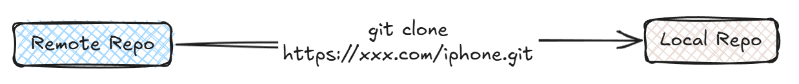
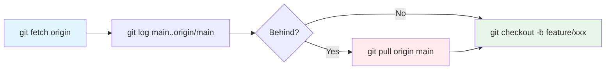
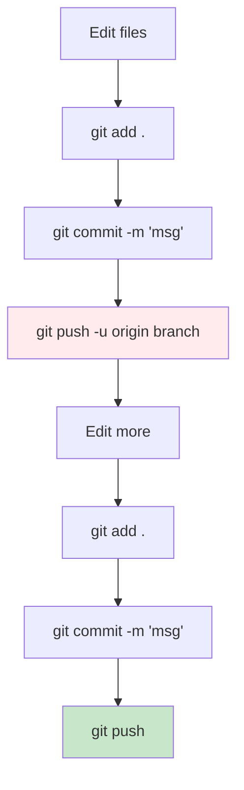
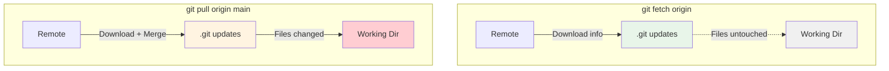
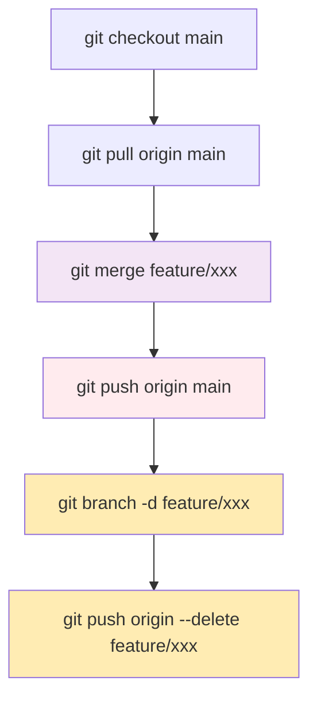

# Getting Started with Git

Every project needs version control. Git is that version control. 

There are others - Mercurial, Subversion, Visual Source Safe. But git won. It's free, open source, and if you use GitHub, GitLab, BitBucket, or Azure DevOps, you're already using git.

This guide will walk you through the basics. Not theory. Real commands you'll use every day.

## Why Git?

Git is distributed. This means every developer has the complete repository on their machine. You can work offline. Commit changes. Push when you're ready.

It's not like the old centralized systems where you needed constant connection to the server. Git is fast. Branching is cheap. Merging is smart.

## Your First Day: Cloning a Repository

You don't start with `git init`. Not in real projects. You start with clone.

Your team already has a repository. On GitHub, maybe GitLab. Your job is to get it on your machine.




Open your terminal. Navigate to where you keep projects.

```bash
cd ~/Documents/projects
```

Now clone.

```bash
git clone https://github.com/username/repository.git
```

If your company uses SSH (they probably do), it looks like this:

```bash
git clone git@github.com:username/repository.git
```

### What just happened?

A lot actually. Git created a folder with the repository name. Inside that folder, it set up a hidden `.git` directory. That's the vault. Everything git-related lives there.

Git downloaded the entire history. Every commit, every branch, every tag. Then it checked out the default branch (usually `main`) and put the files in your folder.

Navigate into it.

```bash
cd repository
```

Check the status.

```bash
git status
```

!!! success "You're synced"
    You'll see something like:
    ```
    On branch main
    Your branch is up to date with 'origin/main'.
    
    nothing to commit, working tree clean
    ```
    This is good. Your local `main` matches remote `main`.

### What is origin?

`origin` is the default name for the remote repository. When you cloned, git automatically set this up. You can see it:

```bash
git remote -v
```

This shows:

```
origin  https://github.com/username/repository.git (fetch)
origin  https://github.com/username/repository.git (push)
```

Every time you push or pull, you're talking to `origin`.

## Day Two: Your First Feature

You got a ticket. Build a new feature. Let's call it user authentication.

You don't work on `main`. Never work on `main`. Create a branch.

### Step 1: Make sure you're up to date

Before creating a branch, sync with remote. Someone might have pushed changes overnight.



```bash
git fetch origin
```

!!! info "What does git fetch do?"
    This downloads the latest information from remote. It doesn't change your files. Just updates git's knowledge of what's on the server.

Now check if your local `main` is behind.

```bash
git log main..origin/main --oneline
```

If this shows commits, your local `main` is outdated. Update it.

```bash
git checkout main
git pull origin main
```

Now your local `main` matches remote. You're ready.

### Step 2: Create a feature branch

```bash
git checkout -b feature/user-auth
```

This creates a new branch called `feature/user-auth` and switches to it.

!!! warning "Branch only exists locally"
    The branch exists only on your machine. Remote doesn't know about it yet.



### Step 3: Make changes

You write code. Edit files. Add new files. Normal work.

Let's say you created `auth.js` and modified `app.js`.

Check what changed:

```bash
git status
```

You'll see:

```
On branch feature/user-auth
Changes not staged for commit:
  modified:   app.js

Untracked files:
  auth.js
```

Git noticed the changes. But it's not tracking them yet.

### Step 4: Stage your changes

Staging is preparing changes for commit. You tell git what to include.

```bash
git add app.js auth.js
```

Or stage everything at once:

```bash
git add .
```

Check status again:

```bash
git status
```

Now you'll see:

```
On branch feature/user-auth
Changes to be committed:
  modified:   app.js
  new file:   auth.js
```

### Step 5: Commit

A commit is a snapshot. You're saving the current state with a message.

```bash
git commit -m "Add user authentication module"
```

??? tip "Writing good commit messages"
    Write clear messages. Your future self will thank you. Your teammates will thank you.
    
    **Bad commit messages:**
    
    - "fixed stuff"
    - "update"
    - "changes"
    
    **Good commit messages:**
    
    - "Add user authentication module"
    - "Fix login validation bug"
    - "Update password encryption to bcrypt"

### Step 6: Push to remote (first time)

Now you want to share your work. Push it to remote.

But you can't just run `git push`. Not yet.

Why? Because remote doesn't know about your branch. It only exists locally. You need to tell git where to push it.

```bash
git push -u origin feature/user-auth
```

!!! important "The -u flag is critical"
    `-u` stands for `--set-upstream`. It does two things:
    
    1. Pushes your branch to remote
    2. Sets up tracking between your local branch and the remote branch
    
    After this, your local `feature/user-auth` knows it's connected to `origin/feature/user-auth`.

You'll see output like:

```
Enumerating objects: 5, done.
Counting objects: 100% (5/5), done.
Delta compression using up to 8 threads
Compressing objects: 100% (3/3), done.
Writing objects: 100% (3/3), 432 bytes | 432.00 KiB/s, done.
Total 3 (delta 1), reused 0 (delta 0)
To https://github.com/username/repository.git
 * [new branch]      feature/user-auth -> feature/user-auth
Branch 'feature/user-auth' set up to track remote branch 'feature/user-auth' from 'origin'.
```

Your branch is now on remote. Your team can see it. You can create a pull request.

### Step 7: Making more changes

You're not done. You need to add password validation. Make the changes. Then:

```bash
git add .
git commit -m "Add password validation"
git push
```

!!! success "No more -u needed"
    Notice something? Just `git push`. No `-u origin feature/user-auth`.
    
    That's the magic of `-u`. You set up tracking once. After that, git knows where to push.

## Working with an Existing Remote Branch

Your teammate created a branch called `feature/payment-gateway`. You need to work on it.

First, fetch the latest from remote:

```bash
git fetch origin
```

Now create your local version of that branch:

```bash
git checkout -b feature/payment-gateway origin/feature/payment-gateway
```

This creates a local `feature/payment-gateway` that tracks `origin/feature/payment-gateway`.

??? info "Simpler method"
    You can also do it in one step:
    
    ```bash
    git checkout feature/payment-gateway
    ```
    
    If the branch exists on remote but not locally, git will automatically create it and set up tracking.

Make your changes. Commit. Push.

```bash
git add .
git commit -m "Add Stripe integration"
git push
```

## Understanding Fetch vs Pull

People confuse these. They're different.



| Command | What it does | Safe? |
|---------|--------------|-------|
| `git fetch origin` | Downloads information from remote. Updates git's knowledge of remote branches. Doesn't change your local files. | ✅ Always safe |
| `git pull origin main` | Fetches from remote AND merges the changes into your current branch. It's `git fetch` + `git merge` combined. | ⚠️ Can cause merge conflicts |

!!! warning "Before pulling"
    Always commit or stash your changes before pulling.

## The .git Folder

That hidden `.git` folder in your repository? It's the database.

Everything lives there. Every commit. Every branch. Every file version. The entire history.

Your project files are just a checkout. A snapshot of one point in history.

!!! danger "Don't delete .git"
    Delete `.git`? Your files stay. But all history is gone. All branches. All commits. You're no longer in a git repository.
    
    Don't touch `.git` unless you know what you're doing.

## When Things Go Wrong

### You made commits on main instead of a branch

It happens. Don't panic.

```bash
# Create a branch from your current position
git branch feature/accidental-work

# Reset main to match remote
git checkout main
git reset --hard origin/main

# Switch back to your new branch
git checkout feature/accidental-work
```

Your work is safe. It's just on the right branch now.

### You need to undo the last commit

```bash
git reset --soft HEAD~1
```

This undoes the commit but keeps your changes staged. You can modify them and commit again.

### You want to see what changed

| Command | What it shows |
|---------|---------------|
| `git diff` | Unstaged changes |
| `git diff --staged` | Staged changes |
| `git diff main..feature/user-auth` | Changes between branches |

## The Merge

Your pull request got approved. Time to merge.



```bash
# Switch to main
git checkout main

# Pull the latest
git pull origin main

# Merge your feature branch
git merge feature/user-auth

# Push to remote
git push origin main

# Delete the feature branch locally
git branch -d feature/user-auth

# Delete it from remote
git push origin --delete feature/user-auth
```

## Quick Reference

| Task | Command |
|------|---------|
| Clone repository | `git clone <repository-url>` |
| Create branch | `git checkout -b feature/branch-name` |
| Stage changes | `git add .` |
| Commit | `git commit -m "Your message"` |
| First push | `git push -u origin feature/branch-name` |
| Subsequent pushes | `git push` |
| Fetch updates | `git fetch origin` |
| Pull changes | `git pull origin main` |
| Check status | `git status` |
| View history | `git log --oneline` |

## What About git init?

You rarely use it. Maybe for a brand new project that doesn't exist anywhere yet.

```bash
git init
```

This creates a `.git` folder in your current directory. Now it's a git repository.

But you still need to connect it to remote:

```bash
git remote add origin <repository-url>
```

Then push your first commit:

```bash
git add .
git commit -m "Initial commit"
git push -u origin main
```

??? note "Real projects start with clone"
    But honestly? Most projects start with clone. Someone already set up the repository. You just clone it and start working.

## The Real Workflow

This is how you'll actually work:

1. **Clone the repository** (once)
2. **Fetch and pull latest changes** (daily)
3. **Create a feature branch**
4. **Make changes, stage, commit**
5. **Push with `-u` the first time**
6. **Keep working, commit, push** (no more `-u`)
7. **Create pull request**
8. **After approval, merge**
9. **Delete the branch**
10. **Repeat from step 2**

!!! success "It becomes muscle memory"
    That's it. You'll do this loop hundreds of times. It becomes muscle memory.
    
    Git seems complicated at first. It's not. It's just different. Practice this workflow a few times. It'll click.