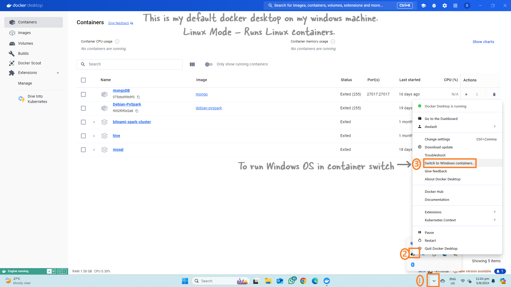

# <span style="color: Teal">Create a Self-Hosted Agent in Docker Windows Container</span>

You can run your Azure Pipeline agent in **Windows**, **Windows Container**, and **Ubuntu Container**.

<p style="color: #006600; font-family: 'Trebuchet MS', Helvetica, sans-serif; background-color: #e6ffe6; padding: 15px; border-left: 5px solid #00cc66;">
This guide will show you how to set up your Azure Pipeline agent in a Windows Container.
</p>

## Setup

We'll use a **Windows laptop/desktop** with Docker Desktop installed. First, we'll switch Docker Desktop to Windows Mode (it runs in Linux Mode by default) because the container will be a Windows OS.

Then we'll create the image, and the rest will be easy.

## Install Docker for Windows

First, make sure Docker Desktop is installed on your Windows machine.

## Switch Docker to Use Windows Containers

<span style="color: red;">Note:</span> Docker can run both Linux and Windows containers. By default, Docker runs in Linux mode. For more details, refer to [this guide](https://learn.microsoft.com/en-us/virtualization/windowscontainers/quick-start/run-your-first-container).

**In PowerShell, run this command:**

> <span style="color: blue;">Note:</span> If you have existing Linux containers, they will disappear when you switch to Windows mode but will return when you switch back to Linux mode. You will get a new Docker desktop!

```powershell
& $Env:ProgramFiles\Docker\Docker\DockerCli.exe -SwitchDaemon
```



To switch back to Linux mode later, refer to the image below:


## Create and Build the Dockerfile

Next, create the Dockerfile.

**Open a command prompt and create a new directory:**

```powershell
mkdir "C:\azp-agent-in-docker\"
cd "C:\azp-agent-in-docker\"
```

Save the following content to a file called `C:\azp-agent-in-docker\azp-agent-windows.dockerfile`:

```dockerfile
FROM mcr.microsoft.com/windows/servercore:ltsc2022

WORKDIR /azp/

COPY ./start.ps1 ./

CMD powershell .\start.ps1
```

Save the following content to `C:\azp-agent-in-docker\start.ps1`:

> Note, this script is taken as-is from this [location](https://learn.microsoft.com/en-us/azure/devops/pipelines/agents/docker?view=azure-devops).

```powershell
function Print-Header ($header) {
  Write-Host "`n${header}`n" -ForegroundColor Cyan
}

if (-not (Test-Path Env:AZP_URL)) {
  Write-Error "error: missing AZP_URL environment variable"
  exit 1
}

if (-not (Test-Path Env:AZP_TOKEN_FILE)) {
  if (-not (Test-Path Env:AZP_TOKEN)) {
    Write-Error "error: missing AZP_TOKEN environment variable"
    exit 1
  }

  $Env:AZP_TOKEN_FILE = "\azp\.token"
  $Env:AZP_TOKEN | Out-File -FilePath $Env:AZP_TOKEN_FILE
}

Remove-Item Env:AZP_TOKEN

if ((Test-Path Env:AZP_WORK) -and -not (Test-Path $Env:AZP_WORK)) {
  New-Item $Env:AZP_WORK -ItemType directory | Out-Null
}

New-Item "\azp\agent" -ItemType directory | Out-Null

# Let the agent ignore the token env variables
$Env:VSO_AGENT_IGNORE = "AZP_TOKEN,AZP_TOKEN_FILE"

Set-Location agent

Print-Header "1. Determining matching Azure Pipelines agent..."

$base64AuthInfo = [Convert]::ToBase64String([Text.Encoding]::ASCII.GetBytes(":$(Get-Content ${Env:AZP_TOKEN_FILE})"))
$package = Invoke-RestMethod -Headers @{Authorization=("Basic $base64AuthInfo")} "$(${Env:AZP_URL})/_apis/distributedtask/packages/agent?platform=win-x64&`$top=1"
$packageUrl = $package[0].Value.downloadUrl

Write-Host $packageUrl

Print-Header "2. Downloading and installing Azure Pipelines agent..."

$wc = New-Object System.Net.WebClient
$wc.DownloadFile($packageUrl, "$(Get-Location)\agent.zip")

Expand-Archive -Path "agent.zip" -DestinationPath "\azp\agent"

try {
  Print-Header "3. Configuring Azure Pipelines agent..."

  .\config.cmd --unattended `
    --agent "$(if (Test-Path Env:AZP_AGENT_NAME) { ${Env:AZP_AGENT_NAME} } else { hostname })" `
    --url "$(${Env:AZP_URL})" `
    --auth PAT `
    --token "$(Get-Content ${Env:AZP_TOKEN_FILE})" `
    --pool "$(if (Test-Path Env:AZP_POOL) { ${Env:AZP_POOL} } else { 'Default' })" `
    --work "$(if (Test-Path Env:AZP_WORK) { ${Env:AZP_WORK} } else { '_work' })" `
    --replace

  Print-Header "4. Running Azure Pipelines agent..."

  .\run.cmd
} finally {
  Print-Header "Cleanup. Removing Azure Pipelines agent..."

  .\config.cmd remove --unattended `
    --auth PAT `
    --token "$(Get-Content ${Env:AZP_TOKEN_FILE})"
}
```

**Build the Docker image:**

```powershell
docker build --tag "azp-agent:windows" --file "./azp-agent-windows.dockerfile" .
```

The final image will be tagged as `azp-agent:windows`.

## Start the Image

Now that you have created an image, you can run a container. This will install the latest version of the agent, configure it, and run the agent. It targets the specified agent pool (the Default agent pool by default) of a specified Azure DevOps or Azure DevOps Server instance of your choice:

```powershell
docker run -e AZP_URL="<Azure DevOps instance>" -e AZP_TOKEN="<Personal Access Token>" -e AZP_POOL="<Agent Pool Name>" -e AZP_AGENT_NAME="Docker Agent - Windows" --name "azp-agent-windows" azp-agent:windows
```