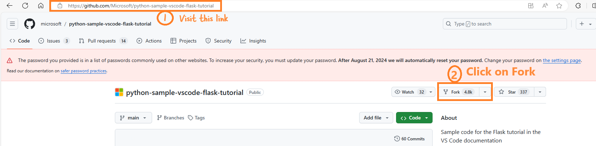
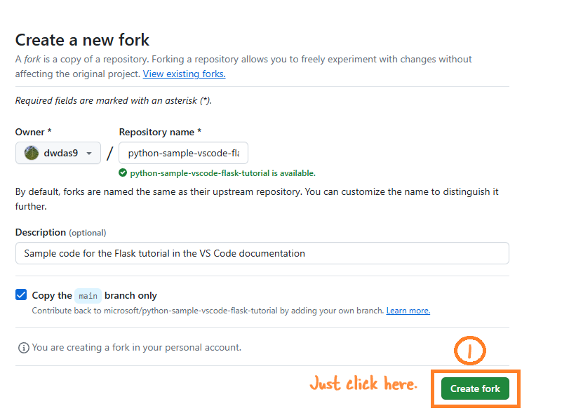
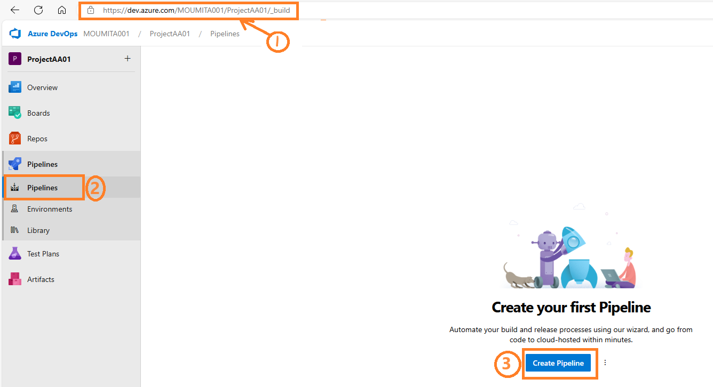
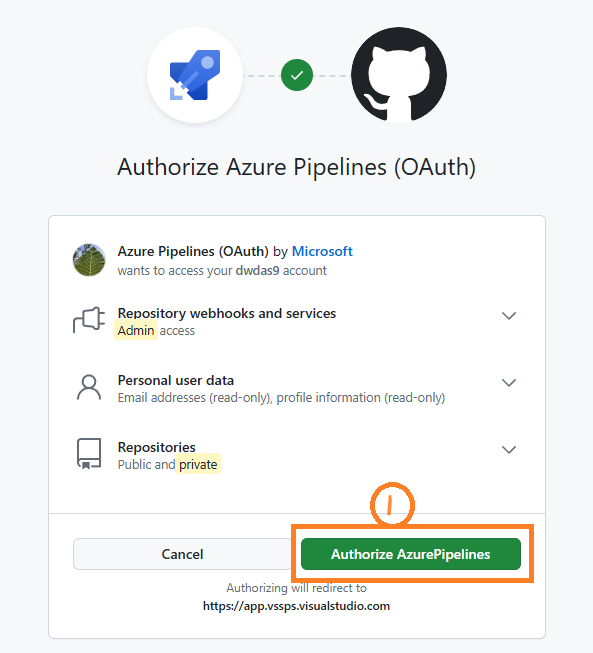
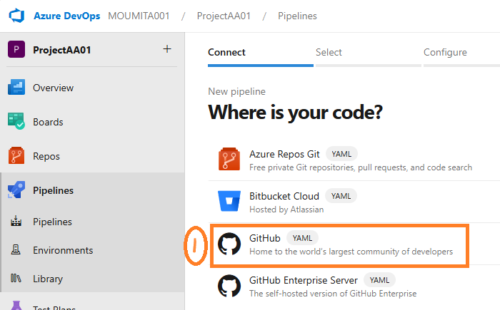
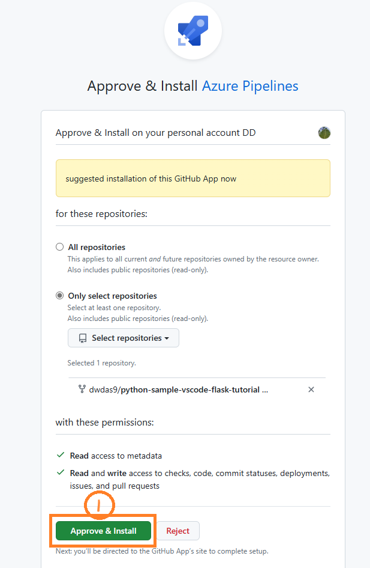
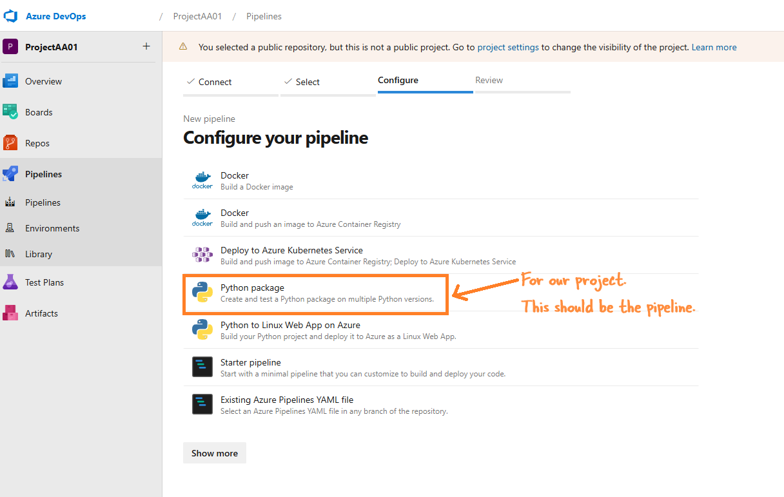
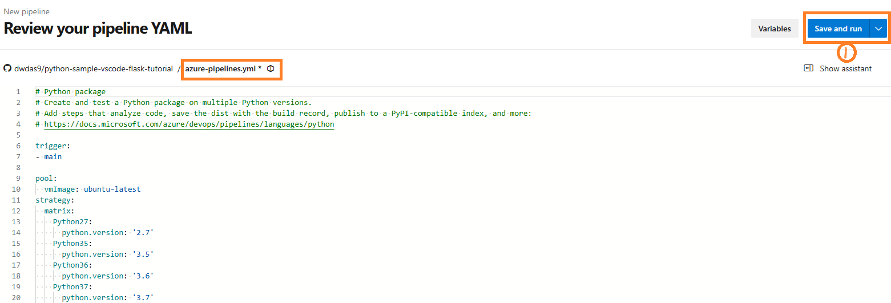
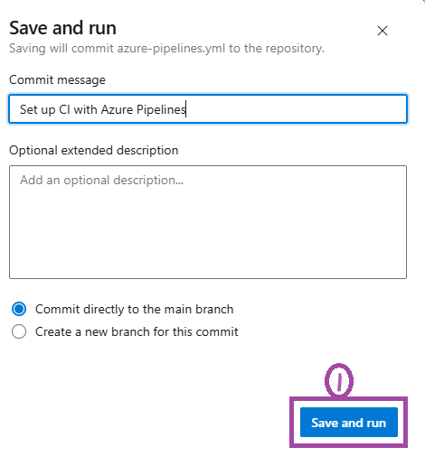
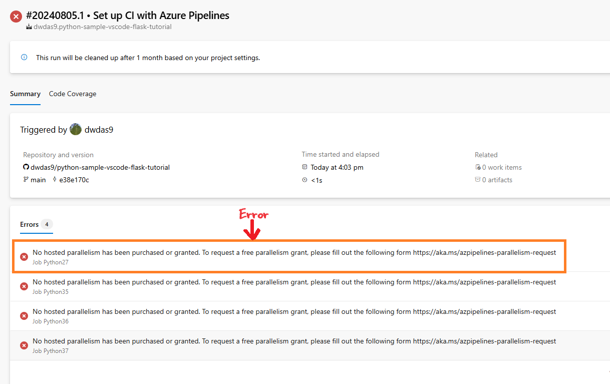

# Azure Pipelines

In Azure DevOps, Azure Pipelines are used to automatically build, test, and deploy any project to Dev, UAT, or PROD environments. This is how CI/CD is implemented using Azure Pipelines.

You can use Azure Pipelines for any type of project, be it C#, Python, iOS, Android, etc. Azure Pipeline is written in a [YAML file](https://learn.microsoft.com/en-us/azure/devops/pipelines/get-started/pipelines-get-started?view=azure-devops), called `azure-pipelines.yml`, in your VS project folder.

[Create your first pipeline](https://learn.microsoft.com/en-us/azure/devops/pipelines/create-first-pipeline?view=azure-devops&tabs=java%2Cbrowser)

# Azure Pipelines Agents

When a pipeline runs, it creates one or more jobs. These jobs need 'a place' to run. This place is the agent. The agent is a machine, VM, or cloud environment with the agent software installed, where the jobs can execute.

There are three types of agents:

- **Microsoft-hosted agent**
- **Self-hosted agent**
- **Azure VM agents**

> The agent is where the jobs for the pipelines run.

# Create a Pipeline in Azure DevOps

### What You Need

- **GitHub account**: Create a free repository on GitHub.
- **Azure DevOps organization**: Create one for free. If your team already has one, ensure you're an administrator of the Azure DevOps project you want to use.
- **Ability to run pipelines on Microsoft-hosted agents**: Your Azure DevOps organization must have access to Microsoft-hosted parallel jobs. You can either purchase a parallel job or request a free grant.

### Steps to Create a Pipeline

1. **Fork the Repository**
   - Open [this link](https://github.com/Microsoft/python-sample-vscode-flask-tutorial) and click on **Fork**.
   
   - Click on **Create fork**.
   

2. **Sign in to Azure DevOps**
   - Sign in to your Azure DevOps organization and go to your project.

3. **Create a New Pipeline**
   - Go to **Pipelines**, and then select **New pipeline** or **Create pipeline** if it's your first pipeline.
   

4. **Connect to GitHub**
   - Follow the steps in the wizard by first selecting GitHub as the location of your source code.
   
   
   - You might be redirected to GitHub to install the Azure Pipelines app. If so, select **Approve & install**.

5. **Configure the Pipeline**
   - Azure Pipelines will analyze your repository and recommend the Python package pipeline template.
   - When your new pipeline appears, check the YAML to see what it does. When you're ready, select **Save and run**.
   - You'll be prompted to commit a new `azure-pipelines.yml` file to your repository. After you're happy with the message, select **Save and run** again.
   
   

6. **Watch Your Pipeline Run**
   - If you want to watch your pipeline in action, select the build job.

You have now created and ran a pipeline that Azure automatically created for you, as your code was a good match for the Python package template. You now have a working YAML pipeline (`azure-pipelines.yml`) in your repository that's ready for you to customize!

### Editing Your Pipeline

- When you're ready to make changes to your pipeline, select it in the Pipelines page, and then edit the `azure-pipelines.yml` file.
  
  

### No Hosted Parallelism Available

This means you haven't purchased Parallelism. You can do this:

1. **Request Free Parallelism**: [Request Parallelism](https://aka.ms/azpipelines-parallelism-request).
2. **Check Usage**: Go to your Azure DevOps settings and check if all your parallel jobs are in use.
3. **Buy More Parallelism**: If needed, buy more parallelism from the billing section in Azure DevOps.
4. **Set Up Self-hosted Agents**: If you have your own resources, [set up self-hosted agents to run your pipelines](https://docs.microsoft.com/en-us/azure/devops/pipelines/agents/v2-linux?view=azure-devops).

You can run the Azure Pipeline agent on your own computer and run the pipeline on a self-hosted Azure Pipeline Agent: [Learn more](https://learn.microsoft.com/en-us/azure/devops/pipelines/agents/agents?view=azure-devops&tabs=browser).