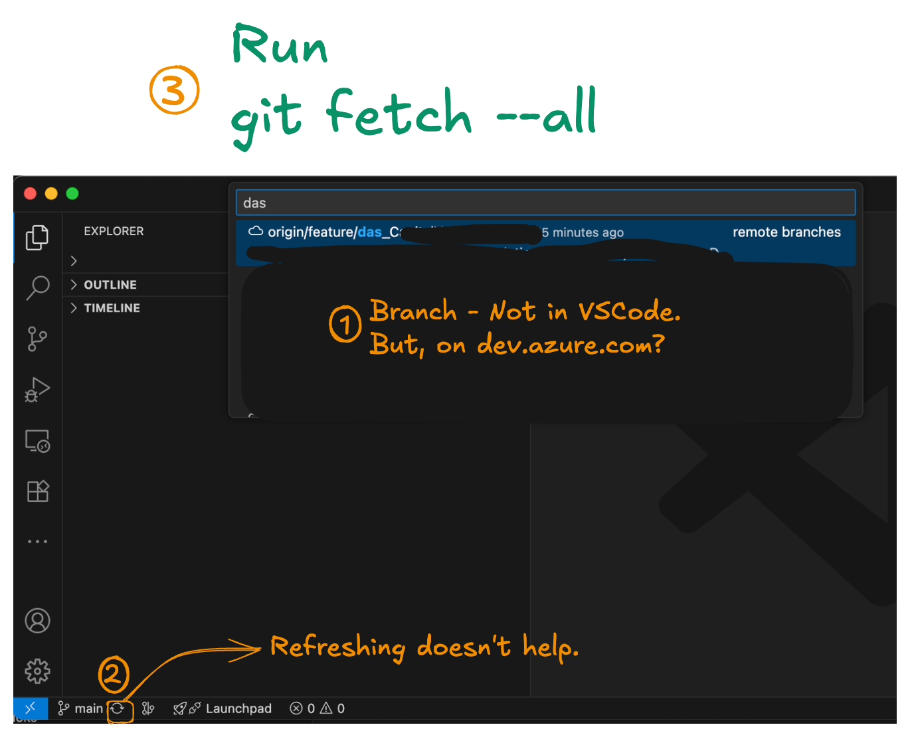

# Git Troubleshooting Scenarios

Here are some common Git troubleshooting scenarios I've encountered, along with explanations and fixes.

## Git Branch Not Showing in VS Code

### The Problem

I could see my branch `feature/DasSomeFeatureName` in Azure DevOps, but VS Code wasn't showing it in the branch selector.



### The Fix

```bash
git fetch --all
```

Then checkout the branch:

```bash
git checkout feature/DasSomeFeatureName
```

### Why This Happens

VS Code's refresh button only syncs branches you're already tracking. It doesn't check for new remote branches. When someone creates a branch remotely (web interface, another machine, teammate), your local Git doesn't know about it until you fetch.

### Quick Reference

```bash
# Get all remote branches
git fetch --all

# See what's available
git branch -a

# Switch to the branch
git checkout feature/DasSomeFeatureName
```

### Key Takeaway

VS Code's refresh ≠ `git fetch`. If a remote branch isn't showing up, fetch first.


## Understanding Git Reset: When Hard Reset Doesn't Work

### The Problem

I had this weird situation. I work on multiple machines with the same GitHub repo. Sometimes I work on one machine, push changes, and then don't touch another machine for weeks. When I finally get back to that old machine, I prefer doing a hard reset instead of merging or dealing with conflicts. Just wipe everything and start fresh with whatever's on GitHub, right?

But here's what happened - I did a `git reset --hard origin/main` and I was still seeing old content. Multiple times. Like, what's going on? I thought hard reset was supposed to be the nuclear option that just obliterates everything local and matches the remote. But it wasn't working.

### What I Was Doing (The Wrong Way)

```bash
# I was doing this:
git reset --hard origin/main
git checkout main
# Still seeing old content... tried again
git reset --hard origin/main
# Still old content!
```

### The Missing Piece

Then I ran `git fetch origin` and boom - suddenly Git downloaded 342 objects. The output showed:

```
From https://github.com/dwdas9/home
a46af0f..b6044b6 main -> origin/main
```

Wait, what? `origin/main` just moved from `a46af0f` to `b6044b6`? That's when it hit me.

### The Fundamental Misunderstanding

Here's what I forgot: **`origin/main` is not the actual GitHub repository. It's a local copy of where GitHub was the last time you asked.**

Let me break this down:

#### What Git Actually Stores Locally

When you have a Git repo, you actually have several things:

1. **Your working directory** - the actual files you see and edit
2. **Your local branches** - like `main`, `feature-branch`, etc.
3. **Remote-tracking branches** - like `origin/main`, `origin/develop`, etc.

That third one is the key. `origin/main` is just Git's **memory** of where the remote `main` branch was. It's a snapshot, a cached reference. Not a live connection.

#### When Does This Memory Get Updated?

Only when you explicitly talk to GitHub:
- `git fetch` - updates your memory
- `git pull` - updates your memory AND merges
- `git push` - sends your changes (also updates memory)

#### What I Was Actually Doing

```bash
git reset --hard origin/main
```

This command means: "Reset my working directory and local branch to match `origin/main`"

But my `origin/main` was pointing to a commit from weeks ago because I hadn't fetched in weeks! So I was just resetting to old content, over and over.

It's like asking someone "What time is it?" and they tell you what time it was the last time they checked their watch three days ago. You keep asking, they keep saying "3:47 PM Tuesday" because they haven't looked at their watch since then.

### The Right Way to Hard Reset

#### Method 1: Fetch First, Then Reset

```bash
# Step 1: Update your knowledge of what's on GitHub
git fetch origin

# Step 2: Now reset to that updated information
git reset --hard origin/main
```

#### Method 2: Pull with Force (One Command)

```bash
# This does fetch + reset in one go
git pull --force origin main
```

#### Method 3: The Safest Comprehensive Reset

```bash
# Fetch all remote branches
git fetch origin

# Make sure you're on the right branch
git checkout main

# Reset to match remote exactly
git reset --hard origin/main

# Clean any untracked files/directories (optional but thorough)
git clean -fd
```

### Key Learnings

#### 1. Remote-Tracking Branches are Local References

`origin/main` lives on your computer. It's not magical or live-updated. It's just Git's bookmark saying "last time I checked, GitHub's main branch was here."

#### 2. Fetch Updates Your Mental Model

`git fetch` is like syncing your calendar. It doesn't change your schedule (working directory), it just updates your knowledge of what everyone else is doing.

#### 3. The Git Three-Way Relationship

Think of it as three separate entities:
- **GitHub's actual repository** (remote server)
- **Your remote-tracking branches** (`origin/main` - local cache)
- **Your local branches** (`main` - what you work on)

When you reset to `origin/main`, you're resetting to #2, not #1. You need fetch to sync #2 with #1 first.

#### 4. Why This Matters More with Multiple Machines

When you work on Machine A, push changes, then go to Machine B weeks later:
- GitHub has all your new changes
- Machine B's `origin/main` still points to the old commit from weeks ago
- Machine B has no idea anything changed until you fetch


If you skip the fetch step, you're resetting to outdated information.

### Other Related Commands to Understand

#### git fetch vs git pull

```bash
# Just updates origin/main reference, doesn't touch your files
git fetch origin

# Updates origin/main AND merges it into your current branch
git pull origin main
```

#### Checking What's Different

```bash
# See what's different between local and remote (after fetching)
git log HEAD..origin/main

# Show all remote branches and their status
git branch -r
```

#### Force Pull vs Force Push

```bash
# Force pull - discard local changes, match remote
git fetch origin
git reset --hard origin/main

# Force push - dangerous! Overwrites remote with local
git push --force origin main  # Be careful with this!
```

### When to Use Hard Reset

Hard reset is perfect for:
- Getting a clean slate when you've been experimenting
- Syncing a rarely-used machine with the main repo
- Recovering from a messy local state
- When you don't care about local changes at all

But remember: **Always fetch first** so you're resetting to the actual latest code, not to your outdated memory of what the latest code was.

### The Command I Should Have Run

Instead of repeatedly doing:
```bash
git reset --hard origin/main  # Wrong - resetting to old cached reference
```

I should have done:
```bash
git fetch origin              # First - update the cache
git reset --hard origin/main  # Then - reset to updated cache
```

Or just:
```bash
git pull --force origin main  # Does both in one step
```

### Conclusion

Git is a distributed version control system, and "distributed" means your local repo is independent. `origin/main` is just your local copy of a reference, not a live connection. Understanding this distinction is crucial for avoiding confusion when working across multiple machines.

The lesson? **Fetch before you reset.** Always update your local references before using them to reset your working state. Otherwise you're just resetting to old information, which is exactly what happened to me.