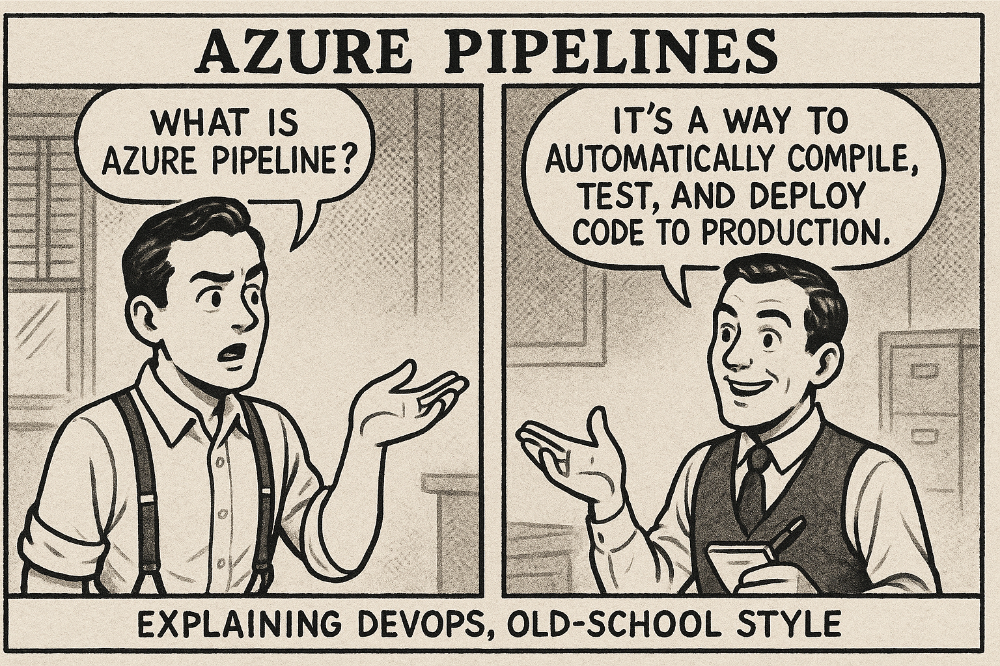
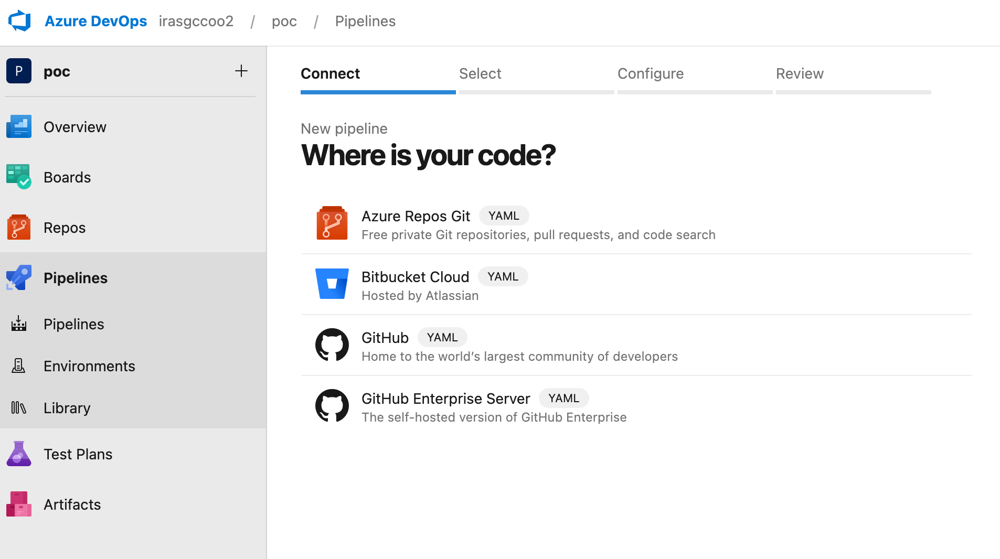

## What is Azure Piplines?

Azure Piplines is a featurre of Azure DevOps which let's you auomatically compile, test and deploy your code(to say to PROD/PREPROD). As long as you use a common language like Python, Java, C#, etc, in linux, windows mac etc. and as long as your code is in a git repository(online or local, azure aws, github, gitlab, etc.), you can use Azure Pipelines to automate the process of building, testing and deploying your code.

## So what are the pre-requisites?

1. You must have an Azure DevOps account [Azure DevOps](https://dev.azure.com/).
2. You should be able to go through these doors: Organization > Project > Pipelines > Create Pipeline. If you can see this, you are good to go.
3. The code you want to build, test and deploy must be in a git repository. You can use Azure Repos, GitHub, GitLab, Bitbucket or any other git repository.

## What is CI? continuous integration?

The term does appear complex, but it's actually straightforward. CI (Continuous Integration) simply means automatically building (like compiling a Java .jar file) and testing your code whenever changes are made. All tests are designed to run automatically, not just some of them.

The typical flow works like this:
1. A developer pushes code to the repository
2. The CI system automatically builds and tests the code
3. If the tests pass, the code *can be* deployed to a staging environment (that's the CD part - Continuous Delivery/Deployment)
4. If the tests fail, the code is not deployed, and the developer is notified of the failure

## What is CD? continuous delivery?

CD (Continuous Delivery) is a workflow written in a YAML file that defines how to build, test and deploy your code. It is a set of steps that are executed automatically whenever changes are made to the source code. The goal of CD is to automate the process of deploying code to production.

Why? Remember, the old days where one would put code to FTP server, someone would run SQL scripts manually, configuration files were manually changed to PROD, etc. This is all gone now. Now, everything is automated. You push code to the repository, and the CD pipeline takes care of the rest.
