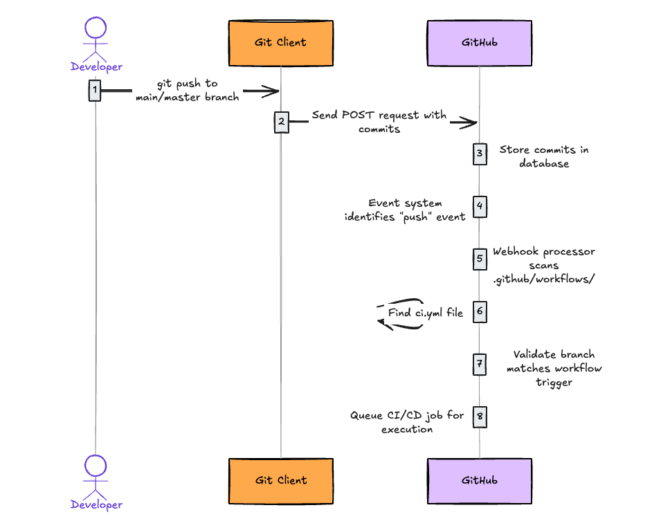
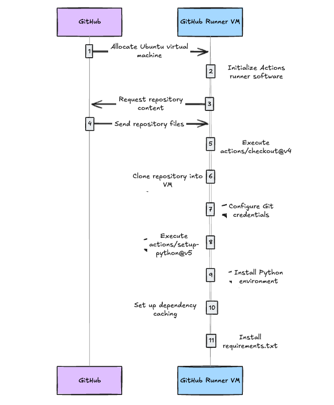
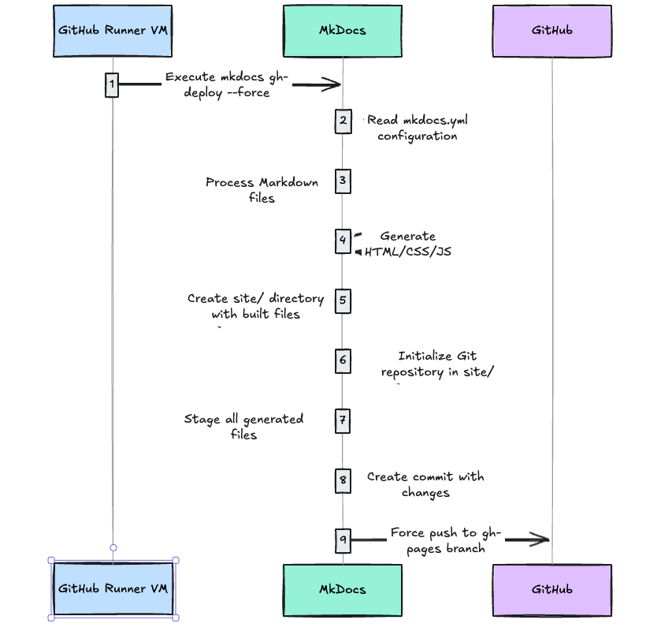
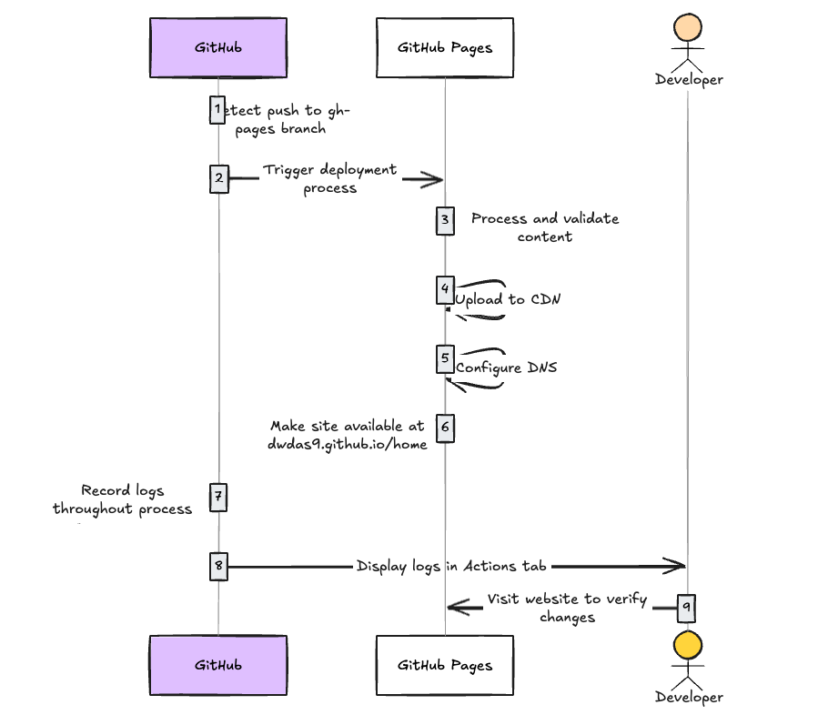

# Understanding a full CI/CD process with a practical example

## Introduction

This website has a full fledged CI/CD process that automatically builds and deploys the website whenever I push changes to the `main` or `master` branch. The CI/CD process is powered by GitHub Actions, which automates the entire workflow from markdown-to-html conversion to deployment. In this document I try to explain how the entire setup works, including the folder structure, the CI/CD process, and the key concepts involved.

### Key Concepts Covered

- **Continuous Integration (CI)**: How the markdown files are automatically built into HTML
- **Continuous Deployment (CD)**: How the built HTML files are automatically deployed to GitHub Pages
- **GitHub Actions**: The automation platform that powers our workflow
- **Runners**: The virtual machines where the CI/CD jobs are executed


## Main folders in ths project

All the source code of this website is present in a VSCode project. The main folders in this project are:

```
├── docs/                # Contains all the markdown files that I write
├── site/                # Contains the generated HTML files (the built website)
├── .github/             # Contains the CI/CD configuration and workflow files
│   └── workflows/       # Contains the CI/CD workflow files
│       └── ci.yml      # The main and only CI/CD workflow file
├── mkdocs.yml           # Configuration file for MkDocs (the documentation generator)
└── requirements.txt     # Python dependencies for the project
```

### The `.github` and `workflows` folder

The `.github` folder is a constant system folder that GitHub uses to manage repository settings and automation. You will need to create this folder if you want to use CI/CD. Remember these points:

- It's a special folder that GitHub recognizes for repository configuration
- The `.github/workflows/` subfolder contains workflow definition files (YAML)
- These workflow files define the automated CI/CD processes
- Additional configuration files for issues, pull requests, etc. can also be stored here

When you put a workflow YAML file (e.g., .github/workflows/ci.yml) to your repository, GitHub specifically indexes only the YAML files (with extensions `.yml` or `.yaml`) inside the `.github/workflows/` directory. GitHub Actions does not index other file types placed in this directory.

To remember:

- GitHub **only indexes files with `.yml` or `.yaml` extensions** inside the `.github/workflows/` directory
- Other file types (like `.md`, `.txt`, or `.json`) placed in the `.github/workflows/` directory will be stored but not processed as workflows
- Files outside the `.github/workflows/` directory, even if they are YAML files with similar structure, will not be processed as GitHub Actions workflows
- Subdirectories within `.github/workflows/` are supported - YAML files in these subdirectories will also be indexed as workflows


#### How are the workflow folder's .yml/yaml files indexed?

GitHub Actions Service is a fully automatic, dedicated, backend GitHub service that handles the indexing process. Indexing is event-driven, meaning, it occurs automatically when a new file is added to the .github/workflows/ directory or when an existing file is modified. The indexing process involves several steps:

1. **File Detection**: GitHub's backend continuously monitors the `.github/workflows/` directory for any changes. When a new file is added or an existing file is modified, the indexing process is triggered.
2. **File Parsing**: The service reads the contents of the YAML file to understand its structure and content. It checks for syntax errors and validates the file against the GitHub Actions schema.
3. **Event Registration**: GitHub specifically extracts and indexes the `on:` section to register which events (like `push`, `pull_request`, `schedule`, etc.) should trigger this workflow. It registers these events in GitHub's event system, allowing the workflow to be triggered when those events occur.
4. **Branch/Path Filters**: For event triggers that support filters (like `branches:`, `paths:`, `tags:`), GitHub indexes these patterns to quickly determine if a particular event should trigger the workflow.
5. **Workflow Metadata**: Information like the workflow `name:`, `permissions:`, and other top-level attributes are indexed.
6. **Job Definitions**: The structure of jobs, their dependencies, and conditions are indexed to determine execution order.
7. **References to Reusable Workflows**: Any references to reusable workflows (using `uses:` with another workflow) are indexed to establish relationships between workflows.
8. **Storage**: The indexed information is stored in GitHub's database, making it available for the workflow execution engine. Each repository's workflow data is stored separately for security and performance reasons. This indexed data is not directly accessible to users through the GitHub UI or API


### The `ci.yml` file

For this website, the `ci.yml` file is the main and ONLY file which contains all our CI/CD logic. There are no other files for CI/CD. It must be present inside `.github/workflows/` folder. Remember, the `on` section of the `ci.yml` file is the most important part. It tells GitHub Actions when to run the workflow. In our case, we have set it to run on every push to the `main` or `master` branch.

Let's analyze the source code we have put in our `ci.yml` :

```yaml
name: ci                 # Name shown in GitHub Actions UI
on:
  push:                  # Trigger this workflow when code is pushed
    branches:            # Only on these specific branches
      - master           
      - main
permissions:
  contents: write        # Grant permission to modify repository contents
jobs:
  deploy:                # Define a job named "deploy"
    runs-on: ubuntu-latest  # Run on Ubuntu virtual machine
    steps:               # Define sequence of steps to execute
      # CI Phase: Setup and Build
      - uses: actions/checkout@v4  # Get repository code
      - name: Configure Git Credentials
        run: |
          git config user.name github-actions[bot]
          git config user.email 41898282+github-actions[bot]@users.noreply.github.com
      - uses: actions/setup-python@v5  # Install Python
        with:
          python-version: 3.x
      - run: echo "cache_id=$(date --utc '+%V')" >> $GITHUB_ENV  # Setup caching
      - uses: actions/cache@v4
        with:
          key: mkdocs-material-${{ env.cache_id }}
          path: .cache
          restore-keys: |
            mkdocs-material-
      - run: pip install -r requirements.txt  # Install dependencies
      
      # CD Phase: Deploy
      - run: mkdocs gh-deploy --force  # Build site and deploy to GitHub Pages
```
#### General workflow File Structure:

```yaml
name: Workflow Name       # Display name in GitHub UI
on: [push, pull_request]  # Events that trigger the workflow
jobs:                     # Groups of steps to run
  job_name:               # A single job definition
    runs-on: ubuntu-latest # Environment to run on
    steps:                 # Ordered list of actions to take
      - uses: actions/checkout@v4  # Use a predefined action
      - name: Custom Step          # Run a custom command
        run: echo "Hello World"
```


## The CI/CD Process Step-by-Step

The CI/CD process starts the momenent the user(I) creates any markdown file and push it to the `main` or `master` branch. Here’s a step-by-step breakdown of how it works:

### Step-by-Step Breakdown of the CI/CD Process

1. **Triggering the Workflow - The Sequence:**

    - **Step 1.1:** I push changes to the `main` or `master` branch using Git on my local machine
    - **Step 1.2:** My git client sends a POST request to GitHub's servers containing my commits
    - **Step 1.3:** GitHub receives and stores these commits in its database
    - **Step 1.4:** This storage action automatically triggers GitHub's event system
    - **Step 1.5:** The event system identifies this as a "push" event and activates the webhook system
    - **Step 1.6:** The webhook processor begins scanning my repository structure, specifically looking in the `.github/workflows/` directory
    - **Step 1.7:** When it finds my `ci.yml` file, it reads the configuration to check if this workflow should run
    - **Step 1.8:** The processor confirms the push was to `main` or `master` branch (as specified in the workflow trigger)
    - **Step 1.9:** After validation succeeds, GitHub's workflow scheduler receives a signal to execute this workflow
    - **Step 1.10:** The scheduler places this job in a queue for the next available runner
      

2. **Setting Up the Environment - What Happens Next:**

    - **Step 2.1:** GitHub allocates an Ubuntu virtual machine from its runner pool
    - **Step 2.2:** The runner VM boots up and initializes the GitHub Actions runner software
    - **Step 2.3:** The runner software downloads my workflow configuration and begins executing it step by step
    - **Step 2.4:** First, the `actions/checkout@v4` action runs, which clones my repository into the VM
    - **Step 2.5:** After cloning, Git credentials are automatically configured for the deployment process
    - **Step 2.6:** Next, `actions/setup-python@v5` runs to install Python on the VM
    - **Step 2.7:** The runner then sets up dependency caching based on my configuration
    - **Step 2.8:** Finally, it installs all required dependencies by running `pip install -r requirements.txt`
      

3. **Building and Deploying - The Build Process:**

    - **Step 3.1:** With the environment ready, the runner executes `mkdocs gh-deploy --force`
    - **Step 3.2:** MkDocs reads my configuration and processes all my Markdown files
    - **Step 3.3:** It converts everything to HTML, CSS, and JavaScript in a temporary `site/` directory
    - **Step 3.4:** MkDocs then initializes a Git repository within this directory
    - **Step 3.5:** It stages all the generated files and creates a commit
    - **Step 3.6:** Using the previously configured Git credentials, it pushes to the `gh-pages` branch
    - **Step 3.7:** The `--force` flag ensures the push succeeds even if there are conflicts
      

4. **Publication to GitHub Pages - After the Push:**

    - **Step 4.1:** GitHub receives the pushed content to the `gh-pages` branch(https://github.com/dwdas9/home/tree/gh-pages)
    - **Step 4.2:** This push automatically triggers GitHub Pages' deployment system
    - **Step 4.3:** GitHub Pages processes the content and prepares it for publication
    - **Step 4.4:** The system uploads the files to GitHub's CDN for global distribution
    - **Step 4.5:** DNS is configured to serve this content at my custom URL
    - **Step 4.6:** The website becomes publicly available at `https://dwdas9.github.io/home`
    


## Breaking Down CI vs. CD in Our Workflow

The ci.yml is all-in-one file that contains both CI and CD processes. This is a common practice for smaller projects, but larger projects may separate these concerns into different workflow files.

### Continuous Integration (CI) Components
- **Code Checkout**: Fetching the latest code from the repository
- **Environment Setup**: Installing Python and configuring Git credentials
- **Dependency Management**: Installing required packages from requirements.txt
- **Caching**: Optimizing build speed with smart caching

### Continuous Deployment (CD) Components
- **Build Process**: Converting markdown to HTML (part of the mkdocs command)
- **Deployment**: Pushing built files to the gh-pages branch
- **Publication**: Making the site available through GitHub Pages


## Appendix
### GitHub Actions

The CI/CD platform on GitHub is called **GitHub Actions**. It allows you to automate workflows directly from your GitHub repository. Here are some key features:

- **Integrated Automation**: Run workflows directly from your repository
- **Event-Driven**: Trigger workflows based on repository events (pushes, pull requests, etc.)
- **Customizable**: Build complex automation with reusable actions and custom scripts
- **Scalable**: Use GitHub-hosted runners or add your own self-hosted runners

#### How GitHub Actions Works Behind the Scenes

GitHub Actions operates through a sophisticated event system:

1. **Event Detection**
    - GitHub continuously monitors repository events (pushes, pull requests, issues, etc.)
    - When an event occurs, GitHub's webhook system generates a notification

2. **Workflow Discovery**
    - GitHub examines all `.github/workflows/*.yml` files in your repository
    - It identifies workflows configured to respond to the triggered event

3. **Configuration Parsing**
    - For matching workflows, GitHub parses the `on` field to confirm the event match
    - It also checks any filters (like branch names or file paths)

4. **Execution Environment**
    - GitHub allocates a runner (virtual machine) for the workflow
    - The runner creates a clean environment for each workflow run

5. **Step Execution**
    - The runner processes each step in sequence
    - It reports progress and collects logs for monitoring

### Workflows

A workflow is an automated process(e.g. a CI/CD process/pipline) which is written in YAML and stored in the `.github/workflows/` folder inside the root folder of the repository. It consists of one or more jobs that run sequentially or in parallel. Each job can have multiple steps, which are individual tasks executed in order.

### Events
Events are triggers that start workflows. Common events include:
- **push**: Triggered when code is pushed to a branch
- **pull_request**: Triggered when a pull request is created or updated
- **schedule**: Triggered at specific times (like a cron job)
- **repository_dispatch**: Triggered by external webhooks
- **workflow_dispatch**: Manually triggered workflows
### Jobs
Jobs are units of work within a workflow. Each job runs in its own environment and can have dependencies on other jobs. Jobs can run in parallel or sequentially, depending on how they are defined.
### Steps
Steps are individual tasks within a job. Each step can run a command, use an action, or execute a script. Steps are executed in the order they are defined in the workflow file.
### Actions
Actions are reusable units of work that can be shared across workflows. They can be created by GitHub or by the community. Actions can be used to perform tasks like checking out code, setting up environments, or deploying applications.

### Runners
Runners are the virtual machines that execute the jobs defined in your workflows. GitHub provides hosted runners, or you can set up self-hosted runners on your own infrastructure. Runners can be configured with different operating systems and software environments.


### What are the components called in Azure DevOps?

| GitHub Component | Azure DevOps Equivalent | Description |
|------------------|-------------------------|-------------|
| GitHub Actions | Azure Pipelines | The overall CI/CD service |
| .github/workflows/ci.yml | azure-pipelines.yml | The pipeline definition file |
| GitHub Runner | Azure Pipeline Agent | The execution environment that runs the CI/CD jobs |
| Self-hosted Runner | Self-hosted Agent | Custom machines that you maintain to run jobs |
| Workflow | Pipeline | A configurable automated process with one or more jobs |
| Job | Job | A set of steps executed on the same runner/agent |
| Step | Task | An individual unit of work within a job |
| Actions | Tasks | Reusable units of work |
| GitHub Secrets | Azure DevOps Variable Groups/Library | Secure storage for sensitive information |
| Triggers (on: push) | Triggers (trigger: branches) | Event conditions that start a workflow/pipeline |
| matrix strategy | matrix strategy | Running the same job with different configurations |
| repository_dispatch | Service hooks | Custom webhook triggers |
| GITHUB_ENV | Pipeline variables | Environment variables |
| checkout action | checkout task | Fetching repository code |
| workflow_dispatch | Manual triggers | Manually triggered runs |