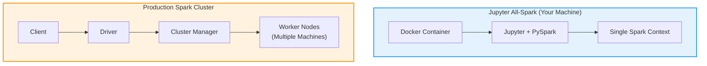

# Jupyter All-Spark Notebook on Windows: Quick Start Guide

## Long Story Short

**Jupyter All-Spark Notebook** is a Docker container bundling Jupyter Lab, Python, and Apache Spark. You get an interactive notebook environment to write and run PySpark code locally on your machine.

### What You Get

- **Python 3** with common data science libraries (pandas, numpy, matplotlib, scikit-learn)
- **Apache Spark** with PySpark, Scala, and SQL support
- **Jupyter Lab** web interface for interactive coding
- **Pre-configured environment** — no manual setup needed

### What You Can Do

✓ Write and test Spark code interactively  
✓ Process datasets up to your machine's available RAM (typically a few GB)  
✓ Learn Spark APIs and distributed computing concepts  
✓ Prototype data pipelines before scaling to production  

### What You Can't Do (vs. Production Spark)

✗ Process massive datasets across multiple machines  
✗ Achieve true fault tolerance or high availability  
✗ Leverage data locality across a distributed file system  
✗ Handle production workloads requiring guaranteed uptime  

**Reality**: Single-node, single-machine processing. When you outgrow this, you move to cloud platforms like Databricks, EMR, or on-prem clusters.

---

## Architecture at a Glance



---

## Setup: Copy & Paste Scripts

=== "Windows"

    ### Script 1: Default Setup (Recommended for Most Users)

    Save this as `start-jupyter.bat` and run it:

??? note "start-jupyter.bat"
    ```batch
    @echo off
    REM Jupyter All-Spark Notebook Startup Script for Windows
    
    set CONTAINER_NAME=jupyter-allspark
    set IMAGE_NAME=jupyter/all-spark-notebook
    set PORT=8888
    set NOTEBOOK_DIR=%USERPROFILE%\jupyter-notebooks
    
    REM Create local notebook directory
    if not exist "%NOTEBOOK_DIR%" mkdir "%NOTEBOOK_DIR%"
    
    REM Check if container is already running
    docker ps | find "%CONTAINER_NAME%" >nul
    if %errorlevel% equ 0 (
        echo Container already running at http://localhost:%PORT%
        start http://localhost:%PORT%
        exit /b 0
    )
    
    REM Check if container exists but is stopped
    docker ps -a | find "%CONTAINER_NAME%" >nul
    if %errorlevel% equ 0 (
        docker start %CONTAINER_NAME%
    ) else (
        REM Run new container
        echo Pulling image and starting container...
        docker run -d ^
            --name %CONTAINER_NAME% ^
            -p %PORT%:8888 ^
            -v "%NOTEBOOK_DIR%":/home/jovyan/work ^
            -e JUPYTER_ENABLE_LAB=yes ^
            jupyter/all-spark-notebook
    )
    
    echo Waiting for startup...
    timeout /t 5 /nobreak
    
    echo Opening http://localhost:%PORT%
    start http://localhost:%PORT%
    
    echo.
    echo Get your token:
    echo   docker logs %CONTAINER_NAME%
    ```

    **How to use:**
    1. Save the script as `start-jupyter.bat`
    2. Double-click it or run from Command Prompt
    3. Docker pulls the image and starts the container
    4. Browser opens to `http://localhost:8888`
    5. Find your token with `docker logs jupyter-allspark`

    ---

    ### Script 2: How to Use a Custom Docker Network (Windows)

Use this if you need Jupyter on a specific Docker network and a pinned version:

??? note "start-jupyter-dasnet.bat (Custom Network + Specific Version)"
    ```batch
    @echo off
    REM Change 'dasnet' to your custom network name if different
    set NETWORK_NAME=dasnet
    REM Pinned version for consistency
    set IMAGE_VERSION=x86_64-ubuntu-22.04
    
    echo Starting Jupyter All-Spark Notebook on %NETWORK_NAME%...
    
    REM Check if network exists, create if it doesn't
    docker network inspect %NETWORK_NAME% >nul 2>&1
    if %errorlevel% neq 0 (
        echo Creating %NETWORK_NAME% network...
        docker network create %NETWORK_NAME%
    ) else (
        echo %NETWORK_NAME% network already exists
    )
    
    echo Checking and removing old container (if exists)...
    docker rm -f jupyter-spark 2>nul
    echo Running container...
    docker run -it ^
      --name jupyter-spark ^
      --network %NETWORK_NAME% ^
      -p 8888:8888 ^
      jupyter/all-spark-notebook:%IMAGE_VERSION%
    echo.
    echo Container exited. Press any key to close...
    pause
    ```

**Key differences from Script 1:**
- Creates and uses a **custom Docker network** for multi-container setups
- Pins a **specific image version** (`x86_64-ubuntu-22.04`) instead of pulling latest
- Runs in **interactive mode** (keeps terminal visible)

**To customize:**
- Change `dasnet` to your network name
- Change `x86_64-ubuntu-22.04` to your preferred version

=== "macOS"

    ### Script 1: Default Setup (Recommended for Most Users)

    Save this as `start-jupyter.sh` and run it:

    ??? note "start-jupyter.sh"
        ```bash
        #!/bin/bash
        
        CONTAINER_NAME="jupyter-allspark"
        IMAGE_NAME="jupyter/all-spark-notebook"
        PORT="8888"
        NOTEBOOK_DIR="$HOME/jupyter-notebooks"
        
        # Create local notebook directory
        mkdir -p "$NOTEBOOK_DIR"
        
        # Check if container is already running
        if docker ps | grep -q "$CONTAINER_NAME"; then
            echo "Container already running at http://localhost:$PORT"
            open "http://localhost:$PORT"
            exit 0
        fi
        
        # Check if container exists but is stopped
        if docker ps -a | grep -q "$CONTAINER_NAME"; then
            echo "Restarting existing container..."
            docker start "$CONTAINER_NAME"
        else
            # Run new container
            echo "Pulling image and starting container..."
            docker run -d \
                --name "$CONTAINER_NAME" \
                -p "$PORT:8888" \
                -v "$NOTEBOOK_DIR":/home/jovyan/work \
                -e JUPYTER_ENABLE_LAB=yes \
                "$IMAGE_NAME"
        fi
        
        echo "Waiting for startup..."
        sleep 5
        
        echo "Opening http://localhost:$PORT"
        open "http://localhost:$PORT"
        
        echo ""
        echo "Get your token:"
        echo "  docker logs $CONTAINER_NAME"
        ```

    **How to use:**
    1. Save the script as `start-jupyter.sh`
    2. Make it executable: `chmod +x start-jupyter.sh`
    3. Run it: `./start-jupyter.sh`
    4. Docker pulls the image and starts the container
    5. Browser opens to `http://localhost:8888`
    6. Find your token with `docker logs jupyter-allspark`

    ---

    ### Script 2: How to Use a Custom Docker Network (macOS)

    Use this if you need Jupyter on a specific Docker network and a pinned version:

    ??? note "start-jupyter-dasnet.sh (Custom Network + Specific Version)"
        ```bash
        #!/bin/bash
        
        # Change 'dasnet' to your custom network name if different
        NETWORK_NAME="dasnet"
        # Pinned version for consistency
        IMAGE_VERSION="x86_64-ubuntu-22.04"
        
        echo "Starting Jupyter All-Spark Notebook on $NETWORK_NAME..."
        
        # Check if network exists, create if it doesn't
        if ! docker network inspect "$NETWORK_NAME" &> /dev/null; then
            echo "Creating $NETWORK_NAME network..."
            docker network create "$NETWORK_NAME"
        else
            echo "$NETWORK_NAME network already exists"
        fi
        
        echo "Checking and removing old container (if exists)..."
        docker rm -f jupyter-spark 2>/dev/null
        echo "Running container..."
        docker run -it \
          --name jupyter-spark \
          --network "$NETWORK_NAME" \
          -p 8888:8888 \
          "jupyter/all-spark-notebook:$IMAGE_VERSION"
        
        echo ""
        echo "Container exited."
        ```

    **How to use:**
    1. Save the script as `start-jupyter-dasnet.sh`
    2. Make it executable: `chmod +x start-jupyter-dasnet.sh`
    3. Run it: `./start-jupyter-dasnet.sh`

    **Key differences from Script 1:**
    - Creates and uses a **custom Docker network** for multi-container setups
    - Pins a **specific image version** (`x86_64-ubuntu-22.04`) instead of pulling latest
    - Runs in **interactive mode** (keeps terminal visible)

    **To customize:**
    - Change `dasnet` to your network name
    - Change `x86_64-ubuntu-22.04` to your preferred version

---

## Access Your Notebook

Once either script runs successfully:

1. Go to `http://localhost:8888` in your browser
2. You'll be asked for a token (first time only)
3. Get your token from terminal output or run:
   ```bash
   docker logs jupyter-allspark
   ```
   (or `docker logs jupyter-spark` if using Script 2)
4. Copy the token and paste it into the login page

---

## Create Your First Notebook

1. In Jupyter Lab, click **File** → **New** → **Notebook**
2. Select **Python 3** as kernel
3. In the first cell, paste this to verify Spark is ready:

```python
from pyspark.sql import SparkSession

spark = SparkSession.builder.appName("TestApp").getOrCreate()
print(f"Spark {spark.version} is running!")

# Simple example: create a dataset
data = [(1, "Alice"), (2, "Bob"), (3, "Charlie")]
df = spark.createDataFrame(data, ["id", "name"])
df.show()
```

4. Press **Shift + Enter** to run the cell

---

## Stop the Container

When done:

```bash
docker stop jupyter-allspark
```

Or for the dasnet version:

```bash
docker stop jupyter-spark
```

Your notebooks are saved in `C:\Users\YourUsername\jupyter-notebooks` and persist after stopping.

---

## Next Steps

- Explore Spark SQL, DataFrames, and RDD transformations
- Work with real datasets (CSV, Parquet, JSON)
- When you need to scale, move to Databricks or cloud Spark clusters