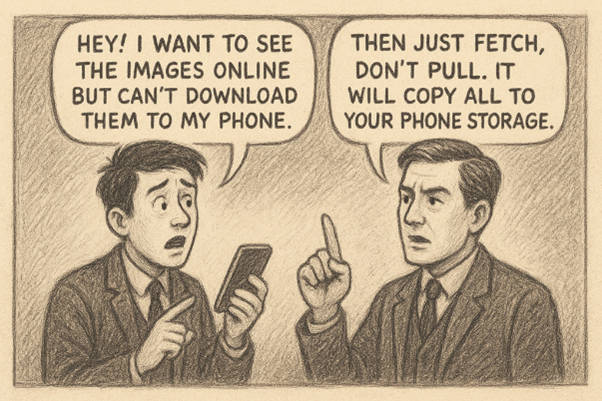
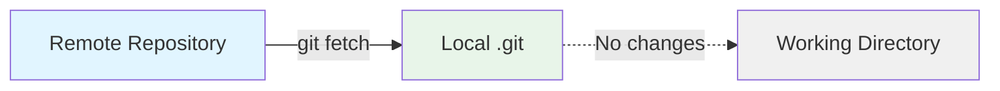
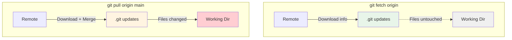

# Understanding Git Fetch

You're working on your feature. You want to know what changed on remote. But you don't want to mess with your local files. You don't want to merge anything yet. Just check what's new.

That's `git fetch`.



## What Git Fetch Does


It downloads information from remote. New commits. New branches. New tags. Everything.- **Retrieves the latest changes** (commits, branches, tags) from a **remote** repository.


But it doesn't change your files. Doesn't touch your working directory. Doesn't merge anything.- It’s **safe**: you can fetch as often as you like without worrying about overwriting local changes.

It downloads information from remote. New commits. New branches. New tags. Everything.

- **Retrieves the latest changes** (commits, branches, tags) from a **remote** repository.
- Updates your local metadata (remote tracking branches), but **does not** merge or apply these changes to your working branches.
- But it doesn't change your files. Doesn't touch your working directory. Doesn't merge anything.
- It’s **safe**: you can fetch as often as you like without worrying about overwriting local changes.


Think of it as reading the news. You're gathering information. Not taking action yet.> **Analogy**: If `git pull` is like *receiving new mail and reading it right away*, `git fetch` is like *receiving new mail and putting it aside to read later*.


## 2. Common Use Cases



1. **Check for new commits** on the remote before merging changes locally.
2. **Review differences** between your local branch and the remote branch.
3. **Fetch updates from multiple remotes** in complex setups (e.g., `origin` + `upstream`).

Your working directory stays clean. You can review changes and decide what to do next.

## 3. Basic Usage

### 3.1 Fetch from the Default Remote

This is what you'll use most of the time:

```bash
git fetch
```
- Fetches updates from **all configured remotes** (commonly `origin`).
- If you have only one remote, it’s effectively the same as `git fetch origin`.

### 3.2 Fetch from a Specific Remote

Fetches all branches from `origin`. Updates your local knowledge of remote branches.

```bash
git fetch origin
```
- Fetches the latest updates **only** from the remote named `origin`.
- Updates **all branches** in `origin` (e.g., `origin/main`, `origin/feature-xyz`).
- Does **not** update local branches automatically.

### 3.3 Fetch Only a Specific Branch

Fetch only the `main` branch from the remote named `origin`:

```bash
git fetch origin main
```
- Fetches **only** the `main` branch from `origin`.
- Updates **only** `origin/main`, without touching other branches.

After fetching, check what's new:

```bash
git log main..origin/main --oneline
```
This shows commits that exist on `origin/main` but not on your local `main`.

## 4. Differences at a Glance

| Command                 | Fetches Updates From | Updates Which Branches?               | Use Case                                              |
|-------------------------|---------------------|---------------------------------------|-------------------------------------------------------|
| `git fetch`             | All remotes         | All remote tracking branches          | Check updates from all remotes                        |
| `git fetch origin`      | `origin` only       | All branches in `origin`              | Fetch all branches from `origin`                      |
| `git fetch origin main` | `origin` only       | Only `origin/main`                    | Quickly fetch updates just for the `main` branch      |

## Fetch vs Pull

People confuse these. They're different.

- **`git fetch`**: Good if you have multiple remotes or want to update all remote branches.
- **`git fetch origin`**: Focuses on fetching all branches from `origin` only.
- **`git fetch origin main`**: Ideal if you care only about the `main` branch.



| Command                | What it does                        | Safe?        |
|------------------------|-------------------------------------|--------------|
| `git fetch origin`     | Downloads info. Doesn't change files| ✅ Always safe|
| `git pull origin main` | Fetches AND merges. Changes files   | ⚠️ Can cause conflicts |

!!! tip "Best Practice"
    Fetch first. Review changes. Then decide to pull or merge.

## 5. Advanced Options

### 5.1 Fetch All Remotes

```bash
git fetch --all
```
- Retrieves updates from **every remote** (e.g., `origin`, `upstream`).

### 5.2 Prune Deleted Branches

```bash
git fetch --prune
```
- Removes remote-tracking branches in your local repo that **no longer exist** on the remote.

Combine both:

```bash
git fetch --all --prune
```
- Keeps your local copy of remote branches clean.

### 5.3 Verbose Output

```bash
git fetch --verbose
```
- Shows detailed information about what’s being fetched.

## 6. Morning Routine

Here's how you'll actually use fetch:

```bash
git fetch --all --prune
git status
git log main..origin/main --oneline
```
You start work. Check what changed overnight.

Or use `git diff`:

```bash
git diff main origin/main
```
- Shows exact code differences.

## 7. Applying Fetched Changes

Since fetching alone doesn’t modify your local branches, you can:

1. **Pull** (merge automatically)
    ```bash
    git pull origin main
    ```
2. **Merge** (manual merge)
    ```bash
    git merge origin/main
    ```
3. **Rebase**
    ```bash
    git rebase origin/main
    ```

Now you're synced. Create your feature branch from updated `main`.

## 8. Example Scenarios

### 8.1 Quick Check Before Pulling

1. **Fetch** the latest changes:
    ```bash
    git fetch origin
    ```
2. **Inspect** what’s new:
    ```bash
    git log main..origin/main --oneline
    ```
3. **Pull** if needed:
    ```bash
    git pull origin main
    ```

Now your branch includes the latest from main. No surprises during code review.

### 8.2 Multiple Remotes

You fork a repository, so you have:
- `origin` → Your fork.
- `upstream` → The original repo.

Fetch updates from both:

```bash
git fetch origin
git fetch upstream
```

Merge changes from `upstream` if necessary.

### 8.3 Checking on Teammate's Branch

Your teammate is working on `feature/payment`. You want to see their latest work.

```bash
git fetch origin feature/payment
git log origin/feature/payment --oneline -10
git diff main origin/feature/payment
```
- Fetches only the specified branch from `origin`.
- You didn't checkout anything. Didn't change your working directory. Just reviewed their work.

## 9. Key Takeaways

- **`git fetch`** is a safe way to update your local knowledge of remote branches **without** modifying your local branches.
- **Use `git fetch --all --prune`** to keep your local copy of remote branches clean.
- **Use `git fetch origin <branch>`** if you only need updates for a specific branch.
- If you want those fetched changes in your local branch, **merge**, **pull**, or **rebase**.

## Quick Command Reference

| Task                       | Command                           |
|----------------------------|-----------------------------------|
| Fetch all branches from origin | `git fetch origin`             |
| Fetch specific branch       | `git fetch origin branch-name`    |
| Fetch from all remotes      | `git fetch --all`                |
| Check what's new on main    | `git log main..origin/main --oneline` |
| See code differences        | `git diff main origin/main`       |
| Check if you're behind      | `git status`                      |

Happy Fetching! 🚀


## Advanced Usage

Everything below is optional. But useful for complex scenarios.

### Fetch Commands Explained

??? abstract "Different Ways to Fetch"
    
    **Fetch everything**
    
    ```bash
    git fetch
    ```
    
    Fetches from all configured remotes. If you only have `origin`, same as `git fetch origin`.
    
    **Fetch from specific remote**
    
    ```bash
    git fetch origin
    ```
    
    Fetches all branches from `origin`. This is what you'll use 90% of the time.
    
    **Fetch specific branch**
    
    ```bash
    git fetch origin main
    ```
    
    Only fetches the `main` branch. Faster if you only care about one branch.
    
    **Fetch all remotes**
    
    ```bash
    git fetch --all
    ```
    
    If you have multiple remotes (like `origin` and `upstream`), this fetches from all of them.
    
    **Comparison:**
    
    | Command | Fetches From | Updates |
    |---------|--------------|---------|
    | `git fetch` | All remotes | All branches |
    | `git fetch origin` | origin only | All origin branches |
    | `git fetch origin main` | origin only | Only main |
    | `git fetch --all` | All remotes | All branches from all remotes |

### Cleaning Up Stale Branches

??? tip "Using --prune to Remove Dead Branches"
    
    Your teammate deleted `feature/old-work` on remote. But your local git still tracks `origin/feature/old-work`.
    
    **See stale branches:**
    
    ```bash
    git branch -r
    ```
    
    You'll see branches that don't exist on remote anymore.
    
    **Clean them up:**
    
    ```bash
    git fetch --prune
    ```
    
    Or automatically prune every time:
    
    ```bash
    git config --global fetch.prune true
    ```
    
    Now every `git fetch` will remove stale branches.
    
    **Combined command:**
    
    ```bash
    git fetch --all --prune
    ```
    
    Fetches from all remotes AND removes dead branches. Clean and efficient.

### Working with Multiple Remotes

??? example "Fetching from Upstream (Forked Repos)"
    
    You forked a repository. You have two remotes:
    
    - `origin` → Your fork on GitHub
    - `upstream` → The original repository
    
    **Setup upstream (one time):**
    
    ```bash
    git remote add upstream https://github.com/original-owner/repo.git
    ```
    
    **Check your remotes:**
    
    ```bash
    git remote -v
    ```
    
    Output:
    
    ```
    origin    https://github.com/you/repo.git (fetch)
    origin    https://github.com/you/repo.git (push)
    upstream  https://github.com/original-owner/repo.git (fetch)
    upstream  https://github.com/original-owner/repo.git (push)
    ```
    
    **Fetch from both:**
    
    ```bash
    git fetch origin
    git fetch upstream
    ```
    
    Or fetch from all at once:
    
    ```bash
    git fetch --all
    ```
    
    **Update your fork with upstream changes:**
    
    ```bash
    # Fetch latest from upstream
    git fetch upstream
    
    # Checkout your main
    git checkout main
    
    # Merge upstream's main
    git merge upstream/main
    
    # Push to your fork
    git push origin main
    ```
    
    Now your fork is synced with the original repo.

### Viewing What Changed

??? info "Inspecting Fetched Changes"
    
    You fetched. Now what? How do you see what changed?
    
    **See commits on origin/main that you don't have:**
    
    ```bash
    git log main..origin/main --oneline
    ```
    
    Output:
    
    ```
    a3f2c1d Fix authentication bug
    b7e9f3a Add password validation
    c4d8e2f Update README
    ```
    
    **See commits you have that origin doesn't:**
    
    ```bash
    git log origin/main..main --oneline
    ```
    
    If this shows commits, you're ahead of remote.
    
    **See code differences:**
    
    ```bash
    git diff main origin/main
    ```
    
    Shows actual line-by-line changes.
    
    **See only which files changed:**
    
    ```bash
    git diff --name-only main origin/main
    ```
    
    Output:
    
    ```
    auth.js
    README.md
    package.json
    ```
    
    **See commit graph:**
    
    ```bash
    git log --oneline --graph main origin/main
    ```
    
    Visual representation of branch history.

### Fetching Tags

??? abstract "Working with Tags"
    
    Tags are version markers. Like `v1.0.0`, `v2.0.0`.
    
    **Fetch all tags:**
    
    ```bash
    git fetch --tags
    ```
    
    **List all tags:**
    
    ```bash
    git tag
    ```
    
    **Checkout a specific version:**
    
    ```bash
    git checkout v1.0.0
    ```
    
    You're now in "detached HEAD" state, viewing the code at version 1.0.0.
    
    **Get back to your branch:**
    
    ```bash
    git checkout main
    ```

### Verbose Output

??? tip "See What's Happening During Fetch"
    
    Want to see exactly what git is doing?
    
    ```bash
    git fetch --verbose
    ```
    
    Or even more detail:
    
    ```bash
    git fetch --verbose --progress
    ```
    
    Output:
    
    ```
    remote: Counting objects: 25, done.
    remote: Compressing objects: 100% (15/15), done.
    remote: Total 25 (delta 10), reused 20 (delta 5)
    Unpacking objects: 100% (25/25), done.
    From https://github.com/username/repo
       a3f2c1d..b7e9f3a  main       -> origin/main
       c4d8e2f..f1a5b9c  develop    -> origin/develop
    ```

## Real-World Scenarios

### Scenario 1: Before Starting Work

You're about to start a new feature. First, sync your knowledge.

```bash
# Fetch latest info
git fetch origin

# Check if main moved
git log main..origin/main --oneline
```

If main has new commits:

```bash
git checkout main
git pull origin main
git checkout -b feature/new-work
```

Now you're branching off the latest code.

### Scenario 2: During Code Review

Someone requested changes on your PR. Meanwhile, main moved ahead.

```bash
# Fetch latest
git fetch origin

# Update main
git checkout main
git pull origin main

# Update your feature branch
git checkout feature/your-work
git merge main

# Push updated branch
git push origin feature/your-work
```

### Scenario 3: Checking Teammate's Work

Your teammate asked you to review their branch before they open a PR.

```bash
# Fetch their branch
git fetch origin feature/their-work

# Compare to main
git log main..origin/feature/their-work --oneline

# See the code diff
git diff main origin/feature/their-work
```

You reviewed without touching your working directory.

## Common Mistakes

!!! danger "Don't Confuse Fetch and Pull"
    **Wrong:**
    ```bash
    # Thinking this will update your files
    git fetch origin main
    # Your files didn't change!
    ```
    
    **Right:**
    ```bash
    # Fetch to check
    git fetch origin main
    # Then pull to apply
    git pull origin main
    ```

!!! warning "Remote Branches Are Read-Only"
    You can't checkout and work on `origin/main` directly.
    
    **Wrong:**
    ```bash
    git checkout origin/main
    # You're in detached HEAD!
    ```
    
    **Right:**
    ```bash
    git checkout main
    git pull origin main
    # Now you're on your local main
    ```

## Best Practices

!!! success "Do This"
    - Fetch before starting work
    - Fetch before creating a PR
    - Use `git fetch origin` as your default
    - Review changes before pulling
    - Set up auto-prune: `git config --global fetch.prune true`

!!! tip "Pro Workflow"
    Make this your morning routine:
    ```bash
    git fetch --all --prune
    git status
    git log main..origin/main --oneline
    ```
    
    You'll know exactly what changed overnight.

## What's Next?

You understand fetch. You know how to check for changes without risking your local work.

Next up: `git pull`, `git merge`, and `git rebase`. How to actually apply those fetched changes.

But fetch is your safety net. Always fetch first. Review. Then act.
