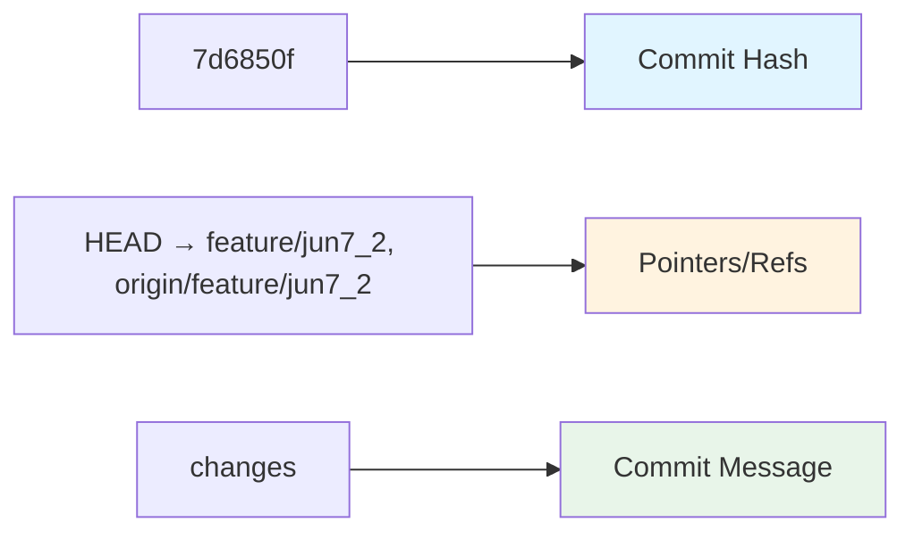

# Understanding Git Log --oneline

You type `git log --oneline`. You see a wall of text. Hashes. Branch names. Messages.

What does it all mean?

Let's decode it.

## The Command

```bash
git log --oneline
```

This shows your commit history. One line per commit. Compact. Easy to scan.

**Example output:**

```
7d6850f (HEAD -> feature/jun7_2, origin/feature/jun7_2) changes
a3b2c1d (origin/main, origin/HEAD, main) Update README
5e4f3g2 Add login feature
```

Each line tells a story. Let's break it down.

## Decoding a Single Line

Take this line:

```
7d6850f (HEAD -> feature/jun7_2, origin/feature/jun7_2) changes
```

Three parts. Each part tells you something important.



## Part 1: The Commit Hash

`7d6850f`

This is the commit ID. A unique identifier for this specific snapshot of your code.

Think of it as a serial number. Every commit gets one. It's permanent. It never changes.

**Full hash vs short hash:**

```bash
# Full hash (40 characters)
7d6850f2a3b4c5d6e7f8g9h0i1j2k3l4m5n6o7p8

# Short hash (7 characters, shown in --oneline)
7d6850f
```

Git shows the short version. It's usually enough to identify a commit.

**Why it matters:**

You use this hash to refer to specific commits:

```bash
# Checkout this commit
git checkout 7d6850f

# Show what changed in this commit
git show 7d6850f

# Cherry-pick this commit
git cherry-pick 7d6850f
```

## Part 2: The Pointers (The Important Stuff)

`(HEAD -> feature/jun7_2, origin/feature/jun7_2)`

This is where the magic happens. These are **pointers** (also called refs). They're labels pointing to this commit.

Let's decode each one:

??? note "HEAD - Where You Are Right Now"
    
    `HEAD` is special. It tells you: **"This is where you're working."**
    
    It's your current position in the repository. Your working directory matches this commit.
    
    **Think of it like this:**
    - You're reading a book
    - `HEAD` is your bookmark
    - It shows which page (commit) you're on
    
    **When you make a new commit:**
    - It gets added after HEAD
    - HEAD moves to the new commit
    - The branch pointer moves too

??? note "HEAD -> feature/jun7_2 - You're On This Branch"
    
    The arrow `->` is critical. It means:
    
    > HEAD is pointing to the branch `feature/jun7_2`, not directly to the commit.
    
    **What this tells you:**
    - You have `feature/jun7_2` checked out
    - You're working on this branch
    - New commits will go on this branch
    - The branch pointer will move with HEAD
    
    **Visual:**
    ```
    HEAD → feature/jun7_2 → 7d6850f (commit)
    ```
    
    HEAD points to the branch. The branch points to the commit.

??? note "feature/jun7_2 - Your Local Branch"
    
    This is a local branch. It exists on your computer.
    
    No prefix like `origin/`. Just the branch name. That means it's local.
    
    **Local branch:**
    - Lives on your machine
    - You can commit to it
    - You can change it
    - You can delete it
    
    Right now, this branch points to commit `7d6850f`.

??? note "origin/feature/jun7_2 - The Remote's State"
    
    This is a **remote-tracking branch**.
    
    It's your local copy of where the branch is on the remote server (GitHub).
    
    **Breaking it down:**
    - `origin` → The remote server (GitHub, GitLab, etc.)
    - `feature/jun7_2` → The branch name on that server
    - Together: "The state of `feature/jun7_2` on origin"
    
    **Important:** This is read-only. You don't commit to it directly.
    
    **It updates when you:**
    - `git fetch` → Updates remote-tracking branches
    - `git pull` → Fetch + merge
    - `git push` → After pushing, fetch updates it
    
    **It tells you:** "This is where the remote branch was last time I checked."

## Part 3: The Commit Message

`changes`

This is what you typed when you committed:

```bash
git commit -m "changes"
```

It's supposed to explain what this commit does. (Though "changes" is a terrible message. Be more specific.)

**Better messages:**

```bash
git commit -m "Add login feature"
git commit -m "Fix null pointer in user service"
git commit -m "Update README with installation steps"
```

## What This Line Really Tells You

Let's put it all together:

```
7d6850f (HEAD -> feature/jun7_2, origin/feature/jun7_2) changes
```

**Translation:**

> You're currently on the local branch `feature/jun7_2`. This branch points to commit `7d6850f`. The remote-tracking branch `origin/feature/jun7_2` also points to the same commit. The commit message is "changes".

**The key insight:**

Your local branch and the remote branch are **in sync**. They're pointing to the same commit.

**What this means:**

- ✅ No unpushed commits (local is not ahead)
- ✅ No unpulled commits (remote is not ahead)
- ✅ You're synced with the remote

## Common Patterns

### Pattern 1: Local Is Ahead

```
c5d4e3f (HEAD -> feature/login) Add password hashing
b4a3c2d (origin/feature/login) Add login form
```

**What this means:**
- Your local branch has commit `c5d4e3f`
- Remote branch is still at `b4a3c2d`
- You have unpushed commits

**Fix it:**
```bash
git push
```

### Pattern 2: Remote Is Ahead

```
b4a3c2d (HEAD -> feature/login) Add login form
c5d4e3f (origin/feature/login) Add password hashing
```

This won't happen with `git log --oneline` because it shows YOUR history. But `git log --oneline --all` would show it.

**What this means:**
- Remote has commits you don't have
- You need to pull

**Fix it:**
```bash
git pull
```

### Pattern 3: You're On Main

```
a3b2c1d (HEAD -> main, origin/main, origin/HEAD) Update README
```

**What this means:**
- You're on main
- Local and remote main are synced
- `origin/HEAD` points here too (default branch on remote)

### Pattern 4: Detached HEAD

```
7d6850f (HEAD, origin/feature/jun7_2) changes
```

Notice: `HEAD` is there, but no arrow `->` to a branch.

**What this means:**
- You're in "detached HEAD" state
- You're looking at a commit directly, not through a branch
- If you make commits, they'll be orphaned

**Fix it:**
```bash
# Create a branch here
git checkout -b new-branch-name

# Or go back to a branch
git checkout main
```

## Quick Reference

| Output | What It Means |
|--------|---------------|
| `7d6850f` | Commit hash (short version) |
| `HEAD` | Your current position |
| `HEAD -> branch` | You're on this branch |
| `branch` (no prefix) | Local branch |
| `origin/branch` | Remote-tracking branch |
| `origin/HEAD` | Default branch on remote |
| Message text | Commit message |

## Useful Variations

??? tip "Show More Commits"
    
    By default, `git log` shows a lot. You can limit it:
    
    ```bash
    # Show last 5 commits
    git log --oneline -5
    
    # Show last 10 commits
    git log --oneline -10
    ```

??? tip "Show All Branches"
    
    See commits from all branches, not just current:
    
    ```bash
    git log --oneline --all
    ```
    
    Now you see commits from every branch.

??? tip "Show Graph"
    
    Visualize branch structure:
    
    ```bash
    git log --oneline --graph
    ```
    
    Output:
    ```
    * 7d6850f (HEAD -> feature/login) Add login
    * 5e4f3g2 Start login feature
    | * a3b2c1d (main) Update README
    |/
    * 2d1c3b4 Initial commit
    ```
    
    The lines show branch relationships.

??? example "Show All Branches with Graph"
    
    The ultimate commit history view:
    
    ```bash
    git log --oneline --graph --all --decorate
    ```
    
    Shows:
    - All branches
    - Graph visualization
    - All decorations (branch names, HEAD, etc.)
    
    **Make it an alias:**
    ```bash
    git config --global alias.lg "log --oneline --graph --all --decorate"
    ```
    
    Now just type:
    ```bash
    git lg
    ```

??? info "Show Commits by Author"
    
    Filter by who made commits:
    
    ```bash
    git log --oneline --author="John"
    ```
    
    Shows only John's commits.

??? abstract "Show Commits in Date Range"
    
    ```bash
    # Last week
    git log --oneline --since="1 week ago"
    
    # Last month
    git log --oneline --since="1 month ago"
    
    # Specific date range
    git log --oneline --since="2024-01-01" --until="2024-01-31"
    ```

## Common Scenarios

### Scenario 1: Checking If You're Synced

You want to know: Do I need to push? Do I need to pull?

```bash
git log --oneline -1
```

Output:
```
7d6850f (HEAD -> feature/login, origin/feature/login) Add login
```

**Analysis:** Local and remote point to same commit. You're synced.

If you see:
```
a1b2c3d (HEAD -> feature/login) Fix bug
7d6850f (origin/feature/login) Add login
```

**Analysis:** Local is ahead. You need to push.

### Scenario 2: Finding a Specific Commit

You remember changing something last week. Find it:

```bash
git log --oneline --since="1 week ago" --grep="login"
```

This shows commits from last week with "login" in the message.

### Scenario 3: Checking Branch Divergence

Your branch diverged from main. How many commits apart?

```bash
# Show commits on your branch not in main
git log --oneline main..feature/login

# Show commits on main not in your branch
git log --oneline feature/login..main
```

## Best Practices

!!! success "Do This"
    - Use `git log --oneline` to get quick overview
    - Add `--graph` to see branch structure
    - Add `--all` to see all branches
    - Check before pushing: Are you synced?
    - Use meaningful commit messages (not "changes")

!!! tip "Make It Your Default"
    Create an alias:
    ```bash
    git config --global alias.lo "log --oneline"
    ```
    
    Now just type:
    ```bash
    git lo
    ```

## What's Next?

You understand `git log --oneline`. It shows commit history in a compact format.

Next up: branches in depth. How to create them. How to merge them. How to rebase them. Everything about branching.

But now you know: that line in `git log --oneline` tells you exactly where you are and where your branches are pointing.