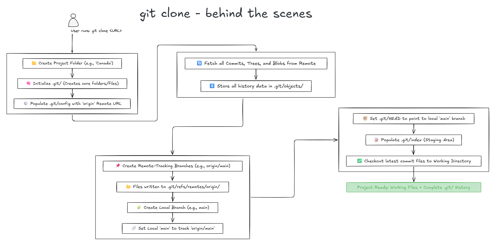
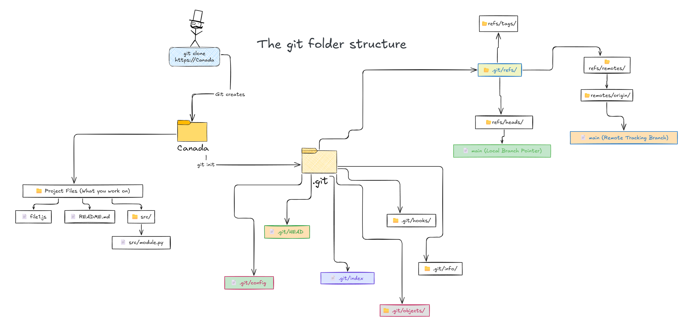

# Getting Started with Git

Every project needs version control. Git is that version control. There are others - Mercurial, Subversion, Visual Source Safe. But git won. It's free, open source, distributed, can work offline and large brands like GitHub, GitLab, BitBucket, or Azure DevOps use git. This section will focus on some important Git concepts you need to know.

## First Step - Clone a repository

The first thing you always do (apart from git setup etc) is **clone a repository**. Your team will already have a repository on some git system (Github/Azure Devops/Gitlab). What this cloning does is simply copies files from the cloud to your machine.

### Basic Clone Syntax

=== "HTTPS"
    ```bash
    git clone https://github.com/username/repo-ontario.git
    ```
    Most common method. Works everywhere.

=== "SSH"
    ```bash
    git clone git@github.com:username/repo-ontario.git
    ```
    No password prompts. Requires SSH key setup.

> Note: The `.git` extension is optional. 
### Different Ways to Clone

=== "Custom Folder Name"
    ```bash
    git clone https://github.com/username/repo-ontario.git repo-belgium
    ```
    Creates a folder called `repo-belgium` instead of `repo-ontario`. Useful when the repo name is generic.

=== "Specific Branch"
    ```bash
    git clone -b development https://github.com/username/repo-ontario.git
    ```
    Checks out the `development` branch instead of `main`. Saves you from doing `git checkout development` after cloning.

=== "Shallow Clone"
    ```bash
    git clone --depth 1 https://github.com/username/repo-ontario.git
    ```
    Downloads only the latest commit. **Way faster.** Perfect for CI/CD or when you don't need history.

=== "Specific Tag/Release"
    ```bash
    git clone --branch v1.0.0 https://github.com/username/repo-ontario.git
    ```
    Gets the code at version 1.0.0. The `--branch` flag works for tags too.

=== "Single Branch Only"
    ```bash
    git clone --depth 1 --single-branch https://github.com/username/repo-ontario.git
    ```
    Downloads only one branch. Even faster for huge repos.

### What Really Happens When You Run `git clone`?

??? abstract "Behind the Scenes: The Complete Clone Process"
    
    

    You type `git clone https://github.com/someone/repo-ontario.git` and boom—a whole project appears. But what's actually happening?

    **Phase 1: The Setup**
    
    ```mermaid
    flowchart LR
        A["git clone"] --> B["Create folder"]
        B --> C["Initialize .git/"]
        C --> D["Add remote 'origin'"]
        style A fill:#e1f5ff
        style D fill:#e8f5e9
    ```
    
    Git creates a folder and initializes a hidden `.git` folder inside it. This `.git` folder is the brain—it contains everything Git knows about your project.

    ??? info "Inside the .git Folder"
        - **config** → Repository settings
        - **refs/** → Branch and tag references
        - **objects/** → All the data (commits, files, everything)
        - **HEAD** → Points to your current branch
        - **hooks/** → Automation scripts

    Git then adds a remote called `origin` to `.git/config`:

    ```ini title=".git/config"
    [remote "origin"]
        url = https://github.com/someone/repo-ontario.git
        fetch = +refs/heads/*:refs/remotes/origin/*
    ```

    !!! question "What does that fetch line mean?"
        "For every branch on the remote (`refs/heads/*`), create a local tracking reference (`refs/remotes/origin/*`)."
        
        So `main` → `origin/main`, `dev` → `origin/dev`, and so on.

    **Phase 2: The Download**
    
    ```mermaid
    flowchart LR
        A["GitHub Server"] -->|"Download everything"| B[".git/objects/"]
        B --> C["Create origin/main<br/>origin/dev<br/>origin/feature"]
        style A fill:#fff3e0
        style C fill:#e8f5e9
    ```
    
    Git downloads **everything**: every commit ever made, every branch, every tag, every file version. You're getting a time machine, not just the latest code.

    ??? tip "How Git Stores Data"
        It compresses all this using SHA-1 hashing and stores it in `.git/objects/`—like a library where every book has a unique barcode. Want a specific commit? Git looks up its hash and pulls it instantly.

    Git creates read-only snapshots for all remote branches:
    
    - `origin/main` → What `main` looks like on GitHub
    - `origin/dev` → What `dev` looks like on GitHub
    - `origin/feature` → What `feature` looks like on GitHub

    !!! warning "These are Read-Only"
        You can view them but can't edit them. They update only when you run `git fetch` or `git pull`.

    !!! note "Exception: Shallow Clones"
        If you used `--depth 1`, Git only downloads that one commit. No history, no other branches (unless you specified them).

    **Phase 3: The Checkout**
    
    ```mermaid
    flowchart LR
        A["Create local main"] --> B["Link main → origin/main"]
        B --> C["Extract files to<br/>working directory"]
        style A fill:#e1f5ff
        style C fill:#e8f5e9
    ```
    
    Git creates your local branch (either `main` or whatever you specified with `-b`) and links it to its remote counterpart. This is called **tracking**.

    !!! success "Why Tracking Matters"
        It means `git pull` and `git push` know where to sync without you specifying every time. It's like speed dial—one command, it knows where to go.

    Finally, Git extracts the latest commit's files into your working directory. Now you see actual code, README files, everything.

    

### Advanced Clone Scenarios

!!! example "Bare Repository (No Working Files)"
    ```bash
    git clone --bare https://github.com/username/repo-ontario.git
    ```
    Creates just the `.git` folder without any working files. Used for setting up mirrors or servers.

!!! example "Different Remote Name"
    ```bash
    git clone -o upstream https://github.com/username/repo-ontario.git
    ```
    Instead of `origin`, your remote is called `upstream`. Useful when working with forks.
