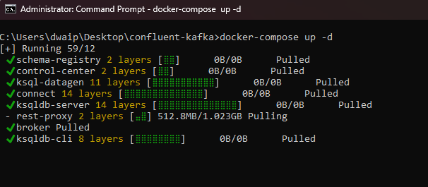
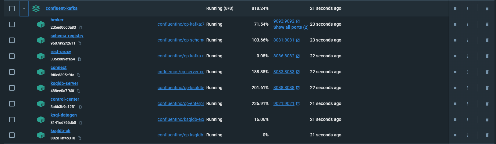
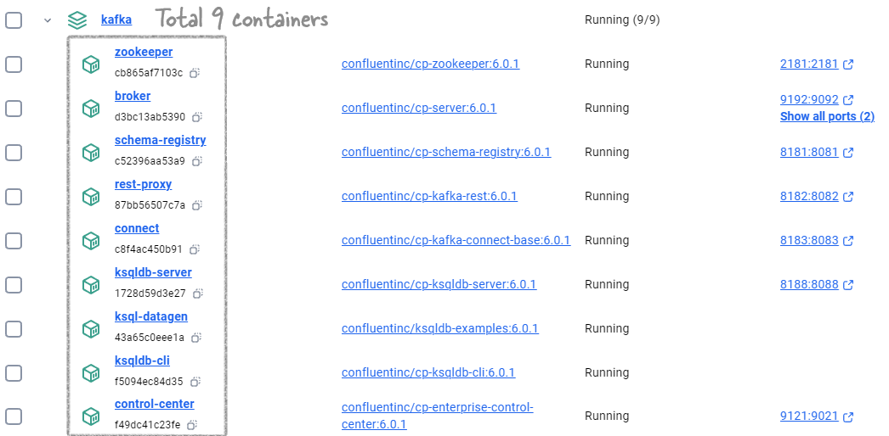

#  <span style="color: #003366;font-family: Segoe UI, sans-serif;">Confluent Kafka with KRaft on Docker</span>


<p style="color: #006600; font-family: 'Trebuchet MS', Helvetica, sans-serif; background-color: #e6ffe6; padding: 15px; border-left: 5px solid #00cc66;">
Here, I will show you how to setup a Kafka setup on Docker. We will use KRaft rather than Zookeper. We will use a docker-compose.yaml file and setup Kafka broker, Schema Registry, Kafka Connect, Control Center, ksqlDB, and a REST Proxy. I have tested the installation in both Windows and Mac machines with M1 chip.
</p>


##  <span style="color: #003366;font-family: Segoe UI, sans-serif;">Step 1: Download the Docker Compose file</span>

The first step is to download the docker-compose.yaml file, KRaft version from confluent's github [site](https://github.com/confluentinc/cp-all-in-one/blob/7.5.1-post/cp-all-in-one-kraft/docker-compose.yml)

> Note: When choosing between KRaft and ZooKeeper as the metadata service for your Apache Kafka cluster, **KRaft** is the **recommended** option.


   
##  <span style="color: #003366;font-family: Segoe UI, sans-serif;">Step 2: Run the container</span>

- Open command prompt/terminal and CD to the folder containing the `docker-compose.yml`

-  Run the following command to start all services:`docker-compose up -d`
  

- The Docker Compose will start all the necessary services in the background. Once finished, go to the docker desktop window and see the services

  

-  You can access the Control Center at http://localhost:9021 once the container is operational.
- To create topics and proceed further you can refer to the  this quickstart [guide](https://docs.confluent.io/platform/current/platform-quickstart.html#cp-quickstart-step-1).

#  <span style="color: Teal; font-family: Segoe UI, sans-serif;">Appendix</span>


##  <span style="color: Teal; font-family: Segoe UI, sans-serif;">Connecting to Kafka Containers</span>

The container group created using the docker-compose become part of  `confluent-kafka_default` network group, restricting access from external containers or local machines not in this network. This means, you won't be able to connect to the broker from outside containers or local machine. To connect to Kafka from an external container, add it to the `confluent-kafka_default` network:

```bash
docker network connect confluent-kafka_default [external-container-name-or-id]
```

After adding, connect to the Kafka broker at `broker:29092`. Example for Spark:

```python
from pyspark.sql import SparkSession

spark = SparkSession.builder \
    .appName("Streaming from Kafka") \
    .config("spark.streaming.stopGracefullyOnShutdown", True) \
    .config('spark.jars.packages', 'org.apache.spark:spark-sql-kafka-0-10_2.12:3.3.0') \
    .getOrCreate()

streaming_df = spark.readStream \
    .format("kafka") \
    .option("kafka.bootstrap.servers", "broker:29092) \
    .option("subscribe", "sometopic") \
    .option("startingOffsets", "earliest") \
    .load()
```

##  <span style="color: Teal; font-family: Segoe UI, sans-serif;">Troubleshooting Broker Connection Issues</span>

Inspect the Kafka broker container using `docker inspect [broker-container-id]`. For detailed network information:

```bash
docker network inspect [network-name]
```

To find the broker's IP address:

```bash
docker inspect -f '{{range .NetworkSettings.Networks}}{{.IPAddress}}{{end}}' [container-name-or-id]
```

Test connectivity to the broker:

```bash
nc -vz -w 5 [broker-ip] [listener-port]
```

### <span style="color: Teal;">Error: no matching manifest for linux/arm64/v8</span>

We might run into an error like no matching manifest for linux/arm65/v8 this error error indicates that the Docker images specified in the `docker-compose.yml` file do not have a version compatible with the architecture of our Mac's processor. This error is less likely if you use the KRaft version. I have tested the KRaft versin on both Windows and Mac M1, they both showed no error in architecture or compatibility.

### <span style="color: Teal;">Resolving Port Conflicts for Kafka Rest Proxy in Docker</span> 

When deploying Kafka Rest Proxy using Docker Compose, port conflicts are a common issue that can prevent the service from starting successfully. 


Here is a typical example of this error:

```bash
Cannot start Docker Compose application. Reason: compose [start] exit status 1. Container broker Starting Container broker Started Container schema-registry Starting Container schema-registry Started Container rest-proxy Starting Container connect Starting Container connect Started Error response from daemon: Ports are not available: exposing port TCP 0.0.0.0:8082 -> 0.0.0.0:0: listen tcp 0.0.0.0:8082: bind: An attempt was made to access a socket in a way forbidden by its access permissions.
```

**Long story short:** Use this  [modified docker-compose.yml](docker-compose.yml) which uses port **8086** instead of **8082**

**Detailed investigation**:

- **Identify Port Usage**: Use `netstat` or `lsof` to check if the intended port is already in use.

   - For Windows: `netstat -ano | findstr :<PORT>`
   - For Linux/Mac: `sudo lsof -i :<PORT>` or `sudo netstat -tulnp | grep :<PORT>`

      

- **Modify Docker Compose File**: If the port is in use, select an unused port and update the `docker-compose.yml` file. Change the host port mapping for the `rest-proxy` service:

   ```yaml
   ports:
     - <UNUSED_PORT>:8082 # Change <UNUSED_PORT> to an available port on your host
   ```

   e.g:

    

- **Restart Docker Compose**: Apply the changes by running:

   ```bash
   docker-compose down
   docker-compose up -d
   ```

- **Update Applications**: Ensure all applications that interact with Kafka Rest Proxy are updated to use the new port.

### <span style="color: Teal;">About the docker-compose.yml</span> 

Here is an explanation of the differnet services in the docker-compose.yml

- **broker**: A Kafka broker service with custom environment configurations for topics, listeners, ports, IDs, etc.
- **schema-registry**: This service provides a serving layer for your metadata. It is configured to communicate with the Kafka broker and expose port 8081.
- **connect**: Kafka Connect with dependencies on the broker and schema-registry, configured to run connectors.
- **control-center**: Confluent's web-based tool for managing and monitoring the Kafka ecosystem.
- **ksqldb-server**: The server for ksqlDB, streaming SQL engine that enables real-time data processing against Apache Kafka.
- **ksqldb-cli**: A command-line interface for interacting with ksqlDB Server.
- **ksql-datagen**: A tool for generating sample data for Kafka topics and provides a source of continuously flowing data.
- **rest-proxy**: Provides a RESTful interface to Kafka clusters.

###  <span style="color: Teal; font-family: Segoe UI, sans-serif;">Fully commented docker-compose.yml</span>

If you want to know each step of the docker compose file. I have placed a fully commented [docker-compose.yml](docker-compose-commented.yml)

##  <span style="color: Teal; font-family: Segoe UI, sans-serif;">Conclusion</span>

You now have a fully functional local Kafka development environment that includes a broker, Schema Registry, Kafka Connect, Control Center, ksqlDB, and a REST Proxy. The KRaft version of the docker compose has been tested in both WIndows and Mac M1 machines.

##  <span style="color: Teal; font-family: Segoe UI, sans-serif;">Further reading</span>

[Confluent Documentation. Quick Start. Docker Container](https://docs.confluent.io/platform/current/platform-quickstart.html#cp-quickstart-step-1)

[Confluent Documentation. Quick Start using CLI](https://developer.confluent.io/quickstart/kafka-local/?_gl=1*1hbigt8*_ga*MzYyMDI3ODc1LjE2OTkyODY3MTE.*_ga_D2D3EGKSGD*MTY5OTMzMTY0Ni41LjEuMTY5OTM0MDk0MS40MC4wLjA.)


# <span style="color: FireBrick; font-family: Segoe UI, sans-serif;">Kafka 6 with Zookeeper on Windows Docker</span>

In this article, I will show you how to set up Confluent Kafka on Docker in Windows. We will be using a total of 9 containers, and this setup is very stable. You will only need one `docker-compose.yml` file, and there is no need for a Dockerfile. The setup will install the following Confluent Kafka components:

- confluentinc/cp-zookeeper:6.0.1
- confluentinc/cp-server:6.0.1
- confluentinc/cp-schema-registry:6.0.1
- confluentinc/cp-kafka-connect-base:6.0.1
- confluentinc/cp-enterprise-control-center:6.0.1
- confluentinc/cp-ksqldb-server:6.0.1
- confluentinc/cp-ksqldb-cli:6.0.1
- confluentinc/ksqldb-examples:6.0.1
- confluentinc/cp-kafka-rest:6.0.1

<div style="border: 2px solid #7A3DAA; border-radius: 10px; padding: 20px; background-color: #f5f5f5; font-family: 'Segoe UI, sans-serif'; color: #333;">
    <p style="font-weight: bold; font-size: 1.2em; color: #3B165C;">For the Busy Professionals</p>
    <ol style="margin-left: 20px; font-size: 1em; line-height: 1.5;">
        <li>Download and unzip the <a href="Docker-Compose.zip" style="color: #3B165C; text-decoration: none; font-weight: bold;">Docker Compose file</a> to a folder on your machine.</li>
        <li>Open Command Prompt and navigate to the folder by running <code>cd [folder_name]</code>.</li>
        <li>Execute <code>docker-compose up -d</code> to start the services.</li>
    </ol>
    <p style="margin-top: 20px;">That's it! You will have 9 containers up and running, ready to serve. See the example image below for reference.</p>
</div>


<br>


## <span style="color: #7F3585; font-family: Segoe UI, sans-serif;">Overview</span>

Many people struggle with setting up Confluent Kafka on their local machines. While it's easier to use 'templates' on AWS or Azure, setting it up locally can be quite complicated. That’s why I’m sharing this method—it helps you create a stable, fully-working, production-like environment on your local system.

## <span style="color: #7F3585; font-family: Segoe UI, sans-serif;">Prerequisites</span>
Before you start, ensure that you have the following installed:
- **Docker Desktop**: Install it from the [Docker website](https://www.docker.com/products/docker-desktop). **Docker Compose**: It usually comes with Docker Desktop, so you don’t need to install it separately.
- Run the command `docker network create dasnet` in **CMD**. 


  <p style="color: #804000; font-family: 'Trebuchet MS', Helvetica, sans-serif; background-color: BurlyWood; padding: 15px; border-left: 5px solid #b35900;">
  Note: I use a network so that all my containers are part of the same network. This is just an extra step. It’s necessary because the Docker Compose file has the dasnet network mentioned everywhere. If you don’t want to use this network, then just remove all occurrences of it from the Docker Compose file.
  </p>


## <span style="color: #7F3585; font-family: Segoe UI, sans-serif;">Steps to create the setup</span>
The steps are simple. Just follow these two steps and your setup will be up and running.

### <span style="color: #DimGray; font-family: Segoe UI, sans-serif;">1. Create the `docker-compose.yaml`</span>

Create a `docker-compose.yaml` file with the content below inside any folder. Alternatively download the file from the link given at the start of the article.

> I have verbosely commented the file. Hope you will find it useful.

```yaml
# Docker Compose file for setting up a Confluent Platform environment with various services.
# Author: DDas

version: '2'  # Specifies the Docker Compose version. Version 2 is stable and compatible with most setups.

services:  # This section defines all the services (containers) that will be created as part of this setup.

  zookeeper:  # Zookeeper service - essential for managing and coordinating Kafka brokers.
    image: confluentinc/cp-zookeeper:6.0.1  # Zookeeper version 6.0.1 from Confluent.
    hostname: zookeeper  # Internal hostname used within the Docker network.
    container_name: zookeeper  # Name of the container as it will appear in Docker.
    ports:
      - "2181:2181"  # laptop:container
    environment:  # Environment variables that configure Zookeeper.
      ZOOKEEPER_CLIENT_PORT: 2181  # Port where Zookeeper listens for client connections.
      ZOOKEEPER_TICK_TIME: 2000  # Basic time unit in milliseconds used by Zookeeper.
      ZOOKEEPER_SERVER_ID: 1
      ZOOKEEPER_INIT_LIMIT: 5
      ZOOKEEPER_SYNC_LIMIT: 2
      ZOOKEEPER_CLIENT_CNXNS: 60
    networks:
      - dasnet  # Connecting Zookeeper to the custom network 'dasnet'.

  broker:  # Kafka broker service - handles message publishing and subscribing.
    image: confluentinc/cp-server:6.0.1  # Kafka broker version 6.0.1 from Confluent.
    hostname: broker  # Internal hostname used within the Docker network.
    container_name: broker  # Name of the container as it will appear in Docker.
    depends_on:  # Ensures Zookeeper is started before the broker.
      - zookeeper
    ports:
      - "9192:9092"  # laptop:container
      - "9111:9101"  # laptop:container
    environment:  # Environment variables that configure the Kafka broker.
      KAFKA_BROKER_ID: 1  # Unique identifier for the broker.
      KAFKA_ZOOKEEPER_CONNECT: 'zookeeper:2181'  # Address of the Zookeeper service.
      KAFKA_LISTENER_SECURITY_PROTOCOL_MAP: PLAINTEXT:PLAINTEXT,PLAINTEXT_HOST:PLAINTEXT  # Protocol mapping.
      KAFKA_ADVERTISED_LISTENERS: PLAINTEXT://broker:29092,PLAINTEXT_HOST://localhost:9092  # Advertised listeners.
      KAFKA_METRIC_REPORTERS: io.confluent.metrics.reporter.ConfluentMetricsReporter  # Metrics reporter.
      KAFKA_OFFSETS_TOPIC_REPLICATION_FACTOR: 1  # Replication factor for the offsets topic.
      KAFKA_GROUP_INITIAL_REBALANCE_DELAY_MS: 0  # Delay in rebalancing consumer groups.
      KAFKA_CONFLUENT_LICENSE_TOPIC_REPLICATION_FACTOR: 1  # Replication factor for the license topic.
      KAFKA_CONFLUENT_BALANCER_TOPIC_REPLICATION_FACTOR: 1  # Replication factor for the balancer topic.
      KAFKA_TRANSACTION_STATE_LOG_MIN_ISR: 1  # Minimum in-sync replicas for transaction state log.
      KAFKA_TRANSACTION_STATE_LOG_REPLICATION_FACTOR: 1  # Replication factor for the transaction state log.
      KAFKA_JMX_PORT: 9101  # Port for JMX monitoring.
      KAFKA_JMX_HOSTNAME: localhost  # Hostname for JMX monitoring.
      KAFKA_CONFLUENT_SCHEMA_REGISTRY_URL: http://schema-registry:8081  # Schema Registry URL.
      CONFLUENT_METRICS_REPORTER_BOOTSTRAP_SERVERS: broker:29092  # Bootstrap servers for metrics reporter.
      CONFLUENT_METRICS_REPORTER_TOPIC_REPLICAS: 1  # Replication factor for metrics topics.
      CONFLUENT_METRICS_ENABLE: 'true'  # Enable Confluent metrics.
      CONFLUENT_SUPPORT_CUSTOMER_ID: 'anonymous'  # Customer ID for support.
      KAFKA_SASL_JAAS_CONFIG: "org.apache.kafka.common.security.plain.PlainLoginModule required username=\"admin\" password=\"Passw0rd\";"

    networks:
      - dasnet  # Connecting the Kafka broker to the custom network 'dasnet'.

  schema-registry:  # Schema Registry service - manages Avro schemas for Kafka topics.
    image: confluentinc/cp-schema-registry:6.0.1  # Schema Registry version 6.0.1 from Confluent.
    hostname: schema-registry  # Internal hostname used within the Docker network.
    container_name: schema-registry  # Name of the container as it will appear in Docker.
    depends_on:  # Ensures the broker is started before the Schema Registry.
      - broker
    ports:
      - "8181:8081"  # laptop:container
    environment:  # Environment variables that configure the Schema Registry.
      SCHEMA_REGISTRY_HOST_NAME: schema-registry  # Internal hostname for Schema Registry.
      SCHEMA_REGISTRY_KAFKASTORE_BOOTSTRAP_SERVERS: 'broker:29092'  # Kafka broker address for Schema Registry.
      SCHEMA_REGISTRY_LISTENERS: http://0.0.0.0:8081  # Listeners for Schema Registry.
      SCHEMA_REGISTRY_AUTH: "admin:Passw0rd"

    networks:
      - dasnet  # Connecting the Schema Registry to the custom network 'dasnet'.

  connect:  # Kafka Connect service - facilitates integration with external systems.
    image: confluentinc/cp-kafka-connect-base:6.0.1  # Kafka Connect version 6.0.1 from Confluent.
    hostname: connect  # Internal hostname used within the Docker network.
    container_name: kafka-connect  # Name of the container as it will appear in Docker.
    depends_on:  # Ensures the broker and Schema Registry are started before Kafka Connect.
      - broker
      - schema-registry
    ports:
      - "8183:8083"  # laptop:container
    environment:  # Environment variables that configure Kafka Connect.
      CONNECT_BOOTSTRAP_SERVERS: 'broker:29092'  # Kafka broker address for Kafka Connect.
      CONNECT_REST_ADVERTISED_HOST_NAME: connect  # Hostname for the Kafka Connect REST API.
      CONNECT_REST_PORT: 8083  # Port for the Kafka Connect REST API.
      CONNECT_GROUP_ID: kafka-connect  # Group ID for Kafka Connect.
      CONNECT_CONFIG_STORAGE_TOPIC: docker-connect-configs  # Topic for storing connector configs.
      CONNECT_CONFIG_STORAGE_REPLICATION_FACTOR: 1  # Replication factor for the config storage topic.
      CONNECT_OFFSET_FLUSH_INTERVAL_MS: 10000  # Interval for flushing offsets.
      CONNECT_OFFSET_STORAGE_TOPIC: docker-connect-offsets  # Topic for storing connector offsets.
      CONNECT_OFFSET_STORAGE_REPLICATION_FACTOR: 1  # Replication factor for the offset storage topic.
      CONNECT_STATUS_STORAGE_TOPIC: docker-connect-status  # Topic for storing connector statuses.
      CONNECT_STATUS_STORAGE_REPLICATION_FACTOR: 1  # Replication factor for the status storage topic.
      CONNECT_KEY_CONVERTER: org.apache.kafka.connect.storage.StringConverter  # Converter for Kafka Connect keys.
      CONNECT_VALUE_CONVERTER: io.confluent.connect.avro.AvroConverter  # Converter for Kafka Connect values.
      CONNECT_VALUE_CONVERTER_SCHEMA_REGISTRY_URL: http://schema-registry:8081  # Schema Registry URL.
      CLASSPATH: /usr/share/java/monitoring-interceptors/monitoring-interceptors-6.0.1.jar  # Additional classpath for interceptors.
      CONNECT_PRODUCER_INTERCEPTOR_CLASSES: "io.confluent.monitoring.clients.interceptor.MonitoringProducerInterceptor"  # Producer interceptor.
      CONNECT_CONSUMER_INTERCEPTOR_CLASSES: "io.confluent.monitoring.clients.interceptor.MonitoringConsumerInterceptor"  # Consumer interceptor.
      CONNECT_LOG4J_LOGGERS: org.apache.zookeeper=ERROR,org.I0Itec.zkclient=ERROR,org.reflections=ERROR  # Logging configuration.
      CONNECT_PLUGIN_PATH: "/usr/share/java,/usr/share/confluent-hub-components,/data/connect-jars"  # Plugin paths.
      CONNECT_SASL_JAAS_CONFIG: "org.apache.kafka.common.security.plain.PlainLoginModule required username=\"admin\" password=\"Passw0rd\";"

    volumes:  # Mounting a volume for persistent storage.
        - ${PWD}/data:/data
            
    networks:
      - dasnet  # Connecting Kafka Connect to the custom network 'dasnet'.

  control-center:  # Confluent Control Center service - web interface for managing and monitoring Kafka.
    image: confluentinc/cp-enterprise-control-center:6.0.1  # Control Center version 6.0.1 from Confluent.
    hostname: control-center  # Internal hostname used within the Docker network.
    container_name: control-center  # Name of the container as it will appear in Docker.
    depends_on:  # Ensures the broker, Schema Registry, and Kafka Connect are started before Control Center.
      - broker
      - schema-registry
      - connect
      - ksqldb-server
    ports:
      - "9121:9021"  # laptop:container
    environment:  # Environment variables that configure the Control Center.
      CONTROL_CENTER_BOOTSTRAP_SERVERS: 'broker:29092'  # Kafka broker address for Control Center.
      CONTROL_CENTER_CONNECT_CLUSTER: 'connect:8083'  # Kafka Connect cluster address for Control Center.
      CONTROL_CENTER_KSQL_KSQLDB1_URL: "http://ksqldb-server:8088"  # KSQL server URL for Control Center.
      CONTROL_CENTER_KSQL_KSQLDB1_ADVERTISED_URL: "http://localhost:8088"  # Advertised KSQL server URL.
      CONTROL_CENTER_SCHEMA_REGISTRY_URL: "http://schema-registry:8081"  # Schema Registry URL for Control Center.
      CONTROL_CENTER_REPLICATION_FACTOR: 1  # Replication factor for Control Center's internal topics.
      CONTROL_CENTER_INTERNAL_TOPICS_PARTITIONS: 1  # Number of partitions for Control Center's internal topics.
      CONTROL_CENTER_MONITORING_INTERCEPTOR_TOPIC_PARTITIONS: 1  # Partitions for monitoring interceptor topic.
      CONFLUENT_METRICS_TOPIC_REPLICATION: 1  # Replication factor for metrics topics.
      PORT: 9021  # Internal port for Control Center.

    networks:
      - dasnet  # Connecting Control Center to the custom network 'dasnet'.

  ksqldb-server:  # KSQL server service - SQL engine for processing real-time streams.
    image: confluentinc/cp-ksqldb-server:6.0.1  # KSQL server version 6.0.1 from Confluent.
    hostname: ksqldb-server  # Internal hostname used within the Docker network.
    container_name: ksqldb-server  # Name of the container as it will appear in Docker.
    depends_on:  # Ensures the broker and Kafka Connect are started before KSQL server.
      - broker
      - connect
    ports:
      - "8188:8088"  # laptop:container
    environment:  # Environment variables that configure KSQL server.
      KSQL_CONFIG_DIR: "/etc/ksql"  # Directory for KSQL configuration files.
      KSQL_BOOTSTRAP_SERVERS: "broker:29092"  # Kafka broker address for KSQL server.
      KSQL_HOST_NAME: ksqldb-server  # Internal hostname for KSQL server.
      KSQL_LISTENERS: "http://0.0.0.0:8088"  # Listeners for KSQL server.
      KSQL_CACHE_MAX_BYTES_BUFFERING: 0  # Disables caching in KSQL.
      KSQL_KSQL_SCHEMA_REGISTRY_URL: "http://schema-registry:8081"  # Schema Registry URL for KSQL server.
      KSQL_PRODUCER_INTERCEPTOR_CLASSES: "io.confluent.monitoring.clients.interceptor.MonitoringProducerInterceptor"  # Producer interceptor.
      KSQL_CONSUMER_INTERCEPTOR_CLASSES: "io.confluent.monitoring.clients.interceptor.MonitoringConsumerInterceptor"  # Consumer interceptor.
      KSQL_KSQL_CONNECT_URL: "http://connect:8083"  # Kafka Connect URL for KSQL server.
      KSQL_KSQL_LOGGING_PROCESSING_TOPIC_REPLICATION_FACTOR: 1  # Replication factor for logging processing topics.
      KSQL_KSQL_LOGGING_PROCESSING_TOPIC_AUTO_CREATE: 'true'  # Auto-create logging processing topics.
      KSQL_KSQL_LOGGING_PROCESSING_STREAM_AUTO_CREATE: 'true'  # Auto-create logging processing streams.

    networks:
      - dasnet  # Connecting KSQL server to the custom network 'dasnet'.

  ksqldb-cli:  # KSQL CLI service - command-line interface for interacting with KSQL server.
    image: confluentinc/cp-ksqldb-cli:6.0.1  # KSQL CLI version 6.0.1 from Confluent.
    container_name: ksqldb-cli  # Name of the container as it will appear in Docker.
    depends_on:  # Ensures the broker, Kafka Connect, and KSQL server are started before KSQL CLI.
      - broker
      - connect
      - ksqldb-server
    entrypoint: /bin/sh  # Entry point for the container to start a shell.
    tty: true  # Allocate a pseudo-TTY for interactive use.

    networks:
      - dasnet  # Connecting KSQL CLI to the custom network 'dasnet'.

  ksql-datagen:  # KSQL DataGen service - generates sample data for KSQL.
    image: confluentinc/ksqldb-examples:6.0.1  # KSQL DataGen version 6.0.1 from Confluent.
    hostname: ksql-datagen  # Internal hostname used within the Docker network.
    container_name: ksql-datagen  # Name of the container as it will appear in Docker.
    depends_on:  # Ensures KSQL server, broker, Schema Registry, and Kafka Connect are started before KSQL DataGen.
      - ksqldb-server
      - broker
      - schema-registry
      - connect
    command: "bash -c 'echo Waiting for Kafka to be ready... && \
                       cub kafka-ready -b broker:29092 1 40 && \
                       echo Waiting for Confluent Schema Registry to be ready... && \
                       cub sr-ready schema-registry 8081 40 && \
                       echo Waiting a few seconds for topic creation to finish... && \
                       sleep 11 && \
                       tail -f /dev/null'"  # Command to ensure services are ready before starting data generation.
    environment:  # Environment variables that configure KSQL DataGen.
      KSQL_CONFIG_DIR: "/etc/ksql"  # Directory for KSQL configuration files.
      STREAMS_BOOTSTRAP_SERVERS: broker:29092  # Kafka broker address for KSQL DataGen.
      STREAMS_SCHEMA_REGISTRY_HOST: schema-registry  # Schema Registry host for KSQL DataGen.
      STREAMS_SCHEMA_REGISTRY_PORT: 8081  # Schema Registry port for KSQL DataGen.

    networks:
      - dasnet  # Connecting KSQL DataGen to the custom network 'dasnet'.

  rest-proxy:  # Kafka REST Proxy service - provides a RESTful interface to Kafka.
    image: confluentinc/cp-kafka-rest:6.0.1  # Kafka REST Proxy version 6.0.1 from Confluent.
    hostname: rest-proxy  # Internal hostname used within the Docker network.
    container_name: rest-proxy  # Name of the container as it will appear in Docker.
    depends_on:  # Ensures the broker and Schema Registry are started before REST Proxy.
      - broker
      - schema-registry
    ports:
      - "8182:8082"  # laptop:container
    environment:  # Environment variables that configure the REST Proxy.
      KAFKA_REST_HOST_NAME: rest-proxy  # Internal hostname for REST Proxy.
      KAFKA_REST_BOOTSTRAP_SERVERS: 'broker:29092'  # Kafka broker address for REST Proxy.
      KAFKA_REST_LISTENERS: "http://0.0.0.0:8082"  # Listeners for REST Proxy.
      KAFKA_REST_SCHEMA_REGISTRY_URL: 'http://schema-registry:8081'  # Schema Registry URL for REST Proxy.

    networks:
      - dasnet  # Connecting REST Proxy to the custom network 'dasnet'.

networks:  # Network configuration for Docker containers.
  dasnet:  # Defines the custom network 'dasnet'.
    external: true  # Indicates that 'dasnet' is a pre-existing external network.

```

### <span style="color: #DimGray; font-family: Segoe UI, sans-serif;">2. Start the Services</span>

- **CD** to `docker-compose.yml` folder. Run the command  `docker-compose up -d`

### <span style="color: #DimGray; font-family: Segoe UI, sans-serif;">3. Check the setup</span>

- Open Docker Desktop. You should see all the containres up and running



- Open the [control centre](http://localhost:9121/clusters) to see the actual working.


- Go through the tabs to see all the functionalities


## <span style="color: #7F3585; font-family: Segoe UI, sans-serif;">Component Details</span>

Refer to the table for quick info on the the setup:

| **Component**       | **Purpose**                                                | **Host Name**       | **Ports (Laptop:Container)** | **Key Environment Variables**                                                                                               | **Network** |
|---------------------|------------------------------------------------------------|---------------------|------------------------------|-----------------------------------------------------------------------------------------------------------------------------|-------------|
| **Zookeeper**       | Coordinates and manages Kafka brokers.                     | `zookeeper`         | 2181:2181                    | `ZOOKEEPER_CLIENT_PORT=2181`<br>`ZOOKEEPER_TICK_TIME=2000`                                                                  | `dasnet`    |
| **Kafka Broker**    | Handles message publishing and subscribing.                | `broker`            | 9192:9092<br>9111:9101       | `KAFKA_BROKER_ID=1`<br>`KAFKA_ZOOKEEPER_CONNECT=zookeeper:2181`<br>`KAFKA_ADVERTISED_LISTENERS=PLAINTEXT://broker:29092`    | `dasnet`    |
| **Schema Registry** | Manages Avro schemas for Kafka topics.                     | `schema-registry`   | 8181:8081                    | `SCHEMA_REGISTRY_KAFKASTORE_BOOTSTRAP_SERVERS=broker:29092`<br>`SCHEMA_REGISTRY_LISTENERS=http://0.0.0.0:8081`             | `dasnet`    |
| **Kafka Connect**   | Integrates Kafka with external systems (e.g., databases).  | `connect`           | 8183:8083                    | `CONNECT_BOOTSTRAP_SERVERS=broker:29092`<br>`CONNECT_REST_PORT=8083`<br>`CONNECT_GROUP_ID=kafka-connect`                  | `dasnet`    |
| **Control Center**  | Web interface for managing and monitoring Kafka.           | `control-center`    | 9121:9021                    | `CONTROL_CENTER_BOOTSTRAP_SERVERS=broker:29092`<br>`CONTROL_CENTER_CONNECT_CLUSTER=connect:8083`                           | `dasnet`    |
| **KSQL Server**     | SQL engine for processing real-time data streams.          | `ksqldb-server`     | 8188:8088                    | `KSQL_BOOTSTRAP_SERVERS=broker:29092`<br>`KSQL_LISTENERS=http://0.0.0.0:8088`<br>`KSQL_KSQL_SCHEMA_REGISTRY_URL=http://schema-registry:8081` | `dasnet`    |
| **REST Proxy**      | Provides a RESTful interface to Kafka.                     | `rest-proxy`        | 8182:8082                    | `KAFKA_REST_BOOTSTRAP_SERVERS=broker:29092`<br>`KAFKA_REST_LISTENERS=http://0.0.0.0:8082`                                  | `dasnet`    |
| **KSQL DataGen**    | Generates sample data for KSQL testing (optional).         | `ksql-datagen`      | N/A                          | `STREAMS_BOOTSTRAP_SERVERS=broker:29092`<br>`STREAMS_SCHEMA_REGISTRY_HOST=schema-registry`                                 | `dasnet`    |

> All components are connected via the `dasnet` custom Docker network.
