- [Create a Spark cluster using Bitnami Spark Image](#create-a-spark-cluster-using-bitnami-spark-image)
  - [Follow just three steps below to create the setup](#follow-just-three-steps-below-to-create-the-setup)
- [Dockerfile and docker-compose](#dockerfile-and-docker-compose)
  - [Dockerfile](#dockerfile)
  - [docker-compose.yml](#docker-composeyml)
- [How to add an extra node to the cluster](#how-to-add-an-extra-node-to-the-cluster)
- [Configuration Reference](#configuration-reference)
- [Bitnami Spark Reference](#bitnami-spark-reference)
- [Bitnami Spark Cluster with Shared Volume](#bitnami-spark-cluster-with-shared-volume)
  - [Steps to create the environment](#steps-to-create-the-environment)
    - [Create the Dockerfile](#create-the-dockerfile)
    - [Create the docker-compose.yml file](#create-the-docker-composeyml-file)
    - [Build Your Docker Images](#build-your-docker-images)
    - [Run the containers using the images](#run-the-containers-using-the-images)
    - [Check Permissions for /user/hive/warehouse](#check-permissions-for-userhivewarehouse)
    - [Connect to SparkSQL using spark-sql CLI](#connect-to-sparksql-using-spark-sql-cli)
    - [Connect to a container and create a spark session](#connect-to-a-container-and-create-a-spark-session)
  - [Common Errors](#common-errors)


# <span style="color: MediumOrchid; font-family: Segoe UI, sans-serif;">Create a Spark cluster using Bitnami Spark Image

Here I will show you how you can setup a Spark Cluster, 1 master, 2 workers node. We will use the Bitnami Docker image for this. This cluster works wonderfully and the easiest of all setups. 

>Make sure Docker is installed and running on your machine. You can [Download](https://www.docker.com/products/docker-desktop) Docker Desktop for windows from here.

## <span style="color: #963F9C; font-family: Segoe UI, sans-serif;">Follow just three steps below to create the setup</span>

- Create a file **docker-compose.yml** with the content from the [docker-compose](#docker-composeyml) section.
- Create a file **Dockerfile**, with the content from [Dockerfile](#dockerfile). Note Dockerfile has **NO extension**.
- Now open Command prompt and run the following commands
  ```bash
  docker network create dasnet
  docker-compose -p bitnami-spark-cluster build
  docker-compose -p bitnami-spark-cluster up -d
  ```
  

- Open the Docker app and navigate to the container section. The containers should be up and running.
  


# <span style="color: MediumOrchid; font-family: Segoe UI, sans-serif;">Dockerfile and docker-compose</span>

## <span style="color: #963F9C; font-family: Segoe UI, sans-serif;">Dockerfile</span>

Save the content below in file, Dockerfile(no extension)

```bash
# Use the official Bitnami Spark image as the base image
# To use the latest version just replace the line below with FROM bitnami/spark:latest
FROM bitnami/spark:3.5

# Switch to root user to install necessary packages and set permissions
USER root

# Install sudo package
RUN apt-get update && apt-get install -y sudo

# Add a non-root user named dwdas with a home directory and bash shell
RUN useradd -ms /bin/bash dwdas

# Set the password for dwdas as Passw0rd
RUN echo "dwdas:Passw0rd" | chpasswd

# Add the user to the sudo group and configure sudoers file to allow passwordless sudo
RUN adduser dwdas sudo
RUN echo "dwdas ALL=(ALL) NOPASSWD:ALL" >> /etc/sudoers

# Ensure dwdas has write permissions to necessary directories and files
RUN mkdir -p /opt/bitnami/spark/tmp && chown -R dwdas:dwdas /opt/bitnami/spark/tmp
RUN chown -R dwdas:dwdas /opt/bitnami/spark/conf
RUN chown -R dwdas:dwdas /opt/bitnami/spark/work
RUN chown -R dwdas:dwdas /opt/bitnami/spark/logs

# Switch back to the non-root user
USER dwdas

# Set the working directory
WORKDIR /home/dwdas
```

## <span style="color: #963F9C; font-family: Segoe UI, sans-serif;">docker-compose.yml</span>

Here is the content for the docker-compose.yml file. Simply copy the contents into a file named `docker-compose.yml` in your folder.

```yaml

version: '3.9'  # Specify the version of Docker Compose syntax. Latest is 3.9 on Aug 2024

services:  # Define the services (containers) that make up your application

  master:
    build:
      context: .  # Build context is the current directory (where the Dockerfile is located)
      dockerfile: Dockerfile  # Dockerfile to use for building the image
    image: bitnami-spark-master  # Name the image for the master node
    container_name: master  # Set a custom name for the master container
    environment:
      - SPARK_MODE=master  # Environment variable to set the Spark mode to master
      - SPARK_RPC_AUTHENTICATION_ENABLED=no
      - SPARK_RPC_ENCRYPTION_ENABLED=no
      - SPARK_LOCAL_STORAGE_ENCRYPTION_ENABLED=no
      - SPARK_SSL_ENABLED=no
      - SPARK_USER=spark
    ports:
      # Mapping ports: <Host_Port>:<Container_Port>
      # Use rare ports on the host to avoid conflicts, while using standard ports inside the container
      - "16080:8080"  # Map a rare port on the host (16080) to the standard port 8080 on the container for Spark Master web UI
      - "17077:7077"  # Map a rare port on the host (17077) to the standard port 7077 on the container for Spark Master communication
    volumes:
      - spark-warehouse:/user/hive/warehouse  # Mount the shared volume for Hive warehouse
    networks:
      - dasnet  # Connect the master container to the defined network

  worker1:
    build:
      context: .  # Build context is the current directory (where the Dockerfile is located)
      dockerfile: Dockerfile  # Dockerfile to use for building the image
    image: bitnami-spark-worker  # Name the image for the worker node
    container_name: worker1  # Set a custom name for the first worker container
    environment:
      - SPARK_MODE=worker  # Environment variable to set the Spark mode to worker
      - SPARK_MASTER_URL=spark://master:7077  # URL for the worker to connect to the master, using the standard port 7077
      - SPARK_WORKER_MEMORY=2G  # Set the memory allocated for the worker
      - SPARK_WORKER_CORES=2  # Set the number of CPU cores allocated for the worker
      - SPARK_RPC_AUTHENTICATION_ENABLED=no
      - SPARK_RPC_ENCRYPTION_ENABLED=no
      - SPARK_LOCAL_STORAGE_ENCRYPTION_ENABLED=no
      - SPARK_SSL_ENABLED=no
      - SPARK_USER=spark
    depends_on:
      - master  # Ensure that the master service is started before this worker
    ports:
      # Mapping ports: <Host_Port>:<Container_Port>
      - "16002:8081"  # Map a rare port on the host (16002) to the standard port 8081 on the container for Spark Worker 1 web UI
    volumes:
      - spark-warehouse:/user/hive/warehouse  # Mount the shared volume for Hive warehouse
    networks:
      - dasnet  # Connect the worker container to the defined network

  worker2:
    build:
      context: .  # Build context is the current directory (where the Dockerfile is located)
      dockerfile: Dockerfile  # Dockerfile to use for building the image
    image: bitnami-spark-worker  # Name the image for the worker node
    container_name: worker2  # Set a custom name for the second worker container
    environment:
      - SPARK_MODE=worker  # Environment variable to set the Spark mode to worker
      - SPARK_MASTER_URL=spark://master:7077  # URL for the worker to connect to the master, using the standard port 7077
      - SPARK_WORKER_MEMORY=2G  # Set the memory allocated for the worker
      - SPARK_WORKER_CORES=2  # Set the number of CPU cores allocated for the worker
      - SPARK_RPC_AUTHENTICATION_ENABLED=no
      - SPARK_RPC_ENCRYPTION_ENABLED=no
      - SPARK_LOCAL_STORAGE_ENCRYPTION_ENABLED=no
      - SPARK_SSL_ENABLED=no
      - SPARK_USER=spark
    depends_on:
      - master  # Ensure that the master service is started before this worker
    ports:
      # Mapping ports: <Host_Port>:<Container_Port>
      - "16004:8082"  # Map a rare port on the host (16004) to a different standard port 8082 on the container for Spark Worker 2 web UI
    volumes:
      - spark-warehouse:/user/hive/warehouse  # Mount the shared volume for Hive warehouse
    networks:
      - dasnet  # Connect the worker container to the defined network

volumes:
  spark-warehouse:
    driver: local  # Use the local driver to create a shared volume for the warehouse

networks:
  dasnet:
    external: true  # Use the existing 'dasnet' network, created externally via 'docker network create dasnet'
```

# <span style="color: MediumOrchid; font-family: Segoe UI, sans-serif;">How to add an extra node to the cluster</span>

<p style="color: #006600; font-family: 'Trebuchet MS', Helvetica, sans-serif; background-color: #e6ffe6; padding: 15px; border-left: 5px solid #00cc66;">
To add an extra node just copy paste the contents worker2 and replace the values like `container_name: worker3` `ports: 16005:8083` etc.
</p>

# <span style="color: MediumOrchid; font-family: Segoe UI, sans-serif;">Configuration Reference</span>

| **Configuration Item**              | **Value**                                       |
|-------------------------------------|---------------------------------------------------------------|
| **Base Image**                      | `bitnami/spark:3.5`                                            |
| **Spark Version**                   | `3.5.2`                                                        |
| **Python Version**                  | `3.12`                                                         |
| **Java Version**                    | `OpenJDK 17.0.12`                                              |
| **Environment Variables**           | `SPARK_MODE`, `SPARK_USER`, `SPARK_MASTER_URL`, `SPARK_WORKER_MEMORY`, `SPARK_WORKER_CORES`, `SPARK_RPC_AUTHENTICATION_ENABLED=no`, `SPARK_RPC_ENCRYPTION_ENABLED=no`, `SPARK_LOCAL_STORAGE_ENCRYPTION_ENABLED=no`, `SPARK_SSL_ENABLED=no` |
| **Java Home**                       | `/opt/bitnami/java`                                            |
| **Spark Home**                      | `/opt/bitnami/spark`                                           |
| **Python Path**                     | `/opt/bitnami/spark/python/`                                   |
| **Pyspark Installation Location**   | `/opt/bitnami/spark/python/pyspark`                            |
| **Users**                           | `dwdas` with sudo privileges, `spark` (default user)           |
| **User Directory**                  | `/home/dwdas`                                                  |
| **Ports**                           | Master: `16080:8080` (Web UI), `17077:7077` (RPC); Workers: `16002:8081` (Web UI worker1), `16004:8082` (Web UI worker2) [Master http://localhost:16080/](http://localhost:16080/), [Worker1 http://localhost:16002/](http://localhost:16002/), [Worker2 http://localhost:16004/](http://localhost:16004/)|
| **Volumes**                         | `/opt/bitnami/spark/tmp`, `/opt/bitnami/spark/conf`, `/opt/bitnami/spark/work`, `/opt/bitnami/spark/logs`, `spark-warehouse:/user/hive/warehouse` |
| **Network Configuration**           | Custom Docker network `dasnet`                                 |
| **Entry Point**                     | `/opt/bitnami/scripts/spark/entrypoint.sh`                     |
| **CMD**                             | `/opt/bitnami/scripts/spark/run.sh`                            |
| **Spark Web UI Ports**              | Master: `8080`, Worker 1: `8081`, Worker 2: `8082`             |
| **Spark RPC Port**                  | `7077` (mapped to `17077` on host)                             |
| **Spark SSL Configuration**         | `SPARK_SSL_ENABLED=no`                                         |
| **Spark Authentication**            | `SPARK_RPC_AUTHENTICATION_ENABLED=no`                          |
| **Spark Configuration Files**       | `/opt/bitnami/spark/conf`                                      |
| **spark-sql CLI**                | Just use `spark-sql`. Location: `/opt/bitnami/spark/bin/spark-sql`                |
| **spark-shell CLI**                | Just use `spark-shell`. Location: `/opt/bitnami/spark/bin/spark-shell`                |

# <span style="color: MediumOrchid; font-family: Segoe UI, sans-serif;">Bitnami Spark Reference</span>

You can check out the [home directory](https://github.com/bitnami/containers/tree/main/bitnami/spark) for the Bitnami Spark Container here. It has all the documentation, configuration files, and version details you might need. If you want to see how the base image is built, you can look at their [Dockerfile](https://github.com/bitnami/containers/blob/main/bitnami/spark/3.5/debian-12/Dockerfile).

Bitnami makes sure to keep up with any changes from the source and quickly rolls out new versions using their automated systems. This means you get the latest fixes and features without any delay. Whether you're using containers, virtual machines, or cloud images, Bitnami keeps everything consistent, making it easy to switch formats based on what your project needs.

All Bitnami images are based on **minideb**, which is a lightweight Debian-based container image, or **scratch**, which is an empty image—so you get a small base that’s easy to work with.

<p style="color: #006600; font-family: 'Trebuchet MS', Helvetica, sans-serif; background-color: #e6ffe6; padding: 15px; border-left: 5px solid #00cc66;">
These containers are set up as non-root by default, but I’ve added myself as a root user.
</p>

# Bitnami Spark Cluster with Shared Volume

Here, I will show you how to set up a Spark Cluster with the following Details:

| **Configuration Detail**      | **Value**                                   |
|-------------------------------|---------------------------------------------|
| **Image**     | `bitnami/spark:latest` (Spark 3.5.1), OS_FLAVOUR=debian-12 |
| **Spark Mode**                | 1 Master + 2 Workers                        |
| **Spark Submission URL**      | `spark://spark-master:7077`                 |
| **Spark URLs Local**          | [Master http://localhost:8080/](http://localhost:8080/), [Worker 1 http://localhost:8081/](http://localhost:8081/), [Worker 2 http://localhost:8082/](http://localhost:8082/) |
| **Spark Worker Specs**        | Memory 2G, Cores 2                          |
| **Common Mounted Volumes**    | `spark-warehouse:/user/hive/warehouse` to all nodes      |
| **Mounted Folder Details**    | Temp Dir: `/opt/bitnami/spark/tmp`, Spark Conf: `/opt/bitnami/spark/conf`, `/opt/bitnami/spark/work`, Logs Dir: `/opt/bitnami/spark/logs` |
| **Networks**                  | `spark-network` (bridge network)            |
| **User**                      | `dwdas` (Password: Passw0rd, Sudo Privileges: `NOPASSWD:ALL`), Working dir: `/home/dwdas` |
| **Java Version**              | OpenJDK 17.0.11 (LTS)                       |
| **Python Version**            | Python 3.11.9                               |
| **JAVA_HOME**                 | `/opt/bitnami/java`                         |
| **SPARK_HOME**                | `/opt/bitnami/spark`                        |
| **PYTHONPATH**                | `/opt/bitnami/spark/python/`                |
| **spark-sql CLI**                | Just use `spark-sql`. Location: `/opt/bitnami/spark/bin/spark-sql`                |
| **spark-shell CLI**                | Just use `spark-shell`. Location: `/opt/bitnami/spark/bin/spark-shell`                |


## Steps to create the environment

### Create the Dockerfile

Create a  **Dockerfile.txt** with the contents below(remove .txt later).


```Dockerfile
# Use the official Bitnami Spark image as the base image
FROM bitnami/spark:latest

# Switch to root user to install necessary packages and set permissions
USER root

# Install sudo package
RUN apt-get update && apt-get install -y sudo

# Add a non-root user named dwdas with a home directory and bash shell
RUN useradd -ms /bin/bash dwdas

# Set the password for dwdas as Passw0rd
RUN echo "dwdas:Passw0rd" | chpasswd

# Add the user to the sudo group and configure sudoers file to allow passwordless sudo
RUN adduser dwdas sudo
RUN echo "dwdas ALL=(ALL) NOPASSWD:ALL" >> /etc/sudoers

# Ensure dwdas has write permissions to necessary directories and files
RUN mkdir -p /opt/bitnami/spark/tmp && chown -R dwdas:dwdas /opt/bitnami/spark/tmp
RUN chown -R dwdas:dwdas /opt/bitnami/spark/conf
RUN chown -R dwdas:dwdas /opt/bitnami/spark/work
RUN chown -R dwdas:dwdas /opt/bitnami/spark/logs

# Switch back to the non-root user
USER dwdas

# Set the working directory
WORKDIR /home/dwdas
```

### Create the docker-compose.yml file

In the same folder, create a `docker-compose.yml` with the content below.

```yaml
version: '3'  # Specify the version of Docker Compose syntax

services:  # Define the services (containers) that make up your application

  spark-master:
    build:
      context: .  # Build context is the current directory (where the Dockerfile is located)
      dockerfile: Dockerfile  # Dockerfile to use for building the image
    image: bitnami-spark-master  # Name the image for the master node
    container_name: spark-master  # Set a custom name for the master container
    environment:
      - SPARK_MODE=master  # Environment variable to set the Spark mode to master
    ports:
      - "8080:8080"  # Map port 8080 on the host to port 8080 on the container for Spark Master web UI
      - "7077:7077"  # Map port 7077 on the host to port 7077 on the container for Spark Master
    volumes:
      - spark-warehouse:/user/hive/warehouse  # Mount the shared volume for Hive warehouse
    networks:
      - spark-network  # Connect the master container to the defined network

  spark-worker-1:
    build:
      context: .  # Build context is the current directory (where the Dockerfile is located)
      dockerfile: Dockerfile  # Dockerfile to use for building the image
    image: bitnami-spark-worker  # Name the image for the worker node
    container_name: spark-worker-1  # Set a custom name for the first worker container
    environment:
      - SPARK_MODE=worker  # Environment variable to set the Spark mode to worker
      - SPARK_MASTER_URL=spark://spark-master:7077  # URL for the worker to connect to the master
      - SPARK_WORKER_MEMORY=2G  # Set the memory allocated for the worker
      - SPARK_WORKER_CORES=2  # Set the number of CPU cores allocated for the worker
    depends_on:
      - spark-master  # Ensure that the master service is started before this worker
    ports:
      - "8081:8081"  # Map port 8081 on the host to port 8081 on the container for Spark Worker 1 web UI
    volumes:
      - spark-warehouse:/user/hive/warehouse  # Mount the shared volume for Hive warehouse
    networks:
      - spark-network  # Connect the worker container to the defined network

  spark-worker-2:
    build:
      context: .  # Build context is the current directory (where the Dockerfile is located)
      dockerfile: Dockerfile  # Dockerfile to use for building the image
    image: bitnami-spark-worker  # Name the image for the worker node
    container_name: spark-worker-2  # Set a custom name for the second worker container
    environment:
      - SPARK_MODE=worker  # Environment variable to set the Spark mode to worker
      - SPARK_MASTER_URL=spark://spark-master:7077  # URL for the worker to connect to the master
      - SPARK_WORKER_MEMORY=2G  # Set the memory allocated for the worker
      - SPARK_WORKER_CORES=2  # Set the number of CPU cores allocated for the worker
    depends_on:
      - spark-master  # Ensure that the master service is started before this worker
    ports:
      - "8082:8081"  # Map port 8082 on the host to port 8081 on the container for Spark Worker 2 web UI
    volumes:
      - spark-warehouse:/user/hive/warehouse  # Mount the shared volume for Hive warehouse
    networks:
      - spark-network  # Connect the worker container to the defined network

volumes:
  spark-warehouse:
    driver: local  # Use the local driver to create a shared volume for the warehouse

networks:
  spark-network:
    driver: bridge  # Use the bridge driver to create an isolated network for the Spark cluster
```
### Build Your Docker Images

In command prompt run the following command to build your Docker images

```bash
docker-compose -p bitnami-spark-cluster build
```

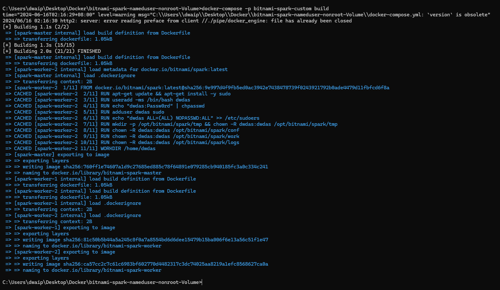

There will be two images: One for the Master and the other for the worker nodes. The images section will also show one dangling image. Ignore it.

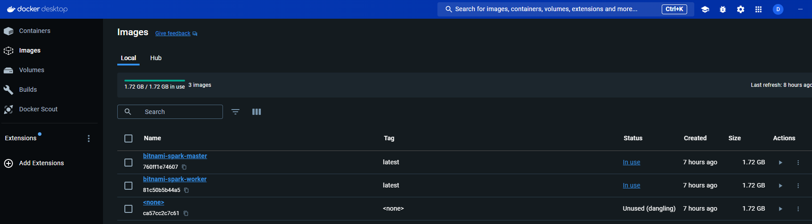

### Run the containers using the images

Now run the following:

```bash
docker-compose -p bitnami-spark-cluster up -d
```

You should see three containers running inside a compose stack.

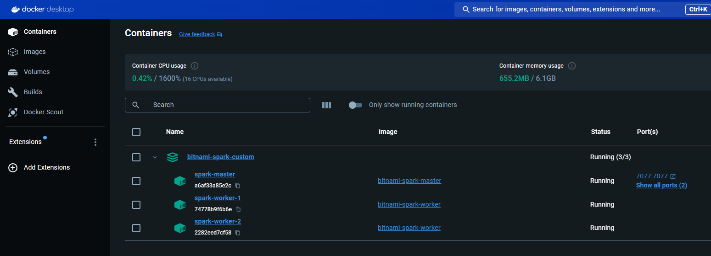

And a volume will be created and shown in teh **Volumes** section:

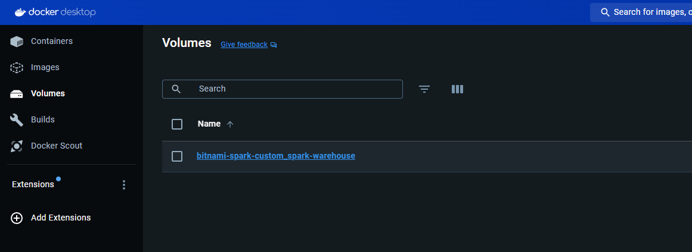

The volume will be mounted to all the three containers:

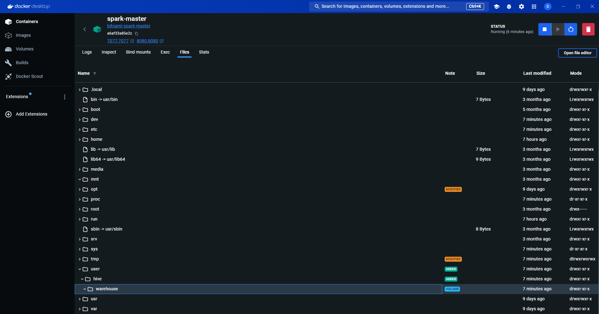

### Check Permissions for /user/hive/warehouse
The `/user/hive/warehouse` folder is the mounted directory we created. The user `dwdas` should have the correct permissions for this folder in all three containers. To check this, connect to each container through the terminal using either:

```bash
docker exec -it spark-master bash
```

Or through Docker Desktop's EXEC tab.

Then run:

```bash
ls -ld /user/hive/warehouse
# The permission should be rwx for dwdas
```

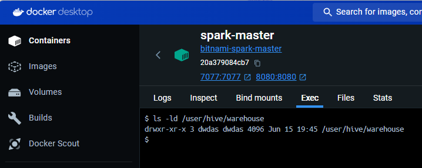

**Note:** If you don't have `rwx` or owner permissions for the warehouse folder and see an output like this:

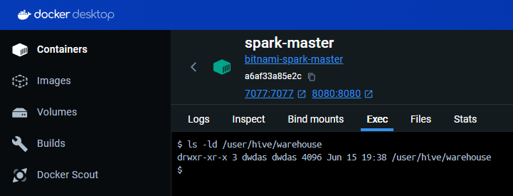

You will need to either provide `rwx` permission for `dwdas` or make `dwdas` the owner of the folder:

```bash
chown dwdas:dwdas /user/hive/warehouse
```

If that doesn't work, you can use:

```bash
chmod 777 /user/hive/warehouse
```

### Connect to SparkSQL using spark-sql CLI

Open any container's terminal(Master/worker) and input **spark-sql**.

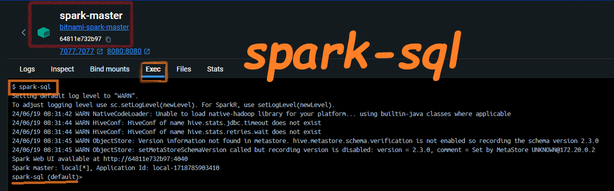

Let's create a simple table and see query it. paste the following in the terminal:

```sql
CREATE TABLE Hollywood (name STRING);
INSERT INTO Hollywood VALUES ('Inception'), ('Titanic');
SELECT * FROM Hollywood;
```

A table will be created in SPARK as extended tabble and you will be able to see the select result:
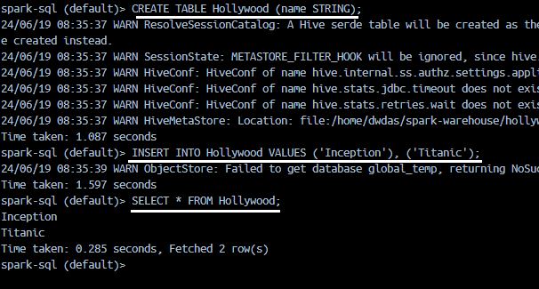

```SQL
DESCRIBE EXTENDED HOLLYWOOD
```
Will give this result:

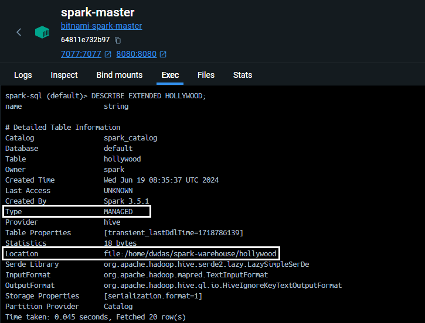

Note: its a manged table in location /home/dwdas/spark-warehouse/

### Connect to a container and create a spark session

Open VS Code and use Dev Containers to attach to the running Master container. Then, open a Jupyter notebook and run the following commands.

To know how to connect VS code to a container, refer to my article [here](02-ConnectVSCodeToDocker.html).

```python
from pyspark.sql import SparkSession

# Initialize the SparkSession
## Note: file:///user/hive/warehouse is the way and not /user/hive/warehouse. Add file: Else, wont be able to find the directory
spark = SparkSession.builder \
    .appName("HiveExample") \
    .config("spark.sql.warehouse.dir", "file:///user/hive/warehouse") \
    .config("spark.sql.legacy.createHiveTableByDefault", "false") \
    .enableHiveSupport() \
    .getOrCreate()

# Explanation:
# - `spark.sql.warehouse.dir`: Specifies the default location for managed databases and tables.
# - `spark.sql.legacy.createHiveTableByDefault`: Ensures that Hive tables are not created by default unless explicitly specified.
# - `enableHiveSupport()`: Enables Hive support, allowing Spark to leverage Hive Metastore, run HiveQL queries, and use Hive functions.

# Sample data
data = [("Kim Jong Obama", 28), ("Vladimir Trump", 35)]
columns = ["Name", "Age"]

# Create a DataFrame
df = spark.createDataFrame(data, columns)

# Save the DataFrame as a managed table
df.write.mode("overwrite").saveAsTable("people")

# Verify the table creation
spark.sql("SELECT * FROM people").show()

# Additional Information:
# - Hive Metastore Integration: Spark can directly access the Hive Metastore, providing a unified metadata layer for Spark and Hive.
# - HiveQL Queries: You can run HiveQL queries using Spark SQL, using the familiar Hive syntax.
# - Hive Functions: Spark supports Hive's built-in functions in Spark SQL queries.
# - Table Management: Spark can read from and write to Hive-managed tables, including creating, dropping, and altering tables.
# - Compatibility with Hive Data Formats: Spark can read from and write to Hive's data formats like ORC and Parquet.
# - Access to Hive UDFs: User-defined functions created in Hive can be used within Spark SQL queries.

```
If everything works fine, we will be able to see the spark internal table created!

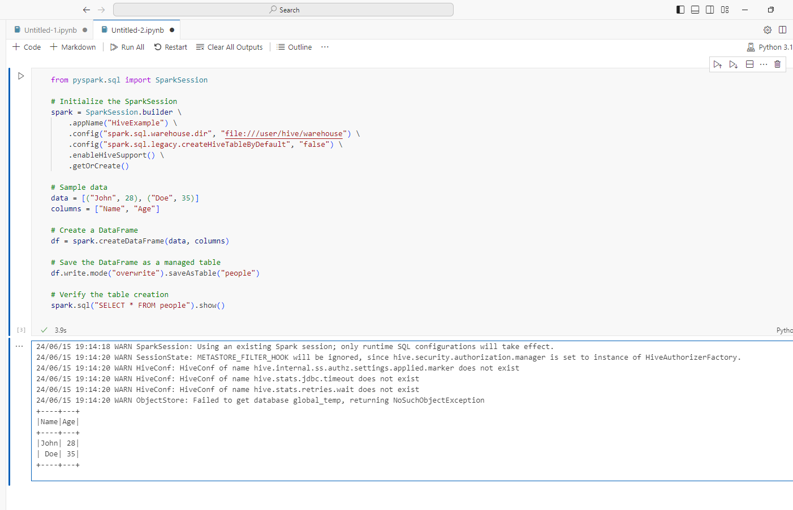

## Common Errors

I will update this section when I get time.