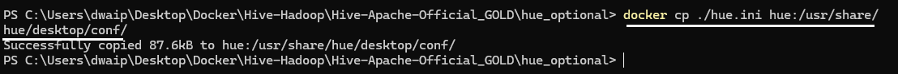

# Apache Official - Hive Metastore, Postgress and HiveServer2 Setup On Docker

## Overview

> This steup is based on [Official Hive docker site](https://hive.apache.org/developement/quickstart/). There is almost no customization, except the addtion of network dasnet.
> The setup consists of few docker commands run using CMD/Terminal. That's it.

> The only issue with this setup is when you restart HiveServer2, it gives the error: "HiveServer2 running as process 7. Stop it first." Other than that, the setup is great. Just rerun the Docker command for HiveServer2 to create a new container. The metastore and PostgreSQL work fine without needing a restart.

## Steps to create the setup

Just download the[zip file](Dockerfiles/ApacheHiveGold.zip). Unzip it and run the run.bat It will create three conatiners like this:


Or, if you want to run it manually here is the CMD script(just save it as `anyname.bat` and run it. That's all.):


```bash
REM Das Sep-04-2024: This CDs to the current folder
cd /d %~dp0

REM Step 1: Create a Docker volume
docker volume create warehouse

REM Das: We create a postgres container
docker run -d --network dasnet --name postgres -e POSTGRES_DB=metastore_db -e POSTGRES_USER=hive -e POSTGRES_PASSWORD=password postgres:13

REM Das: Create metastore-standalone container, connecting to Postgres and initializing the database
docker run -d --network dasnet -p 9083:9083 --env SERVICE_NAME=metastore --env DB_DRIVER=postgres --env SERVICE_OPTS="-Djavax.jdo.option.ConnectionDriverName=org.postgresql.Driver -Djavax.jdo.option.ConnectionURL=jdbc:postgresql://postgres:5432/metastore_db -Djavax.jdo.option.ConnectionUserName=hive -Djavax.jdo.option.ConnectionPassword=password" --mount source=warehouse,target=/opt/hive/data/warehouse --name metastore apache/hive:4.0.0-alpha-2

REM Das: Create HiveServer2 container which will connect to the metastore
docker run -d --network dasnet -p 10000:10000 -p 10002:10002 --env SERVICE_NAME=hiveserver2 --env SERVICE_OPTS="-Dhive.metastore.uris=thrift://metastore:9083" --mount source=warehouse,target=/opt/hive/data/warehouse --env IS_RESUME="true" --name hiveserver2 apache/hive:4.0.0-alpha-2

REM Keep the window open so that the user can review the output
pause
```
## Steps to verify the Setup

To check the connectivity between all components:

```bash
docker ps
```

You should see the `postgres`, `metastore`, and `hiveserver2` containers running.

Connect to Beeline on HiveServer2:

```bash
docker exec -it hiveserver2 /bin/bash
beeline -u 'jdbc:hive2://hiveserver2:10000/'
```

Create a sample table:

```sql
CREATE TABLE movies (id INT, name STRING);
INSERT INTO movies VALUES (1, 'Rambo'), (2, 'Mogambo');
SELECT * FROM movies;
```

Exit Beeline:

```sql
!quit;
```

## How data is stored in this setup by default


<p style="color: #000000; font-family: 'Trebuchet MS', Helvetica, sans-serif; background-color: #90e0ef; padding: 15px; border-left: 5px solid #00cc66;">
This setup is fully self-contained and enough for a Hive warehouse. The data is saved in a Docker volume, and the metadata is stored in a PostgreSQL server. You can later modify this setup to add a Hadoop Namenode (like in real-world scenarios) or even use Amazon S3 or ADLS for data storage. 
</p>

In this setup, Hive data will be stored in the following locations:

1. **Postgres Database**: 
   - The **Postgres container** is used to store the metadata (table schemas, databases, etc.) for Hive. This is where the Hive Metastore connects to manage and query metadata.
   - Database: `metastore_db`, User: `hive`, Password: `password`.

2. **HDFS for Table Data**: 
   - We are using the volume `warehouse` mounted to `/opt/hive/data/warehouse` in both the Metastore and HiveServer2 containers. This is where Hive stores its table data files. The directory `/opt/hive/data/warehouse` in the containers corresponds to the `warehouse` volume on our host system.

3. **Metastore Initialization**: 
   - The **Metastore container** connects to Postgres and uses the JDBC driver (`postgresql-42.5.1.jar`) to initialize the Hive Metastore database. This ensures that Hive's metadata is managed via Postgres.

4. **HiveServer2**:
   - The **HiveServer2 container** connects to the Metastore (via `thrift://metastore:9083`) to retrieve metadata and execute Hive queries.
   - The table data is stored in the same warehouse directory mounted as a volume, allowing HiveServer2 to access the data files in HDFS.

## thrift metastore uris for this setup

1. **`thrift://metastore:9083`**: This is the **Metastore Thrift URI** that other services (like HiveServer2 or Spark) use to connect to the Hive Metastore and retrieve metadata about tables and databases. 9083 is a default port.
   
2. **`thrift://hiveserver2:10000`**: This URI is for the **HiveServer2** service, which is used to execute Hive queries. Applications (like Beeline or JDBC/ODBC clients) connect to this URI to run SQL queries in Hive. 10000 is a default port.

# How to connect a Spark Session to this setup

In this setup, even without explicitly configuring `hive-site.xml` or adding any special configuration files, Spark can still interact with Hive by creating a Spark session that points to Hive and using Hive's metastore through the **Thrift** interface. Here's how it works:


1. **Create a Spark Session**:
   - When you create a Spark session, make sure to specify that it should use Hive. Spark will use the Hive Thrift Server (HiveServer2) to access Hive tables and metadata. Here's how you can create the session:

      ```python
      # Create a Spark session to connect with Hive Metastore
      # 'thrift://metastore:9083' is the URI of the Hive Metastore service in the container.
      # 9083 is the default port for the Hive Metastore using the Thrift protocol.
      # Spark will use this to fetch table metadata and manage Hive tables.

      # Enable Hive support so Spark can read/write Hive tables using Hive's metadata and storage.
      from pyspark.sql import SparkSession
      spark = SparkSession.builder \
         .appName("Spark Hive Example") \
         .config("spark.sql.catalogImplementation", "hive") \
         .config("hive.metastore.uris", "thrift://metastore:9083") \
         .enableHiveSupport() \
         .getOrCreate()
      ```

2. **Create a Table and Store Data**:
   - Once the session is created, you can create tables and store data in Hive without needing `hive-site.xml`. For example, you can create a table and insert data like this:

   ```python
   # Create a DataFrame with some sample data
   data = [("Jango", 30), ("Jamila", 25)]
   df = spark.createDataFrame(data, ["name", "age"])

   # Create a table in Hive and write data to it
   df.write.mode("overwrite").saveAsTable("default.person")

   # Verify that the table was created and data was stored
   spark.sql("SELECT * FROM default.person").show()
   ```

3. **Where is the Data Stored?**:
   - The data you insert will be saved in the `warehouse` directory mounted to `/opt/hive/data/warehouse` in the **HiveServer2** container. This happens automatically since you have the Docker volume set up to persist the data.

   - For example, after creating the `person` table, the actual data will be stored in a directory like `/opt/hive/data/warehouse/default/person` inside the `hiveserver2` container, and it will persist even if the container restarts.

# Configuration Reference

| Component                        | Details                                                                                                                            |
|-----------------------------------|------------------------------------------------------------------------------------------------------------------------------------|
| **PostgreSQL Hive Metastore**     | - **Database Name**: `metastore_db` <br> - **Username**: `hive` <br> - **Password**: `password` <br> - **Connection URL**: `jdbc:postgresql://postgres:5432/metastore_db` |
| **Schema Tool for Hive Tables**   | - **Location**: `/opt/hive/bin/schematool` <br> - **Command**: `/opt/hive/bin/schematool -dbType postgres -initOrUpgradeSchema`    |
| **Hive Configuration Directory**  | `/opt/hive/conf`                                                                                                                   |
| **Hive Version**                  | `4.0.0-alpha-2`                                                                                                                   |
| **HiveServer2 Startup Script**    | `/opt/hive/bin/ext/hiveserver2.sh`                                                                                                |
| **PostgreSQL Container**          | - **Network**: `dasnet` <br> - **Image**: `postgres:13` <br> - **Command**: `docker run -d --network dasnet --name postgres -e POSTGRES_DB=metastore_db -e POSTGRES_USER=hive -e POSTGRES_PASSWORD=password postgres:13` |
| **Metastore Container**           | - **Network**: `dasnet` <br> - **Port**: `9083` <br> - **Warehouse Data Directory**: `/opt/hive/data/warehouse` <br> - **JDBC Driver**: `/opt/hive/lib/postgres.jar` <br> - **Image**: `apache/hive:4.0.0-alpha-2` <br> |
| **HiveServer2 Container**         | - **Network**: `dasnet` <br> - **Ports**: `10000` (Thrift service), `10002` (additional) <br> - **Warehouse Data Directory**: `/opt/hive/data/warehouse` <br> - **Metastore URI**: `thrift://metastore:9083` <br> - **Image**: `apache/hive:4.0.0-alpha-2` <br> |


> 

<p style="color: #000000; font-family: 'Trebuchet MS', Helvetica, sans-serif; background-color: #d9d9d9; padding: 15px; border-left: 5px solid #00cc66;">
<b>Note</b>: This setup works smoothly for the metastore and PostgreSQL combination, but restarting HiveServer2 doesn't work, and you need to recreate the HiveServer2 container alone.
</p>


[Official Hive Docker](https://hive.apache.org/developement/quickstart/)
[Hive Files Github](https://github.com/apache/hive)


# Add hue to the system

To install Apache Hue and connect it to your existing environment, we'll need to configure Hue to work with Hive and PostgreSQL. Here's a step-by-step guide on how to do this:

## Step-by-Step Guide to Install and Connect Hue to Hive

1. **Create a Docker Network (should be already created):**
   The `dasnet` network shoudld be already created. If not, create it using command:
   ```bash
   docker network create dasnet
   ```

2. **Run Hue Docker Container:**
   You can run Hue in a Docker container and connect it to your existing Hive and PostgreSQL setup.

   Here's the command to run Hue:

   ```bash
   docker run -d --network dasnet -p 8888:8888 --name hue gethue/hue:latest
   ```

3. **Configure Hue to Connect to Hive**

> Note: You can either edit the `hue.ini` file directly inside the container or modify it locally and then copy it to the `/usr/share/hue/desktop/conf/` directory in the container.
> After making the changes you can copy the file to container using the followig command(cd to the folder containing the hue.ini file) `docker cp ./hue.ini hue:/usr/share/hue/desktop/conf/`



To connect Hue to HiveServer2, you need to update the `hue.ini` configuration file in the Hue container.

- First, open a terminal in the Hue container:
  ```bash
  docker exec -it hue /bin/bash
  ```

- Navigate to the directory where the `hue.ini` file is located:
  ```bash
  cd /usr/share/hue/desktop/conf/
  ```

- Open the `hue.ini` file using a text editor like `nano` or `vim`:
  ```bash
  nano hue.ini
  ```

- Look for the `[beeswax]` section in the file and add the following lines to point Hue to your HiveServer2 instance:

  ```ini
  [[beeswax]]
  # HiveServer2 connection settings
  hive_server_host=localhost
  hive_server_port=10000
  # Optional authentication settings for HiveServer2
  auth_username=hive
  auth_password=password
  ```

4. **Configure PostgreSQL as Hue's Backend Database**

To make Hue use your PostgreSQL database (the one used by Hive Metastore), update the database configuration in the `hue.ini` file.

- In the same `hue.ini` file, find the `[desktop]` section and add the following lines to configure PostgreSQL as the backend database:

  ```ini
  [desktop]
  [[database]]
  engine=postgresql_psycopg2
  host=postgres
  port=5432
  user=hive
  password=password
  name=metastore_db
  ```

   <p style="color: #006600; font-family: 'Consolas', 'Courier New', monospace; background-color: #e6ffe6; padding: 15px; border-left: 5px solid #00cc66; font-size: 12px;">
      There should only be one `[[database]]` section and one `[[beeswax]]` section in the configuration file, and these sections should always use double brackets (`[[ ]]`). Common errors that occurs if these are not followed are:
   </p>

   ```
   ERROR: Error in configuration file '/usr/share/hue/desktop/conf/hue.ini': Parsing failed with several errors.
   Error in configuration file '/usr/share/hue/desktop/conf/hue.ini': Duplicate section name at line 524.
   ``` 

5. **Restart the Hue Container, then access it:**
   After making changes to the `hue.ini` file, exit the editor and container, and restart the Hue container to apply the changes:

   ```bash
   docker restart hue
   ```
   Then access hue using the following command:

   `http://localhost:8888`
   
   <p style="color: #006600; font-family: 'Consolas', 'Courier New', monospace; background-color: #e6ffe6; padding: 15px; border-left: 5px solid #00cc66; font-size: 12px;">
      The credential you choose will  be your root credential. For me it is `dwdas/Passw0rd`
   </p>

# [Draft DO NOT USE]Connecting To Spark using `hive-site.xml`

>Note:
1. **SparkConf**: If you programmatically set configurations using the `SparkConf` object in your Spark application, these settings have the highest priority. 
2. **Flags passed to `spark-submit`**: If you pass configuration options directly when running the Spark job using `spark-submit` (e.g., `--conf spark.executor.memory=4g`), these come next.
3. **spark-defaults.conf**: This is the default configuration file for Spark, and properties here are considered last. They will only apply if the settings haven't been specified by `SparkConf` or `spark-submit`.


In this section, we will show how to create a Spark container from scratch and connect it to the existing Hive environment that we already set up using Docker. You will learn step by step how to configure Spark so it can talk to Hive, create tables in Hive, and use PySpark to query and manage those tables.

1. **Create and Run the Spark Container**:
   
   First, we need to create a new Spark container. This Spark container will be on the same network as your Hive and PostgreSQL containers so that they can communicate with each other.

   Run this command to create the Spark container and connect it to the Docker network (`dasnet`):

   ```bash
   docker run -d --network dasnet --name spark-container -p 4040:4040 -p 8080:8080 -v /path/to/spark-conf:/opt/spark/conf bitnami/spark:latest
   ```

2. **Configure Hive for Spark**:
   
   Now, we need to tell Spark where to find Hive. We do this by setting up the `hive-site.xml` file with the correct information about the Hive metastore.

   Here’s what the file should look like:

   ```xml
   <configuration>
     <property>
       <name>hive.metastore.uris</name>
       <value>thrift://metastore:9083</value>
     </property>
     <property>
       <name>javax.jdo.option.ConnectionDriverName</name>
       <value>org.postgresql.Driver</value>
     </property>
     <property>
       <name>javax.jdo.option.ConnectionURL</name>
       <value>jdbc:postgresql://postgres:5432/metastore_db</value>
     </property>
     <property>
       <name>javax.jdo.option.ConnectionUserName</name>
       <value>hive</value>
     </property>
     <property>
       <name>javax.jdo.option.ConnectionPassword</name>
       <value>password</value>
     </property>
   </configuration>
   ```

   Copy this file to your Spark container using:

   ```bash
   docker cp /path/to/hive-site.xml spark-container:/opt/spark/conf/hive-site.xml
   ```

3. **Add PostgreSQL Driver to Spark**:

   Since Hive uses PostgreSQL, you need to add the PostgreSQL driver to the Spark container so that Spark can connect to the Hive metastore.

   Copy the PostgreSQL driver (`postgresql-42.5.1.jar`) into the Spark container:

   ```bash
   docker cp /path/to/postgresql-42.5.1.jar spark-container:/opt/spark/jars/
   ```

4. **Start PySpark with Hive Support**:
   
   Now, start the PySpark session from the Spark container with Hive support enabled:

   ```bash
   docker exec -it spark-container /bin/bash
   pyspark --conf spark.sql.catalogImplementation=hive
   ```

5. **Create and Query Tables Using PySpark**:

   Inside the PySpark shell, you can create tables and query them. Here’s how:

   - **Create a table**:

     ```python
     spark.sql("CREATE TABLE IF NOT EXISTS sample_table (id INT, name STRING)")
     ```

   - **Insert data into the table**:

     ```python
     spark.sql("INSERT INTO sample_table VALUES (1, 'Alice'), (2, 'Bob')")
     ```

   - **Query the table**:

     ```python
     result = spark.sql("SELECT * FROM sample_table")
     result.show()
     ```

6. **Verify the Table in Hive**:

   After creating the table using PySpark, you can check if the table exists in Hive using Beeline:

   ```bash
   docker exec -it hiveserver2 /bin/bash
   beeline -u 'jdbc:hive2://hiveserver2:10000/'
   ```

   Run this query in Beeline to verify:

   ```sql
   SHOW TABLES;
   SELECT * FROM sample_table;
   ```


© 2024 Das. All Rights Reserved.