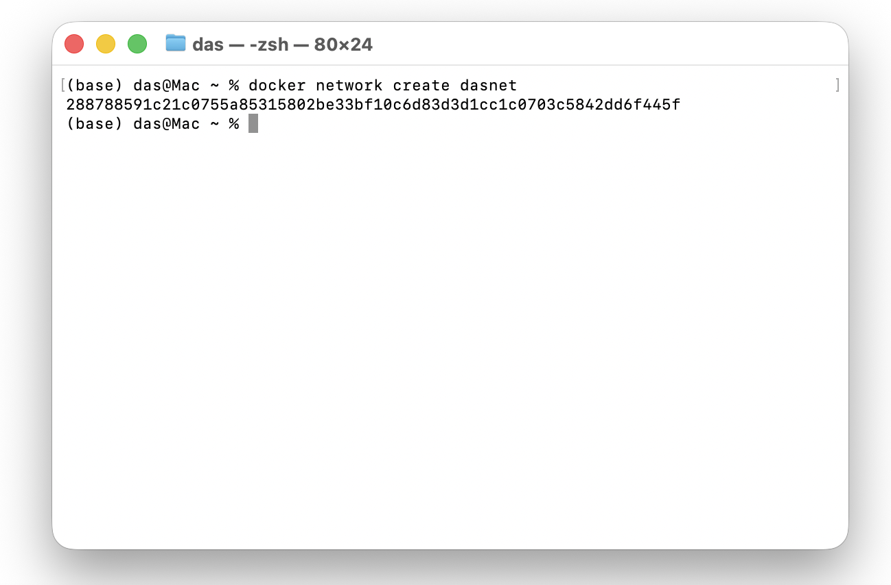
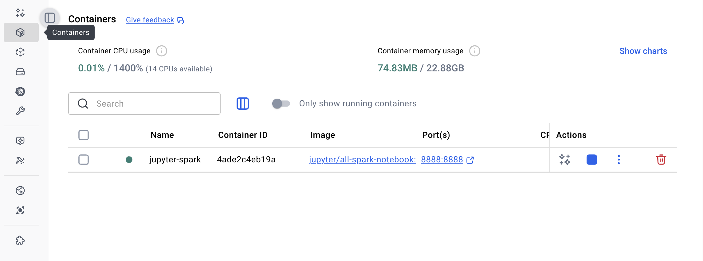

# **Running Jupyter + PySpark on a MacBook M3 Using Docker**

Running a full PySpark environment locally is simple if you use Docker, even on Apple Silicon (M1/M2/M3). The Jupyter project provides a ready-to-use image called **`jupyter/all-spark-notebook`** which includes:

* JupyterLab
* PySpark
* Scala & R kernels
* Hadoop client libraries
* A fully configured Python environment

On a MacBook M3, Docker will automatically pull the **ARM-compatible** image variant.

---

## **1. Create a Dedicated Docker Network (`dasnet`)**

If you plan to connect this Jupyter container to other containers (e.g., Spark master, workers, databases), it's a good idea to create a custom Docker network.

Run this once:

```bash
docker network create dasnet
```



This gives your containers a shared private network with easy hostname-based communication.

---

## **2. Pull the Jupyter All-Spark Notebook Image**

Although Docker can pull automatically, doing it manually lets you verify the architecture:

```bash
docker pull jupyter/all-spark-notebook:latest
```

Docker will download the correct **ARM64 image** for your MacBook.

---

## **3. Run Jupyter + PySpark Container on the `dasnet` Network**

Now start the notebook:

```bash
docker run -it \
  --name jupyter-spark \
  --network dasnet \
  -p 8888:8888 \
  jupyter/all-spark-notebook:latest
```

Eventually you should see an image in the docker desktop app and a running container in the container section



### What this does:

* `--name jupyter-spark` : gives the container a readable name
* `--network dasnet` : attaches it to your custom network
* `-p 8888:8888` : exposes JupyterLab
* automatically launches the notebook server
* logs stay visible in your terminal

Once running, your terminal will show a Jupyter URL with a token.
Open it in your browser to access JupyterLab.

---

## **4. Using PySpark**

Inside any notebook, simply import Spark:

```python
from pyspark.sql import SparkSession
spark = SparkSession.builder.getOrCreate()
```

Spark runs in **local mode** by default, which is perfect for development and experimentation.

---

## **5. Stopping or Removing the Container**

To stop:

```bash
docker stop jupyter-spark
```

To remove:

```bash
docker rm jupyter-spark
```

Run it again anytime using the same `docker run` command.

---