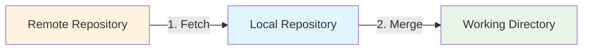
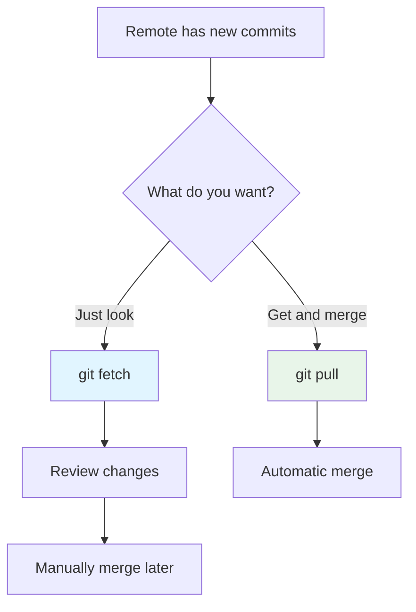

# Understanding Git Pull

You're working on a project. Your teammate pushed changes. You need them. You type `git pull`.

What just happened?

Git pull does two things: fetch + merge. It grabs the latest code from the remote and merges it into your current branch.

One command. Two operations.

## What Git Pull Does



**Step 1:** Fetch - Download commits from remote  
**Step 2:** Merge - Combine them with your local branch

It's `git fetch` + `git merge` in one command.

## The Daily Command

This is what you'll use most:

```bash
git pull
```

That's it. Git pulls from the current branch's remote tracking branch.

You're on `main`, it pulls from `origin/main`.  
You're on `feature/login`, it pulls from `origin/feature/login`.

**More explicit version:**

```bash
git pull origin main
```

This pulls from `origin/main` specifically. Use this when you want to be clear about what you're pulling.

## Pull vs Fetch

| Command | What It Does | When to Use |
|---------|-------------|-------------|
| `git fetch` | Downloads commits, doesn't merge | When you want to check changes first |
| `git pull` | Downloads commits AND merges | When you trust the changes and want them now |

**Think of it like this:**

- `git fetch` → "Show me what's new"
- `git pull` → "Give me what's new and merge it"



## Common Workflows

### Morning Routine

You start your day. You need the latest code.

```bash
git checkout main
git pull
```

Now you're synced. Everyone's changes from yesterday are in your local repo.

### Before Starting New Work

You're about to create a feature branch. Make sure main is up to date first.

```bash
git checkout main
git pull
git checkout -b feature/new-thing
```

You branched from the latest code. No surprises later.

### Updating Your Feature Branch

You've been working for days. Main has moved forward. You need those changes.

```bash
# You're on feature/login
git checkout main
git pull
git checkout feature/login
git merge main
```

Or use rebase (cleaner history):

```bash
git checkout main
git pull
git checkout feature/login
git rebase main
```

### Quick Update While Working

You're on a feature branch. You want the latest from that branch's remote.

```bash
git pull
```

Git automatically pulls from the tracking branch.

## Quick Command Reference

| Task | Command |
|------|---------|
| Pull from current tracking branch | `git pull` |
| Pull from specific remote/branch | `git pull origin main` |
| Pull with rebase instead of merge | `git pull --rebase` |
| Pull all branches | `git pull --all` |
| Pull and don't commit merge | `git pull --no-commit` |
| Pull and show what changed | `git pull -v` |

## Advanced Usage

Everything below is for specific situations.

??? abstract "Pull with Rebase (Cleaner History)"
    
    Normal `git pull` creates a merge commit. It's messy.
    
    **Standard pull:**
    ```bash
    git pull
    ```
    
    Creates:
    ```
    *   Merge branch 'main' of origin into main
    |\  
    | * Commit from teammate
    * | Your local commit
    ```
    
    **Pull with rebase:**
    ```bash
    git pull --rebase
    ```
    
    Creates:
    ```
    * Your local commit (moved on top)
    * Commit from teammate
    ```
    
    Linear history. No merge commit. Cleaner.
    
    **Make it default:**
    ```bash
    git config --global pull.rebase true
    ```
    
    Now `git pull` will always rebase instead of merge.

??? tip "Pull from Different Remote"
    
    You have multiple remotes. You want to pull from a specific one.
    
    ```bash
    # Pull from upstream instead of origin
    git pull upstream main
    ```
    
    Or pull from a teammate's fork:
    ```bash
    git remote add teammate https://github.com/teammate/repo.git
    git pull teammate feature/their-work
    ```

??? example "Pull All Remotes"
    
    You have multiple remotes configured. You want to fetch all of them.
    
    ```bash
    git pull --all
    ```
    
    This fetches from all remotes but only merges the current branch's tracking branch.
    
    **More control:**
    ```bash
    # Fetch from all remotes
    git fetch --all
    
    # Then merge specific branch
    git merge origin/main
    ```

??? info "Pull Without Auto-Merge"
    
    You want to pull but review changes before merging.
    
    ```bash
    git pull --no-commit
    ```
    
    Git fetches and attempts to merge but doesn't commit. You can review and then:
    
    ```bash
    # Accept the merge
    git commit
    
    # Or abort
    git merge --abort
    ```

??? warning "Pull and Overwrite Local Changes (Force)"
    
    You messed up. You want to throw away local changes and pull fresh.
    
    !!! danger "This Deletes Your Local Work"
        Make sure you don't need your local changes.
    
    ```bash
    # Save the branch name
    git fetch origin
    git reset --hard origin/main
    ```
    
    Your local `main` now matches `origin/main` exactly. Local changes are gone.
    
    **Less destructive version:**
    ```bash
    # Stash your changes first
    git stash
    git pull
    # Decide if you want them back
    git stash pop
    ```

??? abstract "Pull Specific Files"
    
    You don't want to pull everything. Just specific files.
    
    **Can't do it with pull.** But you can do it with fetch + checkout:
    
    ```bash
    git fetch origin
    git checkout origin/main -- path/to/file.txt
    ```
    
    This updates only that file from the remote.

## Real-World Scenarios

### Scenario 1: Merge Conflict During Pull

You pull. Git says there's a conflict.

```bash
git pull
```

Output:
```
Auto-merging src/app.js
CONFLICT (content): Merge conflict in src/app.js
Automatic merge failed; fix conflicts and then commit the result.
```

**What to do:**

1. Open the conflicted file
2. Look for conflict markers:

```javascript
<<<<<<< HEAD
// Your code
function login() { }
=======
// Their code
function authenticate() { }
>>>>>>> origin/main
```

3. Fix it manually:

```javascript
function authenticate() { }
```

4. Stage and commit:

```bash
git add src/app.js
git commit
```

Done. Conflict resolved.

### Scenario 2: You Have Uncommitted Changes

You try to pull but Git blocks you:

```bash
git pull
```

Output:
```
error: Your local changes to the following files would be overwritten by merge:
    src/app.js
Please commit your changes or stash them before you merge.
```

**Option 1: Commit your changes**

```bash
git add .
git commit -m "WIP: working on feature"
git pull
```

**Option 2: Stash your changes**

```bash
git stash
git pull
git stash pop
```

Your changes are back. If there's a conflict, fix it manually.

### Scenario 3: Pull Failed Midway

The pull started but failed. Now you're stuck.

```bash
git status
```

Output:
```
You have unmerged paths.
```

**Abort the merge:**

```bash
git merge --abort
```

Back to where you started. Try again or fix the issue.

## Common Mistakes

!!! danger "Pulling Without Committing Local Work"
    **Wrong:**
    ```bash
    # You have changes
    git pull  # Error!
    ```
    
    **Right:**
    ```bash
    # Commit first
    git add .
    git commit -m "Save work"
    git pull
    ```
    
    Or stash:
    ```bash
    git stash
    git pull
    git stash pop
    ```

!!! warning "Pulling the Wrong Branch"
    You're on `main` but you pull from `develop`:
    ```bash
    git checkout main
    git pull origin develop  # Wrong!
    ```
    
    Now `main` has `develop` code. Fix it:
    ```bash
    git reset --hard origin/main
    ```

!!! warning "Pulling Without Checking Current Branch"
    ```bash
    git pull  # Which branch am I on?
    ```
    
    Always check first:
    ```bash
    git branch  # Shows current branch
    git pull
    ```

## Best Practices

!!! success "Do This"
    - Check your branch before pulling: `git status`
    - Commit or stash changes before pulling
    - Pull from `main` before starting new work
    - Use `git pull --rebase` for cleaner history
    - Review merge conflicts carefully

!!! tip "Daily Workflow"
    Start every work session:
    ```bash
    git checkout main
    git pull
    git checkout feature/your-branch
    git merge main  # Or rebase
    ```
    
    You're synced. No surprises.

## Fast-Forward vs Merge

When you pull, Git might "fast-forward" or create a merge commit.

**Fast-forward** (no merge commit):

```
Before pull:
* Your local main
|
* Commit A

After pull (fast-forward):
* Remote commit C
* Remote commit B
* Commit A
```

Your branch just moves forward. No merge needed.

**Merge commit** (you had local commits):

```
Before pull:
* Your local commit
|
* Commit A

After pull:
*   Merge commit
|\
| * Remote commit
* | Your local commit
|/
* Commit A
```

Git creates a merge commit to combine both histories.

## Pull vs Clone

| Command | What It Does | When to Use |
|---------|-------------|-------------|
| `git clone` | Copy entire repository for first time | When you don't have the repo yet |
| `git pull` | Update existing repository | When you already have the repo |

You clone once. You pull many times.

## What's Next?

You understand `git pull`. It's fetch + merge in one command.

Next up: `git push`. How to send your changes to the remote. What happens when you push. When to force push (and when not to).

But now you know: `git pull` gets the latest code and merges it into your branch.