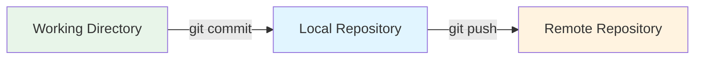

# Understanding Git Push

You made changes. You committed them. Now you want them on GitHub. You type `git push`.

Your local commits go to the remote repository. Your teammates can see them. CI/CD can deploy them.

One command. Your code is shared.

## What Git Push Does



**Step 1:** You commit locally  
**Step 2:** You push to remote  
**Result:** Remote repository has your commits

Push moves commits from your machine to GitHub (or GitLab, Bitbucket, etc.).

## The Daily Command

This is what you'll use most:

```bash
git push
```

That's it. Git pushes to the current branch's remote tracking branch.

You're on `main`, it pushes to `origin/main`.  
You're on `feature/login`, it pushes to `origin/feature/login`.

**First time pushing a new branch:**

```bash
git push -u origin feature/new-branch
```

The `-u` sets up tracking. After this, just use `git push`.

**More explicit version:**

```bash
git push origin main
```

This pushes to `origin/main` specifically.

## Push Workflow

### Creating and Pushing a Feature Branch

You create a branch. You make commits. You push.

```bash
# Create branch
git checkout -b feature/login

# Make changes
git add .
git commit -m "Add login feature"

# Push (first time)
git push -u origin feature/login
```

Now `feature/login` exists on GitHub. Your teammates can see it.

**Subsequent pushes:**

```bash
# Make more changes
git add .
git commit -m "Fix login bug"

# Push (no -u needed)
git push
```

### Pushing to Main

You're on main. You made commits. You push.

```bash
git checkout main
git add .
git commit -m "Update README"
git push
```

Done. Main on GitHub has your changes.

### Pushing After Merging

You merged a feature branch into main. Now push.

```bash
git checkout main
git merge feature/login
git push
```

The merge commit goes to GitHub.

## Quick Command Reference

| Task | Command |
|------|---------|
| Push current branch | `git push` |
| Push and set upstream (first time) | `git push -u origin branch-name` |
| Push to specific remote/branch | `git push origin main` |
| Push all branches | `git push --all` |
| Push tags | `git push --tags` |
| Force push (dangerous) | `git push --force` |
| Force push (safer) | `git push --force-with-lease` |
| Delete remote branch | `git push origin --delete branch-name` |

## Advanced Usage

Everything below is for specific situations.

??? warning "Force Push (When You Rewrote History)"
    
    You rebased. You amended. You changed commits. Now push fails:
    
    ```bash
    git push
    ```
    
    Output:
    ```
    ! [rejected]        main -> main (non-fast-forward)
    error: failed to push some refs
    ```
    
    Git won't let you push because histories diverged.
    
    !!! danger "Force Push Overwrites Remote History"
        This deletes commits on the remote. Make sure you know what you're doing.
    
    **Option 1: Force push (dangerous)**
    ```bash
    git push --force
    ```
    
    Remote branch is now updated. Any commits that were there are gone.
    
    **Option 2: Force with lease (safer)**
    ```bash
    git push --force-with-lease
    ```
    
    This fails if someone else pushed after your last fetch. Safer.
    
    **When to force push:**
    - Working on your own feature branch
    - After rebasing or amending commits
    - After squashing commits
    
    **When NOT to force push:**
    - On `main` or `develop` (shared branches)
    - On branches others are working on
    - If you're not sure what you're doing

??? example "Pushing a New Branch"
    
    You created a branch locally. It doesn't exist on remote.
    
    ```bash
    git checkout -b feature/new-thing
    git add .
    git commit -m "Start new feature"
    ```
    
    **Push it:**
    ```bash
    git push -u origin feature/new-thing
    ```
    
    The `-u` (or `--set-upstream`) creates the branch on remote and sets up tracking.
    
    **After this, just use:**
    ```bash
    git push
    ```

??? tip "Push All Branches"
    
    You have multiple local branches. You want to push all of them.
    
    ```bash
    git push --all
    ```
    
    Every local branch goes to the remote.
    
    **Be careful:** This includes old branches you might not want to share.

??? info "Push Tags"
    
    You created tags. They don't auto-push with commits.
    
    ```bash
    # Create a tag
    git tag v1.0.0
    
    # Push it
    git push origin v1.0.0
    ```
    
    **Push all tags:**
    ```bash
    git push --tags
    ```

??? abstract "Delete Remote Branch"
    
    You merged a feature branch. You want to delete it from GitHub.
    
    ```bash
    git push origin --delete feature/old-branch
    ```
    
    The remote branch is gone. Local branch still exists:
    
    ```bash
    # Delete local too
    git branch -d feature/old-branch
    ```

??? example "Push to Different Remote"
    
    You have multiple remotes. You want to push to a specific one.
    
    ```bash
    # Push to origin
    git push origin main
    
    # Push to upstream
    git push upstream main
    
    # Push to production server
    git push production main
    ```

??? warning "Push Without Specifying Branch (Dangerous)"
    
    Old Git versions had dangerous default behavior. They pushed ALL matching branches.
    
    **Check your config:**
    ```bash
    git config --global push.default
    ```
    
    **Should be:**
    ```
    simple  # or current
    ```
    
    **If it's not set:**
    ```bash
    git config --global push.default simple
    ```
    
    Now `git push` only pushes the current branch.

??? tip "Dry Run (See What Would Be Pushed)"
    
    You want to check before pushing.
    
    ```bash
    git push --dry-run
    ```
    
    Output shows what would happen. Nothing actually pushed.

## Real-World Scenarios

### Scenario 1: Push Rejected (Someone Else Pushed)

You try to push. Git blocks you:

```bash
git push
```

Output:
```
! [rejected]        main -> main (fetch first)
error: failed to push some refs
hint: Updates were rejected because the remote contains work that you do not have locally.
```

**What happened:** Someone pushed while you were working.

**Fix it:**

```bash
# Pull their changes
git pull

# If there's a conflict, fix it
# Then push
git push
```

**Or use rebase for cleaner history:**

```bash
git pull --rebase
git push
```

### Scenario 2: Pushed to Wrong Branch

You're on `develop` but you thought you were on `main`. You pushed.

```bash
git branch  # Oh no, I'm on develop!
```

**Fix it:**

If you pushed to the wrong branch but haven't messed up anything yet:

```bash
# Go to correct branch
git checkout main

# Cherry-pick the commits
git cherry-pick <commit-hash>

# Push to correct branch
git push

# Remove from wrong branch (if needed)
git checkout develop
git reset --hard origin/develop
git push --force
```

### Scenario 3: Accidentally Pushed Sensitive Data

You committed an API key. You pushed it. Now it's on GitHub.

!!! danger "Act Fast"
    Secrets on GitHub are compromised. Rotate them immediately.

**Remove it:**

```bash
# Remove from history (using BFG or git filter-branch)
# This is complex, see GitHub docs

# Or revert the commit and push
git revert <commit-hash>
git push
```

**Then:**
- Rotate the secret
- Use environment variables
- Add secrets to `.gitignore`

### Scenario 4: Push Keeps Failing

Every push fails with authentication errors.

```bash
git push
```

Output:
```
fatal: Authentication failed
```

**Fix it:**

**HTTPS with token:**
```bash
git remote -v  # Check URL
git remote set-url origin https://<TOKEN>@github.com/user/repo.git
```

**Switch to SSH:**
```bash
git remote set-url origin git@github.com:user/repo.git
```

Make sure your SSH keys are set up.

## Common Mistakes

!!! danger "Force Pushing to Shared Branches"
    **Never do this:**
    ```bash
    git checkout main
    git push --force  # NEVER on main!
    ```
    
    You just deleted commits your teammates might have based their work on. You'll break their repos.
    
    **Only force push to:**
    - Your own feature branches
    - Branches you're the only one working on

!!! warning "Pushing Without Pulling First"
    You have old code. You push. It fails.
    
    ```bash
    # Pull first
    git pull
    
    # Then push
    git push
    ```

!!! warning "Pushing Unfinished Work to Main"
    Don't push broken code to main. Use feature branches.
    
    **Wrong:**
    ```bash
    git checkout main
    git commit -m "WIP half-done feature"
    git push  # Breaks main!
    ```
    
    **Right:**
    ```bash
    git checkout -b feature/wip
    git commit -m "WIP half-done feature"
    git push -u origin feature/wip
    ```

## Best Practices

!!! success "Do This"
    - Pull before pushing: `git pull`
    - Push feature branches, not directly to main
    - Write clear commit messages before pushing
    - Use `--force-with-lease` instead of `--force`
    - Check what branch you're on: `git branch`
    - Never force push to shared branches

!!! tip "Before Pushing Checklist"
    ```bash
    # 1. Check your branch
    git branch
    
    # 2. Check what you're pushing
    git log origin/main..HEAD
    
    # 3. Pull first
    git pull
    
    # 4. Push
    git push
    ```

## Push vs Pull

| Command | Direction | What It Does |
|---------|-----------|--------------|
| `git pull` | Remote → Local | Get changes from remote |
| `git push` | Local → Remote | Send changes to remote |

You pull to get updates. You push to share your work.

## Protected Branches

Some branches can't be pushed to directly. GitHub blocks you:

```bash
git push origin main
```

Output:
```
remote: error: GH006: Protected branch update failed
```

**What this means:** Main is protected. You need a pull request.

**Fix it:**
1. Push to a feature branch
2. Open a pull request on GitHub
3. Get it reviewed
4. Merge it

```bash
git checkout -b feature/update
git push -u origin feature/update
# Now open PR on GitHub
```

## Upstream Tracking

When you push with `-u`, Git sets up tracking:

```bash
git push -u origin feature/login
```

Now Git knows:
- `feature/login` (local) → `origin/feature/login` (remote)

**Check tracking:**

```bash
git branch -vv
```

Output:
```
* feature/login  abc123 [origin/feature/login] Latest commit
  main           def456 [origin/main] Another commit
```

The `[origin/feature/login]` shows tracking.

**Why it matters:** After setting upstream, just use `git push` and `git pull`.

## What's Next?

You understand `git push`. It sends your commits to the remote repository.

Next up: branches. Remote tracking branches. What `origin/main` means. How to work with remote branches effectively.

But now you know: `git push` shares your work. `git pull` gets others' work. That's collaboration.