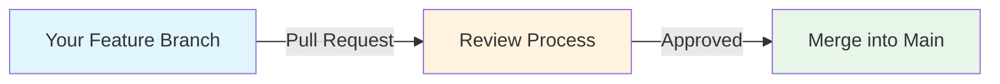

# Understanding Pull Requests (PRs)

You hear "Pull Request" everywhere. PR this. PR that. Open a PR. Merge the PR.

But here's the confusing part: **Pull Request is a terrible name.**

You're not requesting to pull. You're requesting someone to merge your code into their branch.

It should be called a "Merge Request." (GitLab got it right.)

## What a Pull Request Really Is

A Pull Request is you saying:

> "Hey, I made changes on my branch. Please review them and merge them into main."

That's it. You're asking someone(or yourself) to **merge** your feature branch into 'a' branch (usually `main`).



**Not a pull.** It's a merge request with a review process.

## The Name Confusion

??? question "Why Is It Called 'Pull Request'?"
    
    GitHub named it from the repository owner's perspective.
    
    **Your perspective:**  
    "I want to merge my changes into main."
    
    **Repository owner's perspective:**  
    "Please pull my changes into your repository."
    
    The owner "pulls" your changes in. Hence, "Pull Request."
    
    **But it's still confusing** because:
    - You use `git pull` to get changes
    - You use `git push` to send changes
    - But you "open a pull request" to ask for a merge
    
    **What others call it:**
    - **GitHub:** Pull Request (PR)
    - **GitLab:** Merge Request (MR) ← Better name
    - **Bitbucket:** Pull Request (PR)
    - **Azure DevOps:** Pull Request (PR)
    
    Just remember: **PR = "Please merge my code" request.**

## The Basic Flow

This is what happens with every PR:

??? note "Step 1: Create a Feature Branch"
    
    You don't work on `main` directly. You create a branch.
    
    ```bash
    git checkout main
    git pull
    git checkout -b feature/login
    ```
    
    Now you're on `feature/login`.

??? note "Step 2: Make Changes and Commit"
    
    You write code. You commit it.
    
    ```bash
    # Make changes to files
    git add .
    git commit -m "Add login feature"
    ```
    
    Maybe you make more commits:
    
    ```bash
    git add .
    git commit -m "Fix login bug"
    
    git add .
    git commit -m "Add tests for login"
    ```
    
    All commits are on `feature/login`.

??? note "Step 3: Push Your Branch"
    
    Push your feature branch to GitHub.
    
    ```bash
    git push -u origin feature/login
    ```
    
    Your branch is now on GitHub. But it's not merged into `main` yet.

??? note "Step 4: Open a Pull Request"
    
    Go to GitHub. You'll see a yellow banner:
    
    ```
    feature/login had recent pushes
    [Compare & pull request]
    ```
    
    Click it. Fill in:
    - **Title:** What your PR does
    - **Description:** Why you made these changes
    - **Reviewers:** Who should review it
    
    Click "Create pull request."
    
    **Now you wait.** Someone needs to review your code.

??? note "Step 5: Code Review"
    
    Reviewers look at your code. They might:
    
    - **Approve it:** "Looks good!"
    - **Request changes:** "Fix this bug first"
    - **Comment:** "Why did you do it this way?"
    
    You respond. You make more commits if needed:
    
    ```bash
    # Fix review comments
    git add .
    git commit -m "Address review comments"
    git push
    ```
    
    The PR updates automatically with your new commits.

??? note "Step 6: Merge the PR"
    
    Once approved, someone clicks "Merge pull request" on GitHub.
    
    Your `feature/login` branch merges into `main`.
    
    **Done.** Your code is in main. Everyone has it.

??? note "Step 7: Delete the Feature Branch"
    
    The branch is merged. You don't need it anymore.
    
    **On GitHub:** Click "Delete branch" after merging.
    
    **Locally:**
    ```bash
    git checkout main
    git pull
    git branch -d feature/login
    ```
    
    Clean slate. Ready for the next feature.

## Quick Command Reference

| Task | Command/Action |
|------|----------------|
| Create feature branch | `git checkout -b feature/name` |
| Push branch | `git push -u origin feature/name` |
| Open PR | Go to GitHub, click "Compare & pull request" |
| Update PR with changes | `git commit` + `git push` |
| Sync with main during PR | `git pull origin main` or `git rebase main` |
| Delete local branch after merge | `git branch -d feature/name` |
| Delete remote branch | `git push origin --delete feature/name` |

## Common Confusion Cleared

??? question "Confusion 1: Pull Request vs git pull"
    
    **They're completely different.**
    
    | Term | What It Is | Command/Action |
    |------|------------|----------------|
    | `git pull` | Git command to fetch and merge | `git pull` |
    | Pull Request | GitHub feature to request code review | Click button on GitHub |
    
    **git pull:** You get code from remote.  
    **Pull Request:** You ask others to merge your code.
    
    Different things. Same word "pull." Confusing.

??? question "Confusion 2: Do I Need to Pull Before Opening a PR?"
    
    **No, but you should sync with main first.**
    
    Before opening a PR:
    
    ```bash
    # Make sure main is up to date
    git checkout main
    git pull
    
    # Update your feature branch
    git checkout feature/login
    git merge main
    
    # Or rebase for cleaner history
    git rebase main
    
    # Then push
    git push
    ```
    
    Now your PR has the latest code from main. Fewer conflicts.

??? question "Confusion 3: Can I Open a PR Without Pushing?"
    
    **No.** PRs are on GitHub. Your branch must be on GitHub.
    
    ```bash
    # This doesn't work - branch is only local
    git commit -m "Add feature"
    # Open PR ← Can't, GitHub doesn't have your branch
    
    # This works
    git commit -m "Add feature"
    git push -u origin feature/login
    # Now open PR on GitHub
    ```

??? question "Confusion 4: Who Merges the PR?"
    
    **Depends on your team's rules.**
    
    - **Option 1:** Reviewer merges after approving
    - **Option 2:** You merge after getting approval
    - **Option 3:** Auto-merge after tests pass
    
    Check your team's process.

??? question "Confusion 5: Can I Keep Committing After Opening a PR?"
    
    **Yes! The PR updates automatically.**
    
    ```bash
    # PR is already open
    git add .
    git commit -m "Fix typo"
    git push
    ```
    
    GitHub adds this commit to your existing PR. Reviewers see it immediately.

## Real-World Workflow

### Scenario 1: Your First PR

You're new. You want to contribute.

```bash
# 1. Fork the repo on GitHub

# 2. Clone your fork
git clone https://github.com/you/repo.git
cd repo

# 3. Create feature branch
git checkout -b feature/fix-typo

# 4. Make changes
# Edit files...
git add .
git commit -m "Fix typo in README"

# 5. Push
git push -u origin feature/fix-typo

# 6. Open PR on GitHub
# Go to your fork, click "Compare & pull request"
# Make sure base is: original-owner/repo main
# And compare is: you/repo feature/fix-typo

# 7. Wait for review

# 8. After merge, update your fork
git checkout main
git pull upstream main
git push origin main
```

### Scenario 2: PR Has Conflicts

You opened a PR. Someone else merged code. Now you have conflicts.

**GitHub shows:**
```
This branch has conflicts that must be resolved
```

**Fix it:**

```bash
# Update your branch with latest main
git checkout feature/login
git pull origin main
```

**If there are conflicts:**

```bash
# Fix conflicts in files
# Look for <<<<<<< markers

# Stage resolved files
git add .
git commit -m "Resolve merge conflicts"

# Push
git push
```

PR updates. Conflicts are gone.

### Scenario 3: Reviewer Requests Changes

You got feedback. Need to make changes.

```bash
# You're on feature/login
# Make the requested changes
git add .
git commit -m "Address review feedback: improve error handling"
git push
```

The PR updates. Reviewer gets notified. They review again.

### Scenario 4: Keeping PR Updated During Long Review

Your PR is open for days. Main keeps moving forward.

**Keep your branch updated:**

```bash
# Get latest main
git checkout main
git pull

# Update your feature branch
git checkout feature/login
git merge main

# Or rebase (cleaner)
git rebase main

# Push (force push if you rebased)
git push --force-with-lease
```

Your PR stays current with main.

## PR Best Practices

!!! success "Do This"
    - **Small PRs:** Easier to review. Aim for < 400 lines changed
    - **Clear title:** "Add login feature" not "Update stuff"
    - **Good description:** Explain what and why
    - **One feature per PR:** Don't mix unrelated changes
    - **Update often:** Keep your branch synced with main
    - **Respond to reviews:** Answer questions, make requested changes
    - **Add tests:** Include tests with your code
    - **Check CI:** Make sure tests pass before requesting review

!!! tip "Writing Good PR Descriptions"
    **Bad:**
    ```
    Updated code
    ```
    
    **Good:**
    ```
    Add user authentication feature
    
    What:
    - Implemented login/logout
    - Added password hashing
    - Created user session management
    
    Why:
    - Required for accessing protected resources
    - Improves security with bcrypt hashing
    
    Testing:
    - Added unit tests for auth functions
    - Tested manually with different users
    
    Closes #123
    ```

## Advanced PR Concepts

??? abstract "Draft Pull Requests"
    
    You're not ready for review yet. But you want to show progress.
    
    **Create a Draft PR:**
    
    On GitHub, click "Create pull request" dropdown → "Create draft pull request"
    
    **What it means:**
    - Shows your work in progress
    - Can't be merged yet
    - People can comment but won't formally review
    - You convert to "Ready for review" when done
    
    **When to use:**
    - Getting early feedback
    - CI/CD testing before review
    - Showing progress to team

??? tip "PR Templates"
    
    Your repo can have a PR template. It auto-fills the description.
    
    **Create `.github/pull_request_template.md`:**
    
    ```markdown
    ## Description
    What does this PR do?
    
    ## Type of Change
    - [ ] Bug fix
    - [ ] New feature
    - [ ] Breaking change
    
    ## Testing
    How was this tested?
    
    ## Checklist
    - [ ] Tests added
    - [ ] Documentation updated
    - [ ] No linting errors
    ```
    
    Now every PR has this template. Consistent PRs across the team.

??? example "Automated Checks on PRs"
    
    PRs can trigger:
    
    - **Tests:** Unit tests, integration tests
    - **Linting:** Code style checks
    - **Security scans:** Check for vulnerabilities
    - **Build checks:** Make sure code builds
    
    **GitHub shows:**
    ```
    ✓ All checks passed
    ```
    
    Or:
    ```
    ✗ Some checks failed
    ```
    
    **Can't merge until checks pass** (if required).

??? info "Protected Branches and Required Reviews"
    
    Repositories can protect `main`:
    
    - **Require PR:** Can't push directly to main
    - **Require reviews:** Need X approvals before merge
    - **Require tests:** All checks must pass
    - **No force push:** Can't overwrite history
    
    **Check settings:** GitHub repo → Settings → Branches → Branch protection rules

??? warning "Force Pushing to PR Branch"
    
    You rebased your feature branch. Now you need to force push.
    
    ```bash
    git rebase main
    git push --force-with-lease
    ```
    
    **What happens to PR:**
    - PR updates with new commits
    - Old commit history is rewritten
    - Comments on old commits might be hidden
    
    !!! danger "Don't Force Push if Others Are Working on Your Branch"
        You'll mess up their work. Only force push to branches you own.

??? abstract "Squashing Commits"
    
    Your PR has 20 commits. You want to merge as 1 commit.
    
    **On GitHub:** When merging, choose "Squash and merge"
    
    All your commits become one commit in main.
    
    **Before:**
    ```
    * Fix typo
    * Fix another typo
    * Actually fix the bug
    * Add tests
    * Fix tests
    * More fixes
    ```
    
    **After squash:**
    ```
    * Add login feature (#123)
    ```
    
    Clean history in main.

??? tip "Reverting a Merged PR"
    
    You merged a PR. It broke production. You need to undo it.
    
    **On GitHub:** Go to the merged PR → Click "Revert"
    
    This creates a new PR that undoes all changes from the original PR.
    
    Merge this new PR. The code is back to before.

## Merge Strategies

When you click "Merge pull request" on GitHub, you have options:

??? note "Create a Merge Commit"
    
    Default option. Creates a merge commit.
    
    **History looks like:**
    ```
    *   Merge pull request #123 from feature/login
    |\
    | * Add login tests
    | * Implement login
    |/
    * Previous commit on main
    ```
    
    **Pros:** Preserves full history, shows branch structure  
    **Cons:** History can get messy with many PRs

??? note "Squash and Merge"
    
    Combines all commits into one.
    
    **History looks like:**
    ```
    * Add login feature (#123)
    * Previous commit on main
    ```
    
    **Pros:** Clean linear history  
    **Cons:** Loses individual commit messages

??? note "Rebase and Merge"
    
    Replays commits from feature branch onto main.
    
    **History looks like:**
    ```
    * Add login tests
    * Implement login
    * Previous commit on main
    ```
    
    **Pros:** Linear history, keeps individual commits  
    **Cons:** Rewrites commit SHAs

Your team chooses which strategy to use.

## Common PR Mistakes

!!! danger "Opening PR from Main"
    **Wrong:**
    ```bash
    git checkout main
    # Make changes
    git commit
    git push
    # Open PR from main
    ```
    
    Don't work on main. Use feature branches.
    
    **Right:**
    ```bash
    git checkout -b feature/fix
    # Make changes
    git commit
    git push
    # Open PR from feature/fix
    ```

!!! warning "Giant PRs (500+ Lines Changed)"
    Reviewers won't read it carefully. Too much to review.
    
    **Break it up:**
    - PR 1: Database changes
    - PR 2: API changes
    - PR 3: UI changes
    
    Smaller PRs = better reviews = fewer bugs.

!!! warning "Not Testing Before Opening PR"
    Your PR breaks tests. CI fails. Reviewer can't approve.
    
    **Before opening PR:**
    ```bash
    # Run tests locally
    npm test
    # or
    pytest
    # or whatever your test command is
    
    # Make sure they pass
    # Then push and open PR
    ```

!!! danger "Merging Your Own PR Without Review"
    You opened a PR. You merged it yourself immediately.
    
    **Why it's bad:** No one checked your code. Bugs slip through.
    
    **Exception:** Tiny docs fixes, emergency hotfixes (with team agreement).

## PR Etiquette

!!! success "Being a Good PR Author"
    - Respond to reviews within 24 hours
    - Don't take feedback personally
    - Explain your reasoning if you disagree
    - Thank reviewers for their time
    - Keep PRs updated with main
    - Mark conversations as resolved after fixing

!!! success "Being a Good Reviewer"
    - Review within 24-48 hours
    - Be constructive, not critical
    - Explain why, not just what's wrong
    - Approve small fixes, don't nitpick
    - Test the code if possible
    - Say what's good, not just what's bad

## What's Next?

You understand Pull Requests. They're merge requests with a review process.

Next up: branches in depth. Remote tracking branches. What `origin/main` really means. How local and remote branches sync.

But now you know: PR is just a fancy way to say "Please review and merge my code."