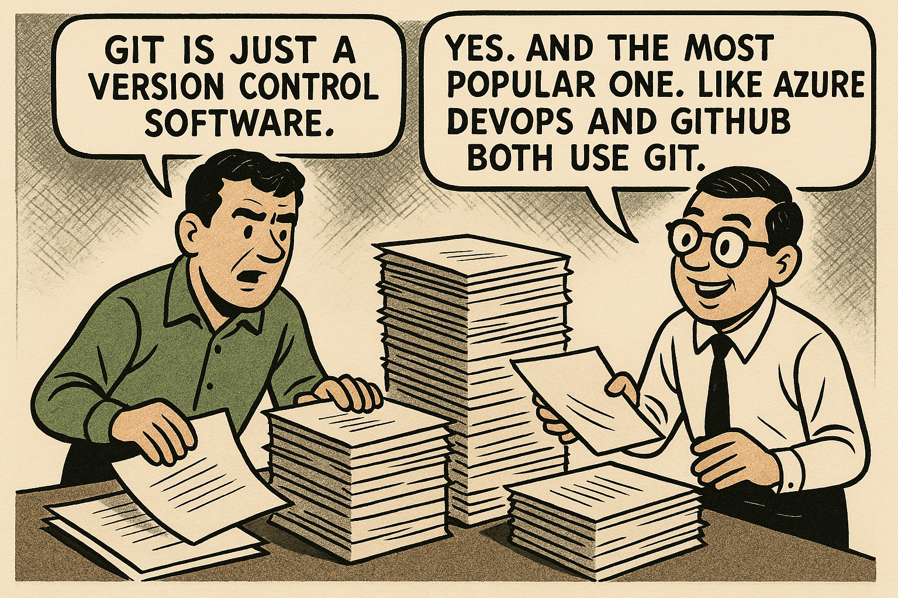
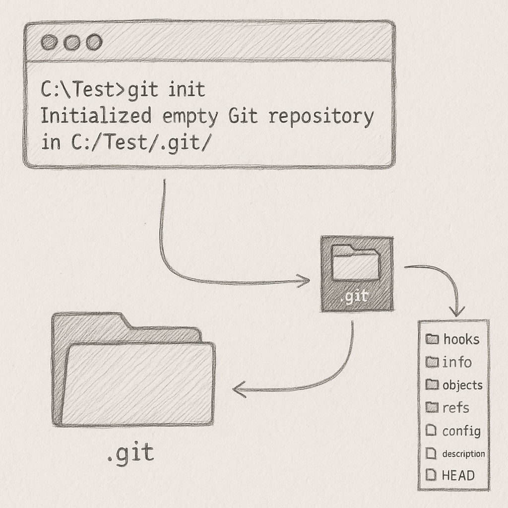
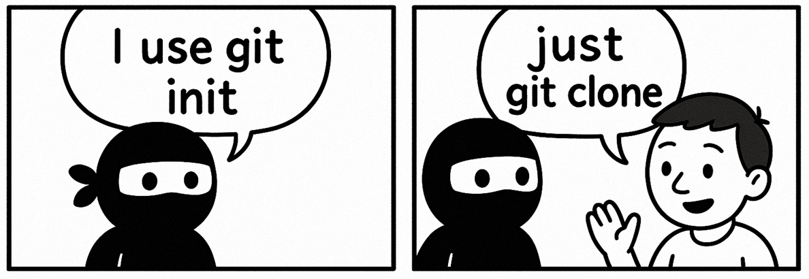
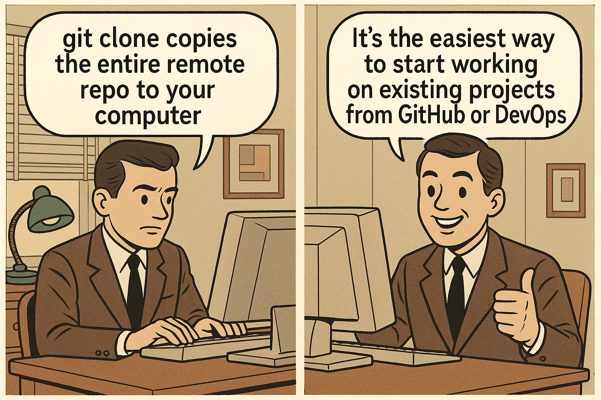
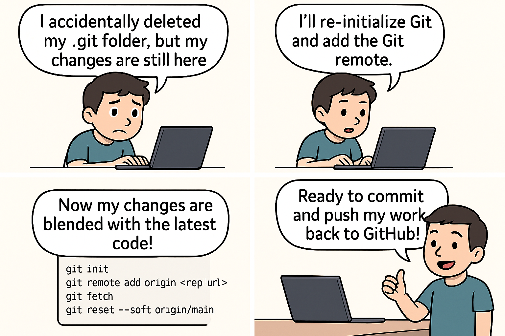

# Getting started with git
Every project needs a version control. Git is simply a version control software. There are other version control software like Mercurial, Subversion, Visual Source Safe, etc. But git is the most popular one. It is free and open source. And if you use GitHub, or GitLab, or BitBucket or Azure DevOps, you are using git already.

{style="display: block; margin: 0 auto;" width="500px" }

## git is distributed
Git is a distributed version control system. This means that every developer has a complete copy of the repository on their local machine. This allows developers to work offline, commit changes, and then push those changes to the remote repository when they are ready.
## git init

The first thing you do to use git is to install the git software. CD to the root folder of your project and then run `git init` . This will create a hidden .git folder inside the root folder of your project. This `.git` folder is the `git repository`. It is the central database/vault that git uses to track all git activities

{style="display: block; margin: 0 auto;" width="500px" }

But, wait, do we use `git init` nowadays? No, in real-world we dont. `git clone` does it all - sets up .git folder, remote origin, copies files, everything. But, for that coding ninja who want to do it all by hand, he will first run `git init`, then git remote add origin <remote-repo-url> to set up the remote origin, then `git pull` to pull the latest changes from the remote repo, and finally `git push` to push the changes to the remote repo.

{style="display: block; margin: 0 auto;" width="500px" }

## The .git folder

The `.git` folder is the central vault of git. Everything related to git is stored in this one folder. There is nothing outside it. It is a hidden folder.

## git clone

A super popular command every developer uses at the start of a project is `git clone <some-url>`. On a very high level, it just `clones(copies)` the files from the remote repository to your local folder.

{style="display: block; margin: 0 auto;" width="500px" }

### What happens when you run `git clone <some-url>`?

When you run `git clone <some-url>`, it does the following things:

1. First it creates an empty folder in your current directory with the same name as the remote repository. For example, if you run `git clone https://github.com/france/paris.git`, it will create a folder called `paris` in your current directory.
2. Inside this new directory, Git initializes a fresh .git folder. 
3. Then it extracts all the latest source code files from the `.git` folder into the empty folder.
4. Git downloads all the repository’s data (commits, branches, tags, and history) from the remote server and stores it inside your new local .git folder.
5. Git checks out the default branch (usually main or master) and unpacks the latest files from that branch into your working directory.

??? info "How does git know which is the default branch?"
    Git uses the remote repository's HEAD reference to determine the default branch. When you clone a repository, Git fetches the HEAD reference from the remote server, which points to the default branch. This is usually set to `main` or `master`, but it can be configured differently in the remote repository settings. If you want to check out a different branch, you can do it by using the --branch option in the git clone command, like this: `git clone -b <branch-name> <some-url>`.

!!! note

    The remote server does not send you a pre-made .git folder; it sends the repository data, and Git builds the .git folder on your machine.

??? info "What if you dont want to use the clone command?"
    - First you need to run `git init` in your project folder. 
    - Then you need to run `git remote add origin <remote-repo-url>` to add the remote repository as "origin". 
    - Then you need to `git fetch origin` to fetch the latest changes from the remote repository. 
    - Finally, you can run `git checkout main` to check out the default branch. 
    - But, wait, you also need to run` git branch --track <branch-name> origin/<branch-name>` for **each** branch you want to track. 

## Some dumb questions

- What if I run `git init` in my project again?

    Just git init again? No url?

- What if I delete the `.git` folder?

    Nothing will happen to your project files. They will be untouched. But, that .git folder is the central database for all things git. Hence, you will lose all your git history, commits, branches, and everything related to git. Your project will no longer be a git repository. You were most centernaly connected to either Github. You will need to do some workarounds to get everything back to normal. 

    {style="display: block; margin: 0 auto;" width="500px" }