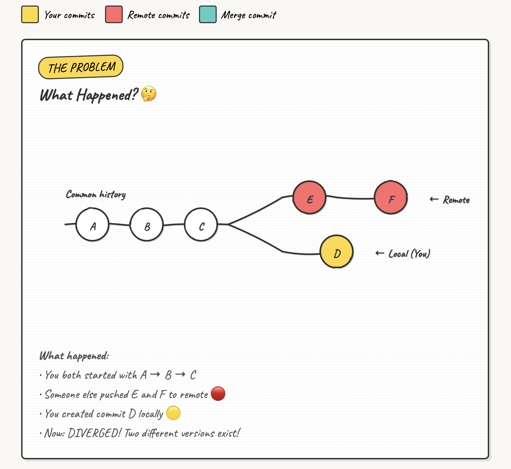
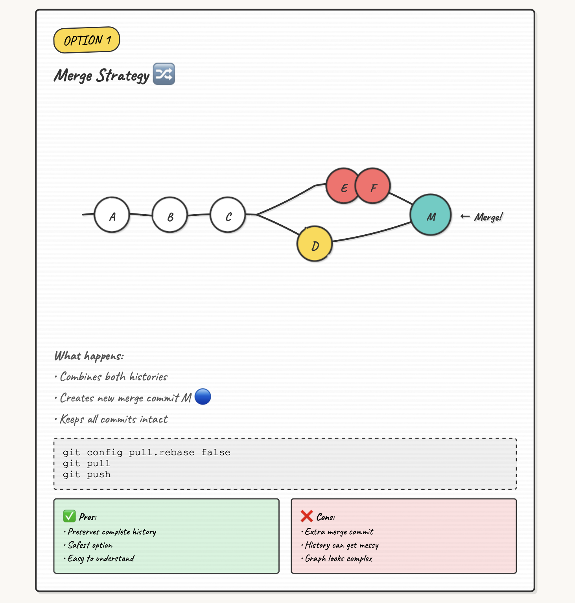
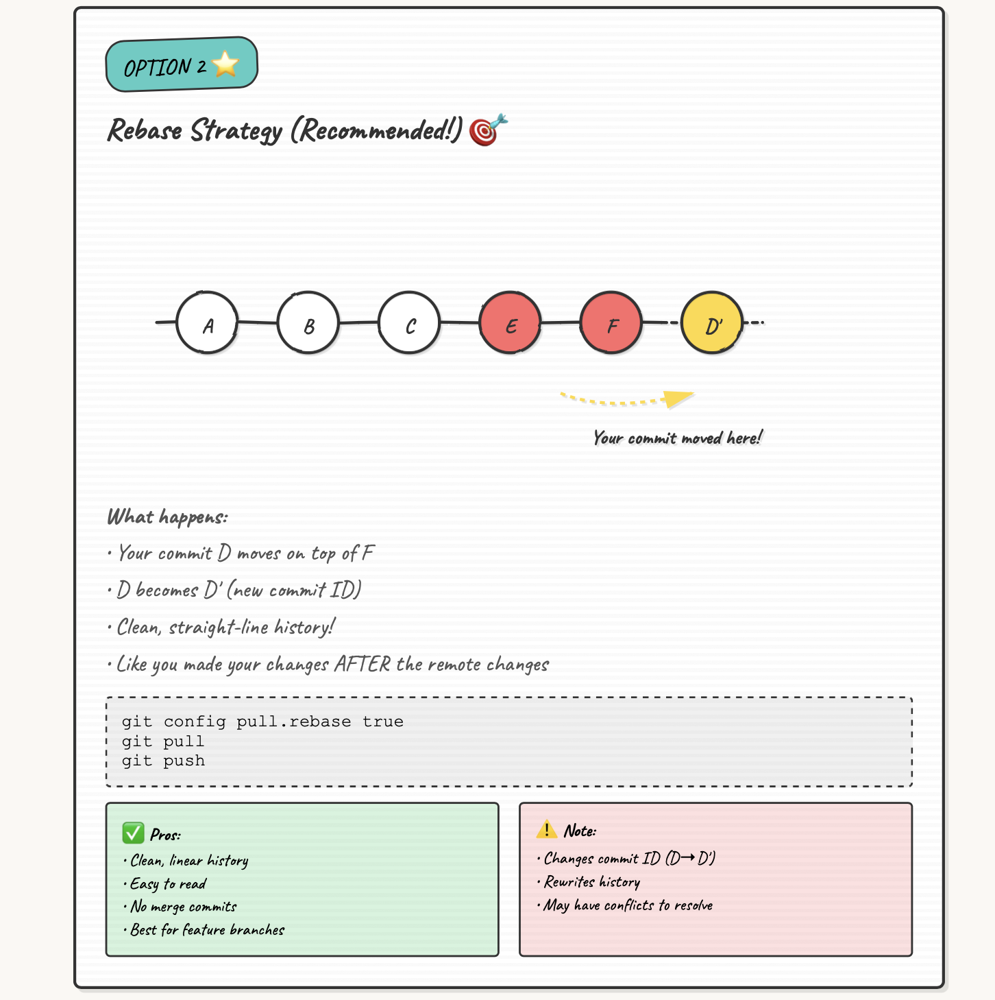
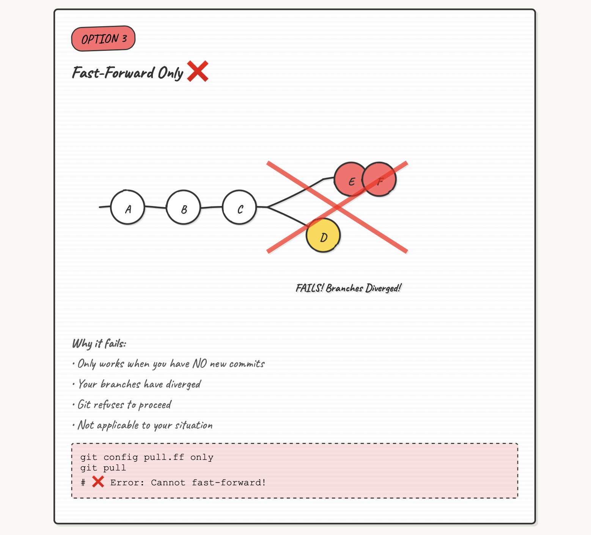

# Git Rebase: Handling Divergent Branches

When you try to push changes and Git says your branch has diverged, it's protecting you from losing work. Let's understand why this happens and how to fix it cleanly.

## The Problem

You're working on a feature branch, make some commits, and try to push. Suddenly:

```bash
$ git push
To https://github.com/dwdas9/home.git
 ! [rejected]        feature/25.10.25 -> feature/25.10.25 (fetch first)
error: failed to push some refs to 'https://github.com/dwdas9/home.git'
```

!!! warning "Push Rejected"
    Git is telling you: "The remote has changes you don't have locally. Pull first!"

So you run `git pull`, but instead of fixing things, you get another error:

```bash
$ git pull
fatal: Need to specify how to reconcile divergent branches.
```

!!! question "What Git is Really Asking"
    "Your local and remote branches have diverged. How do you want to combine them?"
    
    - `git config pull.rebase false` → **merge** (create a merge commit)
    - `git config pull.rebase true` → **rebase** (replay your commits on top)
    - `git config pull.ff only` → **fast-forward only** (only works if you haven't committed)

This guide will help you choose the right strategy.

---

## Understanding Divergent Branches

Think of it like two editors working on the same document simultaneously. Eventually, you need to reconcile the changes.



??? info "Breaking Down the Diagram"
    - **Commits A, B, C**: Shared history between local and remote
    - **Commit C**: Where the branches diverged (common ancestor)
    - **Commits E, F** (red): Changes pushed to remote while you worked locally
    - **Commit D** (yellow): Your local commit that hasn't been pushed

    Git doesn't know which version is "correct"—both have valid work!

### Common Causes

=== "Multiple Developers"
    You and a teammate both work on `feature/auth`. They push first. When you try to push, your branches have diverged.

=== "Multiple Machines"
    You push from your work laptop, then commit from home (forgetting to pull first). Divergence!

=== "CI/CD Automation"
    Your pipeline makes automated commits (version bumps, lockfiles) while you're coding locally.

=== "Force Push"
    Someone force-pushed to the branch, rewriting history. Your local branch is now out of sync.

---

## Three Solutions

Git offers three ways to reconcile divergent branches. Let's explore when to use each.

### 1. Merge Strategy



Creates a new "merge commit" with two parents, preserving both histories.

!!! example "When to Use Merge"
    **Best for:** Main/shared branches where you want full transparency
    
    **Example:** Working on `main` with your team. You want to see exactly when features were integrated.
    
    ```bash
    git config pull.rebase false
    git pull  # Creates a merge commit
    git push
    ```

??? tip "Merge Advantages"
    - Preserves complete history
    - Shows when branches were integrated
    - Non-destructive (doesn't rewrite history)
    - Good for collaborative branches

---

### 2. Rebase Strategy ⭐ Recommended



Replays your commits on top of the latest remote commits, creating a linear history.

!!! success "When to Use Rebase"
    **Best for:** Feature branches where you're the primary developer
    
    **Example:** Working solo on `feature/login`. You want clean, linear history.
    
    ```bash
    git config pull.rebase true
    git pull  # Replays your commits on top
    git push
    ```

??? tip "Rebase Advantages"
    - Clean, linear history
    - Easier to understand commit flow
    - No extra merge commits cluttering history
    - Perfect for feature branches

!!! warning "Golden Rule of Rebase"
    Never rebase commits that you've already pushed to a shared branch where others might have based work on them. Only rebase local commits or personal feature branches.

---

### 3. Fast-Forward Only



Only updates if your local branch is simply "behind" (no local commits).

!!! note "When to Use Fast-Forward"
    **Best for:** When you want to be extra cautious and avoid automatic merges
    
    **Example:** You cloned a repo and haven't made changes. Just want to update.
    
    ```bash
    git config pull.ff only
    git pull  # Works only if you haven't committed locally
    ```

??? warning "Why It Often Fails"
    Fast-forward only works when:
    
    - Remote has new commits
    - You have NO new local commits
    
    In our divergent branch scenario, you HAVE local commits (Commit D), so this fails with:
    ```
    fatal: Not possible to fast-forward, aborting.
    ```

---

## Solving the Problem: Step-by-Step

Let's fix the divergent branch issue from our example.

### Quick Solution (Feature Branch)

For a personal feature branch, rebase is cleanest:

```bash
# 1. Set rebase as the strategy
git config pull.rebase true

# 2. Pull with rebase
git pull

# 3. Push your changes
git push
```

!!! success "Done!"
    Your commits are now replayed on top of the remote changes. Clean, linear history!

### Handling Merge Conflicts

Sometimes your changes and remote changes touch the same lines:

```bash
$ git pull
Auto-merging myfile.py
CONFLICT (content): Merge conflict in myfile.py
error: could not apply 396de08... changes
Resolve all conflicts manually, mark them as resolved with
"git add/rm <conflicted_files>", then run "git rebase --continue".
```

??? example "Conflict Resolution Steps"
    **1. Open the conflicting file(s)**
    
    Git marks conflicts with special markers:
    ```python
    <<<<<<< HEAD
    # Remote version (what's on GitHub)
    print("Hello from remote")
    =======
    # Your version (your local commit)
    print("Hello from local")
    >>>>>>> 396de08 (changes)
    ```
    
    **2. Edit to resolve the conflict**
    ```python
    # Resolved version - keep what you need
    print("Hello from both versions")
    ```
    
    **3. Stage the resolved file**
    ```bash
    git add myfile.py
    ```
    
    **4. Continue the rebase**
    ```bash
    git rebase --continue
    ```
    
    **5. Push your changes**
    ```bash
    git push
    ```

!!! danger "Need to Abort?"
    If things go wrong during conflict resolution:
    ```bash
    git rebase --abort  # Returns to state before rebase
    ```

---

## Best Practices

Minimize divergent branches with these habits:

### Always Pull Before Pushing

```bash
# Make it a habit
git pull
git push
```

### Set a Default Strategy

Choose your preferred method globally:

=== "Rebase (Recommended)"
    ```bash
    git config --global pull.rebase true
    ```

=== "Merge"
    ```bash
    git config --global pull.rebase false
    ```

=== "Fast-Forward Only"
    ```bash
    git config --global pull.ff only
    ```

### Additional Tips

!!! tip "Team Coordination"
    - Communicate when working on the same branch
    - Use separate feature branches per developer
    - Consider branch protection rules

!!! tip "Commit Frequently"
    - Don't let your local branch get too far ahead
    - Smaller, frequent pushes reduce conflict chances
    - Push daily (or more often)

!!! tip "Use Pull Requests"
    For main/shared branches, use PRs instead of direct pushes. This prevents accidental divergence.

---

## Quick Reference

| Strategy | Command | Best For | Result |
|----------|---------|----------|--------|
| **Rebase** | `git pull --rebase` | Feature branches, solo work | Linear history |
| **Merge** | `git pull --no-rebase` | Shared branches, teams | Preserves full history |
| **FF Only** | `git pull --ff-only` | Safe updates, no local commits | Simple updates only |

??? info "Common Commands"
    ```bash
    # Set default strategy
    git config pull.rebase true   # or false, or ff-only
    
    # Pull with specific strategy (one-time)
    git pull --rebase
    git pull --no-rebase
    git pull --ff-only
    
    # During conflict resolution
    git rebase --continue   # After resolving conflicts
    git rebase --abort      # Undo the rebase
    git rebase --skip       # Skip current commit
    
    # View branch status
    git status
    git log --oneline --graph --all
    ```

---

## Key Takeaways

!!! success "Remember"
    - **Divergent branches are normal**—they happen when local and remote histories differ
    - **Three solutions**: Merge, Rebase, or Fast-Forward (when possible)
    - **For feature branches**: Use rebase for clean, linear history
    - **For shared branches**: Use merge to preserve complete history
    - **Always pull before pushing** to minimize divergence

!!! example "Real-World Solution"
    For the scenario we started with:
    ```bash
    git config pull.rebase true
    git pull
    git push
    ```
    Clean history maintained, changes successfully pushed!

---

## Learn More

- [Git Documentation: Rebasing](https://git-scm.com/book/en/v2/Git-Branching-Rebasing)
- [Atlassian: Merging vs Rebasing](https://www.atlassian.com/git/tutorials/merging-vs-rebasing)
- [GitHub: Resolving Merge Conflicts](https://docs.github.com/en/pull-requests/collaborating-with-pull-requests/addressing-merge-conflicts)