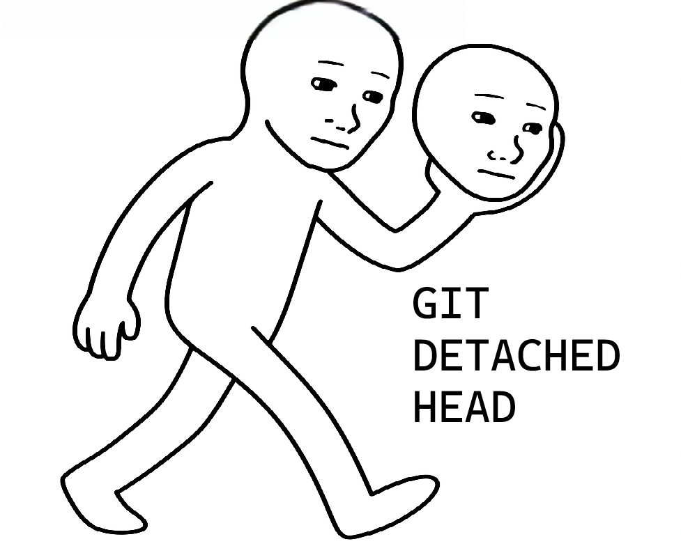
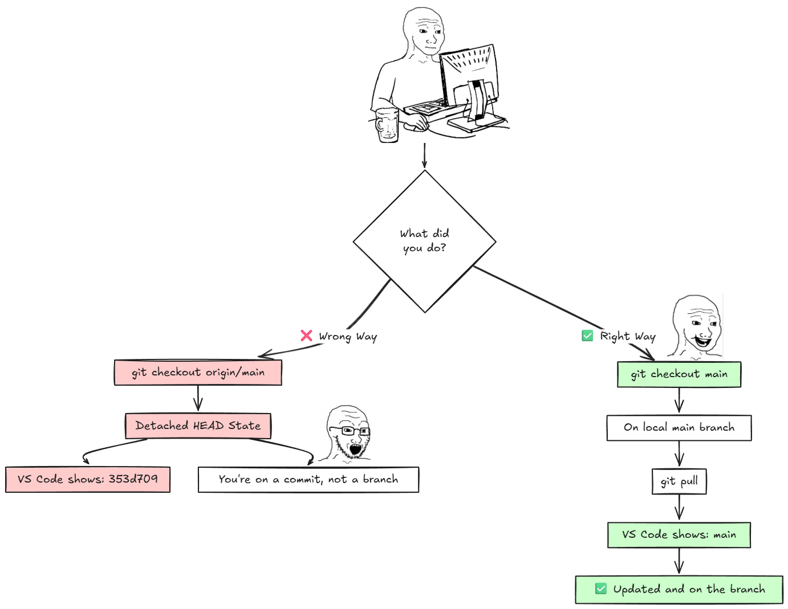

# Git Detached HEAD: Why VS Code Shows a Commit Hash Instead of Branch Name

!!! question "The Problem"
    You run `git checkout origin/main` expecting VS Code to show "main" at the bottom left, but instead it shows something like `353d709`. What's going on?



## What's Happening

!!! warning "Detached HEAD State"
    You're in a **detached HEAD state**. Here's what happened:
    
    - `origin/main` is a reference to the remote branch, not your local branch
    - When you checkout `origin/main`, you're literally sitting on a commit, not on a branch
    - VS Code is being honest—you're not on any branch, you're on commit `353d709`
    - Git even warns you: "You are in 'detached HEAD' state"

!!! tip "Think of it this way"
    `origin/main` is like a bookmark to where the remote branch is. You're checking out the bookmark, not the actual branch.

## The Solution

!!! success "Simple Fix"
    Stop checking out `origin/main`. Check out your local `main` branch instead:

    ```bash
    git checkout main
    git pull
    ```

    That's it. Now VS Code will show "main" because you're actually on the main branch.



??? example "Quick Fix Commands"
    If you're already in detached HEAD state:

    ```bash
    # Just switch to your local main branch
    git checkout main

    # Then pull if needed
    git pull
    ```

??? info "Don't Have a Local Main Branch?"
    If `git checkout main` gives you an error, create it:

    ```bash
    git checkout -b main origin/main
    ```

    This creates a local `main` branch that tracks `origin/main`.

!!! note "The Bottom Line"
    **Always checkout local branches (`main`), never remote references (`origin/main`)** unless you specifically want to inspect that commit without being on a branch.