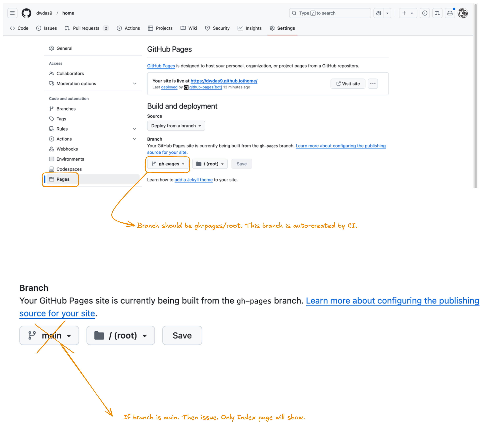

# Background

In this guide, I will show you how to create and deploy an MkDocs site on GitHub. To get started, follow these steps:

1. **Create a GitHub Repository**  
   First, create a GitHub repository for your project. Once the repository is set up, clone it to your local environment and open it in VS Code.

2. **Create a Python Virtual Environment**  
   Open the terminal and navigate to the parent folder of your repository. Then, create a Python virtual environment using the following command:

   ```bash
   python -m venv venvmac
   source venvmac/bin/activate  # For Linux or macOS
   ```

3. **Install MkDocs and Dependencies**  
   Next, install MkDocs and additional dependencies. You can do this either by using a `requirements.txt` file or by running the following command directly:

   ```bash
   pip install --no-cache-dir mkdocs-material pymdown-extensions mkdocs-glightbox
   ```

   **Note:** The `mkdocs-material` is the main library, while the other libraries are additional extensions.

4. **Create the MkDocs Site**  
   To create a new site, run:

   ```bash
   mkdocs new .
   ```

   This will generate a folder structure like this:

   ```
   .
   ├─ docs/
   │  └─ index.md
   └─ mkdocs.yml
   ```

5. **Configure `mkdocs.yml`**  
   Open the `mkdocs.yml` file and add the following minimal configuration:

   ```yaml
   site_name: My site
   site_url: https://mydomain.org/mysite
   theme:
     name: material
   ```

6. **Add Content**  
   Add some Markdown pages inside the `docs` folder.

7. **Build and Serve Locally**  
   To check the site locally, run:

   ```bash
   mkdocs build
   mkdocs serve
   ```

   This should open the site in your browser for preview.

## Host on GitHub Pages

Now, let’s automate the deployment of your MkDocs site using GitHub Actions. At the root of your repository, create a new GitHub Actions workflow (e.g., `.github/workflows/ci.yml`) and paste the following contents:

### Create the Folder Structure

```yml
name: ci
on:
  push:
    branches:
      - master
      - main
permissions:
  contents: write
jobs:
  deploy:
    runs-on: ubuntu-latest
    steps:
      - uses: actions/checkout@v4
      - name: Configure Git Credentials
        run: |
          git config user.name github-actions[bot]
          git config user.email 41898282+github-actions[bot]@users.noreply.github.com
      - uses: actions/setup-python@v5
        with:
          python-version: 3.x
      - run: echo "cache_id=$(date --utc '+%V')" >> $GITHUB_ENV
      - uses: actions/cache@v4
        with:
          key: mkdocs-material-${{ env.cache_id }}
          path: .cache
          restore-keys: |
            mkdocs-material-
      - run: pip install mkdocs-material mkdocs-glightbox
      - run: mkdocs gh-deploy --force
```

Now, whenever a new commit is pushed to the `master` or `main` branches, the static site is automatically built and deployed. Push your changes to see the workflow in action.

### Important:
If the GitHub Page doesn’t show up after a few minutes, go to your repository’s settings and ensure that the publishing source branch is set to `gh-pages`.

Your documentation should appear at:  
`https://<username>.github.io/<repository>`

## MkDocs Issues

### GitHub Pages & gh-pages Branch Troubleshooting

**Issue:** Only the index page shows, and navigation is missing.

**Cause:** The `gh-pages` branch is not set as the source in GitHub Pages settings.



### What is `gh-pages`?
The `gh-pages` branch is used to serve static website content. With MkDocs and GitHub Actions:
1. Documentation is built from the `main` branch.
2. The `gh-pages` branch is updated with the built site.
3. The site is deployed to GitHub Pages.

### Key Points:
1. Never modify the `gh-pages` branch directly.
2. Let GitHub Actions handle deployment.
3. The deployment process is managed by the workflow in `ci.yml`.

### GitHub Pages Settings

#### Initial Setup Issue:
Selecting `main/(root)` won’t work with MkDocs Material.

#### Correct Configuration:
1. Go to **Settings → Pages**.
2. Set:
   - **Source:** "Deploy from a branch"
   - **Branch:** `gh-pages`
   - **Folder:** `/(root)`

### How It Works

#### Source Content (from `main` branch):
```plaintext
main/
├── docs/           # Markdown files
├── mkdocs.yml      # MkDocs configuration
└── .github/        # GitHub Actions workflow
```

#### Built Site (in `gh-pages` branch):
```plaintext
gh-pages/
├── index.html      # HTML files
├── assets/         # CSS, JS, images
└── ...             # Other static files
```

### Troubleshooting Steps

1. **Change GitHub Pages Settings:**

   Go to:  
   **Settings → Pages → Branch: `gh-pages/(root)`**

2. **Trigger a New Build:**

   Use the following command to trigger a rebuild:

   ```bash
   git commit --allow-empty -m "Trigger rebuild"
   git push origin main
   ```

3. **Verify Deployment:**
   - Check the **Actions** tab in GitHub.
   - Wait for the "GitHub Pages deployment" check to complete.
   - Visit your site at: `https://<username>.github.io/<repository>/`

## Best Practices

- Keep source content in the `main` branch.
- Let GitHub Actions manage the `gh-pages` branch.
- Never modify the `gh-pages` branch directly.
- Check workflow logs if the site doesn’t update.

Deployment is handled by the following command:

```yaml
- name: Build and Deploy
  run: |
     mkdocs build
     mkdocs gh-deploy --force
```

--- 
