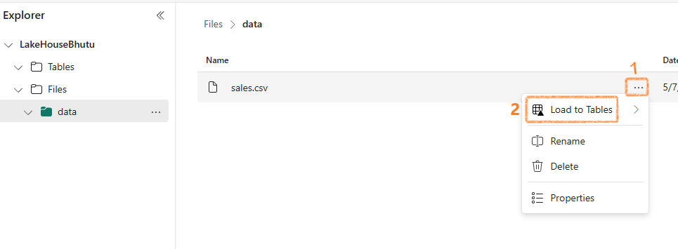
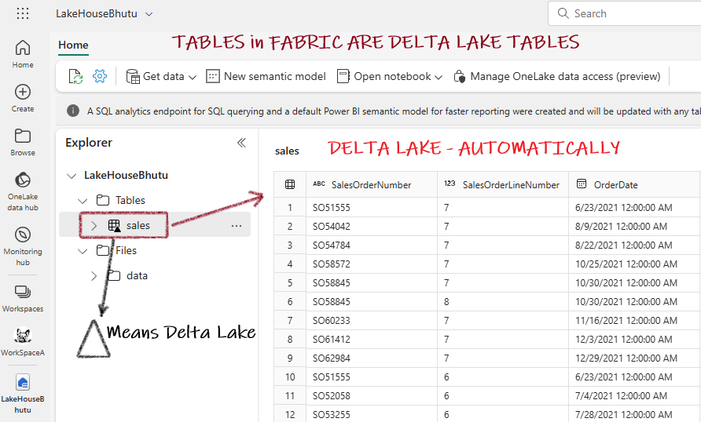

# Getting Started with Microsoft Fabric

## What is Microsoft Fabric?


Microsoft Fabric is a one-stop, low-to-no-code analytics platform that brings together various data tools under a single environment.

!!! info "Core Components"
    * **OneLake** - Central data storage
    * **Data Engineering** - Apache Spark & notebook experiences
    * **Data Factory** - Data pipeline experiences
    * **Data Science** - Machine learning experiences
    * **Real-time Analytics** - Streaming & real-time analytics
    * **Power BI** - Business intelligence & reporting

## Understanding OneLake


OneLake is the foundation of Microsoft Fabric's data storage system.

| OneLake Feature | Description |
| :-------------- | :---------- |
| Default allocation | Each fabric tenant receives one OneLake instance by default |
| Storage concept | Similar to OneDrive but for data (built on Azure Data Lake Storage) |
| Data handling | Import data directly or create shortcuts to external data |
| Default format | Delta Lake format |

## Lakehouse Fundamentals

Lakehouse combines the best of Data Lakes and Data Warehouses.


A Lakehouse provides:

- Flexibility of storing raw data like a data lake
- Structure and performance of a data warehouse
- SQL querying capabilities on lake data

### Pre-requisites for a Lakehouse

Before creating a lakehouse, you need to create a workspace in the Microsoft Fabric platform.

When you create a lakehouse in the Data Engineering workload, three items are produced:

1. **Lakehouse**: Storage and metadata where you interact with files, folders, and table data
2. **Semantic model**: Automatically created data model based on tables
3. **SQL Endpoint**: Read-only endpoint for Transact-SQL queries


You can interact with the data in two modes:

1. **Lakehouse mode**: Add and interact with tables, files, and folders
2. **SQL analytics endpoint**: Query tables using SQL and manage data models


### Shortcuts in Lakehouse

Shortcuts let you integrate external data into your lakehouse without moving it.

!!! tip "About Shortcuts"
    * Appear as folders in the lake
    * Available in both lakehouses and KQL databases
    * Accessible via Spark, SQL, Real-Time Analytics, and Analysis Services
    * Source data permissions and credentials managed by OneLake

### Data Ingestion Methods

There are multiple ways to get data into your lakehouse:

=== "Upload"
    Upload local files or folders and load results into tables

=== "Dataflows (Gen2)"
    Import and transform data from various sources using Power Query Online

=== "Notebooks"
    Use notebooks to ingest, transform, and load data

=== "Data Factory pipelines"
    Copy data and orchestrate processing activities

### Data Transformation Methods

Choose from various transformation methods:

* **Apache Spark**: PySpark, SparkSQL, Notebooks, Spark job definitions
* **SQL analytic endpoint**: Transact SQL
* **Dataflows (Gen2)**: Power Query
* **Data pipelines**: Orchestrated data flows

### Visualization

Create end-to-end solutions using Power BI and Fabric Lakehouse.

## Creating a Fabric Lakehouse

### Create a Lakehouse Workspace

1. Go to [https://app.fabric.microsoft.com](https://app.fabric.microsoft.com)
2. Select **Synapse Data Engineering**


### Create a Lakehouse

1. Click on **Create** then **Lakehouse**
2. Give your Lakehouse a name


3. Fabric will create everything automatically


### Upload a Sample File

1. Download the sample CSV file from [https://raw.githubusercontent.com/MicrosoftLearning/dp-data/main/sales.csv](https://raw.githubusercontent.com/MicrosoftLearning/dp-data/main/sales.csv)


2. Go to **Explorer**, create a **Data** subfolder under **Files**, then upload the CSV


### Load Data into a Table

To use SQL with your data, import it into a table:

1. Click on the ellipsis (...) next to the CSV file
2. Select **Load to Tables**



Once loaded, you can see your table in tabular format:


### Query Data Using SQL

#### Standard SQL Query


#### Visual Query


### Create a Power BI Report

1. At the bottom of the SQL Endpoint page, click the **Model** tab
2. Navigate to the **Reporting** tab and select **New report**


3. In the Data pane, expand the **sales** table and select **Item** and **Quantity**
4. Hide the **Data** and **Filters** panes to create more space
5. Change the visualization to a **Clustered bar chart** and resize it
6. Save the report as **Item Sales Report**


7. Verify that your workspace contains:
   * Your lakehouse
   * SQL analytics endpoint
   * Default semantic model
   * Item Sales Report

### Connect External Data Using Shortcuts

If you want to leave data external but access it from Fabric:

1. Create shortcuts to external data sources like Dataverse
2. The data appears as a folder in your Lakehouse

!!! warning
    The region of Dataverse and Fabric should be the same.


## Apache Spark in Microsoft Fabric

Spark **divides and conquers** large data processing jobs across multiple computers.

!!! note "Key Points"
    * Each Fabric workspace gets one Spark cluster
    * PySpark and SparkSQL are the most commonly used languages
    * SparkContext handles the job splitting and distribution

### Running a Spark Notebook


### Running PySpark Code in a Notebook

Spark sessions are pre-created in Fabric notebooks. Just create dataframes and start coding!


### Creating a Spark Job Definition

1. **Access the Spark Job Definition page**

   

2. **Create a PySpark job definition**
   
   Develop a main definition file named `anyname.py`:

   ```python
   from pyspark.sql import SparkSession

   # This code executes only when the .py file is run directly.
   if __name__ == "__main__":
       # Initialize a Spark session specifically for this job.
       spark = SparkSession.builder.appName("Sales Aggregation").getOrCreate()
       # Read data from a CSV file into a DataFrame.
       df = spark.read.csv('Files/data/sales.csv', header=True, inferSchema=True)
       # Write the DataFrame to a Delta table, overwriting existing data.
       df.write.mode('overwrite').format('delta').save('Files/data/delta')
   ```

3. **Upload and schedule the file**

   

## Delta Lake in Microsoft Fabric

Delta Lake provides a SQL interface over data lakes. In Fabric, any table imported from CSV/Excel automatically becomes a Delta Lake table.



For these tables, you'll find:
* `.parquet` files
* `_delta_log` folders


This automatic conversion to Delta format is a significant advantage - there's no need to convert files separately.

## Delta Lake Tables

### Using DataFrame Write Methods

#### Managed Table
```python
df.write.format("delta").saveAsTable("tableName")
```

#### External Table
```python
df.write.format("delta").saveAsTable("tableName", path="Files/folderX")
```

### Using DeltaTableBuilder API

```python
from delta.tables import *

DeltaTable.create(spark) \
  .tableName("Planet") \
  .addColumn("Size", "INT") \
  .addColumn("Name", "STRING") \
  .execute()
```

### Using Spark SQL

#### Create Managed Table
```sql
CREATE TABLE salesorders
(
    Orderid INT NOT NULL,
    OrderDate TIMESTAMP NOT NULL,
    CustomerName STRING,
    SalesTotal FLOAT NOT NULL
)
USING DELTA;
```

#### Create External Table
```sql
CREATE TABLE MyExternalTable
USING DELTA
LOCATION 'Files/mydata';
```

#### Insert Rows
```python
spark.sql("INSERT INTO products VALUES (1, 'Widget', 'Accessories', 2.99)")
```

#### Using SQL Magic
```sql
%%sql

UPDATE products
SET Price = 2.6 WHERE ProductId = 1;
```

### Working with Delta Files

You can save dataframes directly as Delta format without creating a table:

```python
df.write.format("delta").mode("overwrite").save("Folder/Path")
```

After running this code, you'll see:
1. Parquet files
2. `_delta_log` subfolder

Later, you can create a DeltaTable from the folder:

```python
from delta.tables import *
from pyspark.sql.functions import *

# Create a DeltaTable object
delta_path = "Files/mytable"
deltaTable = DeltaTable.forPath(spark, delta_path)

# Update the table
deltaTable.update(
    condition = "Category == 'Accessories'",
    set = { "Price": "Price * 0.9" })
```

### Time Travel

View all transactions to a table:

```sql
%%sql
DESCRIBE HISTORY products
```

Access a specific version:

```python
df = spark.read.format("delta").option("versionAsOf", 0).load(delta_path)
```

Access data as of a specific date:

```python
df = spark.read.format("delta").option("timestampAsOf", '2022-01-01').load(delta_path)
```

## Delta Lake - Spark Streaming

### Using a Delta Table as a Streaming Source

```python
from pyspark.sql.types import *
from pyspark.sql.functions import *

# Load a streaming dataframe from the Delta Table
stream_df = spark.readStream.format("delta") \
    .option("ignoreChanges", "true") \
    .load("Files/delta/internetorders")

# Process the streaming data
stream_df.show()
```

### Using a Delta Table as a Streaming Sink

```python
from pyspark.sql.types import *
from pyspark.sql.functions import *

# Create a stream that reads JSON data from a folder
inputPath = 'Files/streamingdata/'
jsonSchema = StructType([
    StructField("device", StringType(), False),
    StructField("status", StringType(), False)
])
stream_df = spark.readStream.schema(jsonSchema).option("maxFilesPerTrigger", 1).json(inputPath)

# Write the stream to a delta table
table_path = 'Files/delta/devicetable'
checkpoint_path = 'Files/delta/checkpoint'
delta_stream = stream_df.writeStream.format("delta").option("checkpointLocation", checkpoint_path).start(table_path)
```

Stop the stream when finished:

```python
delta_stream.stop()
```