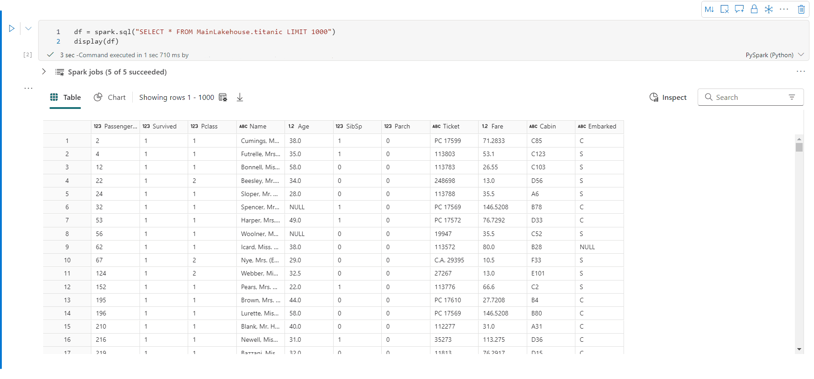
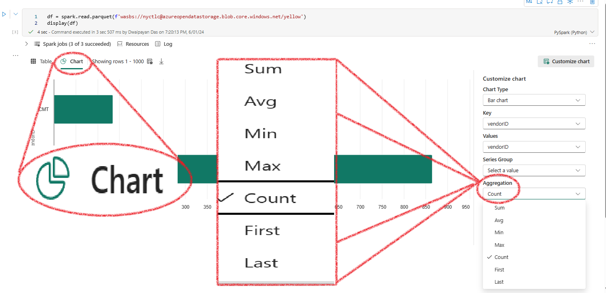
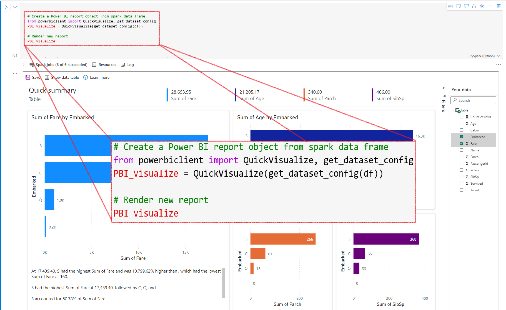
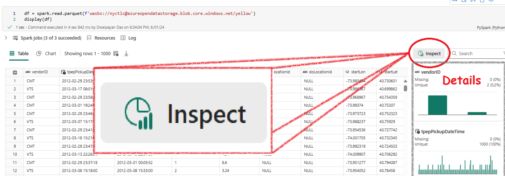

- [Whats in your df? Find out quick.](#whats-in-your-df-find-out-quick)
  - [Firs step - Use the `display()` Function](#firs-step---use-the-display-function)
    - [Table View](#table-view)
    - [Chart View](#chart-view)
    - [Creating a Power BI Report](#creating-a-power-bi-report)
  - [Microsoft Fabric DP-600 question](#microsoft-fabric-dp-600-question)
  - [Reference](#reference)


# <span style="color: CadetBlue; font-family: Segoe UI, sans-serif;">Whats in your df? Find out quick.</span>

When working with a dataframe, you often need to understand its structure, statistics, and null values - essentially, you want to 'profile' the dataset. Here's how you can do it quickly in Fabric notebook.

## <span style="color: Purple; font-family: Segoe UI, sans-serif;">Firs step - Use the `display()` Function

The first step is to use the `display()` function. This will produce a rich table and chart view, displaying it directly in the output.

```python
display(df)
```
Once you have displayed your df using df(). You can use the **Table view** **Chart view** and **Inspect(Table view)** option. Lets explore them one by one.

### <span style="color: Maroon; font-family: Segoe UI, sans-serif;">Table View

The table view allows you to view the data in a tabular format. Follow these steps to inspect your dataframe:

1. **View the Data:** The data is displayed in a table format.
2. **Click on the `Inspect` Button:** This is a powerful tool for a detailed inspection of your dataframe.


3. **Explore Further:** Use the `Inspect` button to delve deeper into your dataframe.



### <span style="color: Chocolate; font-family: Segoe UI, sans-serif;">Chart View

The chart view provides a visual representation of your data. Here's how to get started:

1. **Switch to Chart View:** Click on the chart view icon.
2. **Automatic Key-Value Pair:** Fabric will automatically generate a key-value pair to get you started.
3. **Aggregate Data:** You can then aggregate and analyze the data as needed.



### <span style="color: BlueViolet; font-family: Segoe UI, sans-serif;">Creating a Power BI Report

You can also create a real-time Power BI report using your dataframe with the following code:

```python
# Create a Power BI report object from spark dataframe
from powerbiclient import QuickVisualize, get_dataset_config
PBI_visualize = QuickVisualize(get_dataset_config(df))

# Render new report
PBI_visualize
```



## <span style="color: CornflowerBlue; font-family: Segoe UI, sans-serif;">Microsoft Fabric DP-600 question

In your fabric Notebook you have a dataframe. You want to profile the dataframe - want to find the the columns, which columsn are empty etc etc.

What would the easiest way to do it?

**Options:**

- Create a pandas DataFrame first, and then visualize the data in an embedded Microsoft Power BI report by running QuickVisualize method on the pandas DataFrame.
- Display the DataFrame by running display(df), and then clicking the Inspect button.
- Display the DataDrame by running display(df), and then switching to chart view.
- Visualize the data in an embedded Microsoft Power BI report by running the QuickVisualize method on the DataFrame.

**Answer:** Use the **Inspect**(Table view) option



## <span style="color: CadetBlue; font-family: Segoe UI, sans-serif;">Reference

[Microsoft Reference](https://learn.microsoft.com/en-us/fabric/data-engineering/notebook-visualization)