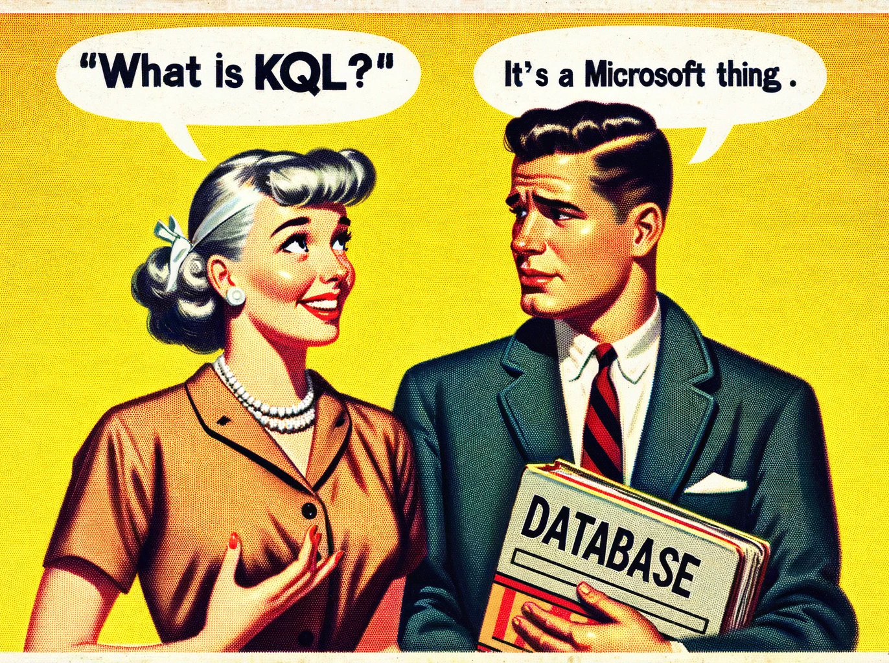
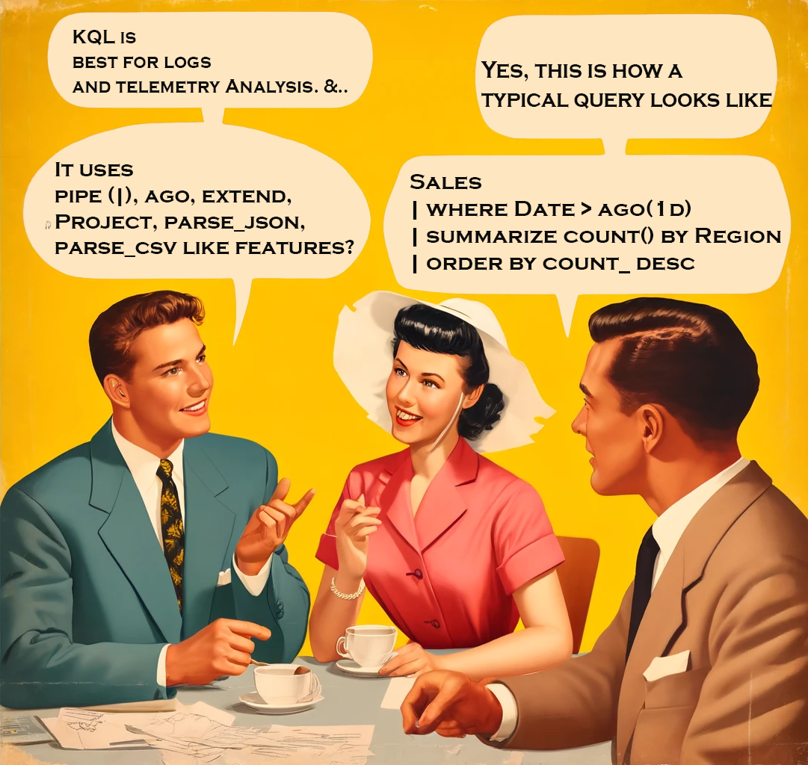

- [What is KQL?](#what-is-kql)
  - [How to run KQL query in Fabric?](#how-to-run-kql-query-in-fabric)
  - [KQL vs SQL Databases](#kql-vs-sql-databases)
  - [KQL Vs SQL Query](#kql-vs-sql-query)
    - [KQL vs SQL - DQL](#kql-vs-sql---dql)
    - [KQL Vs SQL - DDLs, DMLs \& DQLs](#kql-vs-sql---ddls-dmls--dqls)
- [KQL Q\&A](#kql-qa)
- [KQL Questions - Keywords](#kql-questions---keywords)
- [KQL Quesitons - General](#kql-quesitons---general)

## What is KQL?

A **KQL (Kusto Query Language) Database** handles large volumes of structured, semi-structured, and unstructured data for real-time analytics and ad-hoc querying. It is part of the Azure Data Explorer service. The data in a KQL database is **stored in Azure Data Explorer**. It uses a **columnar storage** format, for high-performance.

### How to run KQL query in Fabric?

There is **no magic command** like %%KQL

### KQL vs SQL Databases

| Feature                     | KQL Database                                     | Standard SQL Database                           |
|-----------------------------|--------------------------------------------------|-------------------------------------------------|
| **Query Language**          | Kusto Query Language (KQL)                       | Structured Query Language (SQL)                 |
| **Storage Format**          | Columnar                                         | Row-based                                       |
| **Optimized For**           | Real-time analytics, log and time-series data    | Transactional data, relational data             |
| **Data Structure**          | Tables, columns, materialized views, functions   | Tables, columns, views, stored procedures       |
| **Scalability**             | Highly scalable and distributed                  | Varies by implementation (SQL Server, MySQL, etc.) |
| **Indexing**                | Automatically indexed for fast query performance | Manual and automatic indexing                   |
| **Data Ingestion**          | Supports batch and streaming ingestion           | Primarily batch ingestion                       |
| **Use Cases**               | Log analytics, telemetry data, IoT data          | OLTP, data warehousing, reporting               |
| **Storage Location**        | Azure Data Explorer service in the cloud         | Varies (on-premises, cloud-based)               |
| **Performance**             | Optimized for read-heavy and analytical workloads| Balanced for read and write operations          |
| **Schema**                  | Flexible schema with support for semi-structured data | Rigid schema with well-defined data types       |

### KQL Vs SQL Query

#### KQL vs SQL - DQL

| **Operation**                   | **SQL**                                                                                               | **KQL**                                                                                                           |
|---------------------------------|-------------------------------------------------------------------------------------------------------|-------------------------------------------------------------------------------------------------------------------|
| **Select and Count**            | `SELECT Name, Age, COUNT(*) FROM Employees WHERE Age > 30 GROUP BY Name, Age;`                        | `Employees \| where Age > 30 \| summarize count() by Name, Age`                                                   |
| **Group By and Order By**       | `SELECT Department, AVG(Salary) AS AverageSalary FROM Employees GROUP BY Department ORDER BY AverageSalary DESC;` | `Employees \| summarize AverageSalary=avg(Salary) by Department \| sort by AverageSalary desc`                  |
| **Join**                        | `SELECT e.Name, d.DepartmentName FROM Employees e JOIN Departments d ON e.DepartmentID = d.ID;`       | `Employees \| join kind=inner (Departments) on $left.DepartmentID == $right.ID \| project Name, DepartmentName`   |
| **Subquery and Limit**          | `SELECT Name FROM (SELECT * FROM Employees WHERE Age > 30) AS SubQuery WHERE DepartmentID = 5 LIMIT 10;` | `let SubQuery = Employees \| where Age > 30; SubQuery \| where DepartmentID == 5 \| project Name \| take 10`     |
| **String Functions**            | `SELECT Name FROM Employees WHERE UPPER(FirstName) = 'JOHN';`                                         | `Employees \| where tolower(FirstName) == 'john' \| project Name`                                                 |
| **Date Functions**              | `SELECT Name FROM Employees WHERE YEAR(HireDate) = 2020;`                                             | `Employees \| where datetime_part('year', HireDate) == 2020 \| project Name`                                       |
| **Between**                     | `SELECT * FROM Employees WHERE Age BETWEEN 25 AND 35;`                                                | `Employees \| where Age between (25 .. 35)`                                                                       |
| **Date Range**                  | `SELECT * FROM Sales WHERE SaleDate BETWEEN '2021-01-01' AND '2021-12-31';`                           | `Sales \| where SaleDate between (datetime(2021-01-01) .. datetime(2021-12-31))`                                  |
| **Distinct**                    | `SELECT DISTINCT Department FROM Employees;`                                                          | `Employees \| summarize by Department`                                                                            |
| **Top N**                       | `SELECT TOP 5 Name, Salary FROM Employees ORDER BY Salary DESC;`                                      | `Employees \| top 5 by Salary desc \| project Name, Salary`                                                       |
| **Aggregation with Conditions** | `SELECT Department, COUNT(*) FROM Employees WHERE Age > 30 GROUP BY Department;`                      | `Employees \| where Age > 30 \| summarize count() by Department`                                                  |

#### KQL Vs SQL - DDLs, DMLs & DQLs

| **Description**                                      | **Example**                                                                                                  | **Category** |
|------------------------------------------------------|--------------------------------------------------------------------------------------------------------------|--------------|
| **Tables**                                           |                                                                                                              |              |
| Create a new table                                   | `.create table MyTable (Column1: string, Column2: int)`                                                      | DDL          |
| Show the schema of a table                           | `.show table MyTable schema`                                                                                 | DQL          |
| Ingest data into a table                             | `.ingest into table MyTable <DataSource>`                                                                    | DML          |
| Rename a table                                       | `.rename table OldTableName to NewTableName`                                                                 | DDL          |
| Drop a table                                         | `.drop table TableName`                                                                                      | DDL          |
| List all tables                                      | `.show tables`                                                                                               | DQL          |
| **Columns**                                          |                                                                                                              |              |
| Add a column                                         | `.alter table TableName add column ColumnName: DataType`                                                     | DDL          |
| Drop a column                                        | `.alter table TableName drop column ColumnName`                                                              | DDL          |
| Rename a column                                      | `.rename column OldColumnName to NewColumnName in table TableName`                                           | DDL          |
| **Functions**                                        |                                                                                                              |              |
| Create a new function                                | `.create function with (docstring = "Description", folder = "FolderName") MyFunction () { <KQLQuery> }`       | DDL          |
| Show available functions                             | `.show functions`                                                                                            | DQL          |
| **Materialized Views**                               |                                                                                                              |              |
| Create a new materialized view                       | `.create materialized-view MyView on table MyTable { <KQLQuery> }`                                           | DDL          |
| Show available materialized views                    | `.show materialized-views`                                                                                   | DQL          |
| **Indexes**                                          |                                                                                                              |              |
| Create an index                                      | `.create index IndexName on TableName (ColumnName)`                                                          | DDL          |
| Drop an index                                        | `.drop index IndexName on TableName`                                                                         | DDL          |
| Show indexes                                         | `.show indexes`                                                                                              | DQL          |
| **Ingest**                                           |                                                                                                              |              |
| Ingest data into a table                             | `.ingest into table MyTable <DataSource>`                                                                    | DML          |
| Ingest data from JSON                                | `.ingest into table TableName h@"https://path/to/file.json"`                                                 | DML          |
| **Database Operations**                              |                                                                                                              |              |
| Create a database                                    | `.create database DatabaseName`                                                                              | DDL          |
| Drop a database                                      | `.drop database DatabaseName`                                                                                | DDL          |
| List all databases                                   | `.show databases`                                                                                            | DQL          |
| **Permissions**                                      |                                                                                                              |              |
| Grant table permissions                              | `.grant select on table TableName to UserName`                                                               | DDL          |
| Revoke table permissions                             | `.revoke select on table TableName from UserName`                                                            | DDL          |
| Show permissions                                     | `.show table TableName policy access`                                                                        | DQL          |
| **Views**                                            |                                                                                                              |              |
| Create a view                                        | `.create view ViewName as <KQLQuery>`                                                                        | DDL          |
| Drop a view                                          | `.drop view ViewName`                                                                                        | DDL          |
| Show views                                           | `.show views`                                                                                                | DQL          |
| **Diagnostics**                                      |                                                                                                              |              |
| Show cluster diagnostics                             | `.show cluster diagnostics`                                                                                  | DQL          |
| Show table statistics                                | `.show table TableName stats`                                                                                | DQL          |
| **Data Export**                                      |                                                                                                              |              |
| Export data to JSON                                  | `.export to json at <FilePath> <KQLQuery>`                                                                   | DML          |

## KQL Q&A

**Highlight the answers to reveal it!**

## KQL Questions - Keywords

1. Which KQL keyword is used to limit the results of a query to a specified number of rows?
   - A. select
   - B. take
   - C. project

    **Answer**: *Take limits the results to a specified number of rows.*

2. Which KQL keyword is used to group and aggregate data?
   - A. group_by
   - B. aggregate
   - C. summarize
   
   **Answer**: *Use the summarize keyword to group and aggregate data.*

3. Which KQL keyword is used to filter rows based on a condition?
   - A. where
   - B. filter
   - C. select
   
   **Answer**: *where is used to filter rows based on a condition.*

4. Which KQL keyword is used to create a new column or modify an existing column?
   - A. create
   - B. extend
   - C. modify
   
   **Answer**: *extend is used to create a new column or modify an existing column.*

5. Which KQL keyword is used to sort the results of a query?
   - A. order
   - B. arrange
   - C. sort
   
   **Answer**: *sort is used to order the results of a query.*

6. Which KQL keyword is used to rename a column in the results?
   - A. rename
   - B. project-rename
   - C. alias
   
   **Answer**: *project-rename is used to rename a column in the results.*

7. Which KQL keyword is used to join two tables on a common column?
   - A. merge
   - B. union
   - C. join
   
   **Answer**: *join is used to combine two tables on a common column.*

8. Which KQL keyword is used to calculate the total number of rows in the results?
   - A. count
   - B. total
   - C. sum
   
   **Answer**: *count is used to calculate the total number of rows in the results.*

9. Which KQL keyword is used to remove duplicates from the results?
   - A. distinct
   - B. unique
   - C. remove-duplicates
   
   **Answer**: *distinct is used to remove duplicate rows from the results.*

10. Which KQL keyword is used to extract a substring from a string column?
    - A. substring
    - B. extract
    - C. substr
    
    **Answer**: *substring is used to extract a part of a string column.*

11. Which KQL keyword is used to combine the results of two or more queries?
    - A. combine
    - B. union
    - C. join
    
    **Answer**: *union is used to combine the results of two or more queries.*

12. Which KQL keyword is used to convert a column to a different data type?
    - A. convert
    - B. cast
    - C. toType
    
    **Answer**: *cast is used to convert a column to a different data type.*

13. Which KQL keyword is used to filter rows with null values?
    - A. isnull
    - B. isnotnull
    - C. isnonempty
    
    **Answer**: *isnotnull is used to filter rows with null values.*

14. Which KQL keyword is used to calculate the average of a numeric column?
    - A. average
    - B. mean
    - C. avg
    
    **Answer**: *avg is used to calculate the average of a numeric column.*

15. Which KQL keyword is used to create a time series chart?
    - A. timeseries
    - B. render
    - C. chart
    
    **Answer**: *render is used to create a time series chart.*

16. Which KQL keyword is used to specify the columns to include in the results?
    - A. include
    - B. select
    - C. project
    
    **Answer**: *project is used to specify the columns to include in the results.*

17. Which KQL keyword is used to calculate the maximum value of a numeric column?
    - A. max
    - B. maximum
    - C. highest
    
    **Answer**: *max is used to calculate the maximum value of a numeric column.*

18. Which KQL keyword is used to calculate the minimum value of a numeric column?
    - A. min
    - B. minimum
    - C. lowest
    
    **Answer**: *min is used to calculate the minimum value of a numeric column.*

19. Which KQL keyword is used to convert a datetime column to a specific format?
    - A. format
    - B. convert
    - C. format_datetime
    
    **Answer**: *format_datetime is used to convert a datetime column to a specific format.*

20. Which KQL keyword is used to calculate the difference between two datetime columns?
    - A. datetime_diff
    - B. date_diff
    - C. time_diff
    
    **Answer**: *date_diff is used to calculate the difference between two datetime columns.*

21. Which KQL keyword is used to filter rows based on a regular expression?
    - A. regex_match
    - B. matches_regex
    - C. search
    
    **Answer**: *matches_regex is used to filter rows based on a regular expression.*

22. Which KQL keyword is used to calculate the sum of a numeric column?
    - A. sum
    - B. total
    - C. aggregate_sum
    
    **Answer**: *sum is used to calculate the sum of a numeric column.*

23. Which KQL keyword is used to create a new table with the results of a query?
    - A. create_table
    - B. into
    - C. output
    
    **Answer**: *into is used to create a new table with the results of a query.*

24. Which KQL keyword is used to parse a string into multiple columns?
    - A. split
    - B. parse
    - C. dissect
    **Answer**: *parse is used to parse a string into multiple columns.*

25. Which KQL keyword is used to join two tables and keep only the rows with matching keys?
    - A. inner join
    - B. equijoin
    - C. join
    
    **Answer**: *join is used to join two tables and keep only the rows with matching keys.*

26. Which KQL keyword is used to create an alias for a column in the results?
    - A. alias
    - B. as
    - C. rename
    
    **Answer**: *as is used to create an alias for a column in the results.*

27. Which KQL keyword is used to filter rows based on a range of values?
    - A. between
    - B. in_range
    - C. within
    
    **Answer**: *between is used to filter rows based on a range of values.*

28. Which KQL keyword is used to concatenate two or more strings?
    - A. concat
    - B. strcat
    - C. joinstr
    
    **Answer**: *strcat is used to concatenate two or more strings.*

29. Which KQL keyword is used to extract a portion of a datetime value?
    - A. extract
    - B. datetime_part
    - C. datetime_extract
    
    **Answer**: *extract is used to extract a portion of a datetime value.*

30. Which KQL keyword is used to find the median of a numeric column?
    - A. median
    - B. percentile
    - C. mid
    
    **Answer**: *percentile is used to find the median of a numeric column (percentile 50).*

31. Which KQL keyword is used to return a specified number of rows from the start of the results?
    - A. top
    - B. limit
    - C. head
    
    **Answer**: *head is used to return a specified number of rows from the start of the results.*

32. Which KQL keyword is used to combine multiple conditions in a query?
    - A. combine
    - B. and
    - C. both
    
    **Answer**: *and is used to combine multiple conditions in a query.*

33. Which KQL keyword is used to calculate the standard deviation of a numeric column?
    - A. stddev
    - B. stdev
    - C. sd
    
    **Answer**: *stdev is used to calculate the standard deviation of a numeric column.*

34. Which KQL keyword is used to return rows where a column value is within a list of values?
    - A. in
    - B. within
    - C. includes
    
    **Answer**: *in is used to return rows where a column value is within a list of values.*

35. Which KQL keyword is used to calculate the variance of a numeric column?
    - A. variance
    - B. var
    - C. varp
    
    **Answer**: *var is used to calculate the variance of a numeric column.*

36. Which KQL keyword is used to format a string column?
    - A. format
    - B. str_format
    - C. tostring
    
    **Answer**: *tostring is used to format a string column.*

37. Which KQL keyword is used to pivot a table?
    - A. pivot
    - B. transform
    - C. make-series
    
    **Answer**: *make-series is used to pivot a table.*

38. Which KQL keyword is used to calculate the cumulative sum of a numeric column?
    - A. cumulative_sum
    - B. sum
    - C. running_sum
    
    **Answer**: *cumulative_sum is used to calculate the cumulative sum of a numeric column.*

39. Which KQL keyword is used to create a histogram of a numeric column?
    - A. histogram
    - B. bin
    - C. bucket
    
    **Answer**: *bin is used to create a histogram of a numeric column.*

40. Which KQL keyword is used to evaluate a condition and return one of two values?
    - A. if
    - B. case
    - C. switch
    
    **Answer**: *if is used to evaluate a condition and return one of two values.*

## KQL Quesitons - General

1. You have a table `Sales` with columns `ProductID`, `Quantity`, and `Price`. How would you calculate the total revenue for each product?
   - A. `Sales | summarize TotalRevenue = sum(Quantity * Price) by ProductID`
   - B. `Sales | summarize TotalRevenue = avg(Quantity * Price) by ProductID`
   - C. `Sales | extend TotalRevenue = Quantity * Price | summarize Total = sum(TotalRevenue) by ProductID`
   
   **Answer**: *`Sales | summarize TotalRevenue = sum(Quantity * Price) by ProductID`*

2. How would you find all records in the `Logs` table where the `Message` column contains the word "error"?
   - A. `Logs | where Message contains "error"`
   - B. `Logs | where Message == "error"`
   - C. `Logs | search "error"`
   **Answer**: *`Logs | where Message contains "error"`*

3. What function would you use to calculate the moving average of a column in KQL?
   - A. `moving_avg()`
   - B. `series_fir()`
   - C. `avg()`
   
   **Answer**: *`series_fir()` is used to calculate the moving average.*

4. How do you join two tables `Table1` and `Table2` on the `ID` column, keeping all records from `Table1`?
   - A. `Table1 | innerjoin (Table2) on ID`
   - B. `Table1 | join kind=inner (Table2) on ID`
   - C. `Table1 | join kind=leftouter (Table2) on ID`
   
   **Answer**: *`Table1 | join kind=leftouter (Table2) on ID`*

5. How can you create a histogram of the `Age` column in the `Users` table?
   - A. `Users | histogram Age by 10`
   - B. `Users | summarize count() by Age`
   - C. `Users | summarize count() by bin(Age, 10)`
   
   **Answer**: *`Users | summarize count() by bin(Age, 10)`*

6. You need to extract the year from a `datetime` column called `Timestamp` in the `Events` table. Which function would you use?
   - A. `year(Timestamp)`
   - B. `extract_year(Timestamp)`
   - C. `datetime_part('year', Timestamp)`
   
   **Answer**: *`year(Timestamp)`*

7. How would you filter rows in the `Sales` table to only include those where the `Date` is within the last 30 days?
   - A. `Sales | where Date > ago(30d)`
   - B. `Sales | where Date between (now() - 30d) and now()`
   - C. `Sales | where Date > datetime(30 days ago)`
   
   **Answer**: *`Sales | where Date > ago(30d)`*

8. How do you rename the column `OldName` to `NewName` in a KQL query?
   - A. `| project-rename NewName = OldName`
   - B. `| rename OldName to NewName`
   - C. `| project OldName as NewName`
   
   **Answer**: *`| project OldName as NewName`*

9. Which KQL function would you use to concatenate the values of two columns `FirstName` and `LastName` in the `Employees` table?
   - A. `concat(FirstName, LastName)`
   - B. `strcat(FirstName, " ", LastName)`
   - C. `combine(FirstName, LastName)`
   
   **Answer**: *`strcat(FirstName, " ", LastName)`*

10. In the `Orders` table, how would you calculate the average order value?
    - A. `Orders | summarize avg(OrderValue)`
    - B. `Orders | summarize AverageOrder = mean(OrderValue)`
    - C. `Orders | summarize AverageOrder = avg(OrderValue)`
    
    **Answer**: *`Orders | summarize AverageOrder = avg(OrderValue)`*

11. How can you list the unique values of the `Country` column from the `Customers` table?
    - A. `Customers | distinct Country`
    - B. `Customers | summarize by Country`
    - C. `Customers | unique Country`
    
    **Answer**: *`Customers | distinct Country`*

12. What is the correct way to calculate the total number of orders in the `Orders` table?
    - A. `Orders | summarize count()`
    - B. `Orders | count()`
    - C. `Orders | summarize total_orders = count()`
    
    **Answer**: *`Orders | summarize total_orders = count()`*

13. How would you convert the `Price` column in the `Products` table from a string to a real number?
    - A. `Products | project Price = toreal(Price)`
    - B. `Products | extend Price = todouble(Price)`
    - C. `Products | cast(Price as real)`
    
    **Answer**: *`Products | project Price = toreal(Price)`*

14. You want to visualize the `Sales` table's total revenue over time using a line chart. Which render statement should you use?
    - A. `| render linechart`
    - B. `| render timechart`
    - C. `| render barchart`
    
    **Answer**: *`| render linechart`*

15. How can you combine the results of two queries in KQL?
    - A. `combine`
    - B. `union`
    - C. `join`
    
    **Answer**: *`union`*

16. In KQL, how do you create a new column that shows the length of the `Description` column in the `Products` table?
    - A. `Products | extend Length = len(Description)`
    - B. `Products | project Length = strlen(Description)`
    - C. `Products | project Length = length(Description)`
    
    **Answer**: *`Products | project Length = strlen(Description)`*

17. How would you find the earliest `OrderDate` in the `Orders` table?
    - A. `Orders | summarize EarliestDate = min(OrderDate)`
    - B. `Orders | summarize EarliestDate = earliest(OrderDate)`
    - C. `Orders | summarize EarliestDate = first(OrderDate)`
    
    **Answer**: *`Orders | summarize EarliestDate = min(OrderDate)`*

18. Which KQL keyword is used to combine two tables side by side, based on a common column?
    - A. `merge`
    - B. `union`
    - C. `join`
    
    **Answer**: *`join`*

19. How would you calculate the median value of the `Income` column in the `Employees` table?
    - A. `Employees | summarize median(Income)`
    - B. `Employees | summarize Percentile_50 = percentile(Income, 50)`
    - C. `Employees | summarize MedianIncome = median(Income)`
    
    **Answer**: *`Employees | summarize Percentile_50 = percentile(Income, 50)`*

20. How can you filter the `Events` table to show only records where the `Status` column is either "Active" or "Pending"?
    - A. `Events | where Status in ("Active", "Pending")`
    - B. `Events | where Status == "Active" or Status == "Pending"`
    - C. `Events | where Status matches ("Active", "Pending")`
    
    **Answer**: *`Events | where Status in ("Active", "Pending")`*

21. How would you list the top 5 products by total sales in the `Sales` table?
    - A. `Sales | top 5 by sum(TotalSales)`
    - B. `Sales | summarize TotalSales = sum(SalesAmount) by ProductID | top 5 by TotalSales`
    - C. `Sales | summarize TotalSales = sum(SalesAmount) by ProductID | limit 5 by TotalSales`
    
    **Answer**: *`Sales | summarize TotalSales = sum(SalesAmount) by ProductID | top 5 by TotalSales`*

22. Which function in KQL would you use to format a datetime value as a string?
    - A. `format_datetime()`
    - B. `datetime_to_string()`
    - C. `tostring()`
    
    **Answer**: *`format_datetime()`*

23. How can you find the number of unique customers in the `Sales` table?
    - A. `Sales | summarize UniqueCustomers = dcount(CustomerID)`
    - B. `Sales | summarize UniqueCustomers = countdistinct(CustomerID)`
    - C. `Sales | summarize UniqueCustomers = unique(CustomerID)`
    
    **Answer**: *`Sales | summarize UniqueCustomers = dcount(CustomerID)`*

24. Which KQL function would you use to convert a string to a datetime value?
    - A. `todatetime()`
    - B. `string_to_datetime()`
    - C. `datetime()`
    
    **Answer**: *`todatetime()`*

25. How can you calculate the standard deviation of the `Price` column in the `Products` table?
    - A. `Products | summarize StdDevPrice = stdev(Price)`
    - B. `Products | summarize StdDevPrice = stddev(Price)`
    - C. `Products | summarize StdDevPrice = variance(Price)`
    
    **Answer**: *`Products | summarize StdDevPrice = stddev(Price)`*

26. Which KQL function is used to round a numeric value to the nearest integer?
    - A. `round()`
    - B. `truncate()`
    - C. `ceil()`
    
    **Answer**: *`round()`*

27. How would you extract the day of the week from a datetime column `OrderDate` in the `Orders` table?
    - A. `Orders | extend DayOfWeek = dayofweek(OrderDate)`
    - B. `Orders | extend DayOfWeek = extract('dow', OrderDate)`
    - C. `Orders | extend DayOfWeek = day(OrderDate)`
    
    **Answer**: *`Orders | extend DayOfWeek = dayofweek(OrderDate)`*

28. Which function in KQL can be used to split a string into an array based on a delimiter?
    - A. `split()`
    - B. `string_split()`
    - C. `explode()`
    
    **Answer**: *`split()`*

29. How would you calculate the cumulative sum of the `SalesAmount` column in the `Sales` table?
    - A. `Sales | extend CumulativeSales = sum(SalesAmount)`
    - B. `Sales | extend CumulativeSales = running_sum(SalesAmount)`
    - C. `Sales | extend CumulativeSales = cumulative_sum(SalesAmount`
    
    **Answer**: *`Sales | extend CumulativeSales = cumulative_sum(SalesAmount)`*

30. How do you find all records in the `Logs` table where the `Severity` column is either "Error" or "Warning"?
    - A. `Logs | where Severity == "Error" or Severity == "Warning"`
    - B. `Logs | where Severity in ("Error", "Warning")`
    - C. `Logs | where Severity matches ("Error", "Warning")`
    
    **Answer**: *`Logs | where Severity in ("Error", "Warning")`*

31. Which KQL function would you use to get the current date and time?
    - A. `now()`
    - B. `current_datetime()`
    - C. `getdate()`
    
    **Answer**: *`now()`*

32. How would you calculate the number of days between two datetime columns `StartDate` and `EndDate` in the `Projects` table?
    - A. `Projects | extend DaysBetween = date_diff('day', EndDate, StartDate)`
    - B. `Projects | extend DaysBetween = datetime_diff('day', EndDate, StartDate)`
    - C. `Projects | extend DaysBetween = day_diff(EndDate, StartDate`
  
    **Answer**: *`Projects | extend DaysBetween = date_diff('day', EndDate, StartDate)`*

33. Which function would you use to get the maximum value of a column `Price` in the `Products` table?
    - A. `Products | summarize MaxPrice = max(Price)`
    - B. `Products | summarize MaxPrice = maximum(Price)`
    - C. `Products | summarize MaxPrice = greatest(Price)`
    
    **Answer**: *`Products | summarize MaxPrice = max(Price)`*

34. How can you filter the `Events` table to show records where the `EventDate` is in the current year?
    - A. `Events | where year(EventDate) == year(now())`
    - B. `Events | where EventDate >= startofyear(now())`
    - C. `Events | where EventDate between (startofyear(now()) .. endofyear(now()))`
    
    **Answer**: *`Events | where year(EventDate) == year(now())`*

35. How would you rename the `OldColumn` to `NewColumn` in the `Data` table?
    - A. `Data | project NewColumn = OldColumn`
    - B. `Data | rename OldColumn as NewColumn`
    - C. `Data | project-rename NewColumn = OldColumn`
    
    **Answer**: *`Data | project-rename NewColumn = OldColumn`*

36. Which function in KQL is used to get the number of elements in an array?
    - A. `count()`
    - B. `length()`
    - C. `array_length()`
    
    **Answer**: *`length()`*

37. How would you calculate the average `Salary` for each department in the `Employees` table?
    - A. `Employees | summarize AvgSalary = avg(Salary) by Department`
    - B. `Employees | summarize AvgSalary = mean(Salary) by Department`
    - C. `Employees | summarize AvgSalary = average(Salary) by Department`
    
    **Answer**: *`Employees | summarize AvgSalary = avg(Salary) by Department`*

38. How can you convert the `Price` column in the `Products` table from a string to a real number?
    - A. `Products | project Price = toreal(Price)`
    - B. `Products | extend Price = todouble(Price)`
    - C. `Products | cast(Price as real)`
    
    **Answer**: *`Products | project Price = toreal(Price)`*

39. Which function would you use to extract the hour from a datetime column `EventTime` in the `Events` table?
    - A. `Events | extend Hour = hour(EventTime)`
    - B. `Events | extend Hour = extract('hour', EventTime)`
    - C. `Events | extend Hour = gethour(EventTime)`
    
    **Answer**: *`Events | extend Hour = hour(EventTime)`*

40. How can you create a column `FullName` by concatenating `FirstName` and `LastName` in the `Employees` table?
    - A. `Employees | extend FullName = FirstName + " " + LastName`
    - B. `Employees | extend FullName = strcat(FirstName, " ", LastName)`
    - C. `Employees | extend FullName = concat(FirstName, " ", LastName)`
    
    **Answer**: *`Employees | extend FullName = strcat(FirstName, " ", LastName)`*

41. How would you calculate the 90th percentile of the `ResponseTime` column in the `Requests` table?
    - A. `Requests | summarize Percentile_90 = percentile(ResponseTime, 90)`
    - B. `Requests | summarize Percentile_90 = p90(ResponseTime)`
    - C. `Requests | summarize Percentile_90 = percentile_approx(ResponseTime, 0.90)`
    
    **Answer**: *`Requests | summarize Percentile_90 = percentile(ResponseTime, 90)`*

42. Which function in KQL would you use to replace all occurrences of a substring in a string column?
    - A. `replace()`
    - B. `str_replace()`
    - C. `substitute()`
    
    **Answer**: *`replace()`*

43. How can you find the maximum value of the `Score` column in the `Results` table?
    - A. `Results | summarize MaxScore = max(Score)`
    - B. `Results | summarize MaxScore = maximum(Score)`
    - C. `Results | summarize MaxScore = highest(Score)`
    
    **Answer**: *`Results | summarize MaxScore = max(Score)`*

44. How would you create a new column `Month` by extracting the month from the `OrderDate` column in the `Sales` table?
    - A. `Sales | extend Month = extract('month', OrderDate)`
    - B. `Sales | extend Month = month(OrderDate)`
    - C. `Sales | extend Month = getmonth(OrderDate)`
    
    **Answer**: *`Sales | extend Month = month(OrderDate)`*

45. How do you calculate the variance of the `Duration` column in the `Sessions` table?
    - A. `Sessions | summarize VarDuration = variance(Duration)`
    - B. `Sessions | summarize VarDuration = var(Duration)`
    - C. `Sessions | summarize VarDuration = varp(Duration)`
    
    **Answer**: *`Sessions | summarize VarDuration = var(Duration)`*

46. Which KQL function would you use to count the number of non-null values in a column?
    - A. `count()`
    - B. `countif()`
    - C. `count_not_null()`
    
    **Answer**: *`countif()`*

47. How can you filter the `Orders` table to show only records where the `TotalAmount` is greater than 100?
    - A. `Orders | where TotalAmount > 100`
    - B. `Orders | filter TotalAmount > 100`
    - C. `Orders | find TotalAmount > 100`
    
    **Answer**: *`Orders | where TotalAmount > 100`*

48. How would you create a new column `Year` by extracting the year from the `PurchaseDate` column in the `Purchases` table?
    - A. `Purchases | extend Year = year(PurchaseDate)`
    - B. `Purchases | extend Year = extract('year', PurchaseDate)`
    - C. `Purchases | extend Year = getyear(PurchaseDate)`
    
    **Answer**: *`Purchases | extend Year = year(PurchaseDate)`*

49. Which function in KQL would you use to get the number of elements in an array?
    - A. `count()`
    - B. `length()`
    - C. `array_length()`
    
    **Answer**: *`length()`*

50. How do you calculate the sum of the `SalesAmount` column in the `Sales` table?
    - A. `Sales | summarize TotalSales = sum(SalesAmount)`
    - B. `Sales | summarize TotalSales = adds(SalesAmount)`
    - C. `Sales | summarize TotalSales = cumulative_sum(SalesAmount)`
    
    **Answer**: *`Sales | summarize TotalSales = sum(SalesAmount)`*

51. How can you find the earliest `StartDate` in the `Projects` table?
    - A. `Projects | summarize EarliestStart = earliest(StartDate)`
    - B. `Projects | summarize EarliestStart = min(StartDate)`
    - C. `Projects | summarize EarliestStart = first(StartDate)`
    
    **Answer**: *`Projects | summarize EarliestStart = min(StartDate)`*

52. Which KQL function is used to get the current date and time?
    - A. `now()`
    - B. `current_datetime()`
    - C. `getdate()`
    
    **Answer**: *`now()`*

53. How would you calculate the difference in months between two datetime columns `StartDate` and `EndDate` in the `Tasks` table?
    - A. `Tasks | extend MonthsBetween = date_diff('month', EndDate, StartDate)`
    - B. `Tasks | extend MonthsBetween = datetime_diff('month', EndDate, StartDate)`
    - C. `Tasks | extend MonthsBetween = month_diff(EndDate, StartDate)`
    
    **Answer**: *`Tasks | extend MonthsBetween = date_diff('month', EndDate, StartDate)`*

54. Which function in KQL would you use to get the sum of a column `Amount` in the `Transactions` table?
    - A. `Transactions | summarize TotalAmount = sum(Amount)`
    - B. `Transactions | summarize TotalAmount = sum_amount(Amount)`
    - C. `Transactions | summarize TotalAmount = sum(Amount)`
    
    **Answer**: *`Transactions | summarize TotalAmount = sum(Amount)`*

55. How can you filter the `Logs` table to show only records where the `Level` column is "Error"?
    - A. `Logs | where Level == "Error"`
    - B. `Logs | where Level equals "Error"`
    - C. `Logs | filter Level == "Error"`
    
    **Answer**: *`Logs | where Level == "Error"`*

56. How would you rename the `OldColumn` to `NewColumn` in the `Data` table?
    - A. `Data | project NewColumn = OldColumn`
    - B. `Data | rename OldColumn as NewColumn`
    - C. `Data | project-rename NewColumn = OldColumn`
    
    **Answer**: *`Data | project-rename NewColumn = OldColumn`*

57. Which function in KQL is used to count the number of elements in an array?
    - A. `count()`
    - B. `length()`
    - C. `array_length()`
    
    **Answer**: *`length()`*

58. How would you calculate the average `Price` for each product in the `Products` table?
    - A. `Products | summarize AvgPrice = avg(Price) by ProductID`
    - B. `Products | summarize AvgPrice = mean(Price) by ProductID`
    - C. `Products | summarize AvgPrice = average(Price) by ProductID`
    
    **Answer**: *`Products | summarize AvgPrice = avg(Price) by ProductID`*

59. How can you convert the `Revenue` column in the `Sales` table from a string to a real number?
    - A. `Sales | project Revenue = toreal(Revenue)`
    - B. `Sales | extend Revenue = todouble(Revenue)`
    - C. `Sales | cast(Revenue as real)`
    
    **Answer**: *`Sales | project Revenue = toreal(Revenue)`*

60. Which function would you use to extract the minute from a datetime column `EventTime` in the `Events` table?
    - A. `Events | extend Minute = minute(EventTime)`
    - B. `Events | extend Minute = extract('minute', EventTime)`
    - C. `Events | extend Minute = getminute(EventTime)`
    
    **Answer**: *`Events | extend Minute = minute(EventTime)`*

61. How can you create a column `FullAddress` by concatenating `Street`, `City`, and `ZipCode` in the `Addresses` table?
    - A. `Addresses | extend FullAddress = strcat(Street, ", ", City, ", ", ZipCode)`
    - B. `Addresses | extend FullAddress = concat(Street, ", ", City, ", ", ZipCode)`
    - C. `Addresses | extend FullAddress = Street + ", " + City + ", " + ZipCode`
    
    **Answer**: *`Addresses | extend FullAddress = strcat(Street, ", ", City, ", ", ZipCode)`*

62. How would you calculate the 95th percentile of the `LoadTime` column in the `WebRequests` table?
    - A. `WebRequests | summarize Percentile_95 = percentile(LoadTime, 95)`
    - B. `WebRequests | summarize Percentile_95 = p95(LoadTime)`
    - C. `WebRequests | summarize Percentile_95 = percentile_approx(LoadTime, 0.95)`
    
    **Answer**: *`WebRequests | summarize Percentile_95 = percentile(LoadTime, 95)`*

63. Which function in KQL would you use to replace all occurrences of a substring in a string column?
    - A. `replace()`
    - B. `str_replace()`
    - C. `substitute()`
    
    **Answer**: *`replace()`*

64. How can you find the maximum value of the `Salary` column in the `Employees` table?
    - A. `Employees | summarize MaxSalary = max(Salary)`
    - B. `Employees | summarize MaxSalary = maximum(Salary)`
    - C. `Employees | summarize MaxSalary = highest(Salary)`
    
    **Answer**: *`Employees | summarize MaxSalary = max(Salary)`*

65. How would you create a new column `Quarter` by extracting the quarter from the `OrderDate` column in the `Orders` table?
    - A. `Orders | extend Quarter = extract('quarter', OrderDate)`
    - B. `Orders | extend Quarter = quarter(OrderDate)`
    - C. `Orders | extend Quarter = getquarter(OrderDate)`
    
    **Answer**: *`Orders | extend Quarter = quarter(OrderDate)`*

66. How do you calculate the variance of the `ProcessingTime` column in the `Transactions` table?
    - A. `Transactions | summarize VarProcessingTime = variance(ProcessingTime)`
    - B. `Transactions | summarize VarProcessingTime = var(ProcessingTime)`
    - C. `Transactions | summarize VarProcessingTime = varp(ProcessingTime)`
    
    **Answer**: *`Transactions | summarize VarProcessingTime = var(ProcessingTime)`*

67. Which KQL function would you use to count the number of non-null values in a column?
    - A. `count()`
    - B. `countif()`
    - C. `count_not_null()`
    
    **Answer**: *`countif()`*

68. How can you filter the `Invoices` table to show only records where the `Total` is greater than 500?
    - A. `Invoices | where Total > 500`
    - B. `Invoices | filter Total > 500`
    - C. `Invoices | find Total > 500`
    
    **Answer**: *`Invoices | where Total > 500`*

69. How would you create a new column `Year` by extracting the year from the `Date` column in the `Events` table?
    - A. `Events | extend Year = year(Date)`
    - B. `Events | extend Year = extract('year', Date)`
    - C. `Events | extend Year = getyear(Date)`
    
    **Answer**: *`Events | extend Year = year(Date)`*

70. Which function in KQL would you use to get the sum of a column `Amount` in the `Payments` table?
    - A. `Payments | summarize TotalAmount = sum(Amount)`
    - B. `Payments | summarize TotalAmount = sum_amount(Amount)`
    - C. `Payments | summarize TotalAmount = adds(Amount)`
    
    **Answer**: *`Payments | summarize TotalAmount = sum(Amount)`*

71. How can you find the earliest `HireDate` in the `Employees` table?
    - A. `Employees | summarize EarliestHire = earliest(HireDate)`
    - B. `Employees | summarize EarliestHire = min(HireDate)`
    - C. `Employees | summarize EarliestHire = first(HireDate)`
    
    **Answer**: *`Employees | summarize EarliestHire = min(HireDate)`*

72. How would you calculate the difference in days between two datetime columns `StartDate` and `EndDate` in the `Projects` table?
    - A. `Projects | extend DaysBetween = date_diff('day', EndDate, StartDate)`
    - B. `Projects | extend DaysBetween = datetime_diff('day', EndDate, StartDate)`
    - C. `Projects | extend DaysBetween = day_diff(EndDate, StartDate`
    
    **Answer**: *`Projects | extend DaysBetween = date_diff('day', EndDate, StartDate)`*

73. How can you find the latest `EndDate` in the `Tasks` table?
    - A. `Tasks | summarize LatestEnd = latest(EndDate)`
    - B. `Tasks | summarize LatestEnd = max(EndDate)`
    - C. `Tasks | summarize LatestEnd = last(EndDate)`
    
    **Answer**: *`Tasks | summarize LatestEnd = max(EndDate)`*

74. Which function in KQL would you use to concatenate multiple string columns in the `Products` table?
    - A. `Products | extend FullDescription = concat(Description, " - ", Category)`
    - B. `Products | extend FullDescription = strcat(Description, " - ", Category)`
    - C. `Products | extend FullDescription = joinstr(Description, " - ", Category)`
    
    **Answer**: *`Products | extend FullDescription = strcat(Description, " - ", Category)`*

75. How can you calculate the total number of orders in the `Orders` table?
    - A. `Orders | summarize TotalOrders = count()`
    - B. `Orders | count()`
    - C. `Orders | summarize TotalOrders = count(OrderID)`
    
    **Answer**: *`Orders | summarize TotalOrders = count()`*

76. How would you find all records in the `Errors` table where the `Message` column contains the word "timeout"?
    - A. `Errors | where Message contains "timeout"`
    - B. `Errors | where Message == "timeout"`
    - C. `Errors | search "timeout"`
    
    **Answer**: *`Errors | where Message contains "timeout"`*

77. How would you list the unique values of the `Status` column from the `Tasks` table?
    - A. `Tasks | distinct Status`
    - B. `Tasks | summarize by Status`
    - C. `Tasks | unique Status`
    
    **Answer**: *`Tasks | distinct Status`*

78. How can you calculate the average `ResponseTime` for each URL in the `WebRequests` table?
    - A. `WebRequests | summarize AvgResponseTime = avg(ResponseTime) by URL`
    - B. `WebRequests | summarize AvgResponseTime = mean(ResponseTime) by URL`
    - C. `WebRequests | summarize AvgResponseTime = average(ResponseTime) by URL`
    
    **Answer**: *`WebRequests | summarize AvgResponseTime = avg(ResponseTime) by URL`*

79. How would you calculate the cumulative sum of the `Revenue` column in the `Sales` table?
    - A. `Sales | extend CumulativeRevenue = sum(Revenue)`
    - B. `Sales | extend CumulativeRevenue = running_sum(Revenue)`
    - C. `Sales | extend CumulativeRevenue = cumulative_sum(Revenue)`
    
    **Answer**: *`Sales | extend CumulativeRevenue = cumulative_sum(Revenue)`*

80. Which function in KQL would you use to get the maximum value of a column `Value` in the `Metrics` table?
    - A. `Metrics | summarize MaxValue = max(Value)`
    - B. `Metrics | summarize MaxValue = maximum(Value)`
    - C. `Metrics | summarize MaxValue = greatest(Value)`
    
    **Answer**: *`Metrics | summarize MaxValue = max(Value)`*

81. How can you filter the `Activities` table to show only records where the `ActivityDate` is in the current month?
    - A. `Activities | where month(ActivityDate) == month(now())`
    - B. `Activities | where ActivityDate >= startofmonth(now())`
    - C. `Activities | where ActivityDate between (startofmonth(now()) .. endofmonth(now()))`
    
    **Answer**: *`Activities | where month(ActivityDate) == month(now())`*

82. Which function in KQL is used to split a string into an array based on a delimiter?
    - A. `split()`
    - B. `string_split()`
    - C. `explode()`
    
    **Answer**: *`split()`*

83. How would you calculate the 75th percentile of the `ProcessingTime` column in the `Operations` table?
    - A. `Operations | summarize Percentile_75 = percentile(ProcessingTime, 75)`
    - B. `Operations | summarize Percentile_75 = p75(ProcessingTime)`
    - C. `Operations | summarize Percentile_75 = percentile_approx(ProcessingTime, 0.75)`
    
    **Answer**: *`Operations | summarize Percentile_75 = percentile(ProcessingTime, 75)`*

84. How would you calculate the median value of the `Income` column in the `Employees` table?
    - A. `Employees | summarize MedianIncome = median(Income)`
    - B. `Employees | summarize MedianIncome = percentile(Income, 50)`
    - C. `Employees | summarize MedianIncome = avg(Income)`
    
    **Answer**: *`Employees | summarize MedianIncome = percentile(Income, 50)`*

85. How can you list the unique values of the `Category` column from the `Products` table?
    - A. `Products | distinct Category`
    - B. `Products | summarize by Category`
    - C. `Products | unique Category`
    
    **Answer**: *`Products | distinct Category`*

86. Which function in KQL is used to format a datetime value as a string?
    - A. `format_datetime()`
    - B. `datetime_to_string()`
    - C. `tostring()`
    
    **Answer**: *`format_datetime()`*

87. How can you create a new column `Month` by extracting the month from the `Timestamp` column in the `Events` table?
    - A. `Events | extend Month = extract('month', Timestamp)`
    - B. `Events | extend Month = month(Timestamp)`
    - C. `Events | extend Month = getmonth(Timestamp)`
    
    **Answer**: *`Events | extend Month = month(Timestamp)`*

88. How do you filter the `Orders` table to include only those where the `OrderDate` is within the last 7 days?
    - A. `Orders | where OrderDate > ago(7d)`
    - B. `Orders | where OrderDate >= startofweek(now())`
    - C. `Orders | where OrderDate between (now() - 7d) and now()`
    
    **Answer**: *`Orders | where OrderDate > ago(7d)`*

89. How would you extract the year from a `datetime` column called `Timestamp` in the `Logs` table?
    - A. `Logs | extend Year = year(Timestamp)`
    - B. `Logs | extend Year = extract('year', Timestamp)`
    - C. `Logs | extend Year = getyear(Timestamp)`
    
    **Answer**: *`Logs | extend Year = year(Timestamp)`*

90. How would you rename the column `OldName` to `NewName` in a KQL query?
    - A. `| project-rename NewName = OldName`
    - B. `| rename OldName to NewName`
    - C. `| project OldName as NewName`
    
    **Answer**: *`| project OldName as NewName`*

91. Which function in KQL would you use to get the current date and time?
    - A. `now()`
    - B. `current_datetime()`
    - C. `getdate()`
    
    **Answer**: *`now()`*

92. How can you create a column `FullName` by concatenating `FirstName` and `LastName` in the `Employees` table?
    - A. `Employees | extend FullName = FirstName + " " + LastName`
    - B. `Employees | extend FullName = strcat(FirstName, " ", LastName)`
    - C. `Employees | extend FullName = concat(FirstName, " ", LastName)`
    
    **Answer**: *`Employees | extend FullName = strcat(FirstName, " ", LastName)`*

93. How would you find all records in the `Logs` table where the `Message` column contains the word "error"?
    - A. `Logs | where Message contains "error"`
    - B. `Logs | where Message == "error"`
    - C. `Logs | search "error"`
    
    **Answer**: *`Logs | where Message contains "error"`*

94. Which KQL function would you use to convert a string to a datetime value?
    - A. `todatetime()`
    - B. `string_to_datetime()`
    - C. `datetime()`
    
    **Answer**: *`todatetime()`*

95. How would you filter rows in the `Sales` table to only include those where the `Date` is within the last 30 days?
    - A. `Sales | where Date > ago(30d)`
    - B. `Sales | where Date between (now() - 30d) and now()`
    - C. `Sales | where Date > datetime(30 days ago)`
    
    **Answer**: *`Sales | where Date > ago(30d)`*

96. How do you join two tables `Table1` and `Table2` on the `ID` column, keeping all records from `Table1`?
    - A. `Table1 | innerjoin (Table2) on ID`
    - B. `Table1 | join kind=inner (Table2) on ID`
    - C. `Table1 | join kind=leftouter (Table2) on ID`
    **Answer**: *`Table1 | join kind=leftouter (Table2) on ID`*

97. How would you list the top 10 products by total sales in the `Sales` table?
    - A. `Sales | top 10 by sum(TotalSales)`
    - B. `Sales | summarize TotalSales = sum(SalesAmount) by ProductID | top 10 by TotalSales`
    - C. `Sales | summarize TotalSales = sum(SalesAmount) by ProductID | limit 10 by TotalSales`
    
    **Answer**: *`Sales | summarize TotalSales = sum(SalesAmount) by ProductID | top 10 by TotalSales`*

98. How would you create a time series chart for the `Sales` table's total revenue over time?
    - A. `Sales | summarize TotalRevenue = sum(Revenue) by bin(Time, 1h) | render timechart`
    - B. `Sales | summarize TotalRevenue = sum(Revenue) by bin(Time, 1h) | render linechart`
    - C. `Sales | summarize TotalRevenue = sum(Revenue) by bin(Time, 1h) | render barchart`
    
    **Answer**: *`Sales | summarize TotalRevenue = sum(Revenue) by bin(Time, 1h) | render linechart`*

99. How can you calculate the total number of distinct customers in the `Sales` table?
    - A. `Sales | summarize DistinctCustomers = dcount(CustomerID)`
    - B. `Sales | summarize DistinctCustomers = countdistinct(CustomerID)`
    - C. `Sales | summarize DistinctCustomers = unique(CustomerID)`
    
    **Answer**: *`Sales | summarize DistinctCustomers = dcount(CustomerID)`*

100. How can you concatenate the values of two columns `FirstName` and `LastName` in the `Contacts` table?

     - A. `Contacts | extend FullName = strcat(FirstName, " ", LastName)`
     - B. `Contacts | extend FullName = concat(FirstName, " ", LastName)`
     - C. `Contacts | extend FullName = joinstr(FirstName, " ", LastName)`
     
     **Answer**: *`Contacts | extend FullName = strcat(FirstName, " ", LastName)`*
