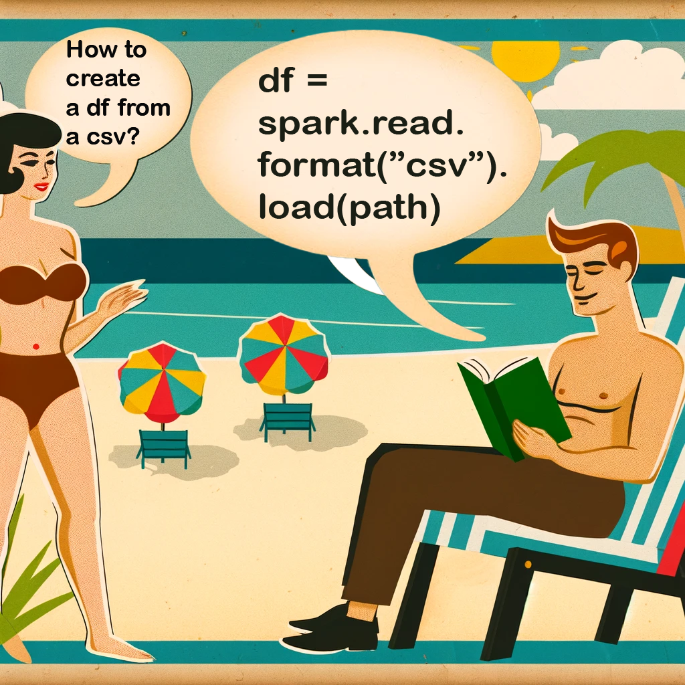
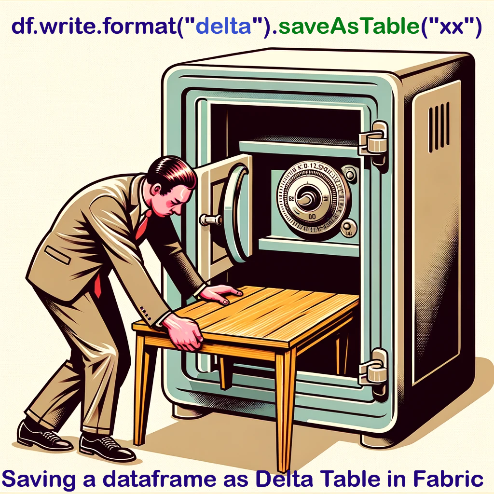

- [Describe Formatted *TableName* ](#describe-formatted-tablename-)
- [DataFrame from csv](#dataframe-from-csv)
- [Write Delta Table](#write-delta-table)


## <span style="color: CadetBlue; font-family: Segoe UI, sans-serif;">Creating a SparkSession</span>

   ```python
   from pyspark.sql import SparkSession
   spark = SparkSession.builder.appName("xxx").getOrCreate()
   df = spark.read.csv("abc.csv", header=True, inferSchema=True)
   ```
   


## <span style="color: Coral; font-family: Segoe UI, sans-serif;">Creating a DataFrame</span>



## Showing dataframe, rows describing tables

### df.show()

   ```python
   df.show()
   df.show(n=10, truncate=False)
   ```
   

### display(df)

   ```pyrhon
   display(df.limit(3))
   ```
   

### df.describe()

   describe is used to generate descriptive statistics of the DataFrame. For numeric data, results include COUNT, MEAN, STD, MIN, and MAX, while for object data it will also include TOP, UNIQUE, and FREQ.

   ```python
   df.describe()
   df.describe().show()
   ```
   

   ```python
   df.printSchema()
   df.columns
   ```
### DESCRIBE FORMATTED tableName

   ```python
   spark.sql("DESCRIBE FORMATTED tableName")
   ```
   

# SQL

CREATE OR REPLACE VIEW <VIEWNAME> doesn't work in Fabric/AzureSynapse/ADF etc. Instead use this:
```SQL
If Exists (Select * From sys.sysobjects where name = 'apple')
    DROP TABLE dbo.apple;
GO
```


### Dropping a table


Small dataframe

df.limit(100)


4. **Selecting Columns**
   ```python
   df.select("column1", "column2").show()
   ```

5. **Filtering Data**
   ```python
   df.filter(df["column"] > value).show()
   df.filter(df["column"] == "value").show()
   ```

6. **Adding Columns**
   ```python
   df.withColumn("new_column", df["existing_column"] * 2).show()
   ```

7. **Renaming Columns**
   ```python
   df.withColumnRenamed("old_name", "new_name")
   ```
   
8. **Dropping Columns**
   ```python
   df.drop("column_name")
   ```

9. **Grouping and Aggregating**
   ```python
   df.groupBy("column").count().show()
   df.groupBy("column").agg({"column2": "avg", "column3": "sum"}).show()
   ```
   
10. **Sorting Data**
    ```python
    df.orderBy("column").show()
    df.orderBy(df["column"].desc()).show()
    ```

### RDD Operations
1. **Creating an RDD**
   ```python
   rdd = spark.sparkContext.parallelize([1, 2, 3, 4, 5])
   ```

2. **Transformations**
   ```python
   rdd2 = rdd.map(lambda x: x * 2)
   rdd3 = rdd.filter(lambda x: x % 2 == 0)
   ```

3. **Actions**
   ```python
   rdd.collect()
   rdd.count()
   rdd.first()
   rdd.take(3)
   ```

### SQL Operations
1. **Creating Temp View**
   ```python
   df.createOrReplaceTempView("table_name")
   ```

2. **Running SQL Queries**
   ```python
   spark.sql("SELECT * FROM table_name").show()
   ```

### Saving Data
1. **Saving as CSV**
   ```python
   df.write.csv("path/to/save.csv")
   ```

2. **Saving as Parquet**
   ```python
   df.write.parquet("path/to/save.parquet")
   ```

3. **Saving to Hive**
   ```python
   df.write.saveAsTable("table_name")
   ```
   

### Miscellaneous
1. **Caching and Unpersisting DataFrames**
   ```python
   df.cache()
   df.unpersist()
   ```

2. **Explain Plan**
   ```python
   df.explain()
   ```

3. **Repartitioning Data**
   ```python
   df.repartition(10)
   df.coalesce(5)
   ```

### Pyspark *when(condition).otherwise(default)*

```python
from pyspark.sql.functions import col, when

result = when(col("Age") > 16, True).otherwise(False)
```

### Remember

The GroupBY columns **must** match the columns used in the SELECT statement.

DENSE_RANK() function returns the rank of each row within the result set partition, with no gaps in the ranking values. The RANK() function includes gaps in the ranking.