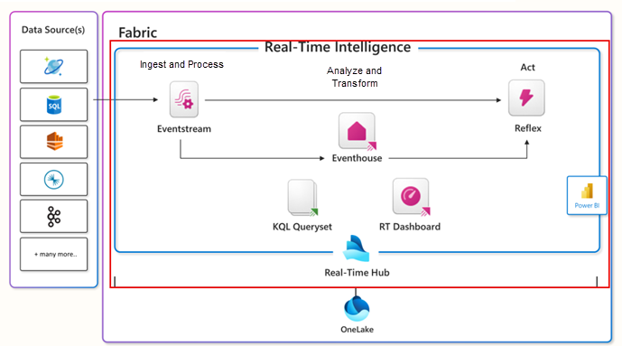
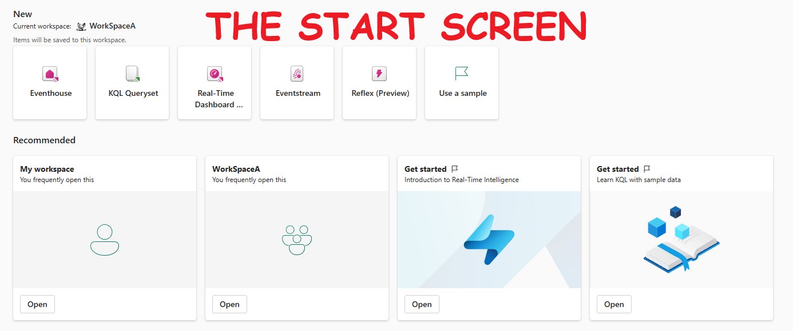
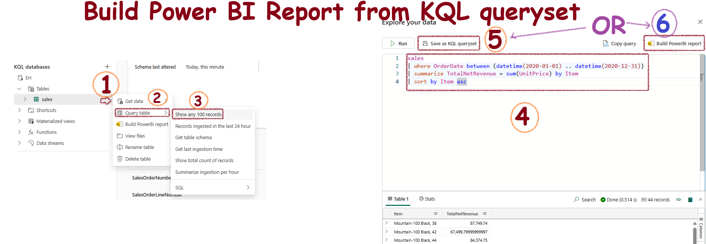

# Real-time Intelligence - Microsoft Fabric

## Core elements of Real-Time Intelligence in Microsoft Fabric

### Eventhouse

- Central workspace/hub - has multiple KQL databases
- Use an Eventhouse for event-based scenarios
- Automatically index and partition data based on ingestion time
- When you create an EventHouse, it initializes a KQL database with the same name inside it
- KQL databses can be standalone or part of an EventHouse
- Can ingest data from multiple sources

### KQL Database

A **KQL (Kusto Query Language) Database** handles large volumes of structured, semi-structured, and unstructured data for real-time analytics and ad-hoc querying. It is part of the Azure Data Explorer service. The data in a KQL database is **stored in Azure Data Explorer**. It uses a **columnar storage** format, for high-performance.

### KQL Queryset

It is a just a query written in KQL. Let's not make it more complex than that!

### Real-Time Dashboards

- Customizable control panels for displaying specific data.
- Tiles for different data views, organized on various pages.
- Export KQL queries into visual tiles.
- Enhances data exploration and visualization.

### Eventstream

- Handles live data without coding.
- Automates data collection, transformation, and distribution.
- Processes real-time data for immediate insights.

## Let's Get Started

- **Open Real-Time Intelligence:** Select it from the bottom left-hand corner of the screen:

    

- **Start Screen:** Here is how it looks:

    

- **Create an Eventhouse:** Eventhouses are groups of databases. When you create an Eventhouse, Fabric creates a KQL Database with the same name inside it

- **KQL Database Structure:** This is the standard structure:

  

**Data Ingestion:** Importing data from files like .csv is a childs play using the GUI, which creates a fully structured database with the correct columns.

## Create a Power BI Report from KQL Queryset

1. Click the three dots next to the table.
2. Select "Show any 100 records" to open the KQL editor.
3. Create your custom KQL query.
4. Save the query or create the Power BI report directly from the editor.

    

