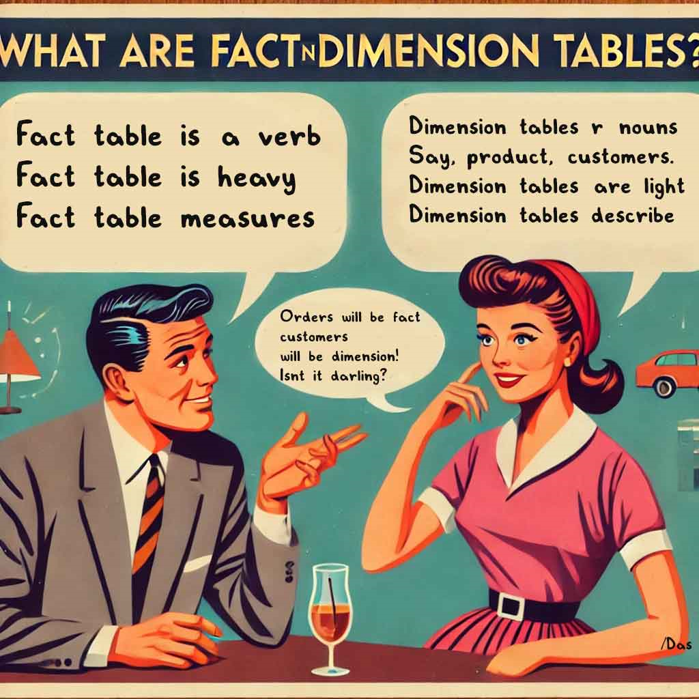

## Fact Table vs. Dimension Table (Simple Explanation)

In simple terms, a **fact table** is where you store **numbers** or **quantities**, and a **dimension table** is where you store **descriptions**.

Just remember these: 

- Fact tables = verbs(e.g. Orders). Dimension tables = nowns(products, customers).
- Fact  tables are heavy. Dimension tables are light.
-  The fact table has the measurements (numbers) and has the primary keys to link to the descriptive information in dimension tables.
