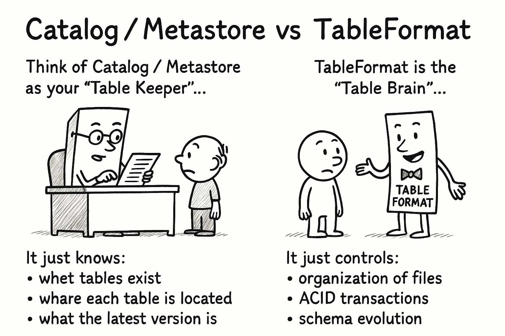

# Catalogue, Metastore, and Table Format — So confusing!



When people first hear the words **catalogue**, **metastore**, and **table format**, it almost sounds like three different versions of the same thing. And if you read random articles online, it becomes even more confusing. Some say the catalogue stores metadata. Some say the table format stores metadata. And then someone else jumps in and says Hive Metastore is still needed. Most of these explanations mix everything together, so let’s clean it up and keep it very simple.

I will explain this in the exact way I would want someone to explain it to me: minimal jargon, no unnecessary sections, and only the pieces that matter.

---

A **Table Format** (like Iceberg, Delta Lake, or Hudi) is basically the "internal brain" of a table. It decides how the table lives inside storage. All the important mechanics—snapshots, schema evolution, partitions, ACID, file layout—these are rules defined by the table format.

If you open an Iceberg table on MinIO, you will literally see its brain laid out:

```
mytable/
  data/
  metadata/
    v1.metadata.json
    v2.metadata.json
    snapshots/
    manifests/
```

Those `metadata.json` files *are the table’s life history*. If someone says “Iceberg supports time travel,” it’s because these files exist. If someone says “Delta supports ACID,” it’s because the format defines how commits work. So the job of the table format is simple: **decide how a single table behaves internally**.

It does *not* keep track of all tables in your system. It only cares about itself.

---

A **Catalogue / Metastore** is the "index of all tables." That’s it. It does not store your data. It does not store snapshots. It does not store Parquet files. It only stores very small information:

* what tables exist
* which database they belong to
* where the table lives in MinIO
* what the latest metadata file is

That’s why I call it "the library index." A library does not store books inside the index drawer. It only tells you where the books are kept. The catalogue does exactly that.

For Iceberg, the modern recommended catalogue is the **Iceberg REST Catalogue**, a lightweight service that Spark, Trino, and Flink talk to. Older systems like Hive Metastore (HMS) also work, but they were designed in a very different era, when everything was tied to Hadoop. Today, REST-based catalogues are simpler, cleaner, and much easier to fit inside container-based setups.


---