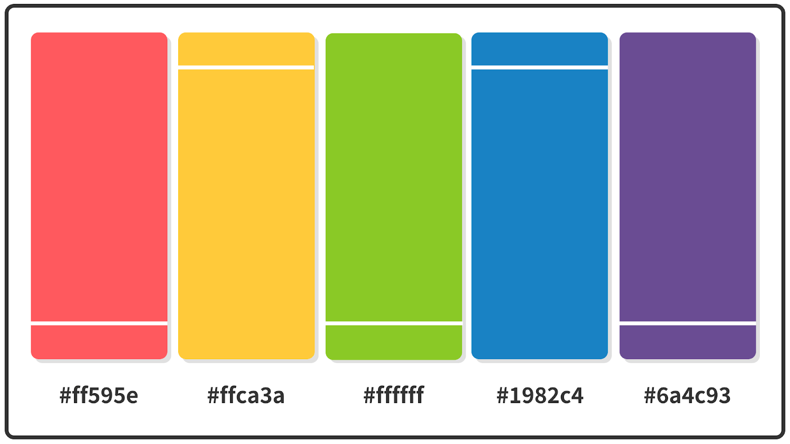

# Color Palettes

I found this from the internet. This could be very useful for technical writers who want  a handy color rereence guid.

### 1. Burnt Sienna Orange + Bedazzled Blue Color Palette

Hex Codes: `#3d5a80`, `#98c1d9`, `#e0fbfc`, `#ee6c4d`, `#293241`

### 2. Imperial Red + Space Cadet Blue Color Palette

Hex Codes: `#2b2d42`, `#8d99ae`, `#edf2f4`, `#ef233c`, `#d90429`

### 3. Orange + Honey Yellow + Prussian Blue Color Palette

Hex Codes: `#8ecae6`, `#219ebc`, `#023047`, `#ffb703`, `#fb8500`

### 4. Candy Pink + Rose Desert + Y in Mn Blue Color Palette

Hex Codes: `#355070`, `#6d597a`, `#b56576`, `#e56b6f`, `#eaac8b`

### 5. Paradise Pink + Caribbean Green + NCS Blue Color Palette

Hex Codes: `#ef476f`, `#ffd166`, `#06d6a0`, `#118ab2`, `#073b4c`

### 6. Lemon Meringue + Prussian Blue Color Palette

Hex Codes: `#003049`, `#d62828`, `#f77f00`, `#fcbf49`, `#eae2b7`

### 7. Orange Web + Oxford Blue Color Palette

Hex Codes: `#000000`, `#14213d`, `#fca311`, `#e5e5e5`, `#ffffff`

### 8. Carolina Blue + CG Blue Color Palette

Hex Codes: `#ffffff`, `#00171f`, `#003459`, `#007ea7`, `#00a8e8`

### 9. Cyber Yellow + Royal Dark Blue Color Palette

Hex Codes: `#00296b`, `#003f88`, `#00509d`, `#fdc500`, `#ffd500`

### 10. Shades of Blue Color Palette

Hex Codes: `#03045e`, `#0077b6`, `#00b4d8`, `#90e0ef`, `#caf0f8`

### 11. Midnight Eagle Green + Metallic Seaweed Blue Color Palette

Hex Codes: `#177e89`, `#084c61`, `#db3a34`, `#ffc857`, `#323031`

### 12. Sage + Ming + Indigo Dye Blue Color Palette

Hex Codes: `#033f63`, `#28666e`, `#7c9885`, `#b5b682`, `#fedc97`

### 13. Almond + Purple Navy + Oxford Blue Color Palette

Hex Codes: `#f1dac4`, `#a69cac`, `#474973`, `#161b33`, `#0d0c1d`

### 14. Ruby + Bright Yellow Crayola + Sky Blue Crayola Color Palette

Hex Codes: `#d81159`, `#8f2d56`, `#218380`, `#fbb13c`, `#73d2de`

### 15. Atomic Tangerine + Pacific Blue + Yale Blue Color Palette

Hex Codes: `#f79256`, `#fbd1a2`, `#7dcfb6`, `#00b2ca`, `#1d4e89`

### 16. Burnt Sienna + Cadet Blue + Columbia Blue Color Palette

Hex Codes: `#dd6e42`, `#e8dab2`, `#4f6d7a`, `#c0d6df`, `#eaeaea`

### 17. Jet + Ming + Indigo Dye Blue Color Palette

Hex Codes: `#353535`, `#3c6e71`, `#ffffff`, `#d9d9d9`, `#284b63`

### 18. Sunglow + Sizzling Red + Crayola Blue Color Palette

Hex Codes: `#ff595e`, `#ffca3a`, `#8ac926`, `#1982c4`, `#6a4c93`

### 19. Light Salmon + French Pink + Baby Blue Color Palette

Hex Codes: `#70d6ff`, `#ff70a6`, `#ff9770`, `#ffd670`, `#e9ff70`

### 20. Black Coffee + Duke Blue + True Blue Color Palette

Hex Codes: `#3c3744`, `#090c9b`, `#3066be`, `#b4c5e4`, `#fbfff1`
