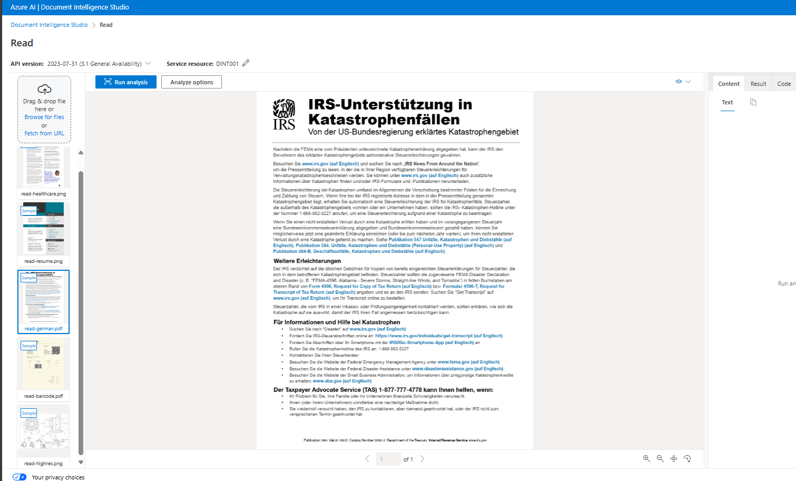

# Azure AI Document Intelligence

## What is Azure AI Document Intelligence?

**Azure AI Document Intelligence** (Form Recognizer) is a machine-learning AI service that extracts text from documents(JPG, PNG, BMP, PDF, or TIFF). It offers REST APIs client library SDKs(Python, C#, Java, and JavaScript) for programmers.

Azure Document Intelligence uses Optical Character Recognition (OCR) capabilities and deep learning models to extract text, key-value pairs, selection marks, and tables from documents.

The service offers two types of models - **Prebuilt models** are ready-to-use models for common  documents like receipts and credit cards. **Custom models** are used when a document has unusual and unique format.

The service is accessible via SDKs in Python, C#, Java, and JavaScript.

## Models in Azure AI Document Intelligence

Azure AI Document Intelligence (formerly Form Recognizer) offers various models for using this service in your application. Here are the models:

1. **Prebuilt Models**:
    - These are pre-trained, ready-to-use models which you can use rightaway without any customization:
        - **General-Document-Read**: Extracts text and key-value pairs from documents.
        - **General-Document-Layout**: Analyzes the layout and structure of documents.
        - **Contract**: Extracts details from contracts.
        - **Health Insurance Card**: Extracts information from health insurance cards.
        - **ID Document**: Extracts data from identification documents.
        - **Invoice**: Extracts relevant details from invoices.
        - **Receipt**: Extracts transaction information from receipts.
        - **US Tax Forms (e.g., 1040, 1098, W2)**: Extracts data from various US tax forms.
        - **Marriage Certificate**: Extracts details from marriage certificates.
        - **Credit Card**: Extracts information from credit cards.
        - **Business Card (deprecated)**: Previously used for business card extraction.
        
2. **Custom Models**:
    - When you have forms with unusual or unique formats, you can create and train your own custom models in Azure AI Document Intelligence. A custom model can provide field extraction for the data that is unique to your form and generate data targeted to your unique business application.

        - **Custom Classification Model**: Allows you to create custom classifiers.
        - **Neural Model**: Use custom neural models for inconsistent, semi-structured or unstructured forms.
        - **Template Model**: Use custom template models when your forms have a consistent visual template. The formatting and layout should be consistent across all completed examples of the form.
        - **Composed Model**: You can build hundreds of custom models within one Azure AI Document Intelligence resource and combine them into a composed model using Azure AI Document Intelligence Studio's GUI or the StartCreateComposedModelAsync() method in code.
        
3. **Add-On Capabilities**:
    - These enhance existing models:
        - **Font Property Extraction**: Extracts font-related information.

## Azure AI Document Intelligence Vs Azure AI Vision

Azure AI Document Intelligence is based on Azure AI Vision services. For basic text extraction from images, Azure AI Vision OCR is appropriate. For more detailed document analysis, such as identifying key/value pairs, tables, and contextual information, Azure AI Document Intelligence is more suitable.

## Tools for AAIDI

Azure AI Document Intelligence tools offer Document Intelligence Studio(https://formrecognizer.appliedai.azure.com/) or (https://documentintelligence.ai.azure.com/studio) to use it without much coding. Here, you can find a range off pre-built models and option to create custom models.

To embed AADI in your applications, coding is required. For instance, users can scan receipts through a mobile app, which uses this service to extract detailed information for integration into a CRM database.  AADI provides APIs for each pre-built model. You can use C#/.NET, Java, Python, and JavaScript to access them. Also, you can access the service via its RESTful web service for other languages.

## Azure Document Intelligence Studio
Azure Document Intelligence services are accessible through both SDKs and APIs, but if you prefer a more visual approach, you can use the Azure Document Intelligence Studio. This web application lets you manage your projects more interactively. In the Studio, you can set up various types of projects like document analysis models, which include capabilities for extracting text, tables, and structure from documents and images. You can also work with prebuilt models for specific document types or even train your own custom models to fit your specific needs. It's a flexible tool that caters to a variety of document processing requirements.

## Use prebuilt document model

Create an Azure AI Document Intelligence resource
Before you can call the Azure AI Document Intelligence service, you must create a resource to host that service in Azure:

In a browser tab, open the Azure portal at https://portal.azure.com, signing in with the Microsoft account associated with your Azure subscription.
On the Azure portal home page, navigate to the top search box and type Document Intelligence and then press Enter.
On the Document Intelligence page, select Create.
On the Create Document Intelligence page, use the following to configure your resource:
Subscription: Your Azure subscription.
Resource group: Select or create a resource group with a unique name such as DocIntelligenceResources.
Region: select a region near you.
Name: Enter a globally unique name.
Pricing tier: select Free F0 (if you don't have a Free tier available, select Standard S0).
Then select Review + create, and Create. Wait while Azure creates the Azure AI Document Intelligence resource.
When the deployment is complete, select Go to resource. Keep this page open for the rest of this exercise.
Use the Read model
Let's start by using the Azure AI Document Intelligence Studio and the Read model to analyze a document with multiple languages. You'll connect Azure AI Document Intelligence Studio to the resource you just created to perform the analysis:

Open a new browser tab and go to the Azure AI Document Intelligence Studio at https://documentintelligence.ai.azure.com/studio.

Under Document Analysis, select the Read tile.

If you are asked to sign into your account, use your Azure credentials.

If you are asked which Azure AI Document Intelligence resource to use, select the subscription and resource name you used when you created the Azure AI Document Intelligence resource.

In the list of documents on the left, select read-german.png.

When the analysis is complete, the text extracted from the image is shown on the right in the Content tab. Review this text and compare it to the text in the original image for accuracy.

Select the Result tab. This tab displays the extracted JSON code.

Scroll to the bottom of the JSON code in the Result tab. Notice that the read model has detected the language of each span. Most spans are in German (language code de) but the last span is in English (language code en).

## Use composed model

Once you've created a set of custom models, you must assemble them into a composed model. You can do this in a Graphical User Interface (GUI) by using Azure AI Document Intelligence Studio, or by using the StartCreateComposedModelAsync() method in custom code.

In the results from the composed model, you can determine which custom model has been used for the analysis by checking the docType field.

The maximum number of custom models that can be added to a single composed model is 100.

## File type  requirement

Note: AAIDI can't extract data from word documents or excel. It only supports, photographed documents like JPG, PNG, BMP, TIFF and PDF. This is also  true for traditional document capture tools like OpenText Intelligent Capture(Captiva InputAccel) whre you can use word document but an intermediate image conversion module converts it to image beore ocring.

Here are the technical reuiqrment for files:

Format must be JPG, PNG, BMP, PDF (text or scanned), or TIFF.
The file size must be less than 500 MB for paid (S0) tier and 4 MB for free (F0) tier.
Image dimensions must be between 50 x 50 pixels and 10000 x 10000 pixels.
The total size of the training data set must be 500 pages or less.