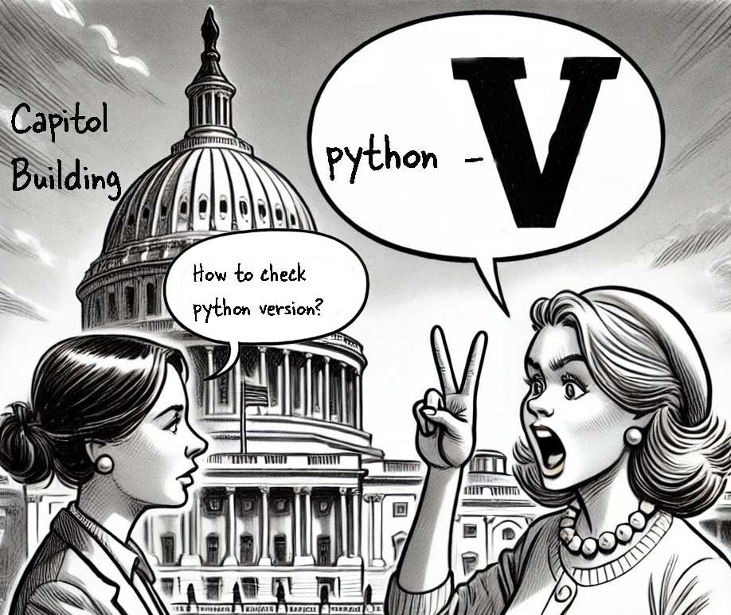

# Getting started

Here, I will assume you are a programmer who has used other languages like Java or C#. So, what makes python different?

But, that being said, you need to remember this important command which let's you check python version:

python -V

To check python version use run in terminal/CMD

**Remember**: V in **CAPS**

