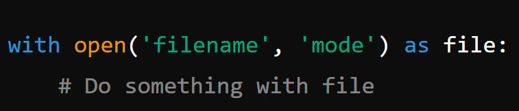
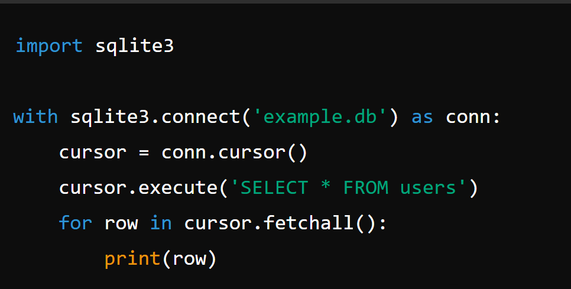

# The `with` Statement in Python

In Python, the `with` statement is very useful when you need to clean up after the code finishes. Cleanup includes things like closing connections and freeing memory.

It also makes the code very clean and readable.

In C#, we have the `using` function, which is similar to `with`.

Let's find out more details about the `with` function in this article.

## What is the `with` Statement?

The `with` statement ensures that resources are properly acquired and released, handling setup and cleanup tasks automatically. It guarantees that resources are released when the block of code is done, even if exceptions occur.

## Basic Syntax

Here's the basic syntax of the `with` statement:





## Why Use `with`?

- **Automatic Resource Management:** The `with` statement ensures that resources are released as soon as the block of code is executed, even if errors occur.
- **Cleaner Code:** Reduces the need for explicit resource management (like closing files), leading to cleaner and more readable code.

## Examples

Let's look at some practical and funny examples to see how the `with` statement works.

1. **Working with Files**

Opening and reading a file:

```python
with open('lovers.txt', 'r') as file:
    content = file.read()
    print("Reading love notes...")
    print(content)
```

Writing to a file:

```python
new_lovers = ["Romeo", "Juliet", "Casablanca"]

with open('lovers.txt', 'a') as file:
    for lover in new_lovers:
        file.write(lover + " ❤️\n")
        print(f"{lover} added to the list of lovers!")
```

2. **Using Locks for Thread Safety**

When working with threads, you might need to use locks to prevent race conditions. The `with` statement makes this simple:

```python
import threading

lock = threading.Lock()

with lock:
    print("Securing the love triangle...")
    # Critical section of code
    print("Thread-safe love triangle management")
```

3. **Handling Database Connections**

Managing database connections can be complex, but the `with` statement can simplify it:





4. **Custom Context Managers**

You can create your own context managers using classes and the `__enter__` and `__exit__` methods:

```python
class LoveContext:
    def __enter__(self):
        print("Entering the love zone ❤️")
        return self

    def __exit__(self, exc_type, exc_value, traceback):
        print("Exiting the love zone 💔")

with LoveContext():
    print("Inside the love zone")
```

This will output:

```
Entering the love zone ❤️
Inside the love zone
Exiting the love zone 💔
```

## Conclusion

The usinng function in C# is same as the with function in Python. This is an example of using using function

```csharp
using (StreamReader reader = new StreamReader("example.txt"))
{
    string content = reader.ReadToEnd();
    Console.WriteLine(content);
}
```
