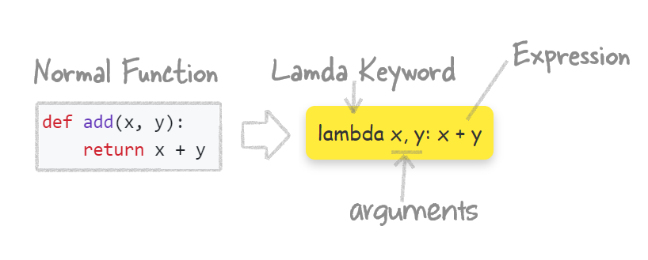

# <span style="color: PaleVioletRed; font-family: Segoe UI, sans-serif;">**Python Lamda  Functions. No-name. One-line functions**</span>

Lamda function is a small function having just one expression and written in just one line. They don't need any function name. They are very handy when you need a small one-line code.

<p style="
    margin: 20px 0;
    font-size: 18px;
    color: #333;
    font-family: 'Comic Sans MS', cursive, sans-serif;
    background-color: #ffeb3b; /* Light yellow background */
    padding: 10px;
    border-radius: 8px; /* Rounded corners */
    box-shadow: 0px 4px 8px rgba(0, 0, 0, 0.2); /* Shadow for depth */
    display: inline-block; /* Shrink to fit content */
">
Lamda functions always start with <b>lamda</b>
</p>

## <span style="color: #D86487; font-family: Segoe UI, sans-serif;">**What is Lambda?**</span>

A lambda function is a small function you write in one line, without even naming it. Here is how a normal function and its lamda counterpart would look like:




### <span style="color: #C05075; font-family: Segoe UI, sans-serif;">**Where to Use Lambda**</span>

Lambda functions are handy for small, quick tasks where you don’t need a full function. Here are a few places where they are commonly used:


#### <span style="color: #A93C63; font-family: Segoe UI, sans-serif;">**1. Sorting with Custom Rules**</span>

Let’s say you have a list of names and you want to sort them by length instead of alphabetically. Normally, you would write a function, but with a lambda, it’s easy:

```python
names = ['Rahul', 'Amit', 'Zara', 'Pooja']
sorted_names = sorted(names, key=lambda x: len(x))
```

<p style="
    margin: 20px 0;
    font-size: 18px;
    color: #333;
    font-family: 'Comic Sans MS', cursive, sans-serif;
    background-color: #ffeb3b; /* Light yellow background */
    padding: 10px;
    border-radius: 8px; /* Rounded corners */
    box-shadow: 0px 4px 8px rgba(0, 0, 0, 0.2); /* Shadow for depth */
    display: inline-block; /* Shrink to fit content */
">
    Use lambda for sorting lists in a custom way.
</p>

---

#### <span style="color: #A93C63; font-family: Segoe UI, sans-serif;">**2. Filtering Lists**</span>

If you have a list of numbers and you only want the even ones, lambda makes it easy:

```python
numbers = [1, 2, 3, 4, 5, 6, 7, 8]
even_numbers = list(filter(lambda x: x % 2 == 0, numbers))
```

<p style="
    margin: 20px 0;
    font-size: 18px;
    color: #333;
    font-family: 'Comic Sans MS', cursive, sans-serif;
    background-color: #ffeb3b; /* Light yellow background */
    padding: 10px;
    border-radius: 8px; /* Rounded corners */
    box-shadow: 0px 4px 8px rgba(0, 0, 0, 0.2); /* Shadow for depth */
    display: inline-block; /* Shrink to fit content */
">
    Lambda functions are perfect for filtering lists.
</p>

---

#### <span style="color: #932851; font-family: Segoe UI, sans-serif;">**3. Mapping Data**</span>

Let’s say you want to double every number in a list. Instead of writing a loop, you can use `map()` with a lambda:

```python
numbers = [1, 2, 3, 4]
doubled = list(map(lambda x: x * 2, numbers))
```

<p style="
    margin: 20px 0;
    font-size: 18px;
    color: #333;
    font-family: 'Comic Sans MS', cursive, sans-serif;
    background-color: #ffeb3b; /* Light yellow background */
    padding: 10px;
    border-radius: 8px; /* Rounded corners */
    box-shadow: 0px 4px 8px rgba(0, 0, 0, 0.2); /* Shadow for depth */
    display: inline-block; /* Shrink to fit content */
">
    Use lambda to quickly transform data in lists.
</p>

---

#### <span style="color: #932851; font-family: Segoe UI, sans-serif;">**4. Filtering with Lambda**</span>

If you need to filter out items from a list based on a condition, `filter` with a `lambda` function is a quick solution:

```python
numbers = [5, 12, 17, 24, 29]
filtered_numbers = list(filter(lambda x: x > 15, numbers))
```

<p style="
    margin: 20px 0;
    font-size: 18px;
    color: #333;
    font-family: 'Comic Sans MS', cursive, sans-serif;
    background-color: #ffeb3b; /* Light yellow background */
    padding: 10px;
    border-radius: 8px; /* Rounded corners */
    box-shadow: 0px 4px 8px rgba(0, 0, 0, 0.2); /* Shadow for depth */
    display: inline-block; /* Shrink to fit content */
">
    Lambda is great for filtering lists based on specific conditions.
</p>

---

#### <span style="color: #932851; font-family: Segoe UI, sans-serif;">**5. Applying Lambda to a DataFrame**</span>

When working with data, you can use `apply` with a `lambda` function to perform operations on each element in a DataFrame column:

```python
df['new_column'] = df['existing_column'].apply(lambda x: x + 10)
```

<p style="
    margin: 20px 0;
    font-size: 18px;
    color: #333;
    font-family: 'Comic Sans MS', cursive, sans-serif;
    background-color: #ffeb3b; /* Light yellow background */
    padding: 10px;
    border-radius: 8px; /* Rounded corners */
    box-shadow: 0px 4px 8px rgba(0, 0, 0, 0.2); /* Shadow for depth */
    display: inline-block; /* Shrink to fit content */
">
    Apply lambda functions to DataFrame columns for quick data manipulation.
</p>

---

#### <span style="color: #932851; font-family: Segoe UI, sans-serif;">**6. Combining Lambda with List Comprehensions**</span>

Sometimes, you might want to use a lambda function within a list comprehension for more complex operations:

```python
result = [(lambda x: x * 2)(x) for x in range(5)]
```

<p style="
    margin: 20px 0;
    font-size: 18px;
    color: #333;
    font-family: 'Comic Sans MS', cursive, sans-serif;
    background-color: #ffeb3b; /* Light yellow background */
    padding: 10px;
    border-radius: 8px; /* Rounded corners */
    box-shadow: 0px 4px 8px rgba(0, 0, 0, 0.2); /* Shadow for depth */
    display: inline-block; /* Shrink to fit content */
">
    Combine lambda functions with list comprehensions.
</p>


#### <span style="color: #932851; font-family: Segoe UI, sans-serif;">7. Lamda with IF-ELIF-ELSE</span>

You can use a lambda function to quickly check if a number is odd or even:

```python
odd_even_lambda = lambda i: 'Number is Even' if i % 2 == 0 else 'Number is Odd'
```

<p style="
    margin: 20px 0;
    font-size: 18px;
    color: #333;
    font-family: 'Comic Sans MS', cursive, sans-serif;
    background-color: #ffeb3b; /* Light yellow background */
    padding: 10px;
    border-radius: 8px; /* Rounded corners */
    box-shadow: 0px 4px 8px rgba(0, 0, 0, 0.2); /* Shadow for depth */
    display: inline-block; /* Shrink to fit content */
">
    You can use lamda with if  IF-ELIF-ELSE logic
</p>


### <span style="color: #7C143F; font-family: Segoe UI, sans-serif;">**Let's recap**</span>

Don’t expect lambda functions to shrink your entire code. They’re only meant for small, one-line tasks where you don’t need to name the function.
