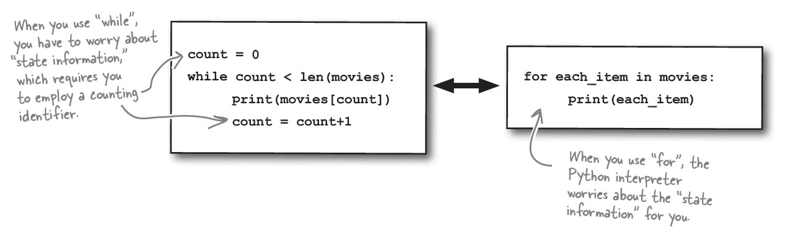

# Python version - python -V

To check python version use run in terminal/CMD


**Remember**: V in **CAPS**
<figure>
  
  <figcaption></figcaption>
</figure>


# <span style="color: blueviolet;Font-family: Segoe UI, sans-serif;">Variables</span>


Python variables don't have a type. They are just names. If you have a python list the variable holding it doesn't need to know what is the type. It just knows its a list and it has some collection.

List in Python my look like arrays. But, they are more. They are full blown Python collection objects. This means, they come with ready-to-use list methods.

# <span style="color: blueviolet;Font-family: Segoe UI, sans-serif;">Python Comments</span>


# Python list

**List are like Arrays v2**


**Access list items with the Square Bracket []**


First few important list methods

print()
pop()
extend()
insert()

## For item in list


## While in list



# Python functions


Python function introduces two new keywords: **def** and **return**
Python doesn't force you to provide type of arguments and return value
You can send objects as arguments and get objects as return. You don't have to provide the type of the object

# Python Snippets

## Get Current User info

```python
import os
import getpass
print("Current user:", getpass.getuser())

# Directory to check
directory_to_check = "/data/spark-warehouse/test_db.db/films"

# Get the current user running the Spark application
current_user = getpass.getuser()
print(f"Current user: {current_user}")

# Check read, write, and execute permissions
has_read_permission = os.access(directory_to_check, os.R_OK)
has_write_permission = os.access(directory_to_check, os.W_OK)
has_execute_permission = os.access(directory_to_check, os.X_OK)

print(f"Read permission: {has_read_permission}")
print(f"Write permission: {has_write_permission}")
print(f"Execute permission: {has_execute_permission}")
```

# Populat MSSQL Tables with random data

This Python script populates a SQL Server database table, `dbo.student`, with random data. The `dbo.student` table should have:

- **id** (integer): A unique identifier for each student.
- **Name** (varchar): A randomly generated student's first name.
- **Age** (integer): A randomly generated age between 18 and 30.

Here's a step-by-step breakdown:

1. **Database Connection**: Connects to the `Oxford` SQL Server database using Windows Authentication (`Trusted_Connection=yes`).
2. **Row Count**: The `num_rows` variable determines how many rows of data to insert. Adjust this to change the number of rows added.
3. **Random Data with Faker**: Uses the `Faker` library to produce random student names.
4. **Get Last ID Value**: Checks the highest `id` in `dbo.student` to determine the next available ID. If no records are present, it starts from 0.
5. **Create INSERT Commands**: The script creates individual `INSERT` commands for each new student record.
6. **Run INSERT Commands**: Executes each `INSERT` command to add new rows to `dbo.student`.
7. **Commit and Disconnect**: Saves the changes and ends the database connection.

For the script to work, ensure the table exists. It's optimal to execute the script from Azure Data Studio on the server itself. Modify connection details if running from a different location.

---
```python
# Faker was not found hence we installed the faker library using pip. Alternatively you can  the command in terminal(mac) or command prompt(windows)
# Dont run it if faker already installed
pip install faker

```
```python
import pyodbc
from faker import Faker
import random

# Establish a connection to your SQL Server
conn = pyodbc.connect('Driver={SQL Server};'
                      'Server=.;'
                      'Database=Oxford;'
                      'Trusted_Connection=yes;')

# Define the number of rows to insert
num_rows = 1000  # Change this to the desired number of rows

# Create a Faker instance for generating random names
fake = Faker()

# Get the last primary key value in the table
cursor = conn.cursor()
cursor.execute("SELECT MAX(id) FROM dbo.student")
last_id = cursor.fetchone()[0]
if last_id is None:
    last_id = 0

# Generate and execute the INSERT statements
for i in range(1, num_rows + 1):
    last_id += 1  # Increment the primary key value
    student_name = fake.first_name()  # Generate a random first name
    student_age = random.randint(18, 30)  # Generate a random age between 18 and 30
    sql = f"INSERT INTO dbo.student VALUES ({last_id}, '{student_name}', {student_age})"
    cursor.execute(sql)

print("Executed succesfully. Rows updated: " + str(i))
# Commit the changes and close the connection
conn.commit()
conn.close()

```

# Python Gotchas
## NameError in Python


If you don't create a variable an use it. You will get **NameError** in Python. 

```python
for i in range(5):
    print(x)
```

To avoid, simple, create the variable and warm it up.

```python
x = 10 # Create and warm up
for i in range(5):
    print(x) # Then use
```

Note for code like `for i in range(x)` the initializatio happens. So, don't take such examples and start using variables without warming them up.

**Python Concepts:**

1. **What are Python's built-in data types?**
   - Python's built-in data types include:
     - **Numbers**: `int`, `float`, `complex`
     - **Sequences**: `list`, `tuple`, `range`
     - **Text**: `str`
     - **Sets**: `set`, `frozenset`
     - **Mappings**: `dict`
     - **Booleans**: `bool`
     - **Binary Types**: `bytes`, `bytearray`, `memoryview`

2. **Explain the difference between a list and a tuple in Python.**
   - A **list** is a mutable sequence, meaning its elements can be changed after creation. A **tuple** is an immutable sequence, meaning its elements cannot be changed after creation.

3. **What is a dictionary in Python, and how is it different from a list?**
   - A **dictionary** is an unordered collection of key-value pairs, where each key is unique. A **list** is an ordered collection of elements that can be of any type and can contain duplicates.

4. **What are functions in Python, and why are they used?**
   - Functions in Python are blocks of reusable code that perform a specific task. They help in organizing code, avoiding repetition, and improving readability.

5. **Explain the concept of list comprehensions in Python.**
   - List comprehensions provide a concise way to create lists by specifying an expression followed by a `for` clause. They are more compact and faster than traditional `for` loops.

6. **What is the purpose of the `self` keyword in Python classes?**
   - The `self` keyword in Python is used to represent the instance of the class. It allows access to the attributes and methods of the class within its own scope.

7. **What are decorators in Python?**
   - Decorators are functions that modify the behavior of other functions or methods. They are used to add functionality to existing code in a clean and readable way.

8. **Explain the difference between shallow copy and deep copy in Python.**
   - A **shallow copy** creates a new object but does not create copies of nested objects; it references the original nested objects. A **deep copy** creates a new object and recursively copies all objects found within the original, ensuring no references to the original objects.

9. **What is exception handling in Python?**
   - Exception handling in Python is done using `try`, `except`, `else`, and `finally` blocks. It allows programmers to handle runtime errors gracefully without crashing the program.


# Python Object-Oriented Programming (OOP)

Object-Oriented Programming (OOP) is a programming paradigm based on the concept of **objects** that represent real-world entities. These objects encapsulate **data** (attributes or properties) and **behavior** (methods or functions). Below are the core concepts of OOP:

---

### 1. **Class**
- A blueprint or template for creating objects.
- Defines the structure (attributes) and behavior (methods) that the objects of the class will have.
  
**Example:**
```python
class Car:
    def __init__(self, brand, model):
        self.brand = brand  # Attribute
        self.model = model  # Attribute

    def drive(self):  # Method
        print(f"The {self.brand} {self.model} is driving.")
```

---

### 2. **Object**
- An instance of a class. Objects are created using the class blueprint.
- Each object can have unique values for its attributes.

**Example:**
```python
car1 = Car("Toyota", "Camry")
car1.drive()  # Output: The Toyota Camry is driving.
```

---

### 3. **Encapsulation**
- Restricts direct access to some of an object's data and methods, ensuring controlled interaction.
- Attributes can be made private by prefixing them with an underscore (`_`) or double underscore (`__`).

**Example:**
```python
class BankAccount:
    def __init__(self, balance):
        self.__balance = balance  # Private attribute

    def deposit(self, amount):
        self.__balance += amount  # Controlled access

    def get_balance(self):
        return self.__balance  # Controlled retrieval
```

---

### 4. **Inheritance**
- Allows a class (child) to inherit attributes and methods from another class (parent).
- Promotes code reuse.

**Example:**
```python
class Vehicle:
    def __init__(self, brand):
        self.brand = brand

class Car(Vehicle):
    def __init__(self, brand, model):
        super().__init__(brand)
        self.model = model
```

---

### 5. **Polymorphism**
- Allows objects to take on multiple forms.
- Enables methods to have the same name but behave differently based on the object calling them.

**Example:**
```python
class Animal:
    def speak(self):
        print("Animal speaks")

class Dog(Animal):
    def speak(self):  # Overriding the parent class method
        print("Dog barks")

class Cat(Animal):
    def speak(self):  # Overriding the parent class method
        print("Cat meows")

animals = [Dog(), Cat()]
for animal in animals:
    animal.speak()
```

---

### 6. **Abstraction**
- Hides complex implementation details and shows only the necessary features.
- Achieved using abstract classes or interfaces.

**Example:**
```python
from abc import ABC, abstractmethod

class Shape(ABC):
    @abstractmethod
    def area(self):
        pass

class Rectangle(Shape):
    def __init__(self, width, height):
        self.width = width
        self.height = height

    def area(self):  # Implementation of the abstract method
        return self.width * self.height
```

---

### Key Benefits of OOP:
1. **Code Reusability**: Inheritance allows reusing code in new contexts.
2. **Modularity**: Encapsulation and classes make code easier to manage.
3. **Scalability**: Easier to extend functionality without altering existing code.
4. **Maintenance**: Organized and readable structure simplifies debugging and updates.