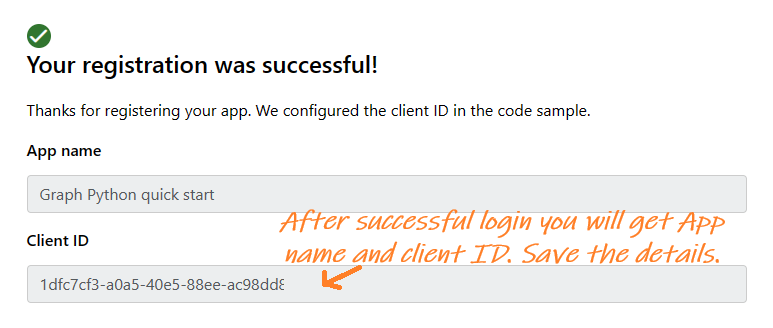

- [**Running Microsoft Graph quick start Python code from a jupyter notebook** ](#running-microsoft-graph-quick-start-python-code-from-a-jupyter-notebook-)
  - [**Background**](#background)
  - [**Getting Started**](#getting-started)
    - [**1. Download the Sample Code**](#1-download-the-sample-code)
    - [**2. Setting Up the Notebook**](#2-setting-up-the-notebook)
    - [**3. Adapting the Code for Jupyter**](#3-adapting-the-code-for-jupyter)
    - [**4. Finalizing the Setup**](#4-finalizing-the-setup)
- [**Cnclusion**](#cnclusion)

## <span style="color: Indigo;Font-family: Segoe UI, sans-serif;">**Running Microsoft Graph quick start Python code from a jupyter notebook** </span>

### <span style="color: DarkOrchid;Font-family: Segoe UI, sans-serif;">**Background**</span>
In this guide I will show you how to run Microsoft's example code in a Jupyter notebook. Usually, this code is meant to be run in a terminal, but with a few small changes, you can run it in a notebook instead. Many people like this way because it's more familiar and easy to use. We'll focus on how to make these changes so the code works in Jupyter, without getting into more details about the code.


### <span style="color: Chocolate;Font-family: Segoe UI, sans-serif;">**Getting Started**</span>

#### <span style="color: DodgerBlue;Font-family: Segoe UI, sans-serif;">**1. Download the Sample Code**</span>

1. Navigate to the [Microsoft Graph Quick Start](https://developer.microsoft.com/en-us/graph/quick-start) page.
   
   
2. Select **Python** as your language of choice.
   
   
3. Click on **Get a client ID** and log in using your personal, work, or school account. Note: An Outlook account is necessary for this step.
   
   
4. Upon successful login, a client ID will be presented to you. Make sure to save this ID.
   
   
5. Click on **Download the code sample** and save the *msgraph-training-python.zip* file. Unzip its contents into a directory where you have permission to run Python code, such as a Visual Studio Code workspace.
   
   
   

#### <span style="color: DodgerBlue;Font-family: Segoe UI, sans-serif;">**2. Setting Up the Notebook**</span>

1. Open a Jupyter notebook in Visual Studio Code (VS Code) and navigate (`cd`) to the `graphtutorial` folder (e.g., `%cd <Path to>\graphtutorial`).
   
2. Install the required dependencies by running `pip install -r requirements.txt` in a notebook cell. This process may take about a minute.
   
   

#### <span style="color: DodgerBlue;Font-family: Segoe UI, sans-serif;">**3. Adapting the Code for Jupyter**</span>

1. Attempt to run the `main.py` file directly in a notebook cell with the command `%run main.py`. This will likely result in an error due to a conflict between Jupyter's and asyncio's event loops.
   
   
2. To resolve this, install the `nest_asyncio` package with `pip install nest_asyncio`. This package allows for the nesting of asyncio's event loop, facilitating the running of asynchronous code in Jupyter.
   
   
3. In a new cell, copy and paste the entire code from `main.py` and add the following lines just before the `main()` function:

    ```python
    import nest_asyncio
    nest_asyncio.apply()
    ```
   
   

4. Comment out the last line of the script to prevent it from executing immediately.
   
   
5. Run the modified cell. You should not see any output yet.
6. In a new cell, execute `await main()` to run the main function asynchronously. This should produce the expected output.
   
   

#### <span style="color: DodgerBlue;Font-family: Segoe UI, sans-serif;">**4. Finalizing the Setup**</span>

1. Follow the on-screen instructions and navigate to [Microsoft Device Login](https://microsoft.com/devicelogin) to enter the provided code. Complete the login process as prompted.
   
   
2. A selection box or palette will appear at the top of VS Code. Enter your choice (e.g., `2` to view emails) and press Enter.
   
   
3. Once you've completed your tasks, enter `0` at the top of the input box and press Enter to conclude the session.
   
   

## <span style="color: Teal;Font-family: Segoe UI, sans-serif;">**Cnclusion**</span>

I have put the juputer notebook vrsion of the code [here](main.ipynb). All you have to do is place it in your \msgraph-training-python\graphtutorial folder. Open it and run cell by cell.
