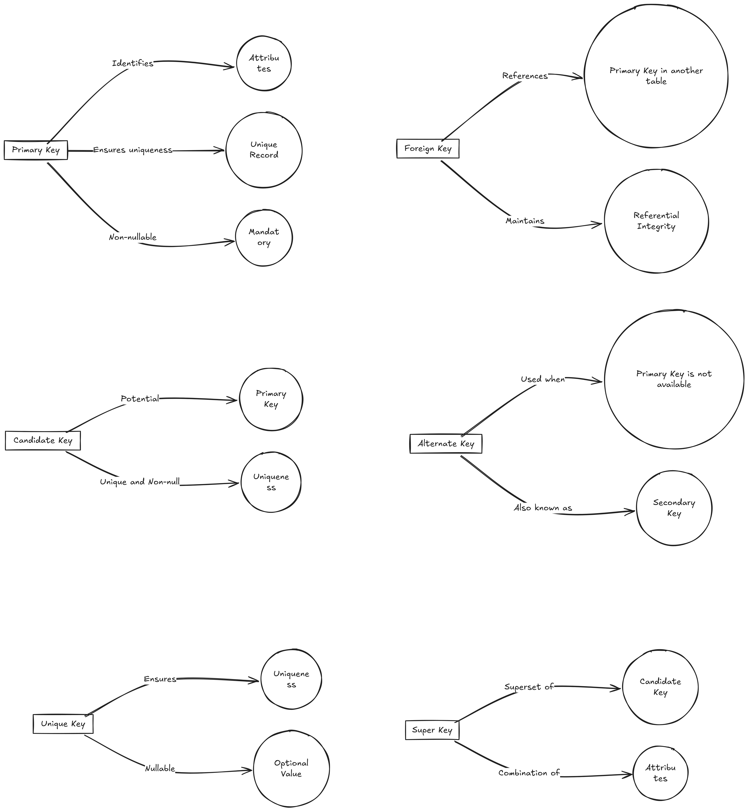

# Essential SparkSQL commands

| **Command**               | **Description**                                                                              | **Example**                                |
|---------------------------|----------------------------------------------------------------------------------------------|--------------------------------------------|
| `SET -v`                  | Shows all Spark SQL settings.                                                                | `SET -v;`                                  |
| `SHOW DATABASES`          | Lists all databases.                                                                         | `SHOW DATABASES;`                          |
| `CREATE DATABASE`         | Creates a new database.                                                                      | `CREATE DATABASE db_name;`                 |
| `DROP DATABASE`           | Drops an existing database.                                                                  | `DROP DATABASE db_name;`                   |
| `USE`                     | Sets the current database.                                                                   | `USE db_name;`                             |
| `SHOW TABLES`             | Lists all tables in the current database.                                                    | `SHOW TABLES;`                             |
| `DESCRIBE TABLE`          | Provides the schema of a table.                                                              | `DESCRIBE TABLE table_name;`               |
| `DESCRIBE EXTENDED`       | Provides detailed information about a table, including metadata.                             | `DESCRIBE EXTENDED table_name;`            |
| `CREATE TABLE`            | Creates a new table.                                                                         | `CREATE TABLE table_name (col1 INT, ...);` |
| `CREATE EXTERNAL TABLE`   | Creates an external table.                                                                   | `CREATE EXTERNAL TABLE table_name ...;`    |
| `DROP TABLE`              | Drops an existing table.                                                                     | `DROP TABLE table_name;`                   |
| `INSERT INTO`             | Inserts data into a table.                                                                   | `INSERT INTO table_name VALUES (...);`     |
| `SELECT`                  | Queries data from tables.                                                                    | `SELECT * FROM table_name;`                |
| `CREATE VIEW`             | Creates a view based on a query.                                                             | `CREATE VIEW view_name AS SELECT ...;`     |
| `DROP VIEW`               | Drops an existing view.                                                                      | `DROP VIEW view_name;`                     |
| `CACHE TABLE`             | Caches a table in memory.                                                                    | `CACHE TABLE table_name;`                  |
| `UNCACHE TABLE`           | Removes a table from the in-memory cache.                                                    | `UNCACHE TABLE table_name;`                |
| `SHOW COLUMNS`            | Lists all columns of a table.                                                                | `SHOW COLUMNS FROM table_name;`            |
| `ALTER TABLE`             | Changes the structure of an existing table.                                                  | `ALTER TABLE table_name ADD COLUMNS (...);`|
| `TRUNCATE TABLE`          | Removes all rows from a table without deleting the table.                                    | `TRUNCATE TABLE table_name;`               |
| `MSCK REPAIR TABLE`       | Recovers partitions of a table.                                                              | `MSCK REPAIR TABLE table_name;`            |
| `SHOW PARTITIONS`         | Lists all partitions of a table.                                                             | `SHOW PARTITIONS table_name;`              |
| `EXPLAIN`                 | Provides a detailed execution plan for a query.                                              | `EXPLAIN SELECT * FROM table_name;`        |
| `SHOW CREATE TABLE`       | Displays the `CREATE TABLE` statement for an existing table.                                 | `SHOW CREATE TABLE table_name;`            |
| `LOAD DATA`               | Loads data into a table from a file.                                                         | `LOAD DATA INPATH 'path' INTO TABLE ...;`  |
| `SET`                     | Sets a Spark SQL configuration property.                                                     | `SET property_name=value;`                 |
| `SHOW FUNCTIONS`          | Lists all functions available in the Spark SQL environment.                                  | `SHOW FUNCTIONS;`                          |
| `DESCRIBE FUNCTION`       | Provides information about a function.                                                       | `DESCRIBE FUNCTION function_name;`         |

# OPENROWSET - The Powerful Transact-SQL for Data Engineering.

## What is OPENROWSET?

`OPENROWSET` is a Transact-SQL function. Using this, you can create a select statement from external data sources (CSV, Parquet, JSON, Delta, ADLS, Blob) as if it were a local database. You don't need to create a table or linked service to run this. Hence, it's fast and requires fewer lines of code.

It is used in SQL Server, Azure SQL DB, Synapse Analytics, Fabric, and Databricks.

<p style="color: #006600; font-family: 'Trebuchet MS', Helvetica, sans-serif; background-color: #e6ffe6; padding: 15px; border-left: 5px solid #00cc66;">
For `OPENROWSET` to work, you need to ensure that the Synapse workspace or the query has the appropriate authentication to access the external data source.
</p>

## Practical scenarios where OPENROWSET is preferred

1. **Ad-Hoc Data Retrieval:**
   - **Scenario:** A business analyst needs to quickly retrieve data from an Excel file for an ad-hoc report.
   - **Reason:** OPENROWSET allows for on-the-fly access to the Excel file without the need to import it into SQL Server first, providing immediate data retrieval for analysis.

2. **Cross-Database Queries:**
   - **Scenario:** A developer needs to run a query that joins tables from different SQL Server instances.
   - **Reason:** OPENROWSET can be used to run distributed queries across different servers, avoiding the need to set up linked servers which can be more complex and require additional configuration and permissions.

3. **Accessing External Data Sources:**
   - **Scenario:** A company needs to integrate data from a remote Oracle database for a one-time data migration task.
   - **Reason:** OPENROWSET provides a quick way to query data from the Oracle database using an OLE DB provider, bypassing the need for more permanent and complex solutions like linked servers or SSIS packages.

4. **Temporary Data Access:**
   - **Scenario:** During a data validation process, a data engineer needs to access data from a CSV file provided by a client.
   - **Reason:** OPENROWSET allows the engineer to read the CSV file directly into a SQL query, facilitating temporary data access without the overhead of creating permanent database tables or ETL processes.

5. **Data Import for Development and Testing:**
   - **Scenario:** Developers need to import data from various formats (e.g., Excel, CSV) into a development environment for testing purposes.
   - **Reason:** OPENROWSET can be used to import data directly into the development environment without the need for pre-configured data import processes, speeding up the testing and development cycles.


## Syntax
```sql
-- General Syntax
OPENROWSET(
    BULK 'file_path',
    FORMAT = 'file_format',
    [DATA_SOURCE = 'data_source_name'],
    [WITH ( column_name column_type [ 'column_ordinal' | 'json_path' ] )]
) AS alias_name

-- Example for CSV
SELECT * 
FROM OPENROWSET(
    BULK 'https://storageaccount.blob.core.windows.net/container/file.csv',
    FORMAT = 'CSV',
    FIRSTROW = 2,
    FIELDTERMINATOR = ',',
    ROWTERMINATOR = '\n'
) AS [result]

-- Example for Parquet
SELECT * 
FROM OPENROWSET(
    BULK 'https://storageaccount.blob.core.windows.net/container/file.parquet',
    FORMAT = 'PARQUET'
) AS [result]

-- Example for Delta Lake
SELECT * 
FROM OPENROWSET(
    BULK 'https://storageaccount.blob.core.windows.net/container/file.delta',
    FORMAT = 'DELTA'
) AS [result]
```

### Key Options
- **BULK**: Specifies the path to the file(s).
- **FORMAT**: Specifies the file format (`CSV`, `PARQUET`, or `DELTA`).
- **DATA_SOURCE**: (Optional) Specifies the external data source.
- **WITH**: Defines the schema of the columns to be read.

### Options for CSV
- **FIELDTERMINATOR**: Character used to separate fields (default is `,`).
- **ROWTERMINATOR**: Character used to separate rows (default is `\n`).
- **FIRSTROW**: Specifies the first row to read (default is 1).
- **HEADER_ROW**: Indicates if the CSV file contains a header row (`TRUE` or `FALSE`).

## Examples

1. **Reading a CSV file without specifying a schema:**
    ```sql
    SELECT * 
    FROM OPENROWSET(
        BULK 'https://storageaccount.blob.core.windows.net/container/data.csv',
        FORMAT = 'CSV'
    ) AS [data]
    ```

2. **Reading specific columns from a CSV file:**
    ```sql
    SELECT * 
    FROM OPENROWSET(
        BULK 'https://storageaccount.blob.core.windows.net/container/data.csv',
        FORMAT = 'CSV',
        FIELDTERMINATOR = ',',
        ROWTERMINATOR = '\n',
        FIRSTROW = 2
    )
    WITH (
        col1 VARCHAR(50),
        col2 INT,
        col3 DATE
    ) AS [data]
    ```

3. **Reading a Parquet file:**
    ```sql
    SELECT * 
    FROM OPENROWSET(
        BULK 'https://storageaccount.blob.core.windows.net/container/data.parquet',
        FORMAT = 'PARQUET'
    ) AS [data]
    ```

4. **Reading a Delta Lake file:**
    ```sql
    SELECT * 
    FROM OPENROWSET(
        BULK 'https://storageaccount.blob.core.windows.net/container/data.delta',
        FORMAT = 'DELTA'
    ) AS [data]
    ```
## What other options we have?

| Alternative      | Usage Scenario                                                                                             | Efficiency           | Microsoft Recommendation                             |
|------------------|------------------------------------------------------------------------------------------------------------|----------------------|------------------------------------------------------|
| BULK INSERT      | Loading large volumes of data from a file into a SQL Server table.                                         | High for large files | Use when importing large data volumes directly.      |
| PolyBase         | Querying external data in Hadoop, Azure Blob Storage, and Azure Data Lake.                                 | High                 | Use for big data environments and distributed systems.|
| EXTERNAL TABLE   | Accessing external data sources seamlessly as if they are regular SQL tables.                              | Moderate to High     | Recommended for persistent access to external data.  |
| Linked Servers   | Connecting SQL Server to other data sources, like another SQL Server or an OLE DB data source.             | Varies               | Use for diverse data sources and quick data joins.   |
| Databricks       | Reading data from various sources using Spark SQL (not native to Databricks but works with Synapse).       | High for big data    | Use for Spark SQL integrations and large-scale analytics. |

# <span style="color: BlueViolet">APPROX_COUNT_DISTINCT</span> when <span style="color: CornflowerBlue">COUNT(DISTINCT ColName)</span> runs forever

Imagine your table has 1 trillion rows. You want to count distinct customer names. Do you think `COUNT(DISTINCT CustomerName)` will show you results in your lifetime?

No, for such scenarios, use `APPROX_COUNT_DISTINCT(ColName)`. It will give you around 97% accuracy.

## <span style="color: DarkCyan">How to run it?</span>

Pretty simple and straightforward.

**Normal Count**
```sql
SELECT COUNT(DISTINCT CustomerName) FROM Customers;
```

**Approximate Count**

```sql 
SELECT APPROX_COUNT_DISTINCT(CustomerName) FROM Customers; 
```
## <span style="color: Gray">Some Fun facts about this T-SQL function</span>

In MS SQL Server `APPROX_COUNT_DISTINCT` it first came in **SQL Server 2019**. It is **available in Synapse SQL**. These other brands support this function:

1. **Google BigQuery**
2. **Amazon Redshift**: It offers the `APPROXIMATE COUNT(DISTINCT column)` function, which serves a similar purpose.
3. **PostgreSQL**: The `approx_count_distinct` extension is available through the `HLL (HyperLogLog)` extension, which allows for approximate distinct counting.
4. **Apache Spark**: The `approx_count_distinct` function is available in Spark SQL, which uses HyperLogLog for approximate counting.


# Practice Joins with MSSQL AdventureWorksLT2016

Download MSSQL Sample database AdventureWorksLT2016.bak and restore it. It will give you a full enviornment.

https://github.com/Microsoft/sql-server-samples/releases/download/adventureworks/AdventureWorksLT2016.bak


## Table Descriptions

Here is a brief description of some of the key tables in the AdventureWorksLT2016 database:

- **SalesLT.Customer**: Contains customer information such as CustomerID, FirstName, LastName, EmailAddress, etc.
- **SalesLT.SalesOrderHeader**: Contains sales order information including SalesOrderID, OrderDate, CustomerID, TotalDue, etc.
- **SalesLT.SalesOrderDetail**: Contains details of each sales order, such as SalesOrderID, ProductID, OrderQty, UnitPrice, etc.
- **SalesLT.Product**: Contains product information including ProductID, Name, ProductNumber, Color, ListPrice, etc.
- **SalesLT.ProductCategory**: Contains information about product categories including ProductCategoryID and Name.
- **SalesLT.ProductModel**: Contains information about product models including ProductModelID and Name.
- **SalesLT.Address**: Contains address information including AddressID, AddressLine1, City, StateProvince, etc.
- **SalesLT.CustomerAddress**: A junction table linking customers to addresses.

## Questions

### Question 1: List Customers with Their Orders

**Question**: Retrieve a list of customers along with their order details. Include the customer's first name, last name, and order date. Only include customers who have placed at least one order.

**Hint**: 
- Use `SalesLT.Customer` to get customer information.
- Use `SalesLT.SalesOrderHeader` to get order information.
- Use an INNER JOIN to connect these tables.

### Question 2: List Products and Their Categories

**Question**: Retrieve a list of products along with their category names. Include all products, even those that do not belong to any category.

**Hint**:
- Use `SalesLT.Product` to get product information.
- Use `SalesLT.ProductCategory` to get category information.
- Use a LEFT JOIN to include all products.

### Question 3: Find Customers and Their Addresses

**Question**: Retrieve a list of customers and their addresses. Include all customers, even if they do not have an address listed.

**Hint**:
- Use `SalesLT.Customer` to get customer information.
- Use `SalesLT.CustomerAddress` to get the relationship between customers and addresses.
- Use `SalesLT.Address` to get address information.
- Use a LEFT JOIN to include all customers.

### Question 4: List All Products and Their Order Details

**Question**: Retrieve a list of all products and their order details. Include all products and orders, even if they do not match.

**Hint**:
- Use `SalesLT.Product` to get product information.
- Use `SalesLT.SalesOrderDetail` to get order details.
- Use a FULL OUTER JOIN to include all products and orders.

### Question 5: Products with No Orders

**Question**: Find products that have not been ordered by any customer.

**Hint**:
- Use `SalesLT.Product` to get product information.
- Use `SalesLT.SalesOrderDetail` to get order details.
- Use a LEFT JOIN and filter to find products with no matching orders.

### Question 6: Calculate Total Sales per Customer Using CTE

**Question**: Use a Common Table Expression (CTE) to calculate the total sales amount for each customer.

**Hint**:
- Use `SalesLT.Customer` to get customer information.
- Use `SalesLT.SalesOrderHeader` to get order information.
- Use SUM function to calculate total sales.
- Use a CTE to organize the query.

# Comprehensive List of SQL Joins

## 1. **INNER JOIN** (also known as **JOIN**)
   - **Description**: Returns only the rows where there is a match in both tables.
   - **Alternative Names**: None
   - **Use Case**: Used when you only want the matching rows between two tables. Common in relational queries.
   - **Example**:
     ```sql
     SELECT * 
     FROM employees
     INNER JOIN departments
     ON employees.department_id = departments.id;
     ```

## 2. **LEFT JOIN** (also known as **LEFT OUTER JOIN**)
   - **Description**: Returns all rows from the left table, and the matching rows from the right table. If no match, NULL values are returned for the right table.
   - **Alternative Names**: **LEFT OUTER JOIN**
   - **Use Case**: Used when you want all rows from the left table, even if there's no match in the right table.
   - **Example**:
     ```sql
     SELECT * 
     FROM employees
     LEFT JOIN departments
     ON employees.department_id = departments.id;
     ```

## 3. **RIGHT JOIN** (also known as **RIGHT OUTER JOIN**)
   - **Description**: Returns all rows from the right table, and the matching rows from the left table. If no match, NULL values are returned for the left table.
   - **Alternative Names**: **RIGHT OUTER JOIN**
   - **Use Case**: Used when you want all rows from the right table, even if there's no match in the left table.
   - **Example**:
     ```sql
     SELECT * 
     FROM employees
     RIGHT JOIN departments
     ON employees.department_id = departments.id;
     ```

## 4. **FULL JOIN** (also known as **FULL OUTER JOIN**)
   - **Description**: Returns all rows from both tables, with matching rows from both sides. Non-matching rows are returned as NULL.
   - **Alternative Names**: **FULL OUTER JOIN**
   - **Use Case**: Used when you need to include all rows from both tables, even if no matches exist.
   - **Example**:
     ```sql
     SELECT * 
     FROM employees
     FULL JOIN departments
     ON employees.department_id = departments.id;
     ```

## 5. **CROSS JOIN**
   - **Description**: Returns the Cartesian product of both tables. Each row from the first table is combined with each row from the second table.
   - **Alternative Names**: None
   - **Use Case**: Used when you want to combine every row from one table with every row from another table. Typically used for generating combinations or testing.
   - **Example**:
     ```sql
     SELECT * 
     FROM products
     CROSS JOIN suppliers;
     ```

## 6. **SELF JOIN**
   - **Description**: A table is joined with itself to compare rows within the same table.
   - **Alternative Names**: None
   - **Use Case**: Used for hierarchical relationships (e.g., finding managers for employees in the same table).
   - **Example**:
     ```sql
     SELECT e1.name AS Employee, e2.name AS Manager
     FROM employees e1
     LEFT JOIN employees e2
     ON e1.manager_id = e2.id;
     ```

## 7. **NATURAL JOIN**
   - **Description**: Automatically joins tables based on columns with the same name in both tables. No need to explicitly specify the join condition.
   - **Alternative Names**: None
   - **Use Case**: Used when both tables have the same column names and you want an automatic join on those columns.
   - **Example**:
     ```sql
     SELECT * 
     FROM employees
     NATURAL JOIN departments;
     ```

## 8. **ANTI JOIN** (also known as **LEFT ANTI JOIN**)
   - **Description**: Returns rows from the left table where no matching rows exist in the right table.
   - **Alternative Names**: **LEFT ANTI JOIN**
   - **Use Case**: Used when you need rows from the left table that do not have a corresponding match in the right table.
   - **Example** (using `LEFT JOIN` and filtering `NULL`):
     ```sql
     SELECT employees.name
     FROM employees
     LEFT JOIN departments
     ON employees.department_id = departments.id
     WHERE departments.id IS NULL;
     ```

## 9. **SEMI JOIN** (also known as **LEFT SEMI JOIN** or **RIGHT SEMI JOIN**)
   - **Description**: Returns rows from the left table where a match exists in the right table, but only columns from the left table are returned.
   - **Alternative Names**: **LEFT SEMI JOIN**, **RIGHT SEMI JOIN**
   - **Use Case**: Used when you need to know which rows in the left table have a match in the right table but only need the left table's columns.
   - **Example** (using `EXISTS`):
     ```sql
     SELECT employees.name
     FROM employees
     WHERE EXISTS (
         SELECT 1 
         FROM departments
         WHERE employees.department_id = departments.id
     );
     ```

## 10. **EXCEPT JOIN**
   - **Description**: Combines two result sets and returns rows from the left set that are not in the right set.
   - **Alternative Names**: None
   - **Use Case**: Used for set difference operations where you need to find rows in one table that don't exist in another.
   - **Example**:
     ```sql
     SELECT * FROM employees
     EXCEPT
     SELECT * FROM employees_in_department;
     ```

## 11. **OUTER APPLY**
   - **Description**: Similar to a left join but with subqueries evaluated per row in the left table.
   - **Alternative Names**: None
   - **Use Case**: Used when you need a subquery or table-valued function evaluated once per row in the left table.
   - **Example**:
     ```sql
     SELECT employees.name, department_details.*
     FROM employees
     OUTER APPLY getDepartmentDetails(employees.department_id) AS department_details;
     ```

## 12. **INNER APPLY**
   - **Description**: Similar to an inner join but with subqueries evaluated per row in the left table.
   - **Alternative Names**: None
   - **Use Case**: Used when you want to perform an inner join with a subquery or table-valued function evaluated per row.
   - **Example**:
     ```sql
     SELECT employees.name, department_details.*
     FROM employees
     INNER APPLY getDepartmentDetails(employees.department_id) AS department_details;
     ```

## Summary Table

| **Join Type**           | **Alternative Name(s)**     | **Description** | **Use Case** |
|-------------------------|-----------------------------|-----------------|--------------|
| **INNER JOIN**          | JOIN                       | Matches rows in both tables | General use, finding common records |
| **LEFT JOIN**           | LEFT OUTER JOIN            | All rows from left, matched from right | When you need all rows from the left table |
| **RIGHT JOIN**          | RIGHT OUTER JOIN           | All rows from right, matched from left | When you need all rows from the right table |
| **FULL JOIN**           | FULL OUTER JOIN            | All rows from both tables, with NULLs for non-matches | When you need complete data from both tables |
| **CROSS JOIN**          | None                       | Cartesian product of both tables | Generating combinations or large result sets |
| **SELF JOIN**           | None                       | Joining a table with itself | For hierarchical relationships within a table |
| **NATURAL JOIN**        | None                       | Automatically joins on matching columns | When tables have common column names |
| **ANTI JOIN**           | LEFT ANTI JOIN             | Rows from the left table without a match in the right | When you need records that don't match |
| **SEMI JOIN**           | LEFT SEMI JOIN, RIGHT SEMI JOIN | Rows from left with matching right rows, only left columns | When you need to check for existence in the right table |
| **EXCEPT JOIN**         | None                       | Rows from left that are not in right | For set difference operations |
| **OUTER APPLY**         | None                       | Subqueries evaluated once per row in the left table | Using subqueries for each row |
| **INNER APPLY**         | None                       | Subqueries evaluated once per row in the left table, like an inner join | Inner joins with subqueries |


# SQL Keys



| **Key Type**      | **Description**                           | **Key Feature**               |
|-------------------|-------------------------------------------|-------------------------------|
| **Primary Key**   | Uniquely identifies each row in a table   | Ensures uniqueness and no NULL values |
| **Foreign Key**   | Refers to a primary key in another table  | Creates relationships between tables |
| **Unique Key**    | Ensures unique values in a column         | Allows one NULL value |
| **Candidate Key** | Potential primary key                    | Can uniquely identify a row |
| **Composite Key** | Made of multiple columns                 | Combines columns to create uniqueness |
| **Alternate Key** | Any candidate key not chosen as the primary | Alternative unique identifier |
| **Superkey**      | A set of columns that can uniquely identify a row | May include extra columns |
| **Natural Key**   | A key formed from real-world data        | Represents real-world attributes |
| **Surrogate Key** | An artificial key generated by the system | No inherent meaning outside the database |


**SQL Concepts:**

1. **What is the difference between `WHERE` and `HAVING` clauses in SQL?**
   - The `WHERE` clause filters rows before any grouping is performed, while the `HAVING` clause filters groups after the `GROUP BY` operation.

2. **Explain the purpose of the `GROUP BY` clause.**
   - The `GROUP BY` clause groups rows that have the same values into summary rows, often used with aggregate functions like `COUNT`, `SUM`, `AVG`, `MAX`, or `MIN`.

3. **What are aggregate functions in SQL? Can you name a few?**
   - Aggregate functions perform a calculation on a set of values and return a single value. Examples include `COUNT`, `SUM`, `AVG`, `MAX`, and `MIN`.

4. **What is a primary key, and why is it important?**
   - A primary key is a unique identifier for a record in a table. It ensures that each record can be uniquely identified and prevents duplicate records.

5. **What is a foreign key, and how does it relate to a primary key?**
   - A foreign key is a field in one table that uniquely identifies a row of another table. It establishes a link between the two tables, ensuring referential integrity.

6. **Describe the different types of joins in SQL.**
   - - **INNER JOIN**: Returns records that have matching values in both tables.
   - **LEFT JOIN (or LEFT OUTER JOIN)**: Returns all records from the left table and the matched records from the right table; if no match, NULL values are returned for columns from the right table.
   - **RIGHT JOIN (or RIGHT OUTER JOIN)**: Returns all records from the right table and the matched records from the left table; if no match, NULL values are returned for columns from the left table.
   - **FULL JOIN (or FULL OUTER JOIN)**: Returns all records when there is a match in either left or right table; if no match, NULL values are returned for columns from the table without a match.

7. **What is normalization in database design?**
   - Normalization is the process of organizing data to reduce redundancy and dependency by dividing large tables into smaller ones and defining relationships between them.

8. **What are indexes in SQL, and how do they improve query performance?**
   - Indexes are database objects that improve the speed of data retrieval operations on a table at the cost of additional space and decreased performance on data modification operations. They function similarly to an index in a book, allowing the database to find data more quickly.

9. **Explain the concept of a transaction in SQL.**
   - A transaction is a sequence of one or more SQL operations executed as a single unit. Transactions ensure data integrity and are governed by the ACID properties: Atomicity, Consistency, Isolation, and Durability.

10. **What is the purpose of the `DISTINCT` keyword?**
    - The `DISTINCT` keyword is used to return only distinct (different) values in the result set, eliminating duplicate records.

