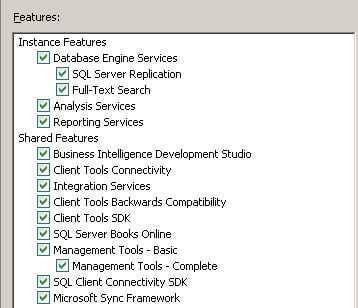
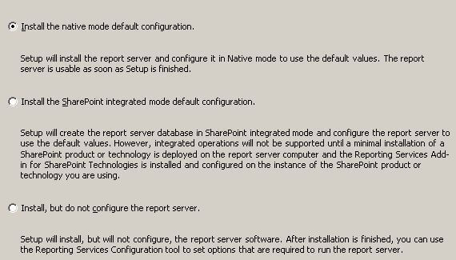
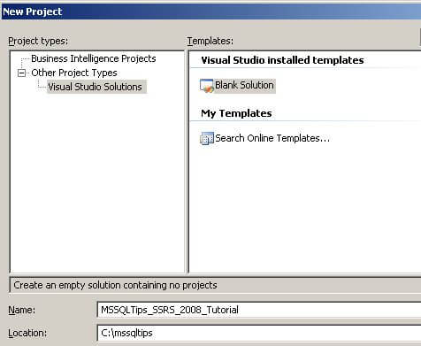
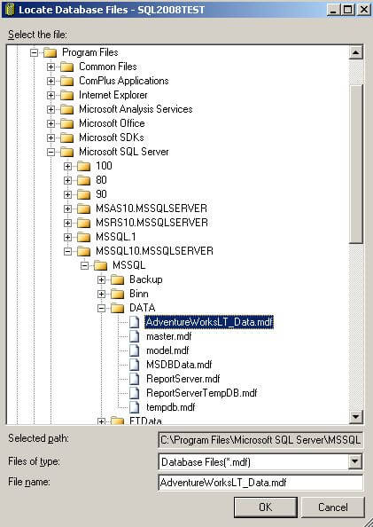
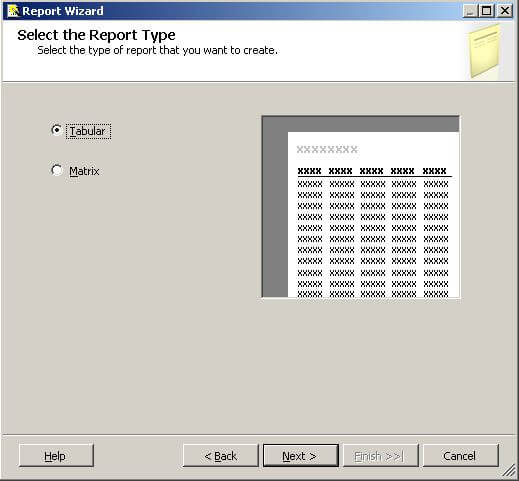
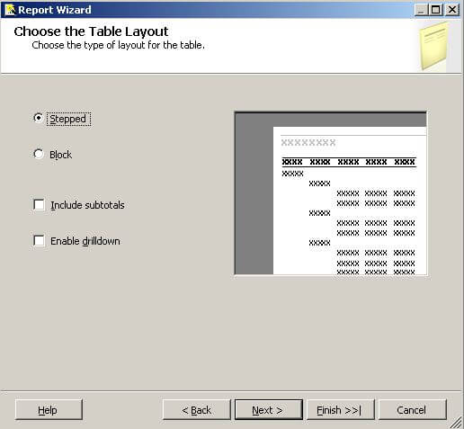
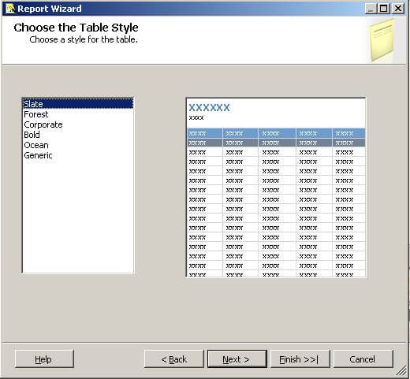
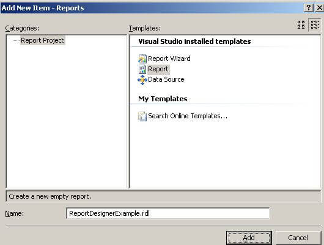
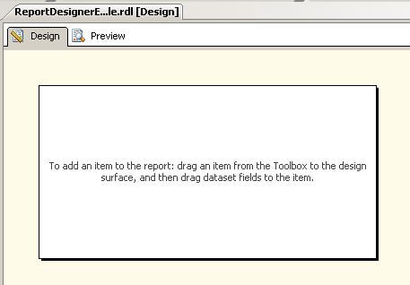

# [TBD]Overview

SQL Server Reporting Services 2008 (SSRS) is a tool in SQL Server 2008 for designing, developing, testing, and deploying reports. It works with the Business Intelligence Development Studio (BIDS) for all tasks related to report authoring and deployment. BIDS is included with SQL Server 2008.

In this tutorial, we will cover the following topics to help you build a report successfully:

1. Reporting Services Components
2. Install Reporting Services
3. Business Intelligence Development Studio (BIDS)
4. Install Sample Database
5. Create a Simple Report with the Wizard
6. Create a Simple Report with the Report Designer
7. Deploy Reports
8. Configure Report Manager Security

## Reporting Services Components

SSRS uses two main databases: ReportServer and ReportServerTempDB. ReportServer stores reports, data sources, snapshots, subscriptions, etc., while ReportServerTempDB is for temporary storage. These databases are created automatically during the SQL Server installation if you choose the default setup. You can also create them manually using the Reporting Services Configuration Manager.

### Reporting Services Windows Service

SSRS functionality is implemented as a Windows service. Understanding this service isn't essential for using SSRS but can be useful. The service provides several functions, as shown in the diagram below:


Key points about the Windows service:

- **HTTP Listener**: This is a new feature in SSRS 2008, removing the need for Internet Information Server (IIS).
- **Report Manager**: An ASP.NET application providing a browser-based interface for managing SSRS.
- **Web Service**: An ASP.NET application offering a programmatic interface to SSRS, used by Report Manager and can be used for custom implementations.
- **Background Processing**: Handles core services for SSRS.

### Report Designer

The Report Designer in BIDS allows you to design, develop, test, and deploy reports. BIDS, included with SQL Server 2008, has a user-friendly interface and new visualizations. Non-developers can use Report Builder, but it is not covered in this tutorial.

## Installing Reporting Services

To install SSRS, run the SQL Server 2008 SETUP.EXE and follow the steps, selecting Reporting Services in the Feature Selection dialog:



Ensure to check all items under Shared Features, especially BIDS, as it is used for designing, developing, testing, and deploying reports.

In the Reporting Services Configuration dialog, select "Install the native mode default configuration":



This installs and configures SSRS automatically. After installation, you can start using SSRS immediately.

## Using BIDS

BIDS helps in developing reports with an intuitive interface based on Microsoft's Visual Studio. To install BIDS, select the Business Intelligence Development Studio checkbox in the Shared Features section during the SQL Server installation. BIDS uses the concept of projects and solutions to organize reports.

To create a new project:
1. Launch BIDS from the Microsoft SQL Server 2008 program group.
2. Click File > New Project.
3. Select Visual Studio Solutions under Project Types and Blank Solution under Visual Studio installed templates. Enter the name and location:

   

4. Click OK to create a blank solution.

Next, add a project to the solution:
1. Click File > Add > New Project.
2. Select Report Server Project and fill in the details:

   

We are now ready to install the sample database to use in our reports.

### Installing the Sample Database

We will use the AdventureWorksLT sample database for our reports. This database is chosen because it is small and easy to set up.

1. Download the AdventureWorksLT database from the Microsoft SQL Server Product Samples page on CodePlex.
2. Run the installer (.msi file) and choose the folder for the database and log files. For a default SQL Server installation, use:

   ```
   C:\Program Files\Microsoft SQL Server\MSSQL10.MSSQLSERVER\MSSQL\DATA
   ```

3. After installation, attach the database to your SQL Server using SQL Server Management Studio:

   

4. In the Attach Databases dialog, click Add and navigate to the AdventureWorksLT_Data.mdf file:

   

5. Click OK to attach the database.

### Creating a Simple Report with the Wizard

The Report Wizard in BIDS helps you create a simple report quickly. 

1. Open your solution in BIDS.
2. Right-click the Reports node and select Add New Report to launch the Report Wizard:

   

3. Follow these steps in the wizard:

   - **Create a Shared Data Source**: Define the data source your report will use.
   - **Design a Query**: Specify the SQL query to fetch the data for your report.
   - **Select a Report Type**: Choose the layout type (e.g., tabular or matrix).
   - **Design a Table**: Define the structure of the report.
   - **Choose the Table Layout**: Select how the table should be displayed.
   - **Complete the Wizard**: Finalize the report setup.

### Next Steps

Now that you've created a simple report using the wizard, you can further customize it using the Report Designer in BIDS. The Report Designer allows you to define every aspect of your report, giving you more control and flexibility. Once you're comfortable with the basics, you can start building more sophisticated reports and dashboards.


---


### Creating a Shared Data Source

A Data Source contains the information needed to fetch the data for your report. SSRS can access data from relational databases, OLAP databases, and almost any data source with an ODBC or OLE DB driver.

When creating a Data Source, you can specify it as shared, meaning it can be used by any report in the same project. It is generally a good idea to create Shared Data Sources. If a Data Source is not shared, its definition is stored inside the report and cannot be shared with other reports.

In this section, we will go through the steps to create a Shared Data Source.

### Explanation

After launching the Report Wizard, you will see the Select the Data Source dialog as shown below:


Since our project does not have any Shared Data Sources yet, we need to define a new Data Source. Here are the details you need to provide:

- **Name**: Choose a descriptive name for the Data Source, like AdventureWorksLT. Avoid spaces in the name to prevent errors.
- **Type**: Select the appropriate type from the dropdown list. The default value, Microsoft SQL Server, is correct for our AdventureWorksLT database.
- **Connection String**: Enter the connection string for your Data Source. It is usually easier to click the Edit button to enter the details and have the connection string created for you.
- **Edit button**: Click this to open the Connection Properties dialog where you can enter the server name and select the database. The connection string will be created for you.
- **Credentials button**: Click this to open the Data Source Credentials dialog where you can specify the credentials to use when connecting to the Data Source.
- **Make this a shared data source checkbox**: Check this box to create a Shared Data Source, so any report in the same project can use it.

Click the Edit button to open the Connection Properties dialog. Enter your server name and select the AdventureWorksLT database as shown below:


The Server name is where your SQL Server database is deployed. If you are running a named instance of SQL Server, specify it as SERVERNAME\INSTANCENAME. If SQL Server is running locally, you can use localhost instead of SERVERNAME. Click the Test Connection button to verify the connection, then click OK to close the dialog.

Next, click the Credentials button to open the Data Source Credentials dialog as shown below:


The default selection, Use Windows Authentication (Integrated Security), is fine for our purposes. This means Reporting Services will connect to the Data Source using the Windows credentials of the person running the report. When you deploy the report and Data Source for others to use, you can select a different option if needed. For now, we'll stick with the default.

After completing these steps, the Select the Data Source dialog will look like this:


Click Next to proceed to the Design the Query dialog, which we will cover in the next section.

---

### Design Query Step

The Design Query step of the Report Wizard allows us to specify what data we want to retrieve from our Data Source and display in our report. In this section, we will explain how to define a query to fetch the data for our report.

### Explanation

The Design Query step in the Report Wizard displays the following dialog:


You can click the Query Builder button to build your query graphically or type it directly into the Query string textbox. Here is an example query you can use:

```sql
SELECT
  c.ParentProductCategoryName,
  c.ProductCategoryName,
  SUM(d.LineTotal) AS Sales
FROM SalesLT.Product p
JOIN SalesLT.vGetAllCategories c 
  ON c.ProductCategoryID = p.ProductCategoryID
JOIN SalesLT.SalesOrderDetail d 
  ON d.ProductID = p.ProductID  
GROUP BY  
  c.ParentProductCategoryName,
  c.ProductCategoryName
ORDER BY
  c.ParentProductCategoryName,
  c.ProductCategoryName
```

This query provides a sales summary broken down by product category. Copy and paste this query into the Query string textbox in the Design Query dialog. Alternatively, you can click the Query Builder button and design the query graphically.

Click Next to move to the Select Report Type dialog.

### Select Report Type Step

The Select Report Type step of the Report Wizard lets us choose between a Tabular or Matrix type of report. Here are the details of these report types.

### Explanation

The Select Report Type step in the Report Wizard shows the following dialog:



A tabular report has page headings, column headings, and subtotals running down the page. A matrix report allows defining fields on columns and rows and provides interactive drilldown capabilities. We will create a tabular report as it is simple and familiar.

Click Next to move to the Design the Table dialog.

### Design Table Step

The Design Table step of the Report Wizard allows us to layout the available fields on our report, choosing between Page, Group, and Details.

### Explanation

The Design Table step in the Report Wizard displays the following dialog:


The Available fields list is populated based on the query you defined in the previous step. Click on a field, then click the appropriate button to place that field. Fill in the dialog as shown below:


### Button Descriptions:

- **Page**: Use this to start a new page when the field value changes, e.g., each ParentProductCategory on a different page.
- **Group**: Group the fields in this list.
- **Details**: Fields in this list appear in each row of the report.

Click Next to move to the Choose Table Layout dialog.

### Choose Table Layout Step

The Choose Table Layout step of the Report Wizard lets us choose a stepped or blocked layout and whether to include subtotals and enable drilldown.

### Explanation

The Choose Table Layout step in the Report Wizard displays the following dialog:



The default Stepped layout shows the groupings as above. Block layout saves space but disables drilldown. Including Subtotals provides intermediate totals based on groupings. Enabling drilldown initially hides details and allows expanding with a click on the plus icon.

Fill in the dialog as shown below:


Click Next to move to the Choose Table Style dialog.

### Choose Table Style Step

The Choose Table Style step of the Report Wizard allows us to select from different styles. This is purely cosmetic, offering different color schemes.

### Explanation

The Choose Table Style step in the Report Wizard displays the following dialog:



Choose a style from the list and click Next to move to the Completing the Wizard dialog.

### Completing the Wizard Step

The Completing the Wizard step of the Report Wizard summarizes your choices from the previous dialogs.

### Explanation

The Completing the Wizard step in the Report Wizard displays the following dialog:


Provide a descriptive name for your report in the Report Name textbox, e.g., ReportWizardExample. You can check the Preview report checkbox to see what your report will look like. Review your choices in the summary. If you need to change anything, click the Back button to revisit the previous dialogs.

Click the Finish button to generate your report. Your report will appear in the Solution Explorer as shown below:


The report will also be displayed in the Report Designer. Click the Preview tab to render your report. A portion of the report is shown below:


We will make a few changes to the report. Click the Design tab; you will see the following:


We'll add spaces in the heading, widen the columns, and format the sales numbers. Here are the steps:

1. Add spaces in the heading: Click between the 't' and 'W', and between 'd' and 'E'.
2. Widen the columns: Click in the ParentProductCategory cell. An Excel-like grid appears. Hover between the cells at the top, click, and drag to widen them.
3. Format sales numbers: Click inside the [Sum(Sales)] column, locate Format in the Properties window, and type C0 to format the cell as currency with no decimals. Repeat for the [Sales] column.

After making these changes, the report design should look like this:


Click the Preview tab to display the report:


Click the + icon to the left of the Parent Product Category Names to drill down to Product Category Name details.

This completes our tutorial section on the Report Wizard.

### Creating a Report from Scratch Using Report Designer

In the prior section, we created a report using the Report Wizard in Business Intelligence Development Studio (BIDS). In this section, we will create a report from scratch using the Report Designer in BIDS. With the Report Designer, you start with an empty canvas and define every aspect of the report yourself, allowing you to create sophisticated reports and dashboards.

We will complete the following steps to build a simple report:

1. Add a new report to our project
2. Create a shared data source
3. Create a Dataset
4. Configure a Table

The following screenshot shows the report we will build as rendered in the Report Manager:


This report is based on the same query used in the earlier Report Wizard section. The plus sign icon to the left of the value in the Parent Product Category column allows us to drill down to the Product Category details.

Now, let's start creating our report.

### Adding a New Report to Our Project

The first step in creating a report is to add a new report to our project.

### Explanation

In the earlier section on Projects and Solutions, we created a blank solution and added a Report Server project to the solution. In the previous section, we added a new report by stepping through the Report Wizard. The BIDS Solution Explorer shows our Reports project along with the Shared Data Source and ReportWizardExample created in the previous section:


Right-click on the Reports node, then select Add > New Item, which will display the Add New Item - Reports dialog. Fill in the dialog as shown below:



Click the Add button to add a new report to your project. Your new report will be displayed in the Report Designer. Let's review the Report Designer before we continue creating our report from scratch.

There are three parts of the Report Designer:

- **Design Surface**: The palette where you lay out your report.
- **Report Data**: Allows you to define Data Sources, Datasets, Parameters, and Images. You can access built-in fields like Report Name and Page Number and drag and drop items onto the design surface.
- **Toolbox**: Contains the Report Items that you drag and drop onto the design surface, such as Table, Matrix, Rectangle, List, etc.

When you add or open a report, the design surface will be displayed. After adding a report, you will see the following blank design surface:



You can display the Report Data and Toolbox areas by selecting them from the top-level View menu if they aren't shown. I prefer to position them to the left of the designer. The Report Data area is shown below:


In the screenshot above, Report Data and the Toolbox share the same area of the screen; click on the tab at the bottom to switch between them. The Toolbox contains the following elements that you will drag and drop onto the design surface:


Note the push pin icon

 in the heading of Report Data and the Toolbox. Clicking this toggles between showing the tab and hiding it, putting a button you can hover over to display the tab.

You can customize what you see in the report designer and position it however you like. Click on the Report Data or Toolbox heading and drag it around to position it.

Now, let's continue to the next section and create a Shared Data Source.

### Creating a Shared Data Source

We discussed the Shared Data Source in the earlier section on using the Report Wizard to create a new report. The Data Source contains the information that Reporting Services needs to retrieve the data for our report. A Shared Data Source can be used by any report in the same project. In this section, we will create a Shared Data Source.

### Explanation

To create a Shared Data Source, click the New button in the Report Data area, then select Data Source from the menu as shown below:


The Data Source Properties dialog will be displayed as shown below:


First, provide a name; enter AdventureWorksLT in the Name textbox. Since we already defined a Shared Data Source in the earlier section on using the Report Wizard, click the Use shared data source reference radio button and select AdventureWorksLT from the dropdown list. The Data Source Properties dialog is shown below:


At this point, we are done. If you need to create a new Shared Data Source, click the New button and complete the Shared Data Source Properties dialog. This is essentially the same as what we did in the Report Wizard section.

We can now see our Shared Data Source in the Report Data area as shown below:


We are now ready to continue to the next section and create a Data Set.

### Creating a Data Set

A Data Set contains a query that Reporting Services uses to retrieve the data for our report. This query could be a SQL statement like we used in the Design the Query step of the Report Wizard section; it could also be a stored procedure that we execute. In this section, we will define a new Data Set using the same query from the Report Wizard section.

### Explanation

To create a Data Set, right-click on the AdventureWorksLT Shared Data Source that we created in the previous section and select Add Dataset from the menu as shown below:


The Dataset Properties dialog will be displayed as shown below:


First, provide a name; enter Main in the Name textbox. Since we only have one Shared Data Source in our project, it will be selected automatically in the Data source dropdown. To define our query, you could click the Query Designer button and do it graphically or type in the query as we did in the Report Wizard section. Instead, click the Import button, which will initially display the familiar Open File dialog. Navigate to the report we created earlier in the Report Wizard section of the tutorial as shown below:


Click OK to display the Import Query dialog as shown below:


The above dialog displays the Datasets and their queries from the report. Our earlier report has only one Dataset, so just click the Import button. If the report had multiple Datasets, you could choose the Dataset from the list on the left.

The Report Data area now shows our new Dataset and the list of available fields as shown below:


We are now ready to continue to the next section to configure a Table for our report layout.