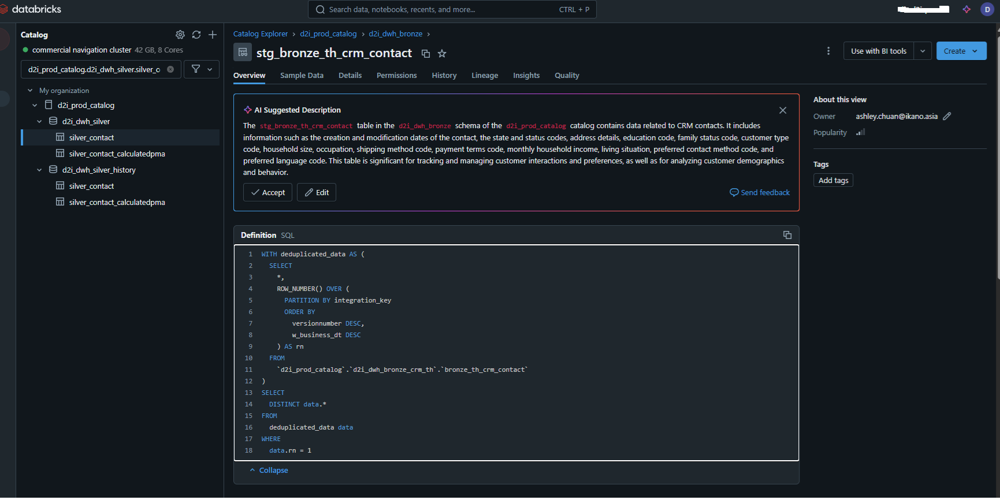

# Beginner’s Guide to Window Functions in SQL

## What if you could perform calculations on rows of data but still see every row? Meet Window Functions!
Imagine you're running a marathon, and you’re curious not just about who won, but also how you rank within your age group, your city, or among your friends. Window Functions are like the "rank tracker" for your SQL data—helping you zoom in on specific slices of your data while keeping the big picture in view.

Think of it this way: Aggregate functions (like SUM, AVG) summarize data by squashing rows together. Window Functions, on the other hand, let you see both the summary and the individual details. It’s like having your cake and eating it too!


## **Meet the Cast: Types of Window Functions**
Let’s dive into the superstar Window Functions—each has its own talent for tackling data challenges.
### **1. Aggregate Functions with OVER Clause**
#### "Summing Things Up Without Losing the Details"
Use these to calculate totals, averages, and more within defined windows. Perfect for seeing the forest *and* the trees.

- **Scenario**: You’re managing a team and want to know each person’s salary along with the total salary of their department.
  ```sql
  SELECT department, employee_name, salary,
         SUM(salary) OVER (PARTITION BY department) AS total_salary
  FROM employees;
  ```
  **Output:**
  | Department | Employee Name | Salary | Total Salary |
  |------------|---------------|--------|--------------|
  | Sales      | Alice         | 5000   | 15000        |
  | Sales      | Bob           | 7000   | 15000        |
  | Sales      | Charlie       | 3000   | 15000        |

### **2. Ranking Functions**
#### "Who’s on Top?"
When you need to assign ranks or positions to rows, these functions are your go-to tools.

#### **ROW_NUMBER()**: The Uniquely Numbered MVP
- **Scenario**: Rank employees by salary within each department.
  ```sql
  SELECT department, employee_name, salary,
         ROW_NUMBER() OVER (PARTITION BY department ORDER BY salary DESC) AS rank
  FROM employees;
  ```

- **PROD Scenario**: Here is a real-query used in a prod envirnment:

   

   This query uses the `ROW_NUMBER()` window function to deduplicate data based on the `integration_key` column. Here’s how it works step by step:

   ##### Breakdown of `ROW_NUMBER` and RANKING Logic:

   1. **Purpose of `ROW_NUMBER()`**:
      - It assigns a unique row number to each record within a partition defined by the `PARTITION BY` clause.
      - The numbering starts at 1 for each partition, based on the ordering specified in the `ORDER BY` clause.

   2. **`PARTITION BY integration_key`**:
      - Divides the data into partitions, where each partition corresponds to a unique `integration_key`.

   3. **`ORDER BY versionnumber DESC, w_business_dt DESC`**:
      - Within each partition, the rows are sorted by:
      - `versionnumber` in descending order (higher version numbers appear first).
      - If there are ties in `versionnumber`, they are further sorted by `w_business_dt` in descending order (more recent dates appear first).

   4. **Alias `rn`**:
      - The `ROW_NUMBER()` function assigns a row number to each row in the partition. The row with the highest priority (based on the `ORDER BY` conditions) gets `rn = 1`.

   ##### Final Selection:

   - **`WHERE data.rn = 1`**:
   - This filters out all rows except the one with `rn = 1`, effectively keeping only the "best" row (highest versionnumber and latest date) for each `integration_key`.

   - **`SELECT DISTINCT data.*`**:
   - Ensures that there are no duplicate rows in the output.

   ##### What Happens in the Query:

   1. **Deduplication**:
      - The CTE (`WITH deduplicated_data`) ensures each `integration_key` has exactly one row based on the ranking logic.
      
   2. **Extraction**:
      - The main query fetches only the top-ranked rows (`rn = 1`) for each `integration_key`.

   This approach is commonly used in SQL to handle deduplication when there’s a clear ranking or prioritization logic. Let me know if you need additional examples or variations!

#### **RANK()**: Sharing the Spotlight
- Assigns the same rank to rows with identical values, but skips the next rank.
  - **Scenario**: Similar to `ROW_NUMBER()` but with ties.

#### **DENSE_RANK()**: Closing the Gaps
- No gaps in ranks, even with ties.

#### **NTILE(n)**: Divide and Conquer
- Divides rows into `n` equal parts—great for quartiles or deciles.

### **3. Distribution Functions**
#### "How Do You Stack Up?"
Use these to see how a value compares to others within a window.

#### **CUME_DIST()**: Track Your Progress
- **Scenario**: See the cumulative distribution of salaries.
  ```sql
  SELECT employee_name, salary,
         CUME_DIST() OVER (ORDER BY salary ASC) AS cumulative_distribution
  FROM employees;
  ```

#### **PERCENT_RANK()**: Relative Ranking Made Easy
- Similar to `CUME_DIST()`, but calculates the rank percentage.


## **Cheat Sheet: Quick Reference Table**
| Function       | Superpower                     | Handles Ties | Gaps in Rank |
|----------------|--------------------------------|--------------|--------------|
| ROW_NUMBER()   | Unique numbering of rows       | No           | N/A          |
| RANK()         | Rank with ties, skips next     | Yes          | Yes          |
| DENSE_RANK()   | Rank with ties, no gaps        | Yes          | No           |
| NTILE(n)       | Split rows into `n` groups     | N/A          | N/A          |

---

## **Your Turn: Practice Makes Perfect**
Here’s a fun challenge to flex your SQL muscles. Given this table:

| Region | Salesperson | Sales |
|--------|-------------|-------|
| East   | John        | 5000  |
| East   | Jane        | 7000  |
| West   | Jack        | 8000  |
| West   | Jill        | 3000  |

### Challenge:
1. Rank salespeople by their sales within each region.
2. Calculate the cumulative sales for each region.
