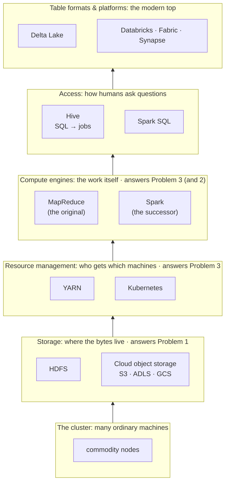

# A Map of the Ecosystem

You now have the two ideas the whole foundation rests on. From the [first article](when-one-machine-isnt-enough.md), *why* we use many machines: one machine hits the wall of price, reliability, or read speed. From the [second](three-hard-problems.md), *what it costs*: storing across machines, surviving constant failure, and coordinating slices into one answer.

This page is different from the two before it. It teaches almost nothing new. It is a **map**: one picture of the whole cast of characters, drawn so that when you meet HDFS in the next module, or Hive two modules later, you already know where it sits and what it is there to do. Bookmark it. Every module on this journey ends by pointing back here, at a slightly different spot, saying *you are here.*

Here is the entire ecosystem on one page. Read it from the **bottom up**, because that is the order it was built in, and the order we will learn it in.

Every arrow means *rests on*. A layer cannot do its job without the ones beneath it, which is exactly why we learn from the ground up, and why dropping a beginner straight into Spark leaves them standing on floors they never built.

---

## The tour, one layer at a time

Each layer below is a one-paragraph orientation, not the lesson, just the location. In brackets: which of the [three problems](three-hard-problems.md) it answers, and which module teaches it properly.

**The cluster.** The ground floor is just *machines*, a rack (or a data centre, or a cloud region) of ordinary computers on a network. Everything above is software that makes those separate boxes behave like one system. *(This is the whole reason the ecosystem exists; see the [first article](when-one-machine-isnt-enough.md).)*

**Storage: HDFS and cloud object storage.** Before you can compute on a 10 TB file, something has to *hold* it across many disks and let you find it again. HDFS was the original answer; cloud object storage (S3, ADLS, GCS) is the modern one that largely replaced it. *(Problem 1: storage · Module 1.)*

**Resource management: YARN and Kubernetes.** A cluster is shared. When ten jobs all want the machines at once, something has to decide who gets what, and when. YARN was Hadoop's answer; Kubernetes is today's general-purpose one. *(Problem 3: coordination, the "who runs where" part · Module 1.)*

**Compute engines: MapReduce and Spark.** This is the layer that actually *does the work*: reads the data, moves it where it needs to go, and produces the answer. MapReduce was first and is now mostly history; **Spark is its faster, friendlier successor** and the centre of gravity for this whole site. *(Problem 3, plus a cleverer answer to Problem 2 · Modules 1 and 3.)* You have already met Spark's own introduction: [What Is Apache Spark?](../1.0_Spark/1.0_Spark-Concepts.md)

**Access: Hive and Spark SQL.** Almost nobody wants to write low-level compute code by hand. This layer lets you ask questions in **SQL** and quietly compiles them down into jobs on the engine below. Hive pioneered it; Spark SQL is the modern equivalent built into Spark. *(Modules 2 and 5.)*

**Table formats and platforms: Delta Lake, Databricks, Fabric.** The newest layer adds database-like guarantees (transactions, versioning) on top of plain files, and wraps the whole stack in managed cloud platforms so you do not run any of the lower layers yourself. *(Module 7 and the platform tracks.)*

---

## Three eras, same foundation

It helps to know that this stack was not designed all at once. It grew in three waves, and the map above quietly contains all three:

- **The Hadoop era.** HDFS + YARN + MapReduce + Hive. Storage and compute lived together on the same machines; everything wrote to disk between steps.
- **The Spark era.** The same storage, but a faster engine that keeps work in memory, and, increasingly, storage moved *off* the cluster into cloud object stores, so compute and storage scale separately.
- **The lakehouse era.** Table formats like Delta Lake bring warehouse-grade reliability to cheap cloud files, and managed platforms hide the machinery entirely.

Each wave kept the layer below and replaced the layer above. We will trace that arc properly much later, in *From Hadoop to the lakehouse*. For now, just notice that nothing was thrown away; it was *renovated.*

---

## The path from here

The map is the "what fits where." Here is the "in what order", the single reading line through the foundations and into Spark:

1. **Why big data:** the three walls, and the three problems. *(You are finishing this now.)*
2. **Hadoop:** HDFS, then YARN, then MapReduce, then the cluster modes. *(Module 1, next.)*
3. **Hive:** SQL over big data, its reason for existing, schema-on-read, and the metastore. *(Module 2.)*
4. **Spark:** what it is, how it executes, and how to read what it is doing. *(Module 3, the existing Spark tab.)*
5. …and onward into working with data, Spark SQL, performance, and the lakehouse.

!!! quote "How to use this map"
    You do not need to memorise a single box on it today. You need only the *shape*: **storage at the bottom, an engine in the middle, SQL and platforms on top, and every layer answering one of the three hard problems.** When a later article introduces a tool, come back here, find its box, and you will already know why it exists and what it stands on.

---

## You are here

You have finished Module 0. You can now answer, from first principles, *why* the big-data ecosystem exists and *what problems* every part of it is fighting. That is genuinely the hardest conceptual step, and everything after this is detail hanging off a frame you now hold in your head.

Next, we descend to the bottom of the map and build the first real layer: **Hadoop**, starting with the storage problem: how do you keep a file that is bigger than any single disk?

---

*Next: **Module 1, Hadoop**, beginning with **HDFS: storing a file too big for one disk**. (Coming next in this curriculum.)*
