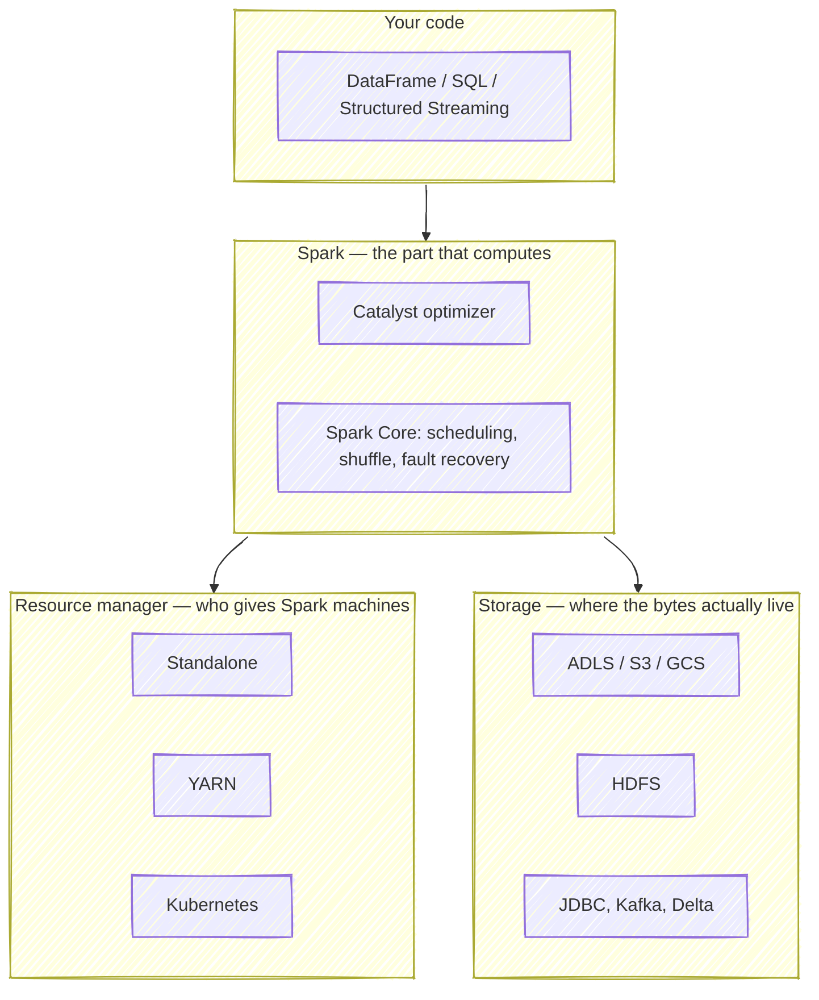
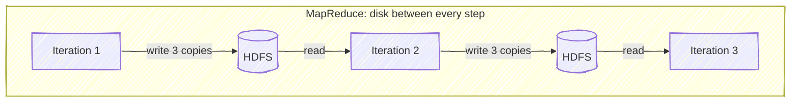
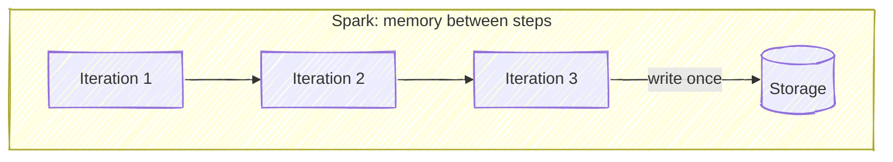
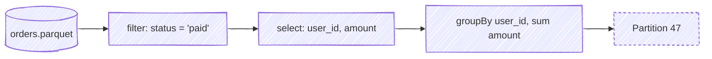
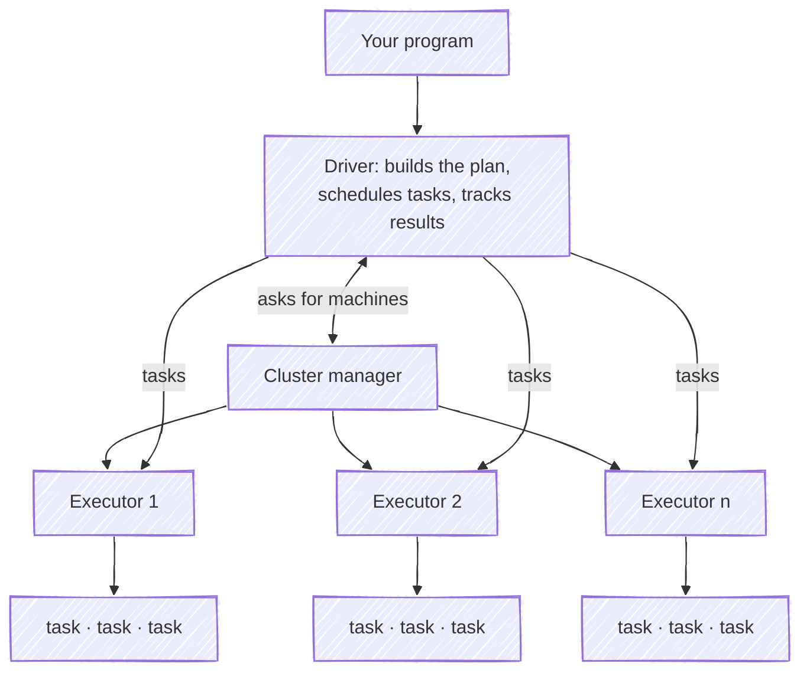

# What Is Apache Spark?

Someone hands you two terabytes of clickstream logs and asks a simple question: how many unique users visited last Tuesday?

On one machine, this is not a hard problem. It is just a slow one. A fast NVMe drive reads at roughly 2 GB/s, so merely *reading* the bytes takes about seventeen minutes — before you have counted anything. Put those logs on a decent network drive instead and you are waiting hours. And you cannot hold the data in memory while you work, because you do not have two terabytes of RAM.

The obvious fix is to use more machines. Split the logs across a hundred of them, have each count its own share, add up the answers. Seventeen minutes becomes ten seconds.

The obvious fix is also where all the difficulty begins. Machines fail halfway through. Counting unique users means the same user's events must end up on the same machine, so data has to *move* between them. Some machines finish early and sit idle. One machine gets the shard containing your biggest customer and takes twenty times longer than the rest.

**Apache Spark exists so that you can write the ten-second version without thinking about any of that.** You describe the computation as though the data were a single local collection. Spark works out how to spread it across the cluster, what to do when a machine dies, and when data needs to move.

That is the whole pitch. Everything below is the interesting part: how it pulls that off, and what it costs you.

---

## Spark is an engine, not a system

This trips up almost everyone at first, because "big data platform" sounds like it should include storage. It does not.

Spark computes. It does not store anything durably, and it does not decide which machines it gets to run on. Both of those are somebody else's job, and Spark is deliberately agnostic about who.



Spark ships with a simple built-in "standalone" cluster manager so it can run on its own, which is why a laptop install works with no other setup. In production it usually borrows machines from YARN or Kubernetes instead.

!!! note "Why this separation matters"
    Because it means **the storage question and the compute question are independent.** You can point the same Spark job at HDFS today and ADLS tomorrow by changing a path. That decoupling is why Spark survived the migration from on-premise Hadoop clusters to cloud object storage, while the rest of the Hadoop stack largely did not.

---

## What MapReduce got wrong

Spark did not arrive in a vacuum. It arrived as a rebuttal.

Hadoop MapReduce, the previous answer, worked in rigid rounds: **map** the data, **shuffle** it so related records meet, **reduce** it to an answer. Between every round, the intermediate results were written to HDFS — and HDFS, by default, wrote three replicated copies to disk across the network.

For one round, that is tolerable. The trouble is that real work is rarely one round.

Consider training a model, or running k-means, or any query with several joins. Each iteration reads the last iteration's output back off disk, computes, and writes it out again — three replicated copies at a time.





Spark's core insight was almost rude in its simplicity: **stop writing to disk between the steps.** Keep intermediate results in memory and hand them straight to the next stage.

That is where the famous "100× faster than MapReduce" figure comes from. It is also where you should be a little suspicious of it.

!!! warning "About that 100× number"
    The 100× benchmark was an **iterative, in-memory** workload — logistic regression, where the same dataset is scanned dozens of times. Of course it wins by two orders of magnitude; it eliminates dozens of disk round-trips.

    A more honest data point is the 2014 Daytona GraySort benchmark, a *disk-bound* workload that Spark cannot cheat at. Spark sorted 100 TB in 23 minutes on 206 machines. Hadoop took 72 minutes on 2,100 machines.

    Three times faster, with ten times fewer machines. That is a spectacular result, and it is nowhere near 100×. For a single-pass ETL scan — which is what most of your jobs actually are — expect a modest multiple, not a miracle. Spark's real advantage there is that you write far less code.

---

## The idea that makes memory safe: lineage

Here is the problem with "keep everything in memory": memory dies with the machine. MapReduce's obsessive disk writing was not stupidity. It *was* the fault-tolerance mechanism. If a node died, the data was still on HDFS, replicated three ways.

Throw out the disk writes and you throw out the recovery story with them. So Spark needed a different one.

Its answer is to keep, instead of extra copies of the data, **the recipe that produced it**. Every distributed dataset in Spark remembers which operations built it and from what. That chain is called its **lineage**.



If the executor holding partition 47 dies, Spark does not need a backup of partition 47. It walks back up the lineage, re-reads only the slice of `orders.parquet` that fed it, and replays the three operations to rebuild exactly that partition. Nothing else in the job is recomputed, and nothing was ever replicated.

This is a genuinely elegant trade: pay a little computation on the rare failure, instead of paying triple disk writes on every single step.

Two consequences fall out of it, and they explain things you will otherwise find baffling:

=== "Transformations must be deterministic"
    If replaying an operation could produce a different answer, recovery would silently corrupt results. This is why Spark is fussy about non-deterministic user code, and why a UDF that calls `random()` or reads the system clock can produce results that change when a node fails.

=== "Very long lineage becomes a liability"
    Rebuild a chain that is a thousand operations deep and recovery costs more than the original job. This is what `checkpoint()` is for — it truncates the lineage by writing the data down for real, deliberately trading Spark's clever recovery for MapReduce's dumb, reliable one.

---

## Lazy on purpose

Write this in a notebook and Spark does nothing at all:

```python
df = spark.read.parquet("s3://logs/2024/")     # reads the schema, and no rows
paid = df.filter(df.status == "paid")          # builds a plan node, filters nothing
totals = paid.groupBy("user_id").sum("amount") # still nothing
```

Not one row has been read. Spark has built a description of what you want, and is waiting.

Then you ask for an answer:

```python
totals.show()   # now Spark runs
```

Operations that build the plan are **transformations**. Operations that demand an answer — `show`, `count`, `collect`, `write` — are **actions**. Only actions execute anything.

This laziness is not an implementation quirk. It is the source of most of Spark's speed. Because Spark sees the *entire* plan before running any of it, its optimizer (Catalyst) can rearrange the whole thing:

- Your `filter` gets pushed **into the Parquet reader**, so rows that fail the predicate are never decoded, never leave the disk, never cross the network.
- Only the two columns you eventually reference get read at all. The other forty are skipped.
- Adjacent operations get fused into a single pass over the data.

An eager system cannot do any of this. By the time it knows you wanted a filter, it has already loaded everything.

!!! tip "The flip side, and it bites everyone"
    Because Spark forgets everything between actions, **each action re-runs the plan from the source.**

    ```python
    print(totals.count())   # scans the data
    print(totals.count())   # scans the data again
    ```

    Two full scans, two bills. This single fact explains most surprised faces at the end of the month. See [Multiple-Pass Aggregation Waste](../1.1_PySparkGotchas/MultiplePassAggregation.md) for what to do about it, and [caching](1.3_persist_and_cache.md) for when to keep the result around.

---

## How a job actually runs

When an action fires, Spark's **driver** — the process running your code — turns the plan into physical work and hands it to **executors**, the JVM processes that hold data and do the computing.



The vocabulary is worth getting straight once, because every performance conversation uses it:

| Term | What it is |
|---|---|
| **Job** | Everything triggered by one action. |
| **Stage** | A run of operations needing no data movement. Stage boundaries are shuffles. |
| **Task** | One stage applied to one partition. The unit of parallelism. |
| **Partition** | One slice of the data. One task processes one partition. |

The important line in that table is the one about stages. A **shuffle** — moving records between machines so that related ones meet, as `groupBy` and most joins require — is the single most expensive thing Spark does. It writes to disk, crosses the network, and forces every task in the stage to finish before the next stage can start.

Optimizing Spark is, almost entirely, the art of shuffling less. Which is why it is worth knowing exactly which operations cause one: see [narrow vs wide transformations](1.1_NarrowVsWideTransformation.md), then [shuffle](1.12_Spark_Shuffle.md), and eventually [Spark architecture](1.2_SparkArchitecture.md) for the full picture.

---

## "In-memory" does not mean "must fit in memory"

This is the most persistent myth about Spark, and it stops people from using it on exactly the data it is good at.

Spark **prefers** memory. It does not **require** it. When a partition does not fit, Spark spills it to local disk and carries on. When a cached dataset outgrows the space you gave it, Spark evicts the oldest blocks and recomputes them later from lineage. Your two-terabyte job runs fine on a cluster with two hundred gigabytes of RAM. It just runs slower.

What "in-memory" really buys you is **reuse**. If a dataset is read once and written once, memory barely matters — you are I/O bound and MapReduce would have been fine. If the same dataset is read fifteen times, keeping it in RAM turns fifteen disk scans into one.

That is the actual decision rule for `.cache()`, and it is why cache-everything is a strategy that reliably makes jobs slower. See [Over-Caching Memory Waste](../1.1_PySparkGotchas/Over-CachingMemoryWaste.md).

---

## Where Hadoop and Hive fit today

Spark grew up inside the Hadoop ecosystem, and the ecosystem has since been quietly dismantled around it. Knowing which parts survived saves a lot of confusion when you meet their names in a config file.

| Hadoop component | What it did | Status today |
|---|---|---|
| **HDFS** | Distributed file system | Largely replaced by object storage — ADLS, S3, GCS |
| **MapReduce** | Processing engine | Effectively dead as something you write |
| **YARN** | Cluster manager | Alive on-premise; Kubernetes elsewhere |
| **Hive** | SQL over HDFS | Its *engine* died. Its **metastore** is everywhere |

The Hive story is the interesting one, and it explains a name you will keep tripping over.

Hive was a way to run SQL over files in HDFS by translating queries into MapReduce jobs. Nobody wants that translation any more — Spark SQL does the job better. But Hive also needed somewhere to record *what tables exist, what columns they have, and where their files live.* That component, the **Hive metastore**, turned out to be the genuinely useful part, and it outlived everything around it.

So when you open Databricks and find a catalog sitting there called `hive_metastore`, this is why. You are not using Hive. You are using the card catalogue Hive left behind.

??? question "“We only use Databricks and Synapse. I've never touched Hive.”"
    You have, constantly. Run this against any managed table:

    ```sql
    DESCRIBE EXTENDED my_table;
    ```

    Look at `Provider`, `Location`, and `Table Properties`. Something is remembering all that between sessions, and on most platforms that something is a Hive metastore — or Unity Catalog, which replaces it.

    You never had to install it, configure a backing database, or think about it. That is the entire value proposition of a managed platform, and it is also why the name keeps surprising people who never chose it.

    See [Hive concepts](../4.0_Hive/Hive_Concepts.md) and [Spark databases, tables and catalogs](1.13_SparkDatabaseTablesCatalogsMetastore.md).

---

## Open-source Spark or a managed platform?

You can run Spark yourself, free, on any machines you like. Or you can pay Databricks, Microsoft, Amazon or Google to run it for you. The engine underneath is the same Apache Spark.

What you are buying is time.

Standing up Spark, Hive metastore, a cluster manager, storage connectors, authentication and monitoring on bare metal is a project measured in months, and an operational burden measured in years. Signing up for Databricks and running your first query is an afternoon.

| | Self-managed Spark | Managed platform |
|---|---|---|
| **Time to first query** | Weeks to months | An afternoon |
| **Cost** | Hardware and your team's time | Per-second compute, at a markup |
| **Tuning** | Every knob is yours | Sensible defaults, some knobs hidden |
| **Failures** | Your pager | Their pager |
| **Lock-in** | None | Real: Delta, Unity Catalog, notebooks, job schedulers |
| **Good for** | Steady predictable load, strict data residency, cost at scale | Almost everyone else |

The honest summary: if your organisation does not already employ people who enjoy operating distributed systems, a managed platform will be cheaper even though the invoice is larger. The invoice is simply the only cost you can see.

---

## When you should not use Spark

This section matters more than any other on this page, because the most common Spark performance problem is that Spark should not have been there.

=== "Your data fits on one machine"
    A cluster is not free. Spinning it up takes tens of seconds. Every shuffle crosses a network. Every row gets serialized. You pay all of that before a single useful operation.

    A laptop with 32 GB of RAM running **DuckDB** or **Polars** will beat a five-node Spark cluster on a 50 GB dataset, and it will beat it badly. Single-machine tools have gotten dramatically better while everyone was busy provisioning clusters.

    A useful rule: **below a few hundred gigabytes, reach for one machine first.** Reach for Spark when one machine has genuinely stopped being an option, not when the dataset merely feels large.

=== "You need an answer in milliseconds"
    Spark job startup is measured in seconds. Even a trivial query pays scheduling overhead, task serialization, and JVM warm-up.

    This is fine for a pipeline that runs hourly. It is hopeless behind a web request. Serve queries from a database — Postgres, ClickHouse, a key-value store. Use Spark to *build* what that database serves.

=== "You need row-level updates and point lookups"
    "Give me user 12345" makes Spark scan a lot of files to find one row. Modern table formats like Delta and Iceberg soften this with statistics and file skipping, but the fundamental shape is still a scan, not a lookup.

    Databases have indexes. Use one.

=== "The algorithm is tightly iterative and small"
    Deep recursion, tight loops over small state, anything that needs a hundred rapid synchronization points — the per-stage overhead dominates and Spark spends its time coordinating rather than computing.

!!! quote "The rule of thumb"
    Use Spark when the data genuinely exceeds one machine, the work is a scan or an aggregation over most of it, and latency is measured in minutes rather than milliseconds.

    Outside that box, something simpler is almost certainly faster, cheaper, and easier to debug at two in the morning.

---

## Misconceptions worth clearing up

??? failure "“Spark is 100× faster than MapReduce.”"
    On iterative in-memory workloads, roughly. On ordinary single-pass ETL, expect a modest multiple. Spark's durable advantage is that the code is a tenth the size, not that the CPU is a hundred times busier.

??? failure "“Your data must fit in RAM.”"
    No. Spark spills to disk and recomputes evicted blocks from lineage. Memory makes *reuse* cheap; it is not an entry requirement.

??? failure "“You should learn RDDs first, since DataFrames are built on them.”"
    Backwards. RDDs are the low-level API and Catalyst cannot optimize them — it cannot see inside your lambda. Write DataFrames and Spark SQL. You will need RDDs perhaps once a year, and when you do, you will know.

    See [RDDs, DataFrames and Datasets](1.9_RDD_Dataframe_Dataset.md).

??? failure "“Adding executors makes a job faster.”"
    Only until you have more executors than partitions, after which the extras sit idle. And if the job is bottlenecked on one skewed partition, a thousand executors change nothing — 999 of them wait. See [Data Skew](<../1.1_PySparkGotchas/Data Skew-TheSilentPerformanceKiller.md>).

??? failure "“Spark is a database.”"
    Spark has no storage, no indexes, no transactions of its own, and no serving layer. It reads other people's data, computes, and writes the answer somewhere else. Delta Lake adds transactions *to the storage*, not to Spark.

---

## Key takeaways

!!! success "What to remember"
    - **Spark is a compute engine.** Storage and cluster management are pluggable and belong to someone else.
    - **It beat MapReduce by not writing to disk between steps**, and it stayed correct by remembering lineage instead of replicating data.
    - **Nothing runs until an action.** Laziness is what lets Catalyst optimize the whole plan — and it is why calling `count()` twice scans twice.
    - **Shuffles are the cost.** Stages are separated by them. Tuning Spark means shuffling less.
    - **"In-memory" means memory is preferred, not required.** Spark spills.
    - **Hive's engine died; its metastore is everywhere.** That is why `hive_metastore` keeps appearing in platforms that never mention Hive.
    - **The best Spark optimization is often not using Spark.** Below a few hundred gigabytes, one machine wins.

---

## See also

<div class="grid cards" markdown>

-   :material-language-python:{ .lg .middle } __Python, PySpark and Spark__

    ---

    Does installing PySpark give you "real" Spark? The confusion, resolved.

    [:octicons-arrow-right-24: Read more](1.0.1__Python_PySpark_Spark_Confusion.md)

-   :material-sitemap:{ .lg .middle } __Spark Architecture__

    ---

    Drivers, executors, cores and slots — and how many of each you need.

    [:octicons-arrow-right-24: Read more](1.2_SparkArchitecture.md)

-   :material-table:{ .lg .middle } __RDDs, DataFrames and Datasets__

    ---

    Three APIs, one engine. Which to write, and why it is not RDDs.

    [:octicons-arrow-right-24: Read more](1.9_RDD_Dataframe_Dataset.md)

-   :material-speedometer-slow:{ .lg .middle } __PySpark Gotchas__

    ---

    Thirteen ways a correct job becomes an expensive one.

    [:octicons-arrow-right-24: Read more](../1.1_PySparkGotchas/index.md)

</div>

**Next:** if you want to run Spark on your own machine before going further, start with [installing PySpark](Install-Pyspark-Windows/Install-Pyspark-Windows.md). If you would rather understand the execution model first, go to [narrow vs wide transformations](1.1_NarrowVsWideTransformation.md) — it is the shortest path to understanding why some Spark code is a hundred times slower than code that looks identical.
