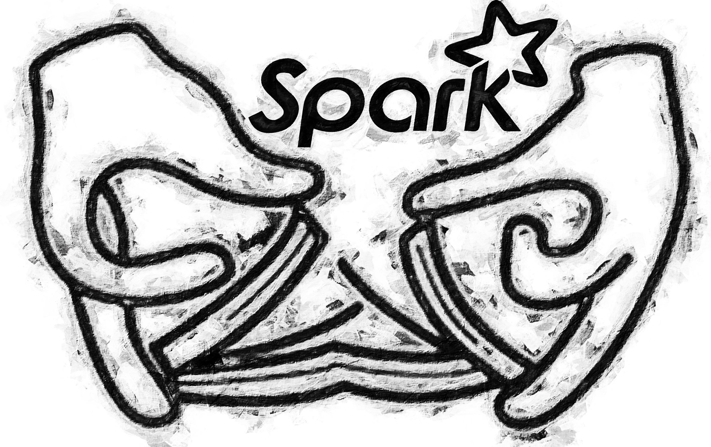

## Shuffle in Spark - Moving Data Between Partitions

You know about partitions, where data is divided into different containers. But, suppose you are doing a `GroupBy` operation. You will need to bring the data together in one place.

This process of bringing data from different partitions to one place is called shuffle.

Shuffle happens during operations like `GroupBy`, `Join`, or `ReduceByKey`.

However, shuffle is very expensive. Our goal should be to reduce it as much as possible. Here are some ways to reduce shuffle:

### Combine Operations to Reduce Shuffles

Instead of doing separate operations that cause multiple shuffles, combine them into one.

```python
df1 = df.groupBy("id").count()
df2 = df1.filter(df1["count"] > 1)
# Combined operations to reduce shuffles:
df_combined = df.groupBy("id").count().filter("count > 1")
df_combined.show()
```

### Repartition Your Data

Repartition your data to balance the load and optimize data distribution.

```python
# Example DataFrame
df = spark.createDataFrame([(1, 'a'), (2, 'b'), (1, 'c'), (2, 'd')], ["id", "value"])

# Repartitioning to optimize data distribution
df_repartitioned = df.repartition("id")
df_repartitioned.show()
```

### Cache Data for Reuse

Cache data that you need to use multiple times to avoid repeated shuffling.

```python
# Example DataFrame
df = spark.createDataFrame([(1, 'a'), (2, 'b'), (1, 'c'), (2, 'd')], ["id", "value"])

# Caching intermediate DataFrame
df_cached = df.cache()

# Using cached DataFrame multiple times
df_cached.groupBy("id").count().show()
df_cached.filter(df_cached["id"] == 1).show()
```

So, you can  operations, repartitioning data, and cahe frequently used data to reduce shuffle.