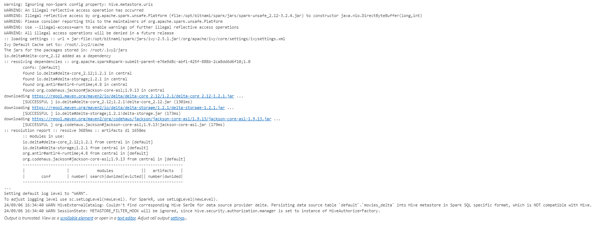
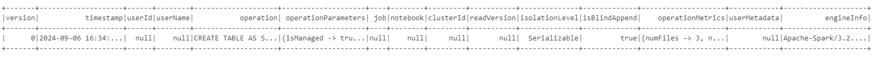
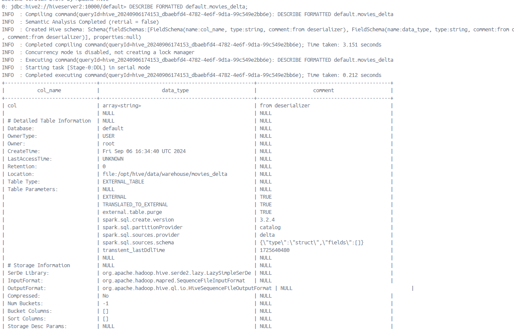

# Creating Delta Tables in Hive with Spark

## Overview

This article will explain two things:
- How to create tables in Hive.
- How to create Delta tables in Hive.

### The Setup:

**Spark**: You can run this example on any Spark setup—Spark clusters or PySpark. There's no special Spark setup required, meaning the code will work on any basic Spark environment. However, there is one important condition: the **Spark version must be 3.2**. Don’t use newer versions like 3.4 or 3.5, as they can cause compatibility issues. Also, the **Delta package must be `delta-core_2.12:1.2.1`**. After many trials, this combination works smoothly.

**Hive**: The Hive Metastore can be accessed using the address `thrift://metastore:9083`. You need to make sure Spark can connect to this location. Apart from this, there's nothing else to configure.

### The Code:

```python
from pyspark.sql import SparkSession

# Create a Spark session and load Delta Lake dependencies dynamically from Maven
spark = SparkSession.builder \
    .appName("Spark Hive Delta Integration") \
    .config("spark.sql.catalogImplementation", "hive") \
    .config("hive.metastore.uris", "thrift://metastore:9083") \
    .config("spark.sql.extensions", "io.delta.sql.DeltaSparkSessionExtension") \
    .config("spark.sql.catalog.spark_catalog", "org.apache.spark.sql.delta.catalog.DeltaCatalog") \
    .config("spark.jars.packages", "io.delta:delta-core_2.12:1.2.1") \
    .enableHiveSupport() \
    .getOrCreate()

# Sample data for Delta table
data = [("Rambo", 30), ("Titanic", 25)]
df = spark.createDataFrame(data, ["name", "release"])

# Create a Delta table in Hive
df.write.format("delta").saveAsTable("default.movies_delta")
```

### The Output:



### Showing the Table Data:

```python
# Read Delta table and show schema
df = spark.read.format("delta").table("default.movies_delta")
df.printSchema()
```

### Showing the History (A Delta Feature):

```python
from delta.tables import *

# Load Delta table
delta_table = DeltaTable.forName(spark, "default.movies_delta")

# Show the history of the Delta table
delta_table.history().show()
```

Here is how the history will look:



### If You Don't Want to Use Hive:

If you don’t want to use Hive and just want to save data to any location, you can also do that. Here’s the code:

```python
spark = SparkSession.builder \
    .appName("Spark Delta Integration") \
    .config("spark.sql.extensions", "io.delta.sql.DeltaSparkSessionExtension") \
    .config("spark.sql.catalog.spark_catalog", "org.apache.spark.sql.delta.catalog.DeltaCatalog") \
    .config("spark.jars.packages", "io.delta:delta-core_2.12:1.2.1") \
    .getOrCreate()

# Sample data for Delta table
data = [("Rambo", 30), ("Titanic", 25)]
df = spark.createDataFrame(data, ["name", "release"])

# Write the DataFrame to a Delta table
df.write.format("delta").save("/tmp/delta-table")

# Read back the Delta table
delta_df = spark.read.format("delta").load("/tmp/delta-table")
delta_df.show()
```

---

## Errors Encountered

Here are some errors you might face due to incompatibility between Delta and Spark versions:

> Py4JJavaError: An error occurred while calling o79.save.  java.lang.NoClassDefFoundError: org/apache/spark/sql/execution/datasources/FileFormatWriter$Empty2Null

> java.lang.NoSuchMethodError: 'org.apache.spark.sql.catalyst.TableIdentifier org.apache.spark.sql.catalyst.TableIdentifier.copy(java.lang.String, scala.Option)'


**Warning**

You might see a warning like this:

WARN HiveExternalCatalog: Couldn't find corresponding Hive SerDe for data source provider delta. Persisting data source table default.movies_delta into Hive metastore in Spark SQL specific format, which is NOT compatible with Hive.

**Reason:**
Hive can handle many table types, but Delta Lake (a storage format by Databricks) is not supported by Hive directly. Spark uses its own format to save Delta tables, which doesn’t match Hive’s SerDe (Serializer/Deserializer). This warning comes up because Hive can’t read Delta tables directly unless special Delta support is added or managed via Spark.

**Solution:**
Since Delta tables are built for Spark, the simplest way is to keep using Spark to query your Delta tables. Don’t register them in Hive’s metastore. Instead, manage them directly with Spark to avoid Hive trying to read the Delta format.

**Note:** Hive doesn’t natively support Delta, but you can use Delta Lake open-source libraries to connect Hive and Delta. However, this setup is complicated and not very reliable.


## JARs Download

When you use the following configuration:

```python
.config("spark.jars.packages", "io.delta:delta-core_2.12:1.2.1")
```

It automatically downloads the necessary JARs from these locations:

- [Delta Core 2.12 JAR](https://repo1.maven.org/maven2/io/delta/delta-core_2.12/2.2.0/delta-core_2.12-2.2.0.jar)
- [Delta Storage JAR](https://repo1.maven.org/maven2/io/delta/delta-storage/2.2.0/delta-storage-2.2.0.jar)
- [ANTLR Runtime JAR](https://repo1.maven.org/maven2/org/antlr/antlr4-runtime/4.8/antlr4-runtime-4.8.jar)

## Seeing the table using beeline

From any server, not hiveserver2, connect to the beeling in hiveserver2 using this command:

```bash
beeline -u jdbc:hive2://hiveserver2:10000/default
```

Issue a command 

```sql
DESCRIBE FORMATTED default.movies_delta;
```

YOu will see an output like this:



