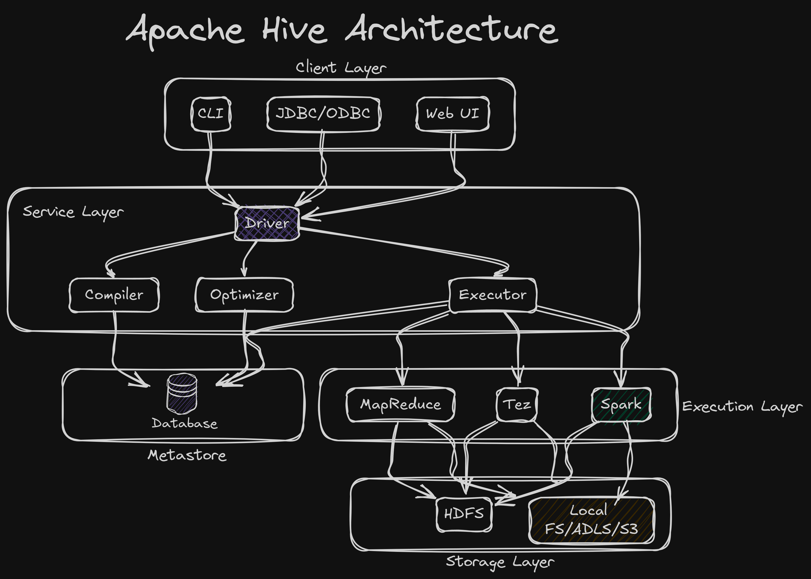
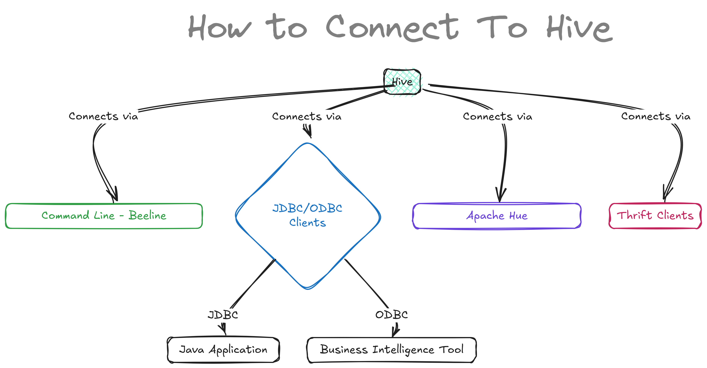
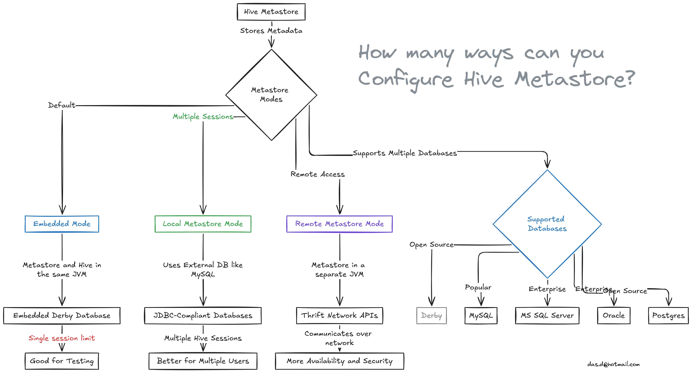
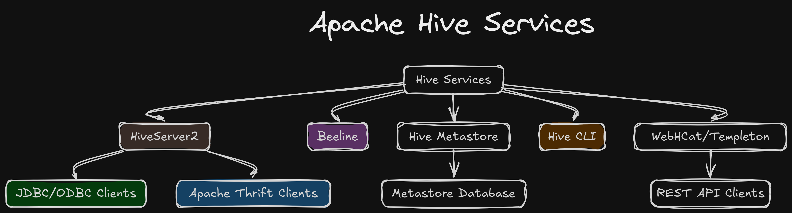

## Apache Hive Architecture



## Hive Clients

Hive clients provide various interfaces to connect to and interact with Hive, enabling you to execute queries and manage data. Below are the primary client types:



### 1. Command Line Interface (CLI)

**Beeline** is the modern, recommended command-line tool for Hive, replacing the deprecated legacy CLI. It connects to HiveServer2 and provides:
- Multi-user support
- Security features (Kerberos authentication)
- Distributed query handling
- Production-ready environment

**Example Usage**:
```bash
# Connect to HiveServer2
beeline -u jdbc:hive2://localhost:10000 -n myuser -p mypassword

# Execute queries
SELECT * FROM sales_data;
```

### 2. JDBC/ODBC Clients

These standard database protocols enable applications and BI tools to connect with Hive:
- **JDBC**: Primarily used in Java applications
- **ODBC**: Used by tools like Power BI, Excel, and Tableau

**Java JDBC Example**:
```java
import java.sql.*;

public class HiveJDBCExample {
    public static void main(String[] args) throws Exception {
        String url = "jdbc:hive2://localhost:10000/default";
        Connection conn = DriverManager.getConnection(url, "myuser", "mypassword");
        Statement stmt = conn.createStatement();
        ResultSet rs = stmt.executeQuery("SELECT * FROM my_table");
        
        while (rs.next()) {
            System.out.println(rs.getString(1));
        }
        
        stmt.close();
        conn.close();
    }
}
```

### 3. Apache Hue

Apache Hue provides a user-friendly web-based interface for data interaction. Features include:
- Query editor with syntax highlighting
- Result visualization
- Data browsing capabilities
- Support for multiple systems: Hive, HBase, Impala, Presto, SparkSQL, Flink SQL, ElasticSearch, PostgreSQL, Redshift, BigQuery, and more

### 4. Thrift Clients

Thrift enables multi-language support, allowing Hive integration across diverse programming environments beyond Java.

**Python Example using PyHive**:
```python
from pyhive import hive

# Connect to HiveServer2
conn = hive.Connection(host='localhost', port=10000, username='myuser')

# Execute query
cursor = conn.cursor()
cursor.execute('SELECT * FROM employees')

# Fetch results
for row in cursor.fetchall():
    print(row)
```

## Hive Metastore

The Hive Metastore serves as the central metadata repository for Hive's Data Warehouse, storing all table definitions, schemas, and locations. The actual data resides in storage systems like HDFS, ADLS, or S3.

### Metastore Deployment Modes



#### 1. Embedded Metastore Mode

**Configuration**: Metastore service and Hive service run in the same JVM using an embedded Apache Derby database.

**Limitations**:
- Single session support only
- Derby database allows only one connection at a time
- Suitable for testing and development only

**Use Case**: Local development and testing environments.

#### 2. Local Metastore Mode

**Configuration**: Supports multiple concurrent sessions using an external JDBC-compliant database (MySQL, PostgreSQL, etc.) while the metastore service runs in the same JVM as Hive.

**Setup Requirements**:
- Add JDBC driver to Hive's lib folder
- Configure connection properties:
  - `javax.jdo.option.ConnectionURL`: `jdbc:mysql://host/dbname?createDatabaseIfNotExist=true`
  - `javax.jdo.option.ConnectionDriverName`: `com.mysql.jdbc.Driver`

**Use Case**: Small to medium deployments with moderate concurrency needs.

#### 3. Remote Metastore Mode (Recommended for Production)

**Configuration**: Metastore runs as a separate service in its own JVM. Clients communicate via Thrift Network APIs.

**Advantages**:
- High availability through multiple metastore servers
- Enhanced security with database firewall protection
- Better manageability and isolation
- No direct database access required for clients

**Configuration**: Set `hive.metastore.uris` to `thrift://host:port`

**Use Case**: Production environments requiring high availability and security.

### Supported Backend Databases

- Apache Derby
- MySQL
- Microsoft SQL Server
- Oracle
- PostgreSQL

## Apache Hive Services



## Common Misconceptions About Hive

### Is Hadoop and MapReduce Mandatory for Hive?

**No.** While Hive was originally tightly coupled with Hadoop, modern Hive deployments are storage-agnostic:

**Storage Evolution**:
- **Legacy**: HDFS was the only reliable distributed storage option
- **Modern**: S3, Azure Data Lake Storage (ADLS), Google Cloud Storage, and other cloud storage systems

**Execution Engine Evolution**:
- **Legacy**: MapReduce was the default execution engine
- **Modern**: Apache Spark has largely replaced MapReduce due to superior performance
- **Supported Engines**: Spark, Tez, MapReduce (optional)

**Conclusion**: Modern Hive deployments can run entirely without traditional Hadoop or MapReduce components.

## Hive Warehouse Data Storage in Distributed Systems

In distributed environments, choosing the correct storage location for Hive warehouse data is critical. The warehouse directory stores actual table data (distinct from metadata in the Metastore).

### Storage Requirements

**Challenge**: In multi-node systems (Spark, Hive, Hadoop running on separate containers/machines), data must be accessible to all nodes. Local storage creates data silos, preventing cluster-wide access.

**Solution**: Use shared, distributed storage accessible to all cluster nodes.

### Storage Options

#### 1. HDFS (Hadoop Distributed File System)

**Best for**: Traditional Hadoop clusters and on-premises deployments

**Configuration** (`hive-site.xml`):
```xml
<property>
  <name>hive.metastore.warehouse.dir</name>
  <value>hdfs://namenode:8020/user/hive/warehouse</value>
  <description>Hive table data location in HDFS</description>
</property>
```

**How It Works**:
- All cluster nodes connect to the same HDFS namenode
- Data is replicated across datanodes for fault tolerance
- All services (Spark, Hive, etc.) access the same data location
- Provides data consistency across the cluster

#### 2. Cloud Object Storage (Recommended for Cloud Deployments)

**Best for**: Cloud-native deployments with elastic scaling needs

**Amazon S3 Example**:
```xml
<property>
  <name>hive.metastore.warehouse.dir</name>
  <value>s3a://my-bucket/hive/warehouse</value>
  <description>Hive table data location in Amazon S3</description>
</property>
```

**Azure Data Lake Storage Example**:
```xml
<property>
  <name>hive.metastore.warehouse.dir</name>
  <value>abfss://container@account.dfs.core.windows.net/hive/warehouse</value>
  <description>Hive table data location in ADLS Gen2</description>
</property>
```

**Advantages**:
- Serverless, fully managed storage
- Unlimited scalability
- Cost-effective pay-per-use model
- Built-in redundancy and durability
- Decouples storage from compute

#### 3. Network File System (NFS)

**Best for**: On-premises environments with existing NFS infrastructure

**Configuration**:
```xml
<property>
  <name>hive.metastore.warehouse.dir</name>
  <value>/mnt/nfs/hive/warehouse</value>
  <description>Hive table data location in shared NFS mount</description>
</property>
```

**How It Works**:
- All nodes mount the same NFS share
- Single namespace provides data consistency
- Suitable for smaller clusters

**Considerations**:
- Performance may be limited compared to HDFS/cloud storage
- Single point of failure without HA NFS setup
- Network bandwidth constraints

#### 4. Local File System (Not Recommended for Production)

**Configuration**:
```xml
<property>
  <name>hive.metastore.warehouse.dir</name>
  <value>/opt/hive/data/warehouse</value>
</property>
```

**Why to Avoid**:
- Each node maintains separate data copies
- No data consistency across cluster
- Impossible to execute distributed queries properly
- Data isolation prevents proper operation

**Only Suitable For**:
- Single-node development environments
- Local testing scenarios
- Learning and experimentation

### Best Practices Summary

| Environment | Recommended Storage | Rationale |
|-------------|-------------------|-----------|
| Cloud (AWS) | Amazon S3 | Scalable, serverless, cost-effective |
| Cloud (Azure) | Azure Data Lake Storage (ADLS) | Native integration, high performance |
| Cloud (GCP) | Google Cloud Storage | Managed service, auto-scaling |
| On-premises Hadoop | HDFS | Purpose-built for Hadoop ecosystem |
| Hybrid/On-premises | NFS/Shared Storage | Existing infrastructure utilization |
| Development/Testing | Local File System | Quick setup, no dependencies |

**Key Principle**: Always ensure storage is accessible to all cluster nodes to maintain data consistency and enable distributed processing.