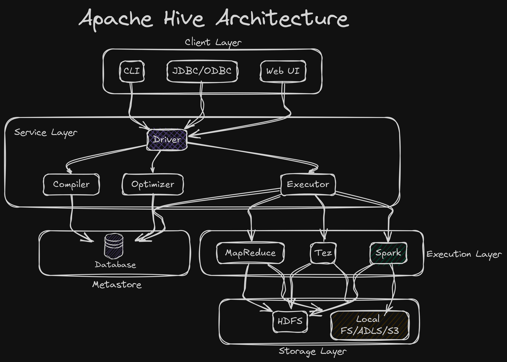
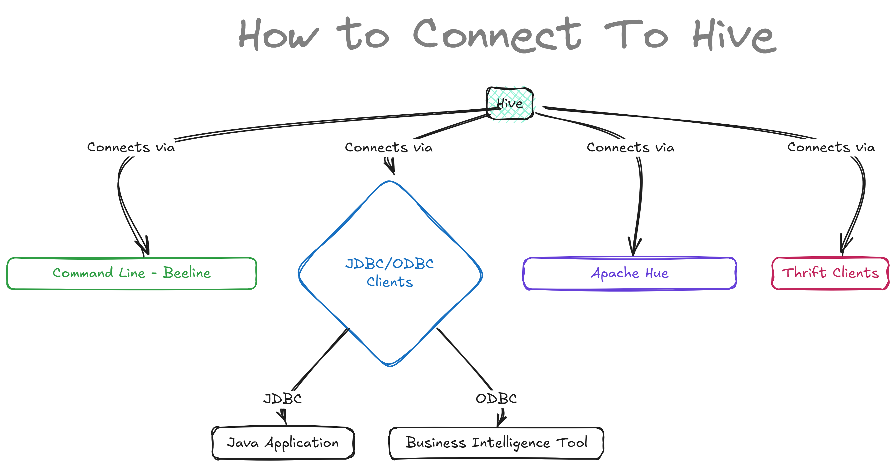
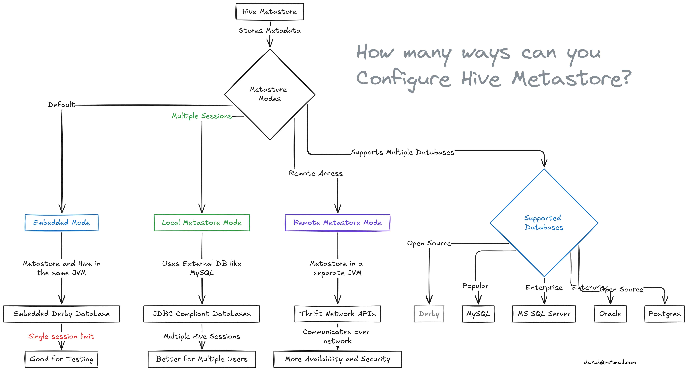
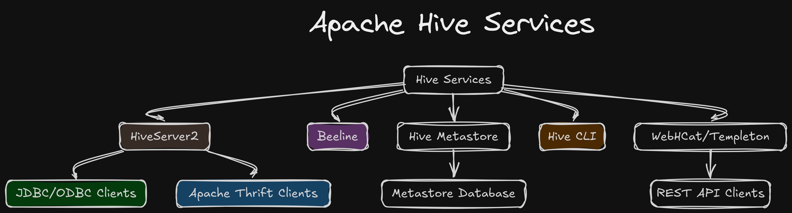

## Apache Hive Architecture



## What are Hive Clients?

Hive clients are different ways you can connect to and interact with Hive. They help you run queries and manage data in Hive. Here are the main Hive clients:



### 1. Command Line Interface (CLI):  
   The original Hive CLI allowed users to interact with Hive by typing SQL queries directly into the terminal (CMD or Linux shell). However, the older CLI has been deprecated in favor of **Beeline**, which connects to HiveServer2. Beeline is now the preferred way to run Hive queries from the command line as it supports multiple users, security (Kerberos authentication), and handles queries in a distributed environment, making it ideal for production.

   **Example**:
   - If you're using Beeline, you would start a session like this:
     ```bash
     beeline -u jdbc:hive2://localhost:10000 -n myuser -p mypassword
     ```
     This command connects to HiveServer2 running on `localhost` at port `10000`. You can then run queries like:
     ```bash
     SELECT * FROM sales_data;
     ```

### 2. JDBC/ODBC Clients:  
   JDBC and ODBC are protocols used to connect applications with Hive. These clients allow various tools and programs to interact with Hive and run SQL queries on the data. JDBC is most commonly used in Java applications, while ODBC is used by tools like Power BI, Excel, and Tableau.

  - In a Java program, you can connect to Hive using JDBC like this:
     ```java
     import java.sql.Connection;
     import java.sql.DriverManager;
     import java.sql.ResultSet;
     import java.sql.Statement;

     public class HiveJDBCExample {
         public static void main(String[] args) throws Exception {
             String url = "jdbc:hive2://localhost:10000/default";
             Connection conn = DriverManager.getConnection(url, "myuser", "mypassword");
             Statement stmt = conn.createStatement();
             ResultSet rs = stmt.executeQuery("SELECT * FROM my_table");
             
             while (rs.next()) {
                 System.out.println(rs.getString(1));
             }

             stmt.close();
             conn.close();
         }
     }
     ```

### 3. Apache Hue:  

Apache Hue is a popular web-based UI for running queries and managing data. It offers a simple interface to write queries, view results, and visualize data without needing the command line. Hue supports multiple Hadoop components like Hive, HBase, and also works with systems like Apache Impala, Presto, SparkSQL, Flink SQL, ElasticSearch, PostgreSQL, Redshift, BigQuery, and more. It’s widely used for its ease of use and visual environment for working with big data.

### 4. Thrift Clients:  
   Thrift is useful when you want to work with Hive in languages other than Java or use Hive in a broader range of applications. It allows for multi-language support, making Hive more flexible in different ecosystems.

   **Example 1: Python Thrift Client**:
   - Using the `PyHive` library, you can connect Python programs to Hive:
     ```python
     from pyhive import hive

     # Connect to HiveServer2
     conn = hive.Connection(host='localhost', port=10000, username='myuser')

     # Create a cursor object to run SQL queries
     cursor = conn.cursor()
     cursor.execute('SELECT * FROM employees')

     # Fetch and print results
     for row in cursor.fetchall():
         print(row)
     ```


## What is Hive Metastore?

Hive is a Data Warehouse software. The Hive Metastore is like a database where all the table information of the Hive Warehouse is stored. The actual data of the tables might be stored somewhere else(HDFS, ADLS, S3).

### Hive Metastore Modes



Hive Metastore has three installation Mode:

#### 1. Embedded Metastore Mode
This is the default mode that comes with Hive. In this mode, the metastore service and the Hive service run in the same JVM (Java Virtual Machine) and use an embedded Apache Derby database, which is stored on the local file system.

**Limitation**: Only one Hive session can run at a time because only one connection can be made to the embedded Derby database. If you try to open another Hive session, you’ll get an error. This mode is good for testing but not for real-world use. If you need more than one session, you can configure Derby as a network server, but it's still mainly used for testing.

#### 2. Local Metastore Mode
To solve the problem of only one session, local metastore mode was introduced. In this mode, many Hive sessions can run at the same time, meaning multiple users can use the metastore.

This is done by using any JDBC-compliant database, like MySQL, which runs separately from the Hive service. Both Hive and the metastore run in the same JVM, but the database is external. Before starting Hive, you need to add the MySQL JDBC driver to Hive’s lib folder.

For MySQL, the `javax.jdo.option.ConnectionURL` property should be set to `jdbc:mysql://host/dbname?createDatabaseIfNotExist=true`, and `javax.jdo.option.ConnectionDriverName` should be set to `com.mysql.jdbc.Driver`. The JDBC driver JAR file (Connector/J) must be in Hive's classpath by placing it in Hive's lib directory.

#### 3. Remote Metastore Mode
In this mode, the metastore runs in its own separate JVM, not in the same JVM as the Hive service. Other processes, like Hive clients or other services, communicate with the metastore using Thrift Network APIs.

You can also have multiple metastore servers for higher availability. This setup improves manageability and security because the database can be completely firewalled, and clients don’t need direct access to the database.

To use this mode, set the `hive.metastore.uris` property in Hive's configuration to point to the metastore server’s URI, which looks like `thrift://host:port`. The port is set by the `METASTORE_PORT` when starting the metastore server.

### Databases Supported by Hive

Hive supports the following backend databases:
- Derby
- MySQL
- MS SQL Server
- Oracle
- Postgres


Hive clients are categorized into three types:

1. Thrift Clients
The Hive server is based on Apache Thrift so that it can serve the request from a thrift client.

2. JDBC client
Hive allows for the Java applications to connect to it using the JDBC driver. JDBC driver uses Thrift to communicate with the Hive Server.

3. ODBC client
Hive ODBC driver allows applications based on the ODBC protocol to connect to Hive. Similar to the JDBC driver, the ODBC driver uses Thrift to communicate with the Hive Server.

## Apache Hive Services



## Some confusion regarding Hive

### Is Hadoop and MapReduce mandatory for Hive?

No, absolutely not. You might be wondering, "What is Hadoop? I use Databricks and Azure Cloud and have never used any Hadoop components."

When Hive was first introduced, there weren’t many reliable systems that could store huge amounts of data safely (like with disaster recovery and clustering). At that time, Hadoop was the only system that provided those features, so Hive was closely tied to it. But nowadays, Hive is used with storage systems like S3 or Azure Data Lake Storage (ADLS), so Hive and Hadoop are no longer dependent on each other.

As for MapReduce, Spark has fully replaced it because Spark is much better and faster. Hive still supports MapReduce and Tez, but these are optional. You can always use Spark instead.

To sum it up, you can have a Hive system without using any Hadoop or MapReduce.