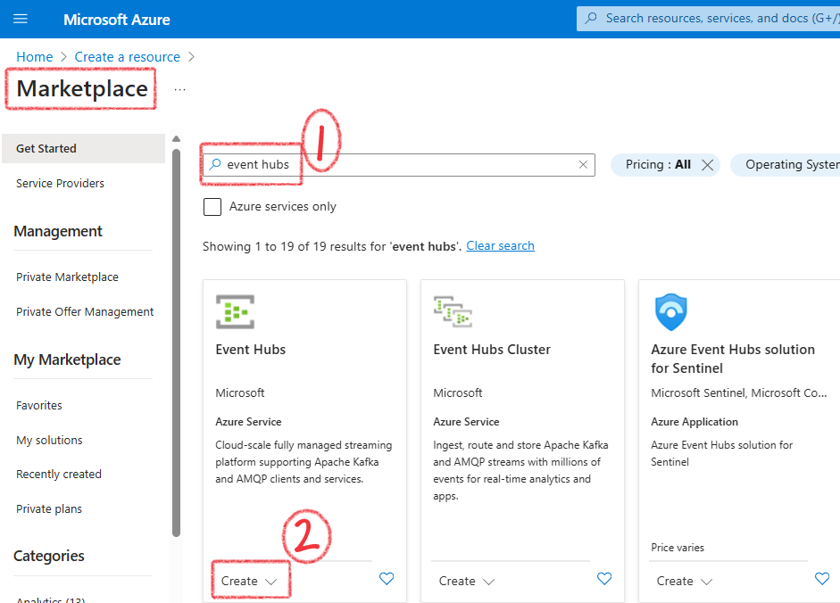
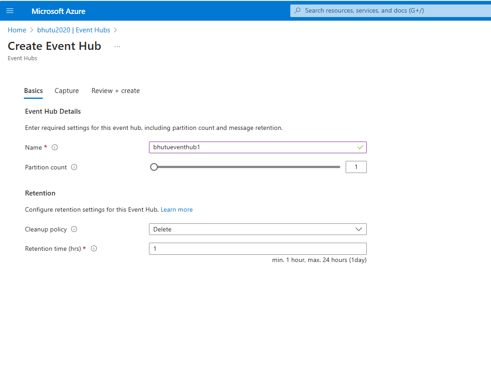

# Overview

# Components in the project

Data Sources: Streaming data from IoT devices or social media feeds. (Simulated in Event Hubs)
Ingestion: Azure Event Hubs for capturing real-time data.
Processing: Azure Databricks for stream processing using Structured Streaming.
Storage: Processed data stored Azure Data Lake (Delta Format).
Visualisation: Data visualized using Power BI.

To get started, the first thing would be to create a Event Hubs Service. This service can contain multiple Event Hub.

> Event Hubs - Can contain multiple Event Hub.

# Reference Projects
[This project is based on this tutorial.](https://www.youtube.com/watch?v=pwWIegHgNRw)
[Stream processing with Azure Databricks](https://github.com/dwdas9/azure-databricks-streaming-analytics)