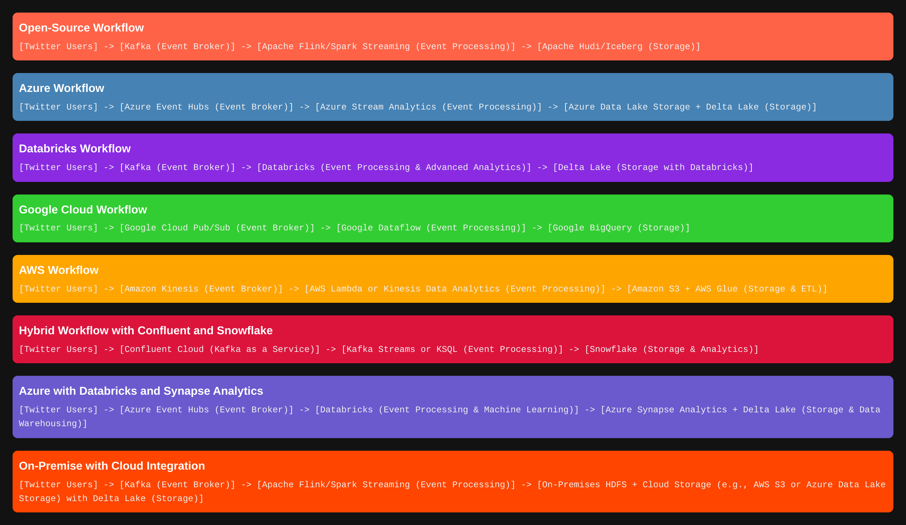

# <span style="color: MediumOrchid; font-family: Segoe UI, sans-serif;">How many different Workflows can you have for Real-Time Data Processing?</span>

Real-time data processing can be quite confusing because there are so many tools and services. But let’s make it simple. We’ll look at different ways to handle real-time events, like tweets, and see how they work with open-source tools, Azure, Aws, Google Cloud and Databricks. 

## <span style="color: #AD49B3; font-family: Segoe UI, sans-serif;">Open-Source Workflow</span>

In this setup, everything is open-source, giving you full control over the technology stack.

```plaintext
[Twitter Users] -> [Kafka (Event Broker)] -> [Apache Flink/Spark Streaming (Event Processing)] -> [Apache Hudi/Iceberg (Storage)]
```

Here’s how it works:
- **Kafka:** Acts as the middleman, receiving and managing events (tweets).
- **Apache Flink/Spark Streaming:** These tools process the data in real-time, filtering or enriching tweets as needed.
- **Apache Hudi/Iceberg:** These storage solutions handle storing the processed data, offering features like time travel and ACID transactions, similar to Delta Lake but in the open-source world.

## <span style="color: #AD49B3; font-family: Segoe UI, sans-serif;">Azure Workflow</span>

This workflow leverages Azure’s managed services for a streamlined, cloud-based solution.

```plaintext
[Twitter Users] -> [Azure Event Hubs (Event Broker)] -> [Azure Stream Analytics (Event Processing)] -> [Azure Data Lake Storage + Delta Lake (Storage)]
```

Here’s the breakdown:
- **Azure Event Hubs:** This is Azure’s version of Kafka, handling real-time data ingestion.
- **Azure Stream Analytics:** Processes the tweets as they come in, performing tasks like filtering and aggregation.
- **Azure Data Lake Storage + Delta Lake:** Stores the processed data in a scalable and efficient way, allowing for further analysis and querying.

## <span style="color: #963F9C; font-family: Segoe UI, sans-serif;">Databricks Workflow</span>

This workflow combines the power of Databricks with Delta Lake for advanced analytics and machine learning.

```plaintext
[Twitter Users] -> [Kafka (Event Broker)] -> [Databricks (Event Processing & Advanced Analytics)] -> [Delta Lake (Storage with Databricks)]
```

Here’s how it functions:
- **Kafka:** As usual, Kafka receives and queues the events.
- **Databricks:** Handles the heavy lifting of real-time processing and advanced analytics, including machine learning if needed.
- **Delta Lake:** Integrated with Databricks, Delta Lake stores the data efficiently, allowing for complex queries and historical data analysis.


## <span style="color: #7F3585; font-family: Segoe UI, sans-serif;">Google Cloud Workflow</span>

If you’re into Google Cloud, this setup might be right for you.

```plaintext
[Twitter Users] -> [Google Cloud Pub/Sub (Event Broker)] -> [Google Dataflow (Event Processing)] -> [Google BigQuery (Storage)]
```
- **Google Cloud Pub/Sub:** Like Kafka, but for Google Cloud, handling event distribution.
- **Google Dataflow:** Processes the data using Apache Beam under the hood, perfect for both stream and batch processing.
- **Google BigQuery:** A serverless data warehouse where you can store and analyze all your processed data.

## <span style="color: #7F3585; font-family: Segoe UI, sans-serif;">AWS Workflow</span>

Here’s a combination using Amazon Web Services for a fully managed experience.

```plaintext
[Twitter Users] -> [Amazon Kinesis (Event Broker)] -> [AWS Lambda or Kinesis Data Analytics (Event Processing)] -> [Amazon S3 + AWS Glue (Storage & ETL)]
```
- **Amazon Kinesis:** Manages real-time data streams like Kafka.
- **AWS Lambda or Kinesis Data Analytics:** Lambda handles event-driven processing, while Kinesis Data Analytics can process streams using SQL.
- **Amazon S3 + AWS Glue:** S3 stores the data, and Glue can be used for ETL (Extract, Transform, Load) operations and cataloging.

## <span style="color: #682A6E; font-family: Segoe UI, sans-serif;">Hybrid Workflow with Confluent and Snowflake</span>

This setup combines a managed Kafka service with Snowflake’s cloud data platform.

```plaintext
[Twitter Users] -> [Confluent Cloud (Kafka as a Service)] -> [Kafka Streams or KSQL (Event Processing)] -> [Snowflake (Storage & Analytics)]
```
- **Confluent Cloud:** A managed Kafka service, making Kafka easier to deploy and scale.
- **Kafka Streams or KSQL:** These tools allow for processing streams directly within Kafka.
- **Snowflake:** A powerful cloud data platform for storing and analyzing your processed data.

## <span style="color: #682A6E; font-family: Segoe UI, sans-serif;">Azure with Databricks and Synapse Analytics</span>

This combination leverages Azure’s data services for powerful analytics.

```plaintext
[Twitter Users] -> [Azure Event Hubs (Event Broker)] -> [Databricks (Event Processing & Machine Learning)] -> [Azure Synapse Analytics + Delta Lake (Storage & Data Warehousing)]
```
- **Azure Event Hubs:** Captures the events in real-time.
- **Databricks:** Processes the data and can apply machine learning models.
- **Azure Synapse Analytics + Delta Lake:** Synapse provides advanced analytics and data warehousing, with Delta Lake ensuring reliable storage.

## <span style="color: #511F57; font-family: Segoe UI, sans-serif;">On-Premise with Cloud Integration</span>

If you’re starting on-premise but want to integrate with the cloud, here’s an option:

```plaintext
[Twitter Users] -> [Kafka (Event Broker)] -> [Apache Flink/Spark Streaming (Event Processing)] -> [On-Premises HDFS + Cloud Storage (e.g., AWS S3 or Azure Data Lake Storage) with Delta Lake (Storage)]
```
- **Kafka:** Manages your events locally.
- **Apache Flink/Spark Streaming:** Processes the events on-premise.
- **On-Premises HDFS + Cloud Storage:** You can store the data locally on HDFS or integrate it with cloud storage services like S3 or Azure Data Lake Storage, using Delta Lake for additional features like ACID transactions.